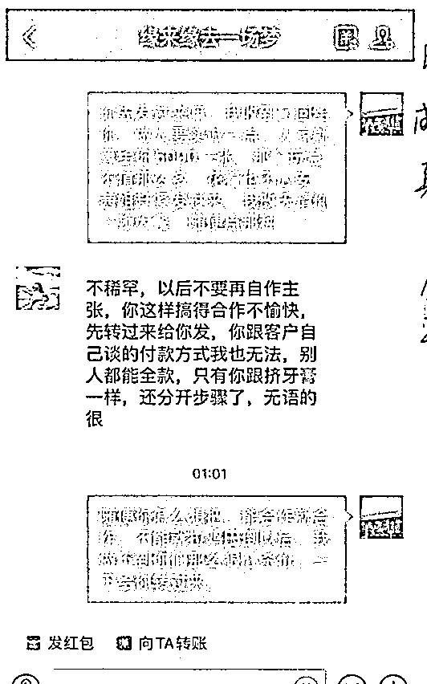

# 话痨威震天：贪婪的人类，在网上乱买 VIP 票，被骗了吧！

> 原文：[`mp.weixin.qq.com/s?__biz=MzIyMDYwMTk0Mw==&mid=2247521693&idx=5&sn=99e649d10d611518fcef174192b6ba5b&chksm=97cb5ea5a0bcd7b35add749c1686a6db4014fd7b0509cb6f363056db014922af18e93396b428&scene=27#wechat_redirect`](http://mp.weixin.qq.com/s?__biz=MzIyMDYwMTk0Mw==&mid=2247521693&idx=5&sn=99e649d10d611518fcef174192b6ba5b&chksm=97cb5ea5a0bcd7b35add749c1686a6db4014fd7b0509cb6f363056db014922af18e93396b428&scene=27#wechat_redirect)

北京环球影城度假区开始运营以来，以话痨威震天为首的变形金刚网红天天热搜，激起了很多人的兴趣，特别是国庆假期，那更是人山人海，所以 VIP 服务就成了搜索的热点。

只要是热门旅游景点，几乎都会出现网上买票被骗的情况。十一期间，购票诈骗从微博、抖音等平台上的预售，转变为小红书、微信上的购买 VIP 服务。因为人太多都不想排队，花钱加塞。

在那里，你可以看到“红友们”发各种显摆的游记，所以很多人就在上面咨询，主动或被动的加了票贩子或者黄牛为好友。

套路不变，**只是增加了视频、发身份证、驾驶本等环节。**给你发这些就能证明他们有票、就是好人吗？大多数人都会有顾虑，但是被骗的没有，他们相信这些自证清白的。特别是会编故事的，还能骗取受害人很多同情。我们直接上图上真相！

先让你转账，然后各种事就来了，什么没**备注、超时、限额**，拜托有点脑子好吧！备注不备注有那么重要吗？

让你再转一次钱，才能把上次的退回来，哪有这种道理，只有骗子才认的理呀！被骗小姑娘最后的倔强就是你不退，我就报警。你觉得报警了马上就能抓到人吗？立即就能退款吗？并不能，你觉得那是一个人在和你对话吗？不是的，那是一个诈骗团伙，甚至是一个诈骗集团。

凡是热点事件，骗子必参与，不提高点防范意识，不下载**国家反诈中心 APP**，真的就像一个憨憨一样，只能对骗子怒喊一句，我已经报警了。

**警方提示** 

来源：北京反诈，阻击诈骗

← 向右滑动与灰产圈互动交流 →

