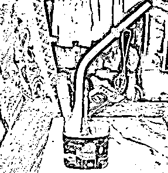
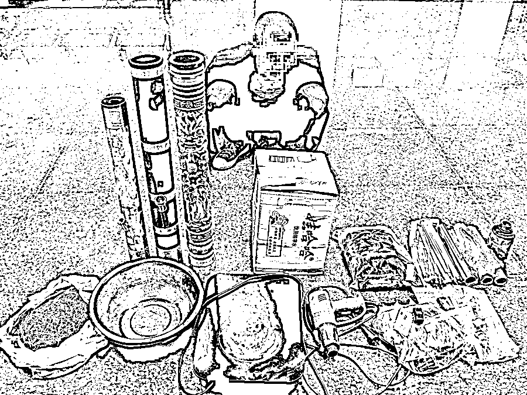
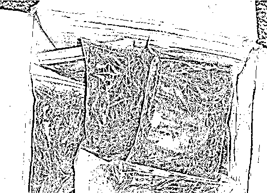
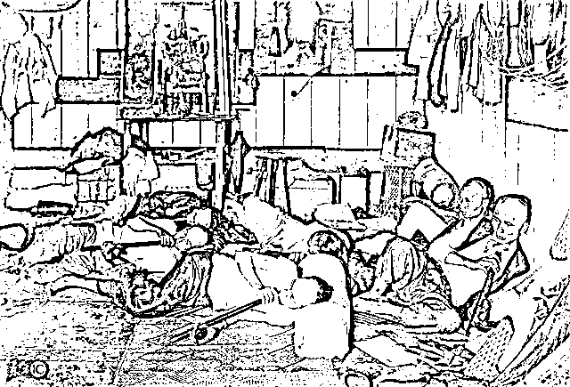
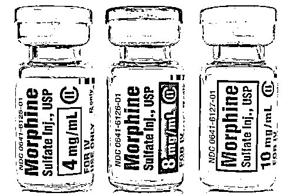
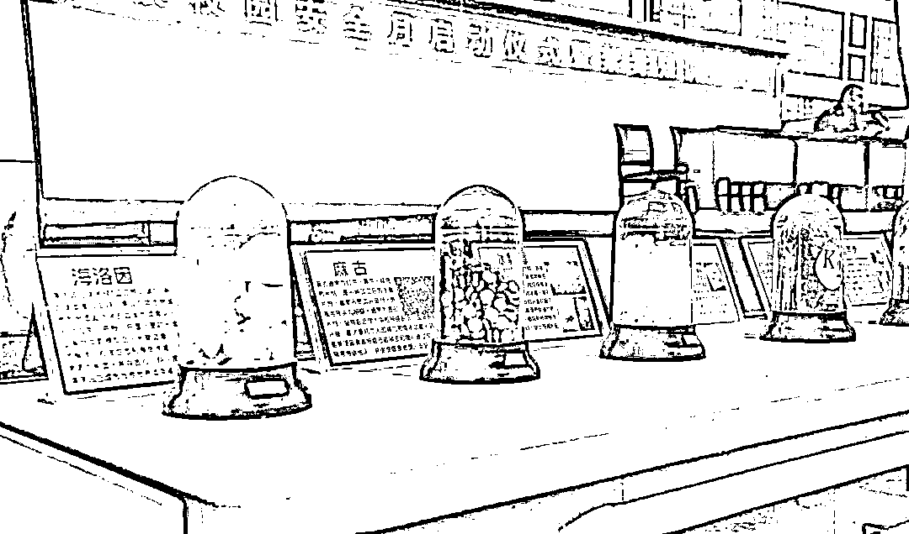

# 小心，它是源于鸦片的“变种”毒品！

> 原文：[`mp.weixin.qq.com/s?__biz=MzIyMDYwMTk0Mw==&mid=2247521737&idx=1&sn=4a87ce150abfdc6e6ed0e5f311b9563a&chksm=97cb5ef1a0bcd7e77f1fbcb67b25a847e7c4c55717a2133301b560027308f6d0114b80c4873e&scene=27#wechat_redirect`](http://mp.weixin.qq.com/s?__biz=MzIyMDYwMTk0Mw==&mid=2247521737&idx=1&sn=4a87ce150abfdc6e6ed0e5f311b9563a&chksm=97cb5ef1a0bcd7e77f1fbcb67b25a847e7c4c55717a2133301b560027308f6d0114b80c4873e&scene=27#wechat_redirect)

令人痛恨的鸦片

还在为祸人间吗 

但事实证明

它通过变换“身份”

依然隐藏在阴暗的角落

觊觎着人们的生命、健康

**揭开“卡苦”的真实身份**

在中缅边境

有一种毒品叫做“卡苦”

“卡苦”其实就是

鸦片烟膏的一种形态

由鸦片和多种草药混合而成

瘾君子们往往会收集

一些植物的叶筋、丝

例如芭蕉丝、车前草等

将它们晒干

这样就会得到烟丝一般的东西

随后

他们会把鸦片烟膏和

这些植物丝混合在一起

再放在水烟筒上吸

上个世纪 30 年代 

“卡苦”在中缅边境颇为流行

中华人民共和国成立后

国家大力打击毒品 

于是“卡苦”在国内就销声匿迹了

但是

缅北的一些少数民族还在吸食

随着时间的推移

“卡苦”又传回了境内

“卡苦”主要流行在富裕阶层

甚至在有的地区

被当做是身份地位的标志

一些人不认识卡苦 

很可能误以为这只是普通的水烟 

甚至是带一点疗效的水烟

但事实上，卡苦就是毒品

其犯瘾症状和海洛因相似

但较海洛因轻微

据测算

瘾癖大者每日需花费人民币约 200 元

月需 6000 元

一些毒贩

瞄准了“卡苦”这个“商机” 

对其进行包装，伪装成茶饼

“卡苦”是鸦片的一种形态 

其本质就是毒品

不但不能救人，反而会害人

**你所不知道的鸦片发展史**

说到鸦片

就不得不提鸦片的发展史

众所周知

鸦片害人害己，祸国殃民 

上个世纪六十年代

有些人就在想

怎么把鸦片戒掉呢

此时

一款国外进口的药物

吸引了他们的注意

上面的广告词宣称

“用了这个药就可以戒掉鸦片”

其实，这个药就是吗啡

服用吗啡后

这些人果然不想吸鸦片了

但他们却对吗啡上了瘾

关于吗啡能戒除鸦片的说法

其实是一些药厂的商业操作

目的就是为了获取更大利益

事实上

吗啡的危害性和成瘾性

比鸦片还大

如果说鸦片的 1.0 版本就是它本身

那么吗啡就是鸦片的 2.0 版本

吗啡是从鸦片中分离出的一种生物碱

通常为白色结晶或粉末

长期滥用吗啡可导致精神不振

消沉、思维和记忆力衰退

并可引起精神失常、肝炎等

严重的会导致呼吸衰竭而死亡

****

对吗啡进一步加工

就会得到海洛因

海洛因就是鸦片的 3.0 版本

一旦上瘾

它比前面两位“前辈”更难戒

 据《2020 年中国毒情形势报告》，在 180.1 万名现有吸毒人员中，滥用阿片类毒品 73.4 万名，占现有吸毒人员总数 40.8%。海洛因、冰毒等滥用品种仍维持较大规模。

毒品就是个无底洞

许多人为了吸毒 

耗费了大量金钱

最终落得个人财两失

妻离子散的下场

生命只有一次

人生无法重来

莫沾毒品，莫交毒友

来源：中国禁毒，吉林警事，利箭在行动

← 向右滑动与灰产圈互动交流 →

