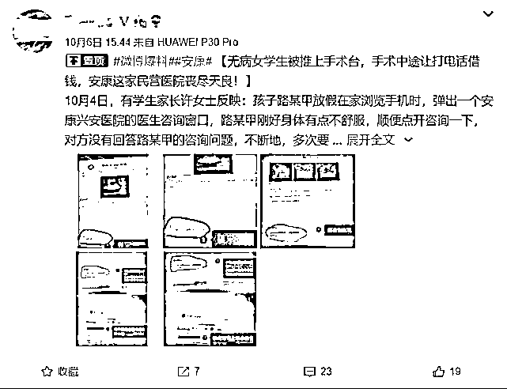
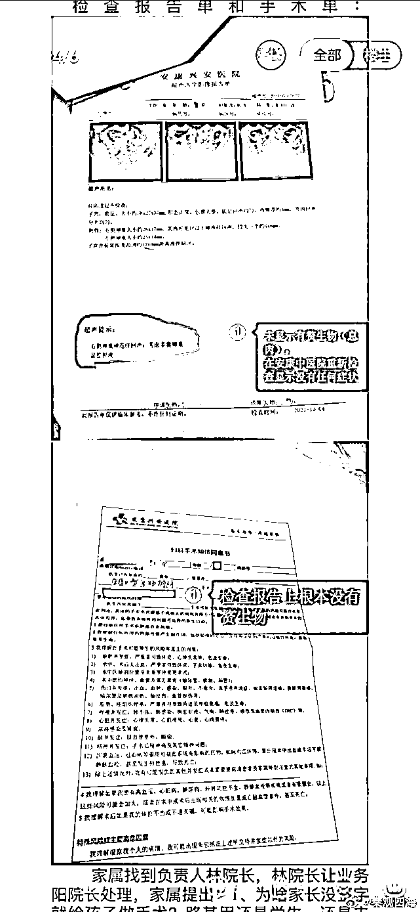
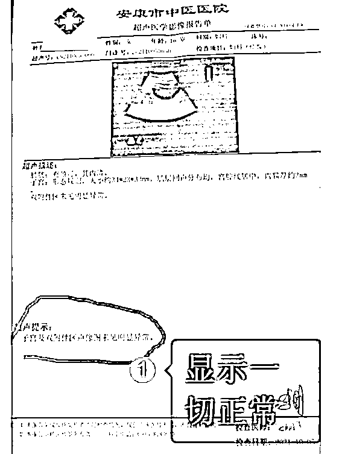
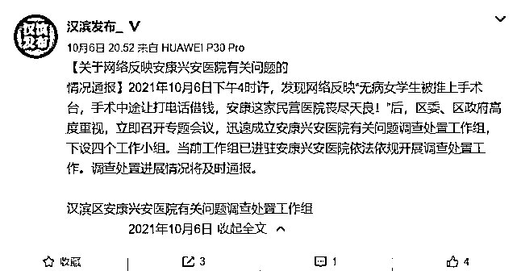

# “无病女学生被推上手术台”，当地最新通报

> 原文：[`mp.weixin.qq.com/s?__biz=MzIyMDYwMTk0Mw==&mid=2247521737&idx=2&sn=a987e2a466639bb846d97466f4740c91&chksm=97cb5ef1a0bcd7e7c02b04c660cdf14460f2f0244c0480d336d06298ef22ed1cd6f65472cc78&scene=27#wechat_redirect`](http://mp.weixin.qq.com/s?__biz=MzIyMDYwMTk0Mw==&mid=2247521737&idx=2&sn=a987e2a466639bb846d97466f4740c91&chksm=97cb5ef1a0bcd7e7c02b04c660cdf14460f2f0244c0480d336d06298ef22ed1cd6f65472cc78&scene=27#wechat_redirect)

## 

**手术中途医生停下来让路某甲在三张单子上签字，是手术同意书和费用单，路某甲感到不对劲，要求下手术台给家长打电话，医生不让她下手术台，说手术血流不止会有生命危险，让路某甲有多少钱赶快交纳。**

10 月 6 日，有网友发文称，陕西省安康市一名未成年女孩被当地一家民营医院做“虚假手术”，手术中途让打电话借钱，被家长发现后，院方只字不提应当承担的责任问题。

**事件还原**

**【女孩儿身体不适，上网求医看病】**

10 月 4 日，女孩家长许女士反映：女儿路某甲放假在家浏览手机时，弹出一个安康兴安医院的医生咨询窗口，路某甲刚好身体有点不舒服，便点开咨询。对方没有直接回答路某甲的问题，只是不断要求路某甲到安康兴安医院咨询。

路某甲来到该医院，一名医生初始检查完毕后，示意护士将学生路某甲带到手术室继续检查。

**【术中要求女孩儿筹钱，禁止给家长打电话】**

该医生直接开始给路某甲做手术，路某甲还以为是在例行检查。

手术中途医生停下来让路某甲在三张单子上签字，是手术同意书和费用单，路某甲感到不对劲，要求下手术台给家长打电话。

医生不让路某甲下手术台，说手术血流不止会有生命危险，让她有多少钱赶快交纳。

路某甲将身上的 1200 多元全部交出，医生说不够，让她给同学打电话借钱，没从同学那里借到钱，医生便让路某甲在手机上通过花呗借款。又让路某甲签订一个欠款单，说手术结束后再想办法补齐。

**【家长赶到医院，医生草草结束手术】**

路某甲同学发现路某甲借款数额较大，语气不安，认为遭到绑架遇到危险，电话告知其家长，家长赶到医院手术室时，医生才草草结束手术。

**【重新检查，不存在该院所检查症状】**

家长看完检查报告单后更是怒不可遏，手术同意书上摘除所谓赘生物（俗称息肉）根本不存在，检查报告单显示没有赘生物，路某甲无辜在宫颈上挨了一刀，身体受到伤害。

家属找到该医院负责人并提出以下几点疑问：
**1、为什么家长没签字就给孩子做手术？路某甲还是未成年人，孩子要给家长打电话，为什么制止不让打？****2、手术中途才让孩子签订手术同意书合不合规定？****3、手术中途停下来让孩子给同学打电话借钱，诱导孩子在花呗上借款违不违法？****4、孩子的检查报告单上根本没有息肉，为什么要切开做手术摘除所谓息肉？为了多收钱视孩子健康、生命为儿戏？**面对家属的投诉，该负责人轻描淡写地说:对医生手术存在的不规范问题，该罚款的罚款，该开除就开除，只字不提医院存在的管理问题和医院应当承担的责任问题。第二天家长把孩子带到安康市中医院重新检查，发现安康兴安医院检查报告单上的症状根本没有，纯属为了诱导进一步治疗虚构症状。

安康兴安医院检查报告显示症状，在安康中医院重新检查后完全没有。

**官方回应**

对此，中共汉滨区委宣传部在官方平台发布“情况通报”，通报称：2021 年 10 月 6 日下午 4 时许，发现网络反映“无病女学生被推上手术台，手术中途让打电话借钱，安康这家民营医院丧尽天良！”后，区委、区政府高度重视，立即召开专题会议，迅速成立安康兴安医院有关问题调查处置工作组，下设四个工作小组。**当前工作组已进驻安康兴安医院依法依规开展调查处置工作。调查处置进展情况将及时通报。**

来源：央视网、澎湃新闻、九派新闻

← 向右滑动与灰产圈互动交流 →

