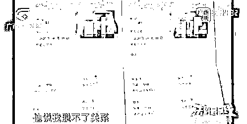
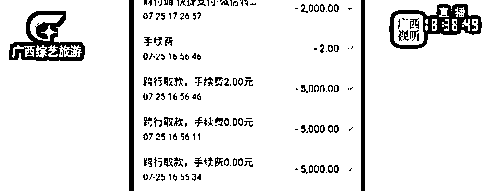

# 一女子结婚生子后，丈夫离奇失踪，连婆婆也是假的？

> 原文：[`mp.weixin.qq.com/s?__biz=MzIyMDYwMTk0Mw==&mid=2247521737&idx=3&sn=4b6eac3939819526c9065f6b0324266a&chksm=97cb5ef1a0bcd7e7eceedc914ae58d54a1b886b11bf9224a8b5d08bbc09223cedda0924bd8c5&scene=27#wechat_redirect`](http://mp.weixin.qq.com/s?__biz=MzIyMDYwMTk0Mw==&mid=2247521737&idx=3&sn=4b6eac3939819526c9065f6b0324266a&chksm=97cb5ef1a0bcd7e7eceedc914ae58d54a1b886b11bf9224a8b5d08bbc09223cedda0924bd8c5&scene=27#wechat_redirect)

南宁的廖女士 2020 年 6 月登记结婚，

今年 8 月，

随着丈夫的离奇失踪 

揭开了这场婚姻的骗局。

结婚生子后

丈夫突然失踪

2019 年 11 月，廖女士认识了同住一个小区的姜某，两人很快坠入情网。廖女士怀孕后，2020 年 6 月，两人领了证。

在认识姜某前， 廖女士是做医药工作的，收入较高，有房有车。婚前婚后，姜某以各种名目向她要钱。廖女士出示了一份聊天记录，姜某的“母亲”曾承认，姜某拿了廖女士差不多 70 万元。

今年 8 月 22 日，姜某突然不辞而别，留下 8 个月大的幼儿。 

婚姻是骗局

家婆是演员

廖女士表示，丈夫失踪后，她的朋友找上门，她才知道老公所谓的教育培训是骗局，多名家长已报警。

8 月 23 日，廖女士签下了一张保证书，表示了解丈夫姜某在今年 5 月至 8 月间，以替 24 位家长子女办理入学事宜为由，收取现金和转账 149.6 万元，现配合处理名下房产并承担相应责任。

然而，廖女士万万没想到，以婆婆自居的人，**其实****是个演员**。姜某还跟同一个小区另一名女子恋爱生子了。

经多方联系，记者找到了这名张姓女子。张女士表示，她和姜某相识在廖女士之前，育有一子。姜某曾向她借款 108 万元，只还了 12 万元，对孩子也是不闻不问。 

廖女士表示，在解决经济纠纷之外，她还想离婚。

律师：应尽快提起诉讼

志愿律师表示，如果像廖女士说的那样，姜某是以“帮孩子入读名校”为由，收取家长相应费用，姜某可能存在以非法占有为目的，但廖女士是否需要承担这笔债务，则有待商榷。 

律师解释，保证书上这笔近 150 万元的债务，远远超过家庭日常生活开销，除非债权人有证据表明这笔钱用于家庭日常生活，或是廖女士自己事后追认，才需要承担连带责任。 

律师建议，如果廖女士是基于和姜某的夫妻关系，而对夫妻共同债务产生什么误解的话，**应尽快提起诉讼，撤销保证书。**

来源 ：法治最前线

← 向右滑动与灰产圈互动交流 →

