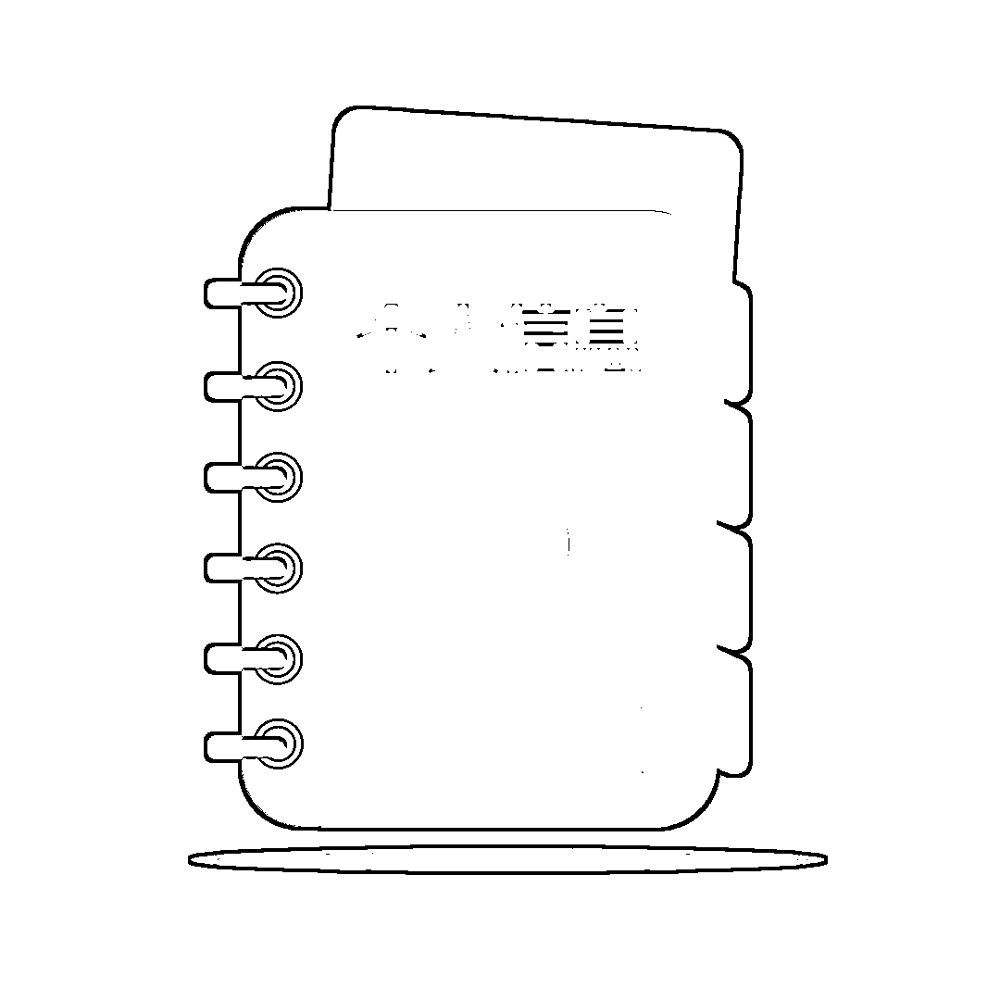
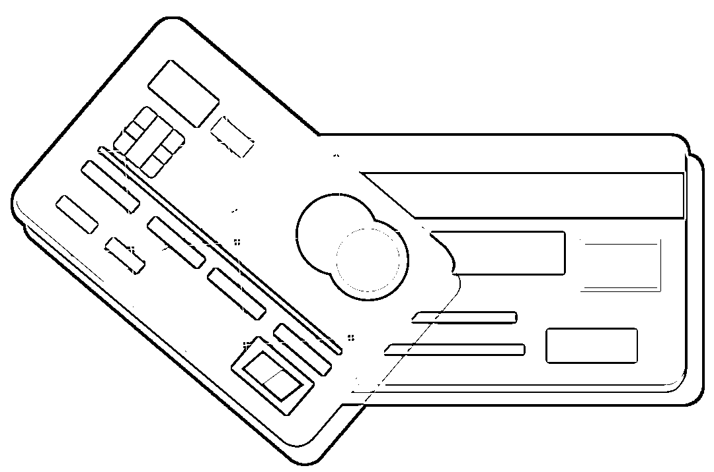
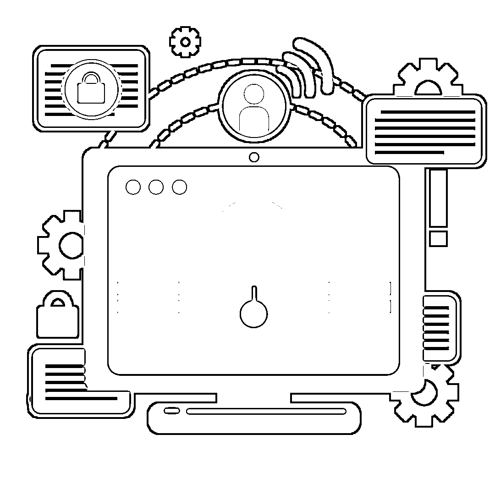
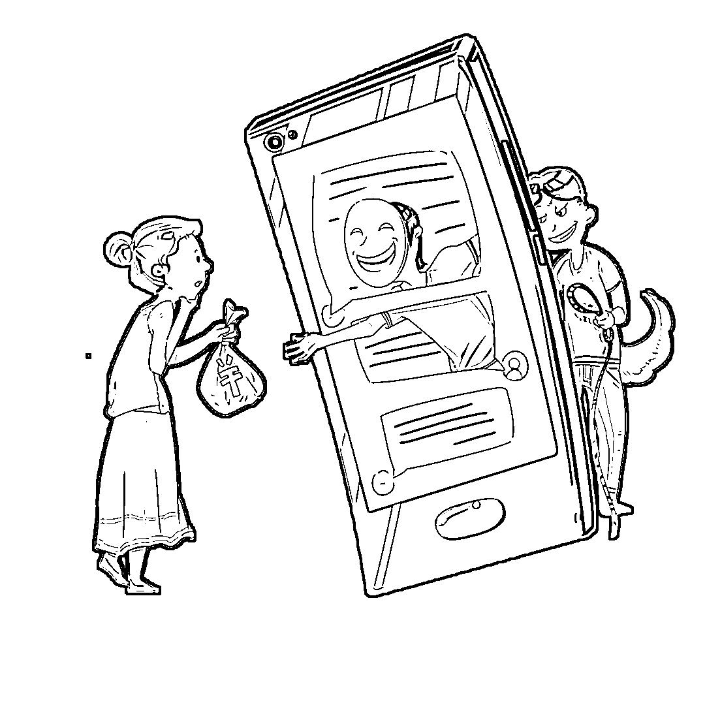

# 教你几招如何反诈防骗！再也不被骗！

> 原文：[`mp.weixin.qq.com/s?__biz=MzIyMDYwMTk0Mw==&mid=2247521737&idx=4&sn=9174d2e667667c82f3782e1bf53f045a&chksm=97cb5ef1a0bcd7e7333ca421c7c3ac6b22edbed89196bc1b0430edb17aebf0b1d84c62a0b6d7&scene=27#wechat_redirect`](http://mp.weixin.qq.com/s?__biz=MzIyMDYwMTk0Mw==&mid=2247521737&idx=4&sn=9174d2e667667c82f3782e1bf53f045a&chksm=97cb5ef1a0bcd7e7333ca421c7c3ac6b22edbed89196bc1b0430edb17aebf0b1d84c62a0b6d7&scene=27#wechat_redirect)

大数据、人工智能、网络直播等移动通信和互联网新技术的更新迭代是电信诈骗犯罪案件高发的客观背景，但除此之外还有许多其他原因。

结合审判实践，我们总结出**电信诈骗犯罪案件高发**的原因，主要有六个方面：

** 1 ** 大量个人信息遭泄露、甚至被买卖，成为犯罪分子筛选潜在行骗对象的重要手段；

** 2 ** 部分地方的工商登记机关、银行机构对申请注册公司、开立银行账户行为把关不严；

 **3**  行政监管、行政处罚缺位，导致部分一般违法行为发展为犯罪；

** 4**  互联网技术的发达同时导致网络电信诈骗行为查处、打击困难；

** 5**  犯罪分子依靠技术手段，具有较强的反侦查能力；

** 6**  被害人因自身贪念、心理承受能力差、识别能力差等弱点，易陷入犯罪分子精心设计好的圈套。

结合以上犯罪特点、原因和审判经验，广州法院的法官们总结出以下防范电信网络诈骗犯罪的对策及建议，一起来看看这份“反诈宝典”吧！

**01**

**妥善保管个人信息**

个人信息泄露、贩卖等现象突出已成为诈骗犯罪黑色产业链的重要组成部分。由于许多电信网络诈骗方式都以获取被害人隐私信息为先决条件和必经步骤，因此，广大人民群众把好个人信息保护的第一道关口，从源头杜绝隐私外泄对于避免财产损失至关重要。

**应对方法**

**① 要保护好个人身份信息。**在非必要情况下，不向陌生人提供身份证号码、工作单位、家庭住址、职务等重要信息。不将身份证照片或号码保存在手机中。

**② 要保管好个人账户信息。**在相关网站输入账号、手机号码、查询支付密码等重要信息前要谨慎核实域名真实性，不点击可疑链接，不连接来历不明的无线网络，不扫描非正规渠道获取的二维码，谨防钓鱼陷阱。

**02**

**绝不出租出售“两卡”**

千万不要认为没有直接参与诈骗行为就不算犯罪。在明知他人利用信息网络实施诈骗行为的情况下，仍出售银行卡、手机卡，为他人提供便利，就涉嫌构成违法犯罪，情节严重将被追究刑事责任。

**应对方法**

广大群众要保持警惕，不轻信他人，不贪图小利，绝不出售、转让、出租、分租、出借或者购买银行卡、支付账户（微信、支付宝等），以免给不法分子提供“作案工具”。否则，5 年内将会被暂停银行账户非柜面业务、支付账户所有业务，还会在个人征信上留下污点，影响贷款办理等业务。

**若发现出售、出租、出借电话卡、银行卡等犯罪行为，要及时向公安机关举报。**

**03**

**加强账户安全管理**

一些电信网络诈骗案件反映出部分群众银行账户管理存在明显漏洞，因此，提高银行账户安全性，给自己的账户上好“锁”，是风险防范的关键一环。

**应对方法**

① 为银行卡、网上银行、手机银行设置复杂程度较高的密码； 

② 不在其他任何网站上设置与网上银行、手机银行等相同的用户名和密码；

③ 不向任何人透露或转发短信验证码及其他形式的动态密码。

此外，为防范电信网络诈骗，人民银行、银监会等金融监管机构近期印发了一系列文件，要求同一个人在同一家银行只能开立一个Ⅰ类户，开立多个Ⅰ类户的，需进行清理；暂停涉案账户开户人名下所有账户的业务，经公安机关认定的用于开展电信网络新型违法犯罪的涉案账户，要中止业务往来等。

上述规定从银行支付端设置防线，群众应积极配合银行执行相关规定，保障自身财产安全权益免受侵害。

**04**

**提高金融安全意识**

被害人金融知识不足或风险意识薄弱是多数电信网络诈骗最终得逞的直接原因，因此，提高对金融产品和服务的认知能力及自我保护能力，是群众防骗避损的核心应对之策。

特别是近年来电信网络诈骗的被害人群更加广泛，逐渐从老年人、受教育程度较低群体向中青年、高学历、高收入人士蔓延，加强金融知识学习已成为每一位群众的必修课。

**应对方法**

① 群众应密切关注媒体报道和网络曝光的诈骗案件，了解近期出现的作案手法，并提醒家人亲友提高警惕。 

② 对电信运营商通过短信推送的安全提示信息，以及公安机关通过网站、公众号不定期发布的风险防范要点，应认真研读并牢记。

另外，银行利用各渠道开展的金融知识宣教活动系统性、针对性强，对资金安全保护大有裨益，群众应当予以关注。

**05**

**培养良好支付习惯**

电信网络诈骗尽管无孔不入且真假难辨，但只要群众时刻保持警惕，养成良好支付习惯，把控住对外转账汇款的最后一道关口，仍可有效避免资金损失。

**应对方法**

① 接到熟人通过短信、微信、微博、QQ、邮件、语音等形式发送的转账请求，或询问银行卡、网银密码等重要信息时，要通过电话核实确认；

② 陌生人或长期失联的“熟人”要求汇款时，须保持谨慎多方求证，遇到可疑情况及时向公安机关、银行、电信运营商等机构咨询；

③ 如确需向对方转账，应尽量选择次日到账方式并于事后再次核实，如有异常及时申请撤销；

④ 具有移动支付习惯的消费者应选择安全性较高的支付产品，并下载安装正版应用软件；

⑤ 避免在与移动支付软件绑定的银行卡中存放过多资金以便分散和锁定风险。

预防和治理电信网络诈骗犯罪是一项系统工程，需要全社会的共同努力。

来源：洛阳市反诈骗中心，利箭在行动

← 向右滑动与灰产圈互动交流 →

