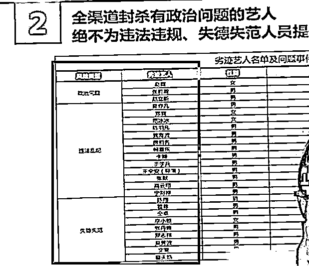

# 劣迹艺人封杀全名单公开：21 男 4 女，再无复出机会

> 原文：[`mp.weixin.qq.com/s?__biz=MzIyMDYwMTk0Mw==&mid=2247521790&idx=1&sn=ad685b3a0a5dab8a3ea149aa796e3729&chksm=97cb5ec6a0bcd7d014ebc843a7b97a7b205d488048c607018a7855ce7eb61996027059c4dd6f&scene=27#wechat_redirect`](http://mp.weixin.qq.com/s?__biz=MzIyMDYwMTk0Mw==&mid=2247521790&idx=1&sn=ad685b3a0a5dab8a3ea149aa796e3729&chksm=97cb5ec6a0bcd7d014ebc843a7b97a7b205d488048c607018a7855ce7eb61996027059c4dd6f&scene=27#wechat_redirect)

**引子：**自从“清朗行动”展开后，整个娱乐圈遭遇了有史以来，最严重的大风暴，不能让这些人把青少年的价值观带偏了。 

**01**

今年是娱乐圈的“丧年”，劣迹艺人频出，多人接连遭到封杀，导致之前有黑历史的艺人，也不敢再出来声张，生怕自己受到连累。

近日有关部门曝光了劣迹艺人名单，对于名单上的这些人，将会给予全网封禁的待遇。

细数一下，名单上总共有 25 人，21 个男人 4 个女人，这比例也令人震惊：

针对所公开的艺人名单，大多数观众并不陌生，其中不乏一度成为娱乐圈一线的艺人。

当这些艺人享受着来自粉丝的鲜花和掌声的时候，恐怕没有人能够想到有朝一日自己会处在当下这种境地，艺人需要爱惜自己的羽毛，一旦违背市场明星应该遵守的选择，苦心经营的人气就会在一夜之间烟消云散。

翟天临、仝卓、陈羽凡等人不是个例，至于是不是最后一个，谁又能够说得准呢？

从监管层的角度出发，针对失德艺人进行一系列淘汰举措，其中还包括加大对失德艺人的惩处，禁止劣迹艺人转移阵地复出这一条。

为何官媒会专门提及这一点呢？是因为在被迫退出娱乐圈之后，不少明星艺人还是会选择通过短视频等社交平台和粉丝产生互动，即便缺少主流媒体的邀约，这些艺人身上公众人物的属性并没有发生变化，这也是接下来官方主要打击的角度。

比如李小璐，之后想要通过跳舞视频来宣传自己，恐怕就会困难很多。

除去某爽、某瀚、某凡、某尊，还有之前就已经跟娱乐圈无缘的范冰冰、李小璐，剩余人名令人震惊，脱口秀演员卡姆，张国立的儿子张默、知名导演某全案。

这一个个名字，不都是之前大火的吗，火了之后就忘本，有钱了就开始变坏，这就是金钱对人欲望的影响，可他们忘了，钱能成就一个人，也能毁掉一个人。

**02**

从公布出来的名单中可以看到，位于榜首的就是那位因涉及到立场问题而被封杀的“大眼格格”，她主演的代表作《情深深雨濛濛》在某瓣上的封面，也换成了古巨基和苏有朋的同框照，主演名单中更是找不到她的名字。

此外，跟她出现相同问题的人还有张某瀚、赵某斯两位，他们能够被放在榜单前列就足以说明事情的恶劣程度有多严重，想起此前看他们节目的画面，至今都有些背后发凉。

有小伙伴猜测说，在这张榜单上名字越是靠前的人，其行为的性质就越恶劣，第二批“违法乱纪”的艺人中，排在首位的就是前段时间跟网红女友闹得沸沸扬扬，此后被抓进去的《大碗宽面》原唱。

照这个形势看来，他日后即便恢复了自由之身，也很有可能被遣送回加拿大，东山再起怕是已经无望了。

第二位的爽妹子就更不用说了，自从在美国 dy 一事被前夫曝光之后，她多年来打造的清纯小仙女形象就瞬间毁于一旦，虽然网上一直有重回娱乐圈的传闻，但明眼人都很清楚，这个领域哪里还有她的容身之地？

再往下就是范冰冰了，相比较而言她的情况就要比前几位好得多，经过几年的沉淀之后现在也开始有了微妙的活跃度，至少能够接到一些小产品的广告和代言，甚至还把自己的品牌也经营得有声有色。

范冰冰还会经常更新动态跟大家分享日常，网上也有声音称她已经在为复出做准备了，但是现在这张名单一出，机会似乎就更加渺茫了。

成龙的儿子房祖名因为吸毒登上榜单，同类型的还有王学兵、柯震东等人，如果不是这样一个个罗列出来，大家怕是怎么也想不到居然有这么多人因此被封杀。

多年前的不由自主却换来后半生的销声匿迹，即便观众可以忘记，但那些灰色的往事也将伴随他们一生，更难说能够在社会上激起什么风浪了。

在“失德失范”行列中的艺人也不少，除了前段时间被女友爆料的霍某之外，吴秀波的名字也很是显眼，印象中的他明明是暖心帅大叔的模样，谁能想到真实面目却如此不堪。

除了上面提到的人之外，还有很多类似问题的艺人都存在着，或许已经被人们遗忘，又或许还没有被曝光出来，但是正义永远都会站在最光明的地方！

**03**

在这个名单上，有人今年还在拍戏，某学兵与周冬雨、刘昊然主演了一部电影，名叫《平原上的火焰》，据说今年 12 月份上映，不知道到时候是否会换脸。

陈翔曾跟毛晓彤是情侣，后来因为出轨上热搜，两人便正式分手了。可此事过后，陈翔也一直在上综艺，似乎没有受到任何影响，没想到现在居然被定义为劣迹艺人。

而影响仝卓的，是那场伪造高考身份的事情，他本来都快火了，谁知突然出了那件事，直接毁了自己的娱乐圈生涯，不过据说他去年还在办巡演。

娱乐圈的这些艺人，占着全社会最好的资源，无疑不是圈内的成功人士，如果没有这些黑历史，他们必将成为更厉害的存在，谁知这些人却不安分，生出了其他心思。

官方对劣迹艺人的整治，除了肃清娱乐圈的风气之外，还想杀鸡儆猴，让其他人也明白，自毁前程是什么意思，别赚着人民大众的钱，却连做人都学不会。

从明星到网红，这些公众人物太把自己当回事了，幸好官方对此事进行干预，停止了娱乐圈的不正风气，如果继续这样发展下去，娱乐圈恐怕要成为违法乱纪的聚集地。

来源：瓜尔佳，阻击诈骗

← 向右滑动与灰产圈互动交流 →

