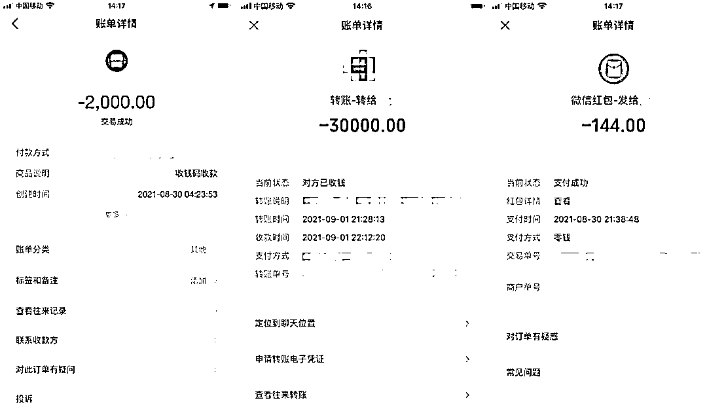
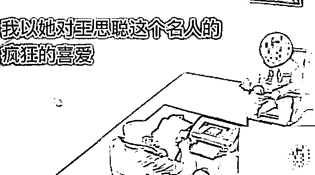
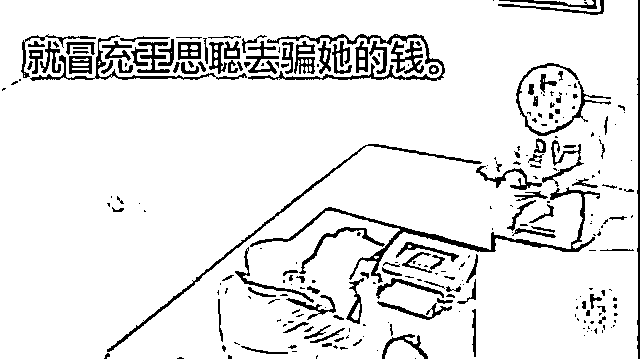

# “王思聪”终于落网了！

> 原文：[`mp.weixin.qq.com/s?__biz=MzIyMDYwMTk0Mw==&mid=2247521790&idx=2&sn=210233966dc50e29ba172f13d4a477b4&chksm=97cb5ec6a0bcd7d0b386253740ab230f8e52759957929523e24321f538d64a04008ef5788ff8&scene=27#wechat_redirect`](http://mp.weixin.qq.com/s?__biz=MzIyMDYwMTk0Mw==&mid=2247521790&idx=2&sn=210233966dc50e29ba172f13d4a477b4&chksm=97cb5ec6a0bcd7d0b386253740ab230f8e52759957929523e24321f538d64a04008ef5788ff8&scene=27#wechat_redirect)

前不久

浙江一名疯狂迷恋王思聪的女士

突然得到“偶像”的钟爱

……

**“偶像”主动加好友**

今年 9 月初，一男子添加胡女士（化姓）微信，并与其语音聊天。作为王思聪铁粉的胡女士听到对方熟悉的声音，不禁小鹿乱撞，对方难道就是王思聪？他怎么会主动示好？**起初她还心存警惕**，在她再三追问下，**对方竟放弃了“伪装”，“大方”地承认自己就是王思聪。** 

于是胡女士一发不可收拾，**每天与偶像浓情蜜意，深深沉浸在幻想里**。她对“王思聪”的爱溢于言表，不顾一切。

胡女士向“王思聪”转账 3 万余元

这种疯狂让她渐渐落入圈套，蜜聊一段时间以后，以有钱著称的“王思聪”突然以同意见面甚至结婚为由，**多次向胡女士索要路费、彩礼费等“小钱”**，胡女士单纯的以为这是王思聪在**考验自己的诚意**，一来二去**打过去 3 万余元**。

**收到钱后“人间蒸发”******

****谁知等来的并不是惊喜，而是“人间蒸发”！**此时，胡女士依然不愿接受被骗的事实，寄希望于对方如果不想结婚，能退回彩礼便好，谁知这样的妥协依然没有换来对方的觉醒。家人得知此事后，为了不让胡女士继续执迷不悟，果断报警。**

**萧山蜀山派出所立案后，随即对案件开展调查，**确定暂住上海的“王思聪”的真实身份实则是张某某（湖北人）**，于是立即对其账户进行冻结，张某某却仍抱有侥幸心理，又**突然现身联系胡女士，企图协商退钱，并要求胡女士撤案。****

**为了能够尽快解冻账户，张某某自行来派出所说明情况，最终在民警的追问之下终究百口莫辩，将诈骗经过和盘托出。**

****

****

**据犯罪嫌疑人张某某交代，其 9 月份**在微博上刷到胡女士对王思聪的“爱意”留言后，顿时萌生了借助自己酷似王思聪的声音，冒充王思聪进行诈骗的念头。****

**他在成功添加受害人胡女士微信好友后，一直用语音与她聊天，并假装不小心被识破了身份，很**快骗取了对方的信任，又利用对方对爱情的幻想，多次骗取钱财。****

 **[`mp.weixin.qq.com/mp/readtemplate?t=pages/video_player_tmpl&action=mpvideo&auto=0&vid=wxv_2080424159817318401`](https://mp.weixin.qq.com/mp/readtemplate?t=pages/video_player_tmpl&action=mpvideo&auto=0&vid=wxv_2080424159817318401)** 

**虽然张某某已将**钱财如数退还****

**但其冒充名人实施诈骗，性质恶劣**

**目前，张某某**因涉嫌诈骗罪****

****已被依法刑事拘留****

**案件正在进一步侦查中**

** 来源：萧山公安，新闻晨报，巴蜀反诈**

****

**← 向右滑动与灰产圈互动交流 →**

****