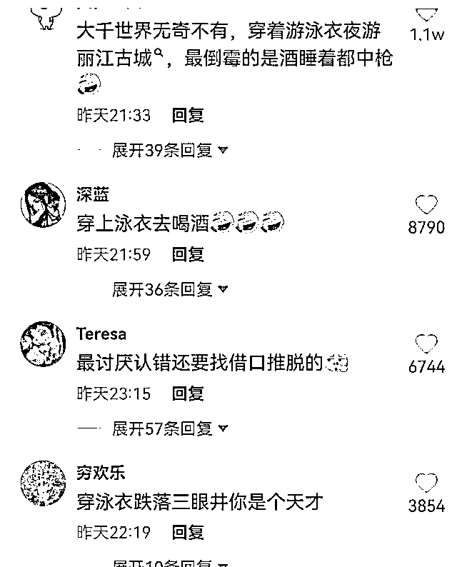

# 酒后失控？不接受！

> 原文：[`mp.weixin.qq.com/s?__biz=MzIyMDYwMTk0Mw==&mid=2247521790&idx=3&sn=f957c5b87bd3c04063e8524b26ee35d9&chksm=97cb5ec6a0bcd7d033d1642da5990c47c2b35e498feb94f9cbcc7fc85db12c39926e4259bfa4&scene=27#wechat_redirect`](http://mp.weixin.qq.com/s?__biz=MzIyMDYwMTk0Mw==&mid=2247521790&idx=3&sn=f957c5b87bd3c04063e8524b26ee35d9&chksm=97cb5ec6a0bcd7d033d1642da5990c47c2b35e498feb94f9cbcc7fc85db12c39926e4259bfa4&scene=27#wechat_redirect)

刚刚过去的国庆小长假

各大旅游景点迎来出游高峰

然而景色虽美

**可个别游客的不文明行为却有点“扎眼”**

[`v.qq.com/iframe/preview.html?width=500&height=375&auto=0&vid=f33008zi7g5`](https://v.qq.com/iframe/preview.html?width=500&height=375&auto=0&vid=f33008zi7g5)

近日，一段女游客在丽江古城石榴井内，游泳戏水的视频引发了网友的关注。

视频中女游客身着泳衣

在石榴井内戏水，

动作十分不雅，

嘴里还大喊着“好爽啊”，

引起周围游客的围观。

这不文明的一幕被路过游客拍下

并上传社交平台，

引起网友的广泛关注，

网友愤慨道，**“水就这样被糟蹋了。”**

此事发酵后

立刻登上热搜

引四千万网友围观

有关部门也关注了此事，10 月 7 日下午两点左右，世界文化遗产丽江古城保护管理局发布微博表示：已关注到有游客在古城七一街石榴井戏水视频，目前，文旅、公安等相关部门已介入调查。在对这样的行为予以谴责的同时，我们再次提醒广大游客朋友，**爱护遗产、尊重民俗、遵守公约、文明出游。**

10 月 7 日晚 7 点女子发文道歉称：

10 月 2 日到丽江古城旅游，

住在石榴井旁边的客栈，

**因为大假出游非常高兴饮酒过度，**

**完全失去自控能力，**

**不慎跌入井水中，**

对自己不文明举止非常后悔，

请大家原谅。

但网友对女游客的道歉并不买账，

有网友称，**“不接受，穿泳衣怎么解释？”**

**“这是饮用水，**

**竟然在里面游泳，**

**真是没素质到家了……”**

**“这样的行为，建议列入景区黑名单****”**

随后，

小编上网查询了关于石榴井的相关信息。

据公开资料显示，

石榴井位于丽江古城七一街一上段，

属古城内繁华路段，

纯朴的纳西人在井边放一小碗供路人饮用，

井水清冽甘甜，

是丽江最“知名”的三眼井之一。

现在仍有老古城人来这里打水，

附近的商户也自觉遵循古约，

分潭用水。

为了一己私利

毁坏景观、扰乱公共场所秩序

不仅有失道德 

还涉嫌违法！

9 月 8 日，北京市民陈先生发布视频称，在北京圆明园遗址公园远瀛观与大水法区域，一名中年男性游客无视“请勿进入”的提示牌，进入遗址区域踩踏，并无视工作人员的提醒。

9 月 11 日，北京市公安局海淀分局发布情况通报称，**违法行为人李某（男，39 岁）在圆明园遗址公园违规进入远瀛观遗址踩踏、拍照，已被海淀警方依法行政拘留。**

9 月 21 日，有北京市民发现，在故宫西华门城墙前，一名身穿白衣黑裤、头戴棒球帽的男子正拿着车钥匙用力在城墙砖上刻画，这一行为令目击市民十分气愤，他上前厉声制止。目击者将这一情况反映给了故宫工作人员，此事在网络上曝光后迅速引发热议。

9 月 25 日，据北京市公安局通报：针对近日一游客在故宫西华门外城墙上刻划的情况，经警方工作，将违法行为人周某明（男，54 岁）查获，该人对其违法行为供认不讳。目前，根据《中华人民共和国治安管理处罚法》相关规定，**已对周某明作出行政拘留并处罚款的处罚。**

**实施不文明行为的游客将被纳入“黑名单”**

国家旅游主管部门为提升公民文明出游意识，曾出台相关规范性文件，对这些行为实施相应惩戒机制。

2016 年实施的《国家旅游局关于旅游不文明行为记录管理暂行办法》明确规定，中国游客在境内外旅游过程中发生因违反境内外法律法规、公序良俗，造成严重社会不良影响的行为，将纳入“旅游不文明行为记录”。主要包括：

> ➤ 扰乱航空器、车船或其他公共交通工具秩序；
> 
> ➤ 破坏公共环境卫生、公共设施；
> 
> ➤ 违反旅游目的地社会风俗、民族生活习惯；
> 
> ➤ 损毁、破坏旅游目的地文物古迹；
> 
> ➤ 参与赌博、色情、涉毒活动；
> 
> ➤ 不顾劝阻、警示从事危及自身以及他人人身财产安全的活动；
> 
> ➤ 破坏生态环境，违反野生动植物保护规定；
> 
> ➤ 违反旅游场所规定，严重扰乱旅游秩序等。

按照规定，实施了此类不文明行为的游客，或将被纳入旅游不文明行为“黑名单”。

**后果严重的可能触犯刑法**

除了上述处罚外，有些旅游不文明行为后果严重的，还可能触犯刑法。例如，损毁、破文物古迹的行为有可能涉嫌故意损毁文物罪、过失损毁文物罪，及故意损毁名胜古迹罪；对于破坏生态环境，违反野生动植物保护规定的行为，情节严重或涉嫌非法杀害珍贵濒危野生动物罪、非法毁坏国家重点保护植物罪等。

小编提醒

在享受快乐时光时，

一定要把文明时刻装在心中，

不要让不文明行为大煞风景。

来源：新闻晨报，红网

← 向右滑动与灰产圈互动交流 →

