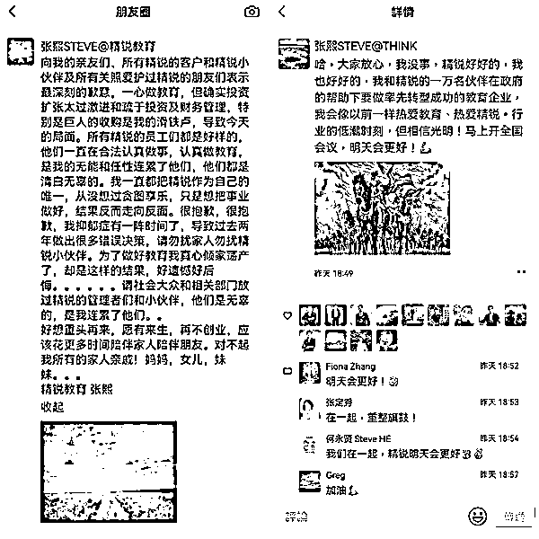
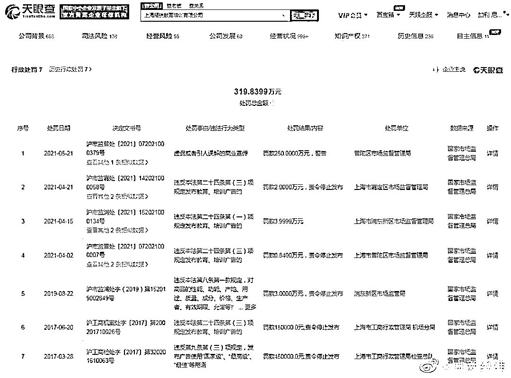
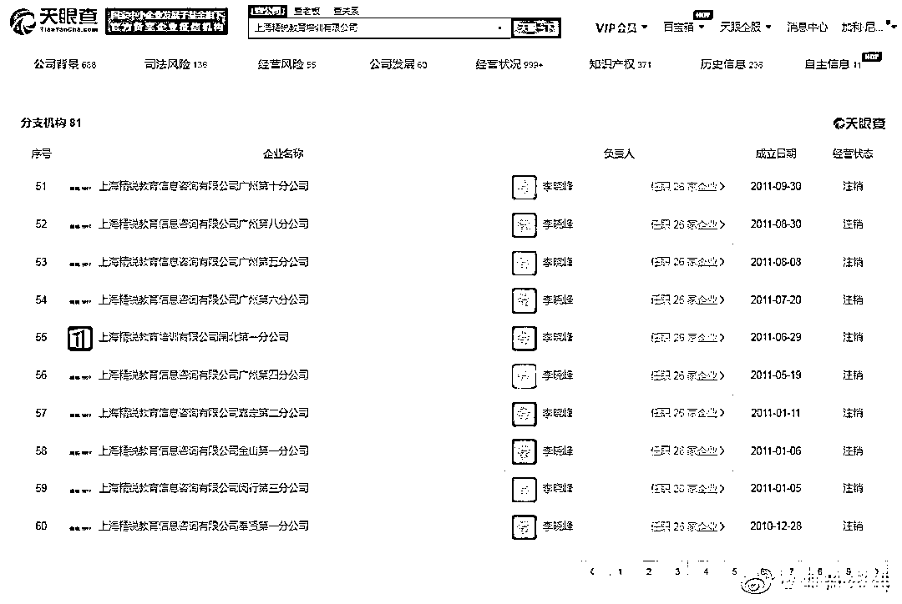
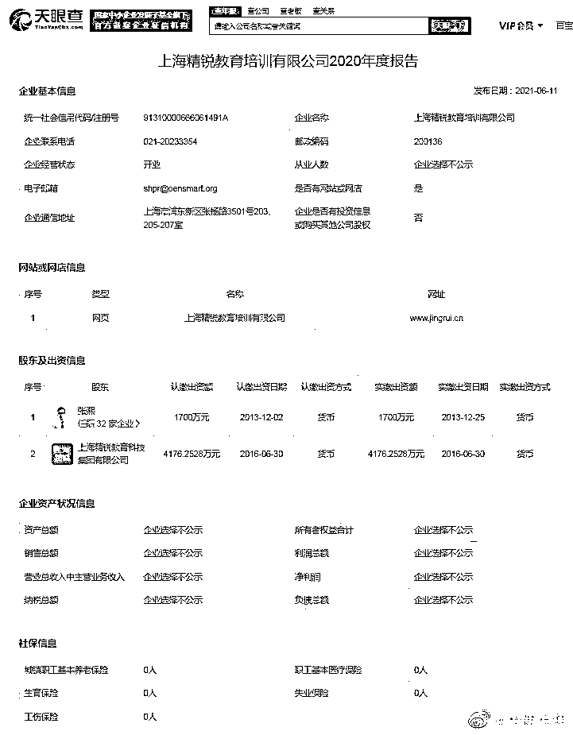
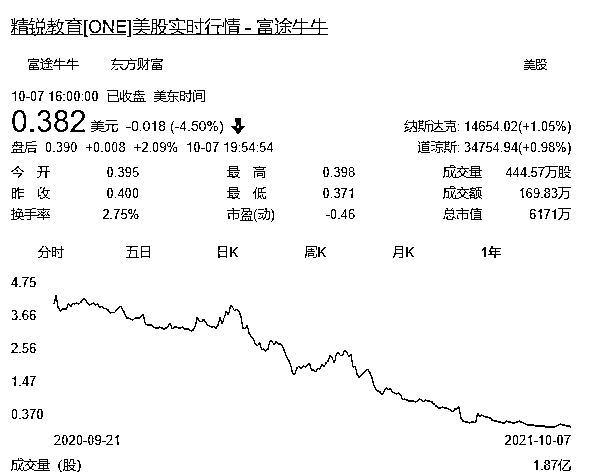

# 网传创始人“倾家荡产”？股价跌去 98%，退市倒计时？

> 原文：[`mp.weixin.qq.com/s?__biz=MzIyMDYwMTk0Mw==&mid=2247521790&idx=4&sn=5e625d14a7004f16e4302065fe119e97&chksm=97cb5ec6a0bcd7d0f90606e86e33109a231cf8a64396578ecf68a6974d9d51f5cf976a49f59e&scene=27#wechat_redirect`](http://mp.weixin.qq.com/s?__biz=MzIyMDYwMTk0Mw==&mid=2247521790&idx=4&sn=5e625d14a7004f16e4302065fe119e97&chksm=97cb5ec6a0bcd7d0f90606e86e33109a231cf8a64396578ecf68a6974d9d51f5cf976a49f59e&scene=27#wechat_redirect)

图：视觉中国

10 月 7 日，有媒体报道称，精锐教育董事长张熙在朋友圈发文，向亲友、精锐的客户和精锐的员工等致歉。张熙称自己一心做教育，但投资扩张太过激进和疏于投资及财务管理，导致今天的局面，其中特别提到**巨人的收购是他的滑铁卢。**

该截图中张熙表示，一直都把精锐作为自己的唯一，从没想过贪图享乐，只是想把事业做好，结果反而走向反面。**为了做好教育真心倾家荡产了，却是这样的结果，好遗憾好后悔。**

他还表示，好想重头再来，愿有来生，再不创业，应该花更多时间陪伴家人陪伴朋友。此番言论一度被外界解读为张熙要轻生。

精锐回应：网传截图是假的

10 月 8 日，据界面报道，精锐教育回应称：“（网传截图）是假的，根本就不是老板的朋友圈”，并表示“我们都在正常上班”。精锐教育工作人员还表示，**张熙没有轻生，上午还在公司开会，公司也正常运营、向家长退费，“公司已经辟谣了”。**

据精锐教育提供的朋友圈截图显示，张熙说，“大家放心，我没事，精锐好好的，我也好好的，我和精锐的 1 万名伙伴在政府的帮助下要做率先转型成功的教育企业，我会像以前一样热爱教育、热爱精锐。行业的低潮时刻，但相信光明。”

据悉，精锐教育于 2008 年开业。2018 年 3 月，精锐教育在美国纽交所上市。同年 8 月，精锐收购天津华英教育，10 月，精锐教育又以 7 亿元的价格收购巨人教育，然而就在 9 月前后，有 27 年历史的培训学校巨人教育发布公告称，由于经营困难，秋季将无法继续向学员提供教学服务。且由于多种原因，巨人也可能无法满足家长的退费要求。

巨人“滑铁卢”？

此前流传的截图中，特别提及了“巨人收购是我的滑铁卢”。

实际上，早在 2018 年，精锐教育收购巨人教育时，还对这家传统老牌教培机构充满雄心壮志。

2019 年 4 月，张熙表示，到 2023 年，巨人教育将在中国建立起 500 家线上线下结合的校区，完成 50 万的学生在读指标，预计达到 50 亿元的生产收入。未来五年，巨人教育将投入 20 亿元，其中 10 亿元是用于校区的扩张和区域性的并购。

张熙还在《致全体巨人同仁的一封信》中表示：“未来三年计划拿出 10%的股权用于团队的激励”、“未来三年内，坚决不裁员、坚决涨薪水、坚决做大做强！”、“带领大家冲击属于巨人自己的 IPO，未来 3-4 年内实现上市。”

然而，2020 年巨人教育就开始走下坡路。2020 年 12 月 21 日，精锐和其他投资方将原来参与投资的巨人教育、天津华英、巨人网校、优毕慧等相关的班课业务重组整合为“新巨人教育”。

但结果证明整合没达到预期。今年 8 月初，巨人教育董事、CEO 罗沫鸣在公司内部群发言称，随着“双减”政策落地，巨人教育面临着极为艰难的转型以及更为巨大的经营压力。8 月 11 日，罗沫鸣向公司员工表示，**精锐教育决定不再对巨人网校投入资金，目前公司没有办法正常发放薪资。**

前段时间，巨人教育在官方微信公众号发布《致巨人学员的一封信》，信中称巨人学校由于经营困难，秋季将无法继续向学员提供教学服务。

对于巨人教育经营困难和投资问题，精锐教育在 9 月初的一场采访中，曾作出回应。

据蓝鲸财经，精锐教育表示，精锐只是拥有小部分股权，精锐教育在新巨人持股为 10.89%。精锐作为巨人原投资者之一不参与其实际运营，巨人和精锐各自独立运营。精锐教育相关负责人表示：“目前这种情况下，我们也希望巨人在有关部门的指导下，度过目前危机，妥善解决相关遗留问题。” 

而且在当时的采访中，对于未来教育行业的发展走向，**精锐教育表示：仍充满信心。**

精锐教育表示，“双减”之下，学生和家长的教育需求仍然存在，国家下发双减政策是必要的，目的是为了实现学生和家长的减负增效。而对于转型中的教培机构，精锐教育认为，教育公司和教培机构谁调整的快、调整的好，才是关键。 

创始人张熙就曾表示，“精锐未来的方向就像是一个提供家庭教育及孩子学习能力诊断和解决方案的‘诊所’，本质上我们是帮助家庭解决教育问题，专门针对遇到孩子教育问题的家庭及孩子。”

过半分支机构已注销

精锐退市倒计时？

提前放弃巨人教育的精锐教育，同样受到影响。今年以来，精锐教育多次

被罚款，进入教育培训类“黑榜榜单”。

2021 年 6 月 1 日，精锐国际教育集团因存在价格欺诈违法行为被罚款。

天眼查 App 显示，精锐教育目前涉及多条法律诉讼，案由包括合同纠纷、商业贿赂不正当竞争纠纷等。2021 年 8 月，该公司被北京市海淀区人民法院强制执行超 302 万。此外，该公司还多次因虚假宣传、违法广告法被行政处罚，**处罚金额累计近 320 万。**

其中虚假宣传主要是精锐教育在其官方微信公众号、网站的宣传中虚构教师资质，虚构教师培训、任教经历，上述行为属于虚假或引人误解的商业宣传行为。

除了记录在案的处罚，**精锐教育也多次因虚假宣传被处罚也不断遭到家长的质疑。**据《证券日报》，在新浪黑猫投诉上，多数投诉提到师资力量堪忧、退费困难等问题。

数据显示，精锐教育公司对外投资数十家企业。自 2007 年 12 月以来，该公司相继投资成立 80 余家分支机构，其中超半数目前已注销。

值得一提的是，据其 2020 年度报告显示，该公司参保人数为 0。

更加雪上加霜的是，**精锐教育在 2021 财年上半年已经巨亏 3.32 亿元，公司资产负债率为 97.94%。**8 月 4 日，精锐教育收到纽交所发出的退市警示函，若连续 30 个交易日内普通股最低交易价低于每股 1 美元，则面临退市风险。

截至美东时间 10 月 7 日收盘，精锐教育股价下跌 4.5%至 0.382 美元/股，较历史最高点 16 美元/股，跌幅高达 97.6%，市值仅剩 6171 万美元。

对于即将退市一事，香颂资本执行董事沈萌表示，精锐教育这么久没有对策，**说明很大程度上是束手无策，而不是蛰伏待机。**

教培机构倒闭潮来临？

不管是巨人教育破产还是华尔街英语跑路，“双减”政策发布后，教培机构正在面临越来越严峻的考验。

8 月 31 日，海淀教委公示了首批学科类校外培训机构，其中新东方、学而思、新航道、高思等机构的相关分校都已列入白名单，但仍旧还有很多教育平台尚未对外披露。

**这意味着只要未被列入白名单的机构都面临倒闭的风险。**

东吴证券研究报告显示，各地政府随后严格落实“双减”政策，出台了更加细化的限制，K12 教培监管落地预计按计划推进。

天眼查最新数据显示，截至 9 月 1 日，2021 年教培相关企业注销或吊销的数量超 16 万家，较 2020 年同期相比，增长约 26.51%。

据证券日报不完全统计，**今年 7 月以来，我国已有超 1250 家教培相关机构被法院强制执行**。“教培机构倒闭潮已经来临。”深度科技研究院院长张孝荣表示，严监管之下，没有现金流支撑的教培机构存活空间非常小。

来源：AI 财经社、中新经纬、界面新闻、中国基金报、证券日报、蓝鲸财经、21tech

← 向右滑动与灰产圈互动交流 →

