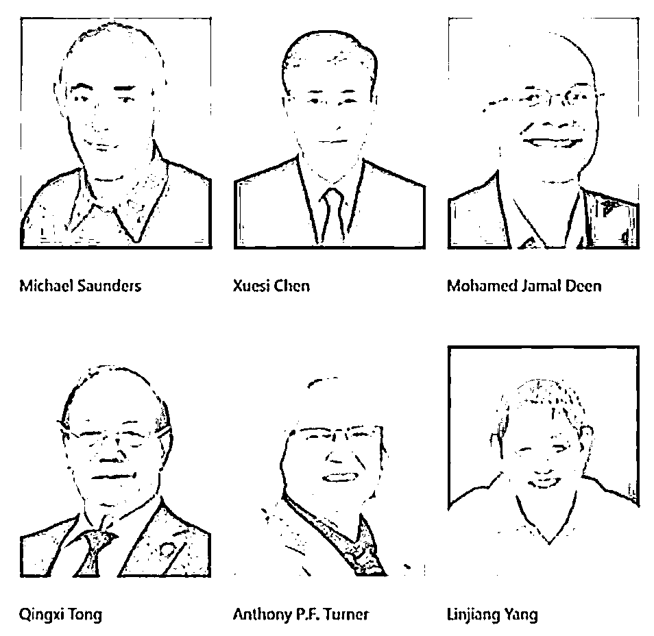

# “联合国科学院”？是假的！不少知名大学都上当了！

> 原文：[`mp.weixin.qq.com/s?__biz=MzIyMDYwMTk0Mw==&mid=2247521790&idx=5&sn=710c37bcced55e79f51101e5d65d5568&chksm=97cb5ec6a0bcd7d0e1c779da0951a91664d7456fe87307ba34d828e4df9bbf39ad195703b1ef&scene=27#wechat_redirect`](http://mp.weixin.qq.com/s?__biz=MzIyMDYwMTk0Mw==&mid=2247521790&idx=5&sn=710c37bcced55e79f51101e5d65d5568&chksm=97cb5ec6a0bcd7d0e1c779da0951a91664d7456fe87307ba34d828e4df9bbf39ad195703b1ef&scene=27#wechat_redirect)

**不瞒大家说，刚听到“**联合国科学院**”的名头时，哥确确实实被唬到了。** 

**在我们这个所有人小时候梦想都是科学家的地方，**联合国认证、科学、院士**，任何一个词单独拿出来，都散发着金光直叫人膜拜。**

**要是连在一起，那是怎样的重量级？**

****

**这位重量级选手，它还真就来了。**

**最近互联网上流传着一份喜讯，标题就闪耀着科学的光芒——** 

****《联合国科学技术组织公布 53 位学者为联合国科学院首批院士》****

********

****重磅炸弹在后头——****

****首批院士 53 位，**华人占了 47 位**。****

********

****瞧瞧你们，还瞎嚷嚷什么华人和犹太人并列世界上最聪明的民族。****

****过时啦，以后犹太人也只能跟在我们后面，捡一点残羹剩饭装点自己的门面。****

****黑眼睛黑头发黄皮肤，成果尽在手里出。****

********

****这 47 位“首批院士”，不乏硕果累累，在专业领域名声赫赫的专家。****

****比如中国工程院院士赵春江、清华大学脑与认知科学研究院首席科学家陈世卿。****

****都是各大院校的骄傲。****

****不少学校的校友会在第一时间发文庆祝。****

****************

****但他们的数量也就到这了。****

****《中国新闻周刊》梳理了各位“院士”的身份，除了少数中国两院院士外，大部分是全国排名二三百名高校的学者。****

********

****剩下的那就厉害了，全是没有学术头衔的**企业人士**。****

****不说了，我的心中只有敬佩。****

****什么叫绝活出草莽？什么叫高手在民间？****

****即使不在高校没有研究条件，即使开公司赚钱已经够忙了，仍然挤出时间进行科学攻坚。****

****虽然不知道他们究竟做出了什么贡献，但能当联合国科学院院士，那肯定是老神仙放屁——非同凡响啊。****

********

****怀着卑微的心，哥登上了联合国的官网，想瞻仰下大能的学术成果。****

****可是无论我在官网怎么找，都找不到这个“联合国科学院”的链接在哪。****

****太重要了，所以把它隐藏起来了？****

****好在天无绝人之路，哥在百度里打上了“联合国科学院”几个字，它的网站一下就蹦出来了。****

****百度搜得到，联合国官网却搜不到，建议古特雷斯秘书长带队来我们西二旗参观学习，好好提升技术力。****

********

****一进入“联合国科学院”的网站，哥就有被震撼到。****

****但凡念过初中的朋友，都知道联合国有六大工作语言。****

****而“联合国科学院”的网站上，只有两种语言，英文和中文。****

****国旗都用错了……****

********

****也许是工作上的小失误吧，上网高强度冲浪的人都知道，歪果仁可不如我们辛苦耐劳。****

****人家在简介里也说了，自己隶属于“联合国科学技术组织”，血统纯正。****

********

****好奇心害死猫，哥又去看了下“联合国科学技术组织”的官网。****

****奇怪，除了 title，怎么都没有提到联合国。****

********

****根据介绍，他们涉及的领域包括国际科学技术发展、科学人居环境...... 此外还发布了一份议程，号称要改变世界。****

****但从他们的“全球区块链联盟”能够看出，他们对区块链情有独钟。****

********

****全名有了，总部知道了，想查出它的底细，还是不难的。****

****有好事网友上美国纽约政府数据库，找到了这个组织的疑似注册地址。****

********

****他用谷歌地图搜了下，在纽约唐人街的一家电玩城。****

****联合国科学家也喜欢打电动哪？****

********

****当然不。****

****很快啊，“联合国科学院”发表声明，他们的注册地址在这栋楼的 8 层 805 号房。****

****而电玩城在 1 层，很明显不一样嘛。****

********

****那最重要的，“联合国科学院”和联合国究竟有没有关系？****

****联合国有个理事会，会接受各种民间组织的注册，而他们的“联合国科学技术组织”就是三万四千个民间组织中的一个！****

****而且他们收到了理事会的回复邮件，还不能证明吗？****

****************

****至于从属关系，他们也挂出来了——****

****本数据库和本网站上的简介本身并**不意味着与联合国有任何从属关系**。****

****“这个组织是完全合法的，联合国科学院从来没有宣称自己是联合国的直属机构，从来就没有宣称过，大家非要这样理解，那也没有办法。”联合国科学院首批院士之一、联合国科学院院长李松军告诉媒体。****

****李院长不愧是联合国级的院士。讲话逻辑严密，天衣无缝。联合国科学院不一定属于联合国。****

****嗐，本来以为他们的关系是罗密欧与朱丽叶。****

****现在一看，罗密欧与忽必烈了属于是。****

********

****也对，很合理。****

****老婆饼里有老婆吗？丝袜奶茶里有丝袜吗？****

****那你凭什么要联合国科学院从属于联合国，气抖冷。****

********

****最神奇的是，就像石原里美不知道自己在中国虎扑参加了女神大赛一样。****

****所谓“首批院士”中的门面，德高望重的两院院士，很多都不知道自己“当选”了。****

****比如北京大学遥感与地理信息系统研究所所长童庆禧，他就表示自己是被“凭空列为院士的”。****

****上半年，有青年学者邀请他“做一些有益科学发展的事”，并发来一张中文表格，他就填了一些自己的贡献，可后来他发现这个“国际组织”里的中国人越来越多，走向不对，就没有再理他们。****

****此后，他也没有收到任何所谓“联合国科学院院士”的聘书。****

********

****现在北大、复旦的校友会都撤掉宣传稿。****

****“联合国科学院”很生气，又发了一通声明。****

****我来翻译一下：都是你们嫉妒向凌云哥哥 哥哥挡了太多对家的路了 哥哥做错了什么你们网暴他。****

********

****好家伙，这位向凌云先生何许人也。****

****“联合国科学技术组织”官网就有他的介绍，组织的执行主席，标准的高端人士。****

********

****是哥手贱，在瞻仰网站的时候不小心下滑，发现在“联合国科学院”一栏上面，赫然写着四个字“千禧王国”****

****地球上还有这么个国家么？****

********

****而根据向凌云先生在网上挂出的信息，他是“千禧王国”的“总统”。****

********

****王国里面当总统，还是位华人？****

****一时间信息量过多，哥的知识盲区警戒灯爆闪，不谈。****

****只是联想到建国后称帝，后被派出所三名干警剿灭的大哥们。****

********

****说回这个“联合国科学院”。****

****一点生活小发现，那些没用明星代言的广告，通常都会出现一个站台“专家”，背后的名号都大得吓人，这个国际组织成员，那个世界协会会长。****

****听着都是高大上，深扒下去都很可疑。****

****比如让杨幂勇夺影后的塞班国际电影节，入围的八成都是中国电影。****

****你细品。****

****再举个例子，世界杰出华商协会，全称世界杰出华商协会有限公司，既是世界又是杰出，既是协会又是公司，多重 buff 加身。****

****你再品。****

********

****这时候，再来看向凌云先生给自己叠的 buff。****

********

****是不是就很亲切了？****

****都是高人啊。****

********

****据说，面对质疑，向凌云认为是“羡慕嫉妒恨”，已经报警了。****

******他真敢报警吗？警察会抓谁呢？******

****来源：新闻哥、中国新闻周刊、东方野、巴蜀反诈****

********

****← 向右滑动与灰产圈互动交流 →****

********