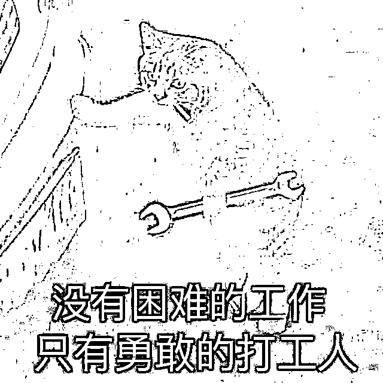
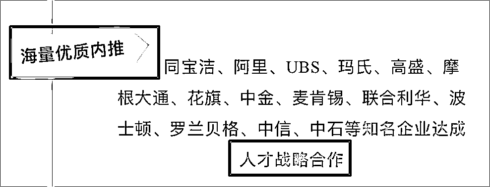

# 大厂内推包过，保实习 2-3 万？！

> 原文：[`mp.weixin.qq.com/s?__biz=MzIyMDYwMTk0Mw==&mid=2247521790&idx=6&sn=6be8492740bb0f101bd5118a7ddb1a8a&chksm=97cb5ec6a0bcd7d04f43047f11e19e6c23dc6c398d8716c87ffd05fd5d830692a837969579ab&scene=27#wechat_redirect`](http://mp.weixin.qq.com/s?__biz=MzIyMDYwMTk0Mw==&mid=2247521790&idx=6&sn=6be8492740bb0f101bd5118a7ddb1a8a&chksm=97cb5ec6a0bcd7d04f43047f11e19e6c23dc6c398d8716c87ffd05fd5d830692a837969579ab&scene=27#wechat_redirect)

随着国庆小长假的结束，金九银十招聘季也进入最后的黄金时期。

小张信心满满地准备着找工作，**没成想反被骗了 6 千块......**

事情是这样的。

小张作为睡衣都要穿企鹅印花的腾讯狂粉，未来就职的首选就是腾讯。

但自觉自己的简历并没有任何亮点。于是他决定先参加一个大公司的实习，提升自己的竞争优势，为进入腾讯作准备。

左等右等了几个月，还是没有一个双方都满意的 offer，焦虑透顶的小张经人介绍，添加了一个“**就业实习导师**”的微信，因为他的个性签名写着：**各大厂实习，欢迎咨询内推**。

而从此时开始，一场出色而精湛的表演开始了。

对方介绍说他姓贾，看在小张发过去的简历非常优秀的份上，**他会提供 2 次的模拟面试和 4 节单独定制的个性化面试辅导，****原价 1500 元，打八折，交 900 定金就行了****，对辅导结果不满意，****首次可退****。**

小张听说可退，便同意接受对方的辅导，满心欢喜交付了定金。

辅导结束他并没有感到有多大的收获，但他清楚的记得老师每节课都会穿插其中的一句话：“**你的简历没有实践经历，靠自己面试有点难啊，其实给你内推一下就不用这么费劲准备了，包过。”**

当天他小心翼翼的表达了退款需求后，对方爽快的将钱打了过来。这让小张感觉贾老师真的不能再真。紧接着小张决定询问关于“**内推包过**”的事，一向只会发“微笑”的贾老师第一次发来了可爱的表情包。随即开始了介绍。

“我们跟各大企业都有战略合作，只要你符合基本要求，通过是完全没有问题的。岗位和实习地点你可以根据自己的需求进行选择。”这些话让小张对贾老师向他描绘出来的美好未来产生了极大的向往。

单纯的小张看着对方发来的一份表格两眼发光，上面详细的记录了目前各大公司可以申请的岗位，以及相对应的价格，名额，办公要求等。

小张选了一个 XX 公司的技术前端岗，远程实习，有正式实习证明，有工资，售价 1.5 万元。

第二天，对方便发来了消息“面试官对你很满意，你选个方便的时间，我这边马上安排你入职。”小张感到皇天不负有心人，终于可以丰富自己的简历了，他满心欢喜的拿出自己攒的生活费，**按照约定支付了 40%的定金，6000 元，等待收到正式的入职邀请。**

几天过后，他发现敬爱的贾老师将他拉黑了，他，被骗了。

事后才知道，**所谓的“战略合作”实际就是个噱头，认识几个内部的人即等同于战略合作，而事实上所谓的“内部人士”甚至都不知道这回事的存在**；而通过率其实就是个概率问题，他们收到你的简历后即会按照正常程序投递，跟你的操作一模一样，总会有人凭自己的实力得到 offer，而这份荣誉就会算在他们的头上化为“成功率”。最后的岗位和地点，当然也是假的。

这样的局不似传统骗局，赤裸裸地骗钱。相反，它**利用互联网的一些信息差和漏洞，打着“大厂内推”的旗号，精准算计目标群体。**

小珊在这提醒大家，招聘单位以任何名义向求职者收取体检费、上岗费、保密费、预留职位费、保证金等各种费用，都是违法的。

所以看到收钱的，直接走就好了，骗子无疑。

**除了大厂内推陷阱，针对学生的****培训陷阱也层出不穷。**

**小 A 是个刚毕业的大学生，求职过程中被一家**免费培训免费找工作**的机构吸引了。抱着试一试的心态，小 A 找到了这家培训公司。**

**这家培训公司煞有介事的安排了满满当当的培训。但三天后，当初宣传的免费变了味。**原来这个“免费”不是不要钱，而是“借钱”给你培训，事后还款**。**

**怎么一波操作呢？培训机构告诉小 A，本次培训是收费的，但是可以**向第三方贷款机构申请贷款交学费，培训完成后由培训公司推荐就业，最后贷款费用从工资中按月归还**。**

**一边是找不到工作的窘境和压力，一边是看起来很正规的培训机构。这钱还不用自己出，未来的就业蓝图也是被吹嘘的像彩虹一样绚烂，主要还跟你**签合同，保证高薪就业**。**

**小 A“上钩”了。**

****

**结果就是，培训机构最后把钱一收，找不找得到工作全看天意，所谓“高薪就业”不过是幌子，不过是让你心甘情愿去贷款。**

****

**这样的“培训陷阱”不在少数，这些培训公司多以宣传**“95%的推荐成功率”、“100%推荐工作，直到满意为止”**招揽求职者，培训内容多为 IT 行业。**

**而他们的套路出奇的一致：**

****先打压，再安慰，画好饼，去培训，没有钱，去贷款，贷完款，我赚钱，你玩完。****

******** 

**说了这么多，那求职者该去哪里获得招聘信息，减少被骗的可能性呢？**

**别慌，小珊给大家整理了几个**相对靠谱的渠道**。**

****

****就业中心官网**** 

**在学校就业中心官网上和其他兄弟院校的就业网上的招聘信息可以优先考虑，高校就业中心对其官网挂出的招聘单位通常有审核要求，为你挡住了一批骗子。**

****

**** 校园宣讲会**** 

**校园宣讲会是非常好的沟通/甄别渠道，通常公司会承担场地费、高校会审核他们资质，关于公司业务、人员素质、团队风格等都可以在宣讲会上详细了解。**

****

**** 审核招聘资质的招聘网**** 

**如应届毕业生网等。**

**怎么知道招聘网是否审核资质？可以在登陆时以企业身份注册信息，若需提交企业营业执照等证件才能发布信息，一般是靠谱招聘网站。若网站没有此环节，则需要进一步核实公司和招聘人员真伪。** 

****公司官网****

**在公司官网/官微——“加入我们”的栏目中通常会放上近期招聘计划。**

* * *

**最后，刚出社会的学生没有社会经验，加上信息不透明和急于找到实习来证明自己，往往给不法分子留下很大发挥信息差的空间。**

**小珊真诚建议学生群体在求职之前预留时间提前了解一下招聘陷阱和真实职场，不要成为骗子实验的“小白鼠”。** 

****

**来源：微信珊瑚安全**

****

**← 向右滑动与灰产圈互动交流 →**

****