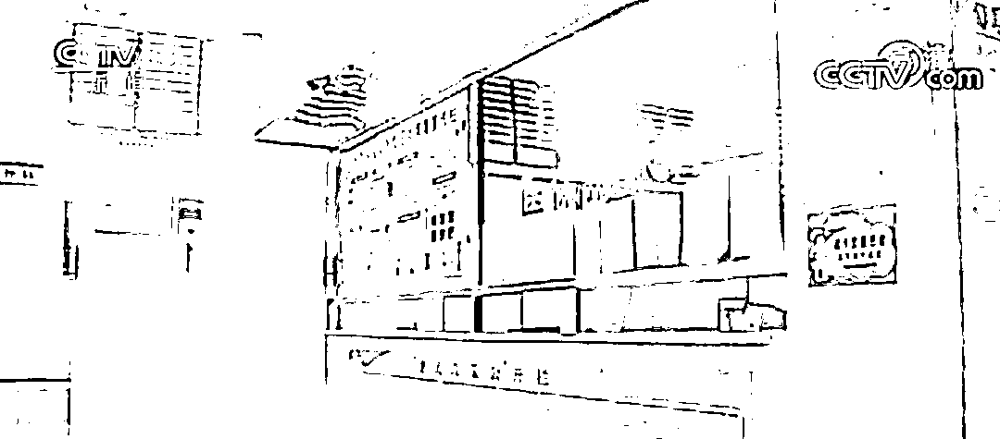
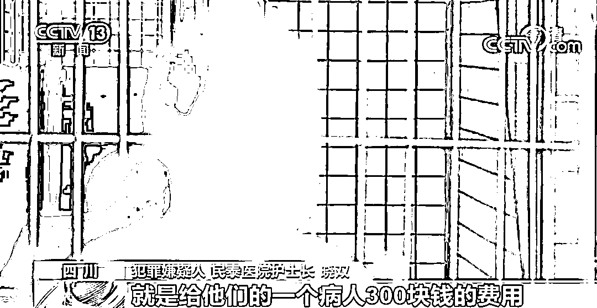
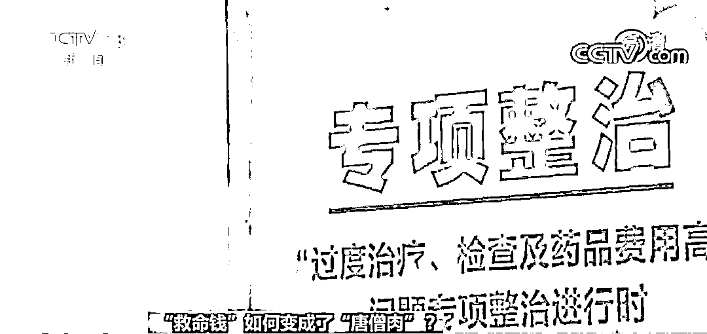
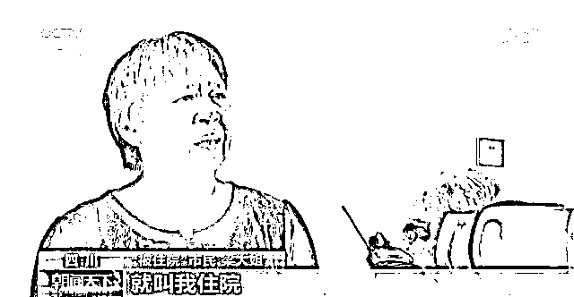
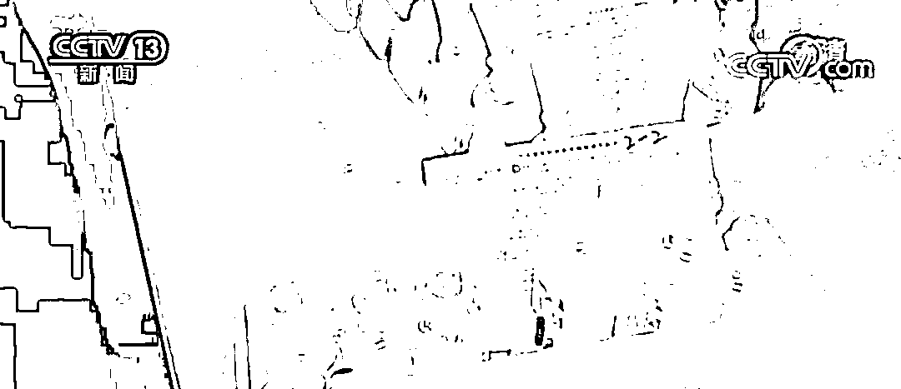
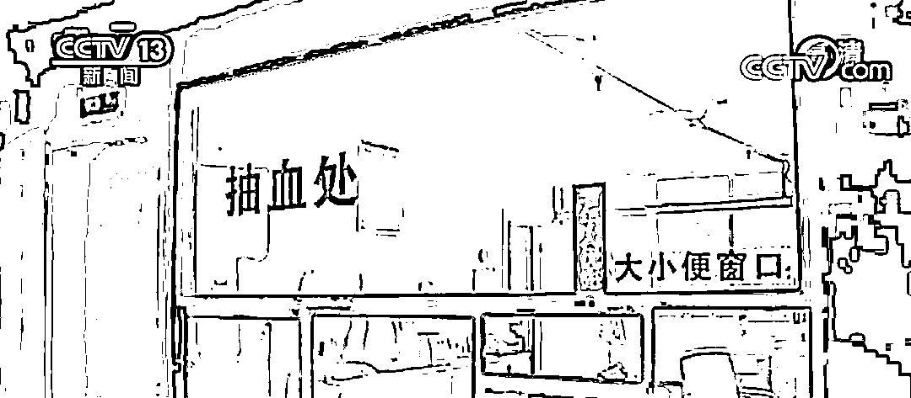

# 触目惊心！医院院长带头骗保，职工介绍一个病人提成 300 元

> 原文：[`mp.weixin.qq.com/s?__biz=MzIyMDYwMTk0Mw==&mid=2247521850&idx=2&sn=7cf33a879bee240760a60413e8bf5c6c&chksm=97cb5d02a0bcd4144f3047a8dfe9557fb9966ab40c8422696a4023e53c0242e5ba0955dda46d&scene=27#wechat_redirect`](http://mp.weixin.qq.com/s?__biz=MzIyMDYwMTk0Mw==&mid=2247521850&idx=2&sn=7cf33a879bee240760a60413e8bf5c6c&chksm=97cb5d02a0bcd4144f3047a8dfe9557fb9966ab40c8422696a4023e53c0242e5ba0955dda46d&scene=27#wechat_redirect)

近期，四川警方破获一起民营医院诈骗医保基金的案件，案件背后的真相触目惊心。为骗取医保基金非法牟利，该医院内部全流程造假，医院院长带头骗保、医院职工每介绍一个病人提成 300 元……

涉案医院看病拉人头

市场部地位举足轻重

涉事医院名为民泰医院，位于四川省达州市宣汉县。医院院长王大财，医学专业出身，曾在乡镇卫生院做过院长。2018 年 3 月，他和朋友合伙开办了这家医院。医院下设综合部、市场部、医生办、护理部、检验科等 8 个部门，其中市场部在医院的地位举足轻重。 

> 犯罪嫌疑人 民泰医院检验科殷律：医院成立了一个市场部，在外面拉病人。 
> 
> 犯罪嫌疑人 民泰医院医生办竹心：我刚来医院应聘的时候，领导就告诉我说，你在这里看病，不用愁病人，把病人看好就行。 
> 
> 犯罪嫌疑人 民泰医院护士长晓双：病人不是很多的时候，院长就说大家都要去找病人，这医院是大家的。

刚开业的两个月，民泰医院人头攒动、一床难求。根据医院员工反映，那段时期，市场部几乎每天都能带来不少患者。 民泰医院护士长晓双说，市场部带病人有提成，一个给 300 块钱。有时候不需要住院，他们就办住院了。

2018 年 5 月，民泰医院被正式纳入定点医疗机构。可开业刚刚半年，医保局就给他们开出了罚单。 

> 达州市宣汉县医保局副局长 王进：在 2019 年 1—6 月份的时候，它的申报医保基金的数字就是达到 377 万元，我们当时就感觉它的申报基金与同级同规模的医院比有点偏大。

随后，宣汉县医保局迅速对民泰医院进行了重点核查。因为发现医院有不合理检查、不合理用药和治疗等问题，宣汉县医保局对民泰医院做出暂停联网结算三个月，追缴违规基金 21 万元的行政处罚。 

涉案医院虚构医疗服务和诊疗项目

病人“被住院”、做所谓的“免费体检”

被医保局开出罚单并停止医保结算，这让民泰医院的患者数量迅速回落。没有患者，医院就没有收入，为了扭转被动局面，院长和他的核心团队就开始筹划一盘更大的棋局。

家住附近的小童，曾经因为输液来过民泰医院。警察找到他核实情况时，他才知道自己已经被“住过”七次医院了， “我后面才知道住了六七次吧，我只住了两次差不多，我都不在这里睡觉。”

公安机关在外围取证过程中还发现，民泰医院自 2018 年以来共收治患者 3000 余名，患者大多以中老年为主且居住在偏远的农村。

东乡镇明月村村民梁大姐去市里参加广场舞活动时，被同伴带去了民泰医院，就是因为当时医院承诺给大家做免费的体检。

> “被住院”市民 梁大姐：做了个 B 超和心电图。体检之后，我就问多久拿结果。他们说今天拿不到，说给我办个住院手续让我住院。我说我个人晓得没有什么毛病，不住院。 
> 
> 记者：那您最后还是没住过院？ 
> 
> “被住院”市民 梁大姐：没住过院。 
> 
> 记者：您的体检结果到现在也没拿到吧？ 
> 
> “被住院”市民 梁大姐：没拿到，不晓得。

达州市宣汉县公安局刑警大队李博说：“他们就是通过免费体检换取病患的医保信息和身份信息。然后将这些信息用于医院挂床，来诈骗国家医保资金。”

伪造病历、虚开的药品被捣碎倒掉…

涉案医院医护“配合默契”

警方在侦查中还发现，诈骗医保基金，这家医院内部可以说得上是分工明确、配合默契。医生办主要负责虚假治疗、伪造病历、空挂和虚开住院天数，而护理部的工作就要配合医生办执行假医嘱，编写虚假的护理记录。

护士长晓双平常除了做好在院患者的基础护理工作外，还有一个重要的任务，就是及时处置虚开的药品。“王大财让我们把多余的药处理掉，我们就把药敲碎倒掉。”

虚开的药品没有真正用于患者，而是被倒进了下水道，医疗资源被大量浪费，被侵占的医保资金却源源不断地流进民泰医院的口袋。

为使患者达到住院标准

涉案医院对检测结果动手脚

经过对患者全覆盖式的走访调查，专案组在海量的医保数据中发现民泰医院的医保病人覆盖率达 99%，门诊病人却几乎为零。只要到民泰医院就诊，不管大病小病，有病没病都被要求住院治疗。 

住院的标准不是患者的病情指征，而是治疗的费用是否能达标。医院有了这样的硬指标，各个科室之间不但要自我发挥还得相互配合。 

> 犯罪嫌疑人 民泰医院检验科殷律：就血常规、白细胞稍微给它上升一点，看起来符合用药的标准。 
> 
> 记者：你觉得对患者意味着什么？ 
> 
> 犯罪嫌疑人 民泰医院检验科殷律：乱用药，过度使用抗生素。

患者的血象检测系数被动了手脚，医生办才好照单全收、安排住院。 

> 犯罪嫌疑人 民泰医院医生办竹心：病人不够住院指征，我可以拒绝不治疗，但是外联部不同意，他要找你说话。他辛辛苦苦从外面找来，你给他推走了的话，他肯定就对你有意见。

患者不知情、病历靠虚构、四处拉人头、没病也住院，正是在这样畸形的医疗生态下，各个部门之间形成的默契，早已背离了医院“救死扶伤”的初心。

截至目前，警方已查明，院长王大财和他的核心团队组织紧密、分工明确，以民泰医院为掩护诈骗的医保基金，经审计确认的已达近 100 万元。这些非法所得除用于支付医院日常运行成本之外，全部用于股东分红和市场部提成。

记者在采访中看到民泰医院墙上张贴的海报，上面写着“带着感情进病房、想着病人开处方”，如今也成了这个骗保团伙最大的讽刺。

[`v.qq.com/iframe/preview.html?width=500&height=375&auto=0&vid=z3300q1xj15`](https://v.qq.com/iframe/preview.html?width=500&height=375&auto=0&vid=z3300q1xj15)

来源：央视新闻

← 向右滑动与灰产圈互动交流 →

