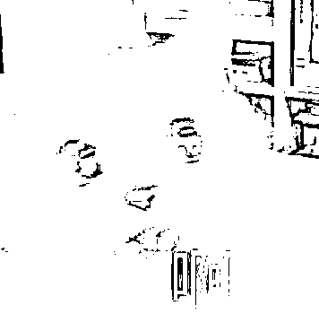
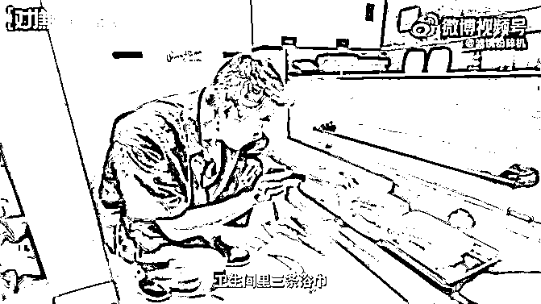

# 2800 元一晚！环球影城酒店被曝“马桶不刷、枕套不换、水杯不洗”，重新定义《五星级》…

> 原文：[`mp.weixin.qq.com/s?__biz=MzIyMDYwMTk0Mw==&mid=2247521850&idx=3&sn=a0bd7cdf98f661aa3e130e0f78cd9785&chksm=97cb5d02a0bcd4143296c475a7803f4eafd3a3efa9940a8fd7aa0f8f5525741f754c95a01aa6&scene=27#wechat_redirect`](http://mp.weixin.qq.com/s?__biz=MzIyMDYwMTk0Mw==&mid=2247521850&idx=3&sn=a0bd7cdf98f661aa3e130e0f78cd9785&chksm=97cb5d02a0bcd4143296c475a7803f4eafd3a3efa9940a8fd7aa0f8f5525741f754c95a01aa6&scene=27#wechat_redirect)

说起来最近北京环球的热搜

上的有点频繁

亮点刷屏一波之后

风波就来了

前有游客因插队问题起争执...

后有员工偷拍女游客裙底…

不过 尽管节前环球影城风波不断

但是整个国庆假期

新开园的北环球依旧持续火爆

据北京市文化和旅游局统计

10 月 1 日至 4 日

入园人数总计高达**10.5w 人次**

可就在 10 月 4 日晚上

北京环球又双叒出事了！！

震惊！有网友爆料称

北京环球影城的酒店

**马桶不刷**

**枕套不换**

**水杯不洗**

**环球影城两家酒店卫生情况堪忧**

首先要知道

环球影城的酒店

堪称**五星级酒店**

价位可是不一般啊

像国庆这种节假日期间

诺金度假酒店

房价可以达到**2120r**一晚

而环球影城大酒店

房价更是达到了**3500r**一晚

四位数的客房

肯定很尊贵啊

起码整洁干净是肯定要保证的

毕竟那可是**四位数**啊！！

然而，四号傍晚五点

B 站 UP 主"滤镜粉碎机"

发布视频称：北环球酒店存在

**“枕套不换、水杯不洗、马桶不刷”**的情况

UP 主称自己在**9 月底非周末时间**

入住了**环球影城大酒店 **

**2800 元一晚**的功夫熊猫主题房

不得不说

这个熊猫主题房

布置有那么一点点诡异

整体配色是红配绿

没看出古色古香

但是莫名想到了土里土气

一个不留神

仿佛穿越到东北扭秧歌现场

到了夜晚更是有点...

**阴    间**

入住当天，UP 主进行了

**一客一换测试**

在酒店的床品、卫浴、水吧、杯具上

盖了隐形的荧光标记

这些标记可以轻松被水擦拭掉

也就是说

只要清扫阿姨按流程清洁过房间

这些标记就会消失

第二天，UP 主退房并换人

入住同一间房

没想到再次检查后

结果令人目瞪口呆...

房间里**三个枕头的枕套**

**以及六个水杯**

均有完整的荧光标记

**也就是说！**

**它们根本没有换过！！！**

**三件浴袍、三条浴巾、三条毛巾**

**都只是更换了一件（条 )**

来看马桶这边的情况

**只擦拭了马桶圈**

**而马桶盖内侧没有清洁**

另外 UP 主还碰到这种奇怪的情况

房卡总是莫名其妙消磁

但是消磁的房卡却

可以点亮每一层的电梯

 

这不是很危险吗？

谁拿到房卡就可以随意出入

这家酒店的房间？！

环球影城的另外一家酒店

诺金酒店的卫生情况如何？

已经不想抱希望了......

UP 主在同样的时间段

入住了诺金酒店 

**2809 元一晚**的豪华双大床房

同样也进行了**一客一换**测试

测试结果显示

诺金酒店的床上用品

毛巾、浴巾、地巾全部都更换了

但**马桶清洁不够彻底**

和环球影城大酒店

存在同样的问题

两个漱口杯、六个水杯

没有清洗更换

其中一个水杯

博主还曾用来喝过药

很难想象

价格 2800 一晚的豪华酒店

甚至抵得上别人一个月房租

卫生情况就这？就这？

想象一下，你用陌生人的

浴巾浴袍毛巾床单

万一人家有个皮肤病传染了咋办？

▼视频 19 秒

[`v.qq.com/iframe/preview.html?width=500&height=375&auto=0&vid=c33004dve2n`](https://v.qq.com/iframe/preview.html?width=500&height=375&auto=0&vid=c33004dve2n)

**网友议论纷纷，环球影城回应**

目前该视频在 B 站的

**播放量已超过 200 万**

**弹幕超过 7000 条**

**点赞近 16 万**

**微博热搜阅读量也过亿**

**讨论量超过 6000**

网友大无语

虽然知道酒店卫生情况 emmm

但刚刚开业就敢这样？

好歹多坚持一会啊？

更有网友大胆猜测谨慎求证

是不是五星级还是街边旅馆

打扫阿姨拿的钱都一样的？

那酒店管理怎么才搞得好？

不是网友不信任

是现在酒店真的不行！

另外有件事挺无奈的

大家选择入住环球影城酒店

是因为这两家配套酒店

为目前北京环球度假区内

**仅有的两家酒店**

住客能在每日开园时间之前提前入园

并能通过酒店专属通道

快捷地进入环球影城主题公园

这样一来，能够节省排队时间

玩到火爆难抢的项目

 所以大家当然趋之若鹜

不管怎么说，UP 主这期视频

确实掀起了一波舆论

这不，10 月 5 日下午

北京环球影城方

也第一时间回应了此事：

**“我们对于视频中**

**所反映的情况非常重视**

**这与我们一贯的卫生标准不一致**

**我们已立即启动内部调查**

**并将根据调查结果采取进一步措施。”**

贴心的网友纷纷帮忙翻译了一下

这回应话术我熟啊我来！

最后还是希望北京环球影城

这个自查不是为了糊弄网友随便搞搞

而是真的做好 2000r+酒店

“一客一换”基础管理

可千万别从此重新定义

**《四位数》《五星级》**

《四位数》《五星级》：

指“枕套不换、水杯不洗、马桶不刷”

顺便，不会写公告？

网友来帮你！

（最后的凌晨三点不要太灵性）

 本文部分素材来自：滤镜粉碎机，由上海全知道整理发布

← 向右滑动与灰产圈互动交流 →

