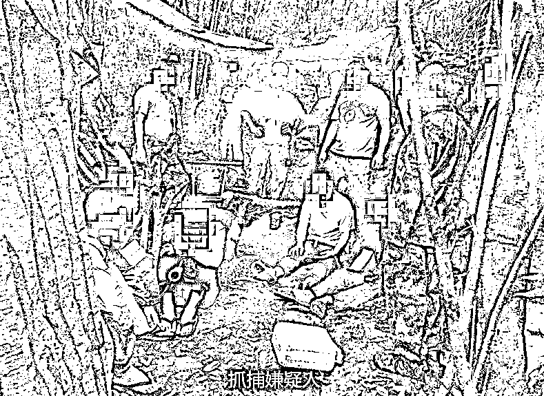

# 隐居深山老林，骗子们比你更能吃苦，更努力

> 原文：[`mp.weixin.qq.com/s?__biz=MzIyMDYwMTk0Mw==&mid=2247521906&idx=1&sn=5f3d9cc71e9cb43156f22d38ae3bf664&chksm=97cb5d4aa0bcd45ca329503d3c6efc63a15770a10ba0b35d1c9f28f9d40b3b8d109810097ee4&scene=27#wechat_redirect`](http://mp.weixin.qq.com/s?__biz=MzIyMDYwMTk0Mw==&mid=2247521906&idx=1&sn=5f3d9cc71e9cb43156f22d38ae3bf664&chksm=97cb5d4aa0bcd45ca329503d3c6efc63a15770a10ba0b35d1c9f28f9d40b3b8d109810097ee4&scene=27#wechat_redirect)

当中国政府严打诈骗的时候，那些想要淘金的诈骗分子，不远万里漂洋过海到异国他乡或者冒着生命危险摸黑偷渡，过着有家不敢回或者不能回的日子，一有些风吹草动就担惊受怕。 

而没有出国的那帮人，则将窝点搬到深山里，“艰苦奋斗”。

**其实，他们心里也觉得委屈、无奈，也觉得自己是用命在换钱，时刻在感叹着世事多艰，赚钱不易。**

最近，泉州永春警方破获一起躲在深山老林里“安营扎寨”，过着隐居般生活的“杀猪盘”诈骗案。

经缜密侦查、周密部署，泉州永春县公安局于 9 月 27 日凌晨三点组织开展抓捕行动，民警们经过近 2 个小时的跋涉，成功在某山头上捣毁一个诈骗窝点。

从警方公布的信息来看，你就知道了骗子到底有多“努力”，多能“吃苦”，才可以成功骗到钱。

其实，只要有人可骗，骗子们宁愿每天不眠不休，而且从不挑自己的工作环境。

难走的山路。 

警方现场抓获 4 名诈骗犯罪嫌疑人莫某波（男，32 岁，广西壮族自治区人）；卢某虎（男，24 岁，湖北省监利县人）；陈某明（男，33 岁，广东省茂名市茂南区人），邓某萍（女，30 岁，江西省全南县人）；

简易帐篷、原始般的生存环境，诈骗分子就是在这种环境里，进行“艰苦奋斗”的诈骗。

这些人在深山里冒充在香港从事证券工作的年轻离异单身女性，利用手机从陌陌上寻找对象添加为好友进行聊天。时机成熟后就直接“杀猪”。

在深山里搭建简易的工棚。将所需的生活用品扛进山里，过着隐居般的生活。

吃住啥的都不讲究，只要能活下去就行。 

时刻提防蚊虫叮咬，扛住得野外蛇等攻击性动物侵扰的风险。

想要吃香喝辣，也要等宰完一头头“猪”再说。

一张简易的桌子，一个装在树上的新号发射装置，搭建起**一个辐射全国各地**的工作基地。

需要躲到深山里从事诈骗，也反应出了，国家对诈骗的严厉，骗子们也是活的“很艰难”。 

不单单是国内的那帮人，国外的诈骗分子们也过的不是很好。

上图为上个月，柬埔寨警方突袭一非法窝点，进入窝点时一些人在地板上睡觉，旁边人在上班。

要不是有图片为证，不少人都不相信这是诈骗者的生存条件。

当然也有不少人被骗往东南亚，呆在诈骗窝点里如同黑砖窑的“黑工”，不敢声张、小心翼翼，过着暗无天日的生活。

来源：我在柬埔寨

← 向右滑动与灰产圈互动交流 →

