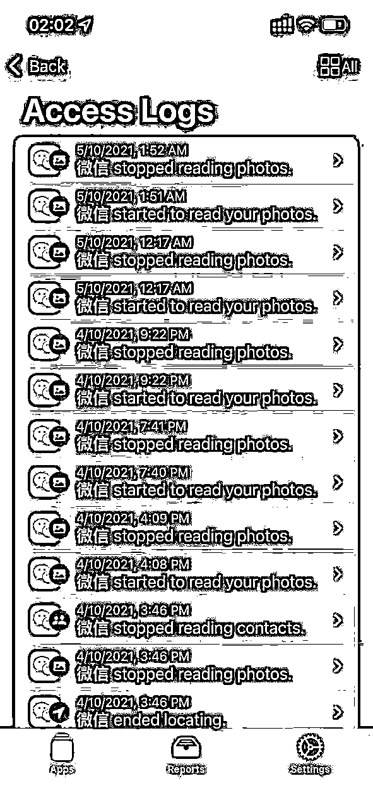
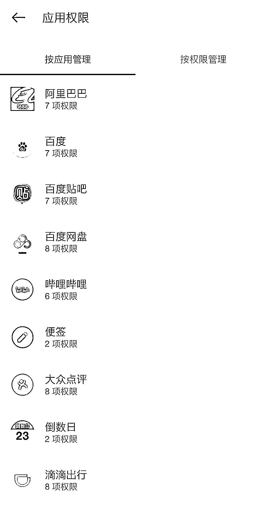
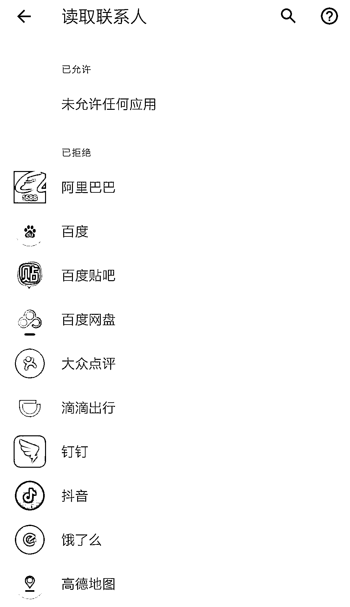
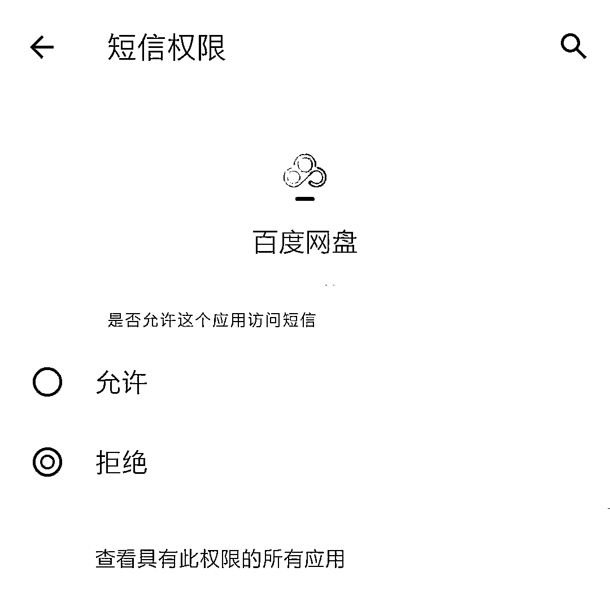
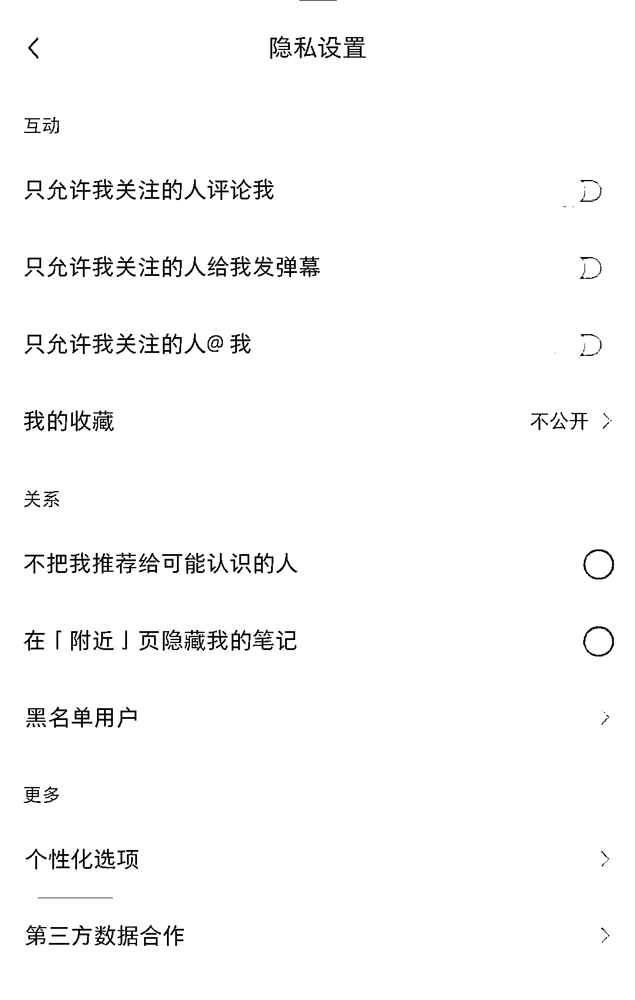

# 微信后台反复读取用户相册？手把手教你为隐私上锁

> 原文：[`mp.weixin.qq.com/s?__biz=MzIyMDYwMTk0Mw==&mid=2247521906&idx=2&sn=1ce659db3d534215127e10e07cee56e8&chksm=97cb5d4aa0bcd45c370463ca548cee9460b35a076f00fd5bf4bc2dc7de314a64b5c3094342ea&scene=27#wechat_redirect`](http://mp.weixin.qq.com/s?__biz=MzIyMDYwMTk0Mw==&mid=2247521906&idx=2&sn=1ce659db3d534215127e10e07cee56e8&chksm=97cb5d4aa0bcd45c370463ca548cee9460b35a076f00fd5bf4bc2dc7de314a64b5c3094342ea&scene=27#wechat_redirect)

△图源视觉中国，图文无关。

10 月 8 日晚间，有网友反映，iOS 版微信、QQ、淘宝等多款 App 在后台反复读取用户相册。针对此事，微信方面回应称，iOS 系统为 App 开发者提供相册更新通知标准能力，相册发生内容更新时会通知到 App，提醒 App 可以提前做准备，App 的该准备行为会被记录成读取系统相册。那么，作为普通用户，如何最大程度地保护自己的信息。

**不用软件也被读取数据**

根据用户描述，开启新版 iOS15 的“隐私”功能有“记录 APP 活动”，可以存储 7 天内 APP 访问位置或麦克风等数据，该用户发现，微信在用户未主动激活应用的情况下，在后台数次读取相册，每次读取时间长达 40 秒至 1 分钟不等。此外，QQ、淘宝等多款国产 App 均存在后台频繁读取用户相册的行为。

该用户表示，在进行测试时，用户在前台并未主动运行 App，但上次使用微信后，直接上划返回主屏幕，没有彻底杀死后台，期间 iOS 默认开启后台应用数据刷新，未手动改变过状态。从读取时间来看，用户在睡觉的时候它也在读。“照片是用户隐私，每次调取用户隐私时用户并不知情，如果仅仅是为了扫描是否添加了新图片，也没有必要如此过度请求。”该用户说道。

对此，微信方面表示，iOS 系统为 APP 开发者提供相册更新通知标准能力，相册发生内容更新时会通知到 APP，提醒 APP 可以提前做准备，APP 的该准备行为会被记录成读取系统相册。当用户授权微信可以读取“系统相册权限”的前提后，为便于用户在微信聊天中按“+”时可以快速发图，微信使用了该系统能力，使用户发送图片体验更快速流畅。

微信还表示，上述行为均仅在手机本地完成，最新版本中将取消对该系统能力的使用，优化快速发图功能。

**简单几步为隐私上锁**

手机 App 私自浏览用户文件、侵犯个人隐私的事件层出不穷，作为普通用户也并非没有对策，在平时使用 App 时注意使用习惯，首次下载 App 时选择性地开启权限都能在一定程度上防止 App 读取信息。

首先，在首次下载并启动 App 时，App 都会向用户索取各种权限，在此时，用户就可根据自身需要拒绝某些功能的授权，例如游戏类 App 可以关闭录音拍照功能、视频类 App 可以关闭通讯录读取等等。

在完成第一步授权之后并不算万事大吉，有些应用就会在初次授权时趁机向用户索取一些与该 APP 无关的权限，然后在用户毫不知情的情况下偷偷开启。在这时，用户就需要通过手机设置，进一步查询 App 的权限并关闭。

以记者的安卓手机为例，进入手机“设置”-“隐私”，就可找到应用权限管理的入口（也有手机会将权限管理的入口放在“应用”里）。进入权限管理，就可从逐个查询 App 权限，可根据自身需要关闭。例如记者在查询时注意到，“百度网盘”App 可以读取信息，但在日常使用中记者并不需要对短信内容进行备份，就可以关闭权限。依据 App 功能，我们只需要打开它必须运行的集中权限即可，其他的都关上。

在设置内完成权限设置之后，可以再去各个 App 检查一下是否还有没有关掉的、会泄露隐私的功能，进入 App 的“设置”-“隐私”/“通用”就可排查。例如被很多人诟病的联系人推荐功能，以小红书为例，如果不想被熟人发现账号，就可在“隐私设置”里把“不把我推荐给可能认识的人”这一项打开。

此外，在每次用完 App 时及时清除后台，也能在一定程度上防止 App 读取数据。

 来源 ：潇湘晨报

← 向右滑动与灰产圈互动交流 →

