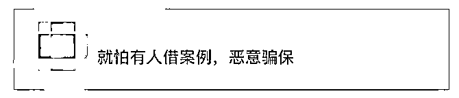

# 父亲驾车不慎轧死 2 岁儿子，保险被判赔 111 万！网友炸锅…

> 原文：[`mp.weixin.qq.com/s?__biz=MzIyMDYwMTk0Mw==&mid=2247521906&idx=3&sn=cf3e92cfe23615c2dfb5020cfdccca9a&chksm=97cb5d4aa0bcd45c83ca41c8e87165a5da77247b6701edb686aac8602942b827925df8038350&scene=27#wechat_redirect`](http://mp.weixin.qq.com/s?__biz=MzIyMDYwMTk0Mw==&mid=2247521906&idx=3&sn=cf3e92cfe23615c2dfb5020cfdccca9a&chksm=97cb5d4aa0bcd45c83ca41c8e87165a5da77247b6701edb686aac8602942b827925df8038350&scene=27#wechat_redirect)

开车不能“飙车”

这一点是毋庸置疑的！

但是...

有一点经常会被一些司机忽略

——开车起步前留心观察

**上海的一位父亲就因为一个疏忽**

**受到“血的教训”**

**驾车时不慎轧死自己两岁的儿子**

**令人惊诧的是——**

**这个父亲还把保险公司告上了法庭！**

**事件：**

**父亲驾车意外轧死儿子** 

**夫妻二人状告保险公司索赔**

2020 年 8 月，上海市民吴先生从家里出发，准备驾驶小车外出办事。没想到，车辆起步的时候，自己刚满 2 岁的儿子小吴正好在车旁玩耍。

吴先生并没有留意到这一情况，驾驶车辆不慎轧到儿子。最终，经抢救无效…小吴死亡。

复旦大学上海医学院司法鉴定中心鉴定，小吴死因符合道路交通事故，并致颅脑损伤。根据公安部门出具的《非道路交通事故证明》显示，吴先生驾驶机动车时，未按操作规范安全驾驶，对本起交通事故负全部责任，小吴无责任。

事后，**吴先生夫妇认为保险公司应负赔偿责任，并起诉到法院。**涉案车辆登记由保险公司承包交强险及商业险 100 万元，事故发生在保险期限内，要求赔偿死亡赔偿金 138 万余元。**这下，保险公司不答应了！****明明是驾驶员的责任****  凭啥让我赔偿？**保险公司认为：小吴是被保险人吴先生的家庭成员，吴先生既为加害人，又是赔偿请求权人，身份竞合，吴先生不应该作为原告，保险公司不承担赔偿责任。且事故发生在吴先生家门口，不属于道路交通事故。该事故不应该属于交强险和商业险的责任范畴。即便认为保险公司应作出赔偿，吴先生夫妇作为小吴的监护人，并没有尽到相应的看护义务，也应该承担相应的责任。**法院：****判决保险公司赔付共计 111 万元** 经法院审理认为，保险公司作为肇事车辆的承保人，应按法律和保险合同约定承担赔偿责任。吴先生夫妇作为小吴父母，有权以赔偿权利人（即原告的身份）提起诉讼，诉讼主体合格。对超出保险赔偿部分，小吴母亲自愿免除加害方的责任，于法无悖，法院予以准许。此外，本案中加害人与受害人系父子关系，但经鉴定受害人符合道路交通事故致颅脑损伤特征，驾驶员非故意造成事故，不存在被保险人骗保等道德、法律风险，保险公司仍应按照保险合同约定承担相应的赔偿责任。保险公司以小吴为驾驶员家庭成员为由拒绝赔偿无事实和法律依据。案件损害后果发生的主要过错在于机动车吴先生操作不当，吴先生夫妇疏于监护与事故发生具有一定因果关系，结合案情酌情确定机动车一方应承担 80%的赔偿责任。**法院最终判决：****保险公司在交强险限额内****赔付原告 11 万元****在商业三者险限额内****按责 80%赔付 100 万元**这一案例一经公布在网络上引起了巨大争议一度登上微博热搜↓↓↓ 很多网友表示担心有人借此案例恶意骗保 也有人表示支持法院的判决实际上类似的案例不是没有过其中刑事责任部分司法机关也会依法判决 2018 年 3 月 31 日上午 8 点多，安徽繁昌的小舒在自家门口倒车，他没有注意到，1 岁多的儿子已经走到了轿车后方。当小舒下车查看之后，已经为时已晚——儿子小小的身躯已经无法动弹，送到医院时已经来不及了。小舒案发后拨打 110 电话报警，并在将其子送医院抢救后自行到繁昌县公安局交通管理大队接受调查。繁昌县公安局交通管理大队经过调查后认定，小舒负本起交通事故全部责任。案发后，**小舒的妻子对小舒的过失行为表示谅解，请求司法机关从轻处罚。** 法院审理认为：被告人小舒在自家门前驾驶机动车时，由于疏忽大意未确认安全，以致造成一人死亡的后果，其行为已构成过失致人死亡罪，公诉机关指控的犯罪事实及罪名成立，法院予以支持。**本案被告与受害人系父子关系，受害人之母亦对被告的过失行为表示谅解，据此可认定被告犯罪情节较轻。**被告具有自首情节，依法予以从轻处罚；其当庭自愿认罪且系初犯、过失犯罪，**可以适用缓刑。**最终，被告人小舒因犯过失致人死亡罪，被判处有期徒刑一年，宣告缓刑一年。 法律面前人人平等 虽然当事人获得了经济赔偿但是心灵的创伤却无法弥补法官提示

驾驶机动车时，在车辆起步、行驶、停车等各个环节均应高度注意，不可掉以轻心。本案中加害人与受害人系父子关系，但经鉴定受害人符合道路交通事故致颅脑损伤特征，驾驶员非故意造成事故，不存在被保险人骗保等道德、法律风险，保险公司仍应按照保险合同约定承担相应的赔偿责任。

**再次提醒：****驾驶机动车时****在车辆起步、行使、停车等****各个环节均应高度注意****不可掉以轻心!**来源：上海青浦法院、@021 视频、上海新闻广播、广州日报、红网

← 向右滑动与灰产圈互动交流 →

