# 冲上热搜！“新氧”医美被吴奇隆、华晨宇、鞠婧祎等多位明星起诉…

> 原文：[`mp.weixin.qq.com/s?__biz=MzIyMDYwMTk0Mw==&mid=2247521906&idx=5&sn=5c68c8547d7a171ecdc341f7d50e2ea5&chksm=97cb5d4aa0bcd45c4748e7b376b9b717c79c756ecf19e5816ca0ae850f69785d2cc0c5924a0a&scene=27#wechat_redirect`](http://mp.weixin.qq.com/s?__biz=MzIyMDYwMTk0Mw==&mid=2247521906&idx=5&sn=5c68c8547d7a171ecdc341f7d50e2ea5&chksm=97cb5d4aa0bcd45c4748e7b376b9b717c79c756ecf19e5816ca0ae850f69785d2cc0c5924a0a&scene=27#wechat_redirect)

******在这个“容貌焦虑”大行其道的时代，无论是医美机构还是医美平台都赚得盆满钵满。即便这样，非法广告宣传、侵犯明星肖像权的行为在医美行业却屡见不鲜。**

**据企查查 APP 显示**

**北京新氧科技有限公司**

**新增多条开庭公告信息**

**案由多为网络侵权责任纠纷**

**原告方包括吴奇隆、华晨宇、**

**鞠婧祎等多位明星** 

**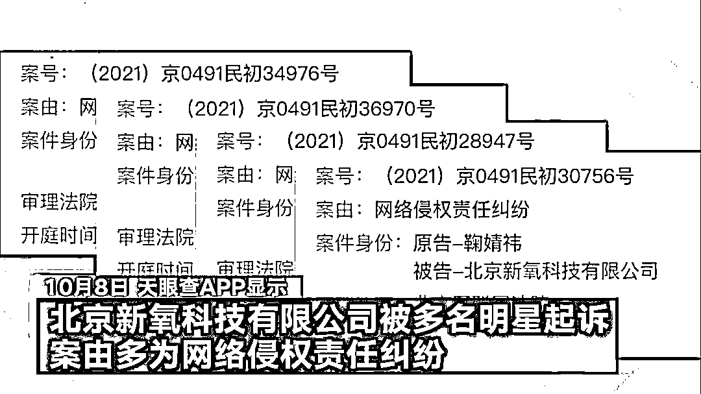**

**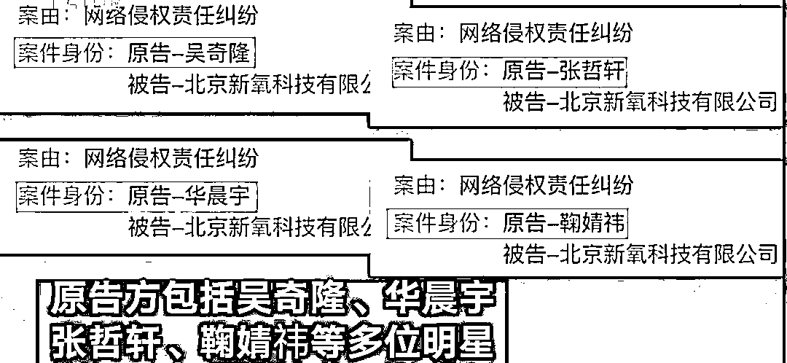**

**据红星资本局报道**

**近日，医美平台两巨头**

**北京完美创意科技有限公司**

**和北京新氧科技有限公司**

**均被多位明星起诉**

**案由多为网络侵权责任纠纷**

**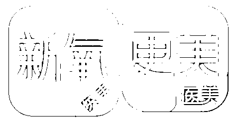**

****公开信息显示****

****完美创意今年以来****

****共有 48 条开庭信息****

****以网络侵权责任纠纷为由****

****起诉更美的明星就有****

****杨洋、李冰冰、宋茜、****

****张一山、****周扬青、戚薇、****

****吴昕、吴谨言、古力娜扎等人****

**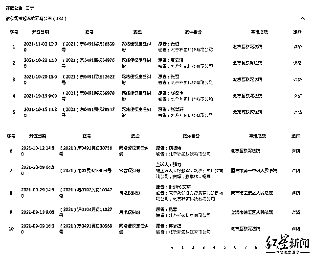**

**更早以前**

**还被王一博、张艺兴、**

**李易峰、张雨绮等明星起诉**

**2019 年 12 月 26 日**

**完美创意曾在官方微博**

**公开向多位明星致歉称**

**“之所以在微信公众号中**

**使用明星的公开剧照或生活照片**

**初衷是希望通过明星照片**

**将晦涩的医美知识**

**通俗易懂地传递**

**使人们理性看待医美**

**建立正确的医美消费观**

**不冲动整形、无审美整形”**

**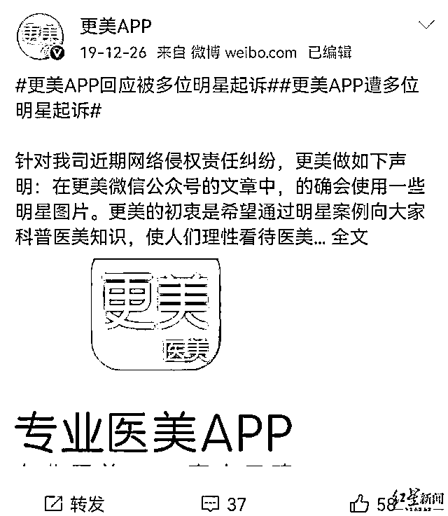**

**不过，就目前而言**

**完美创意似乎并未改变其营销风格**

**近期在其官方微信公众号的推送中**

**仍然可以看到多位流量明星的身影**

**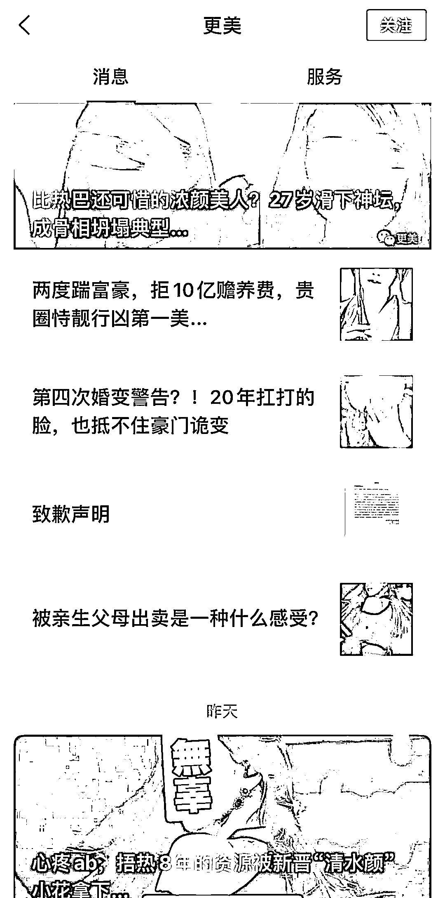**

**此外，行业内另一巨头**

**新氧的情况也差不多**

**自 2021 年 10 月 9 日起**

**新氧将面临包括吴奇隆、**

**华晨宇、鞠婧祎等明星的起诉**

**而在刚刚过去的 9 月**

**已有杨蓉、蒋梦婕等明星曾起诉新氧**

**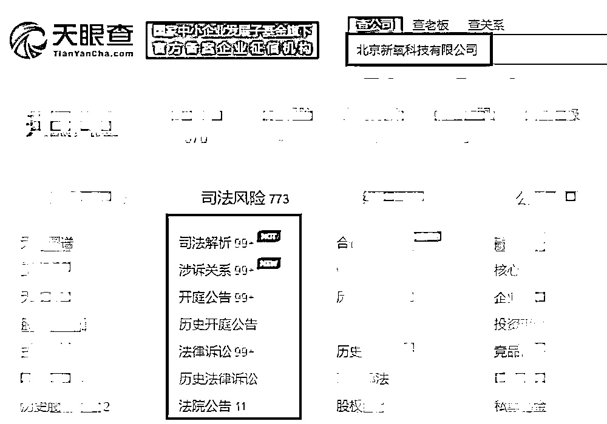**

********不少网友这次站在了明星这边****

**↓↓↓**

**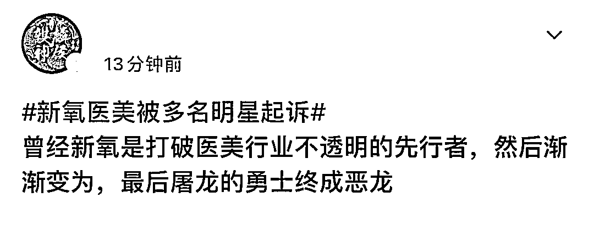**

****

**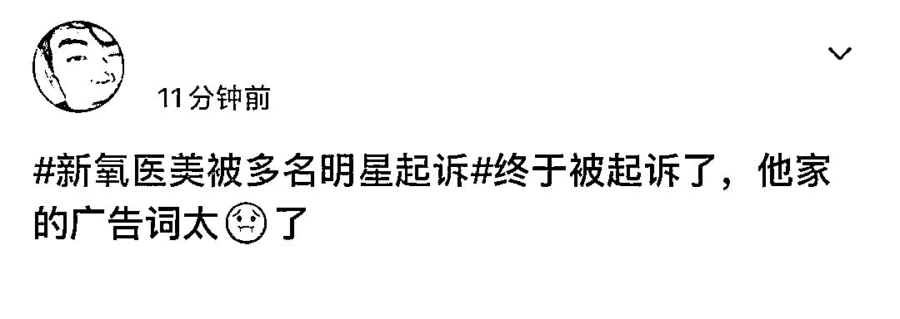**

**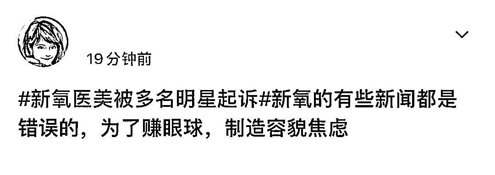**

**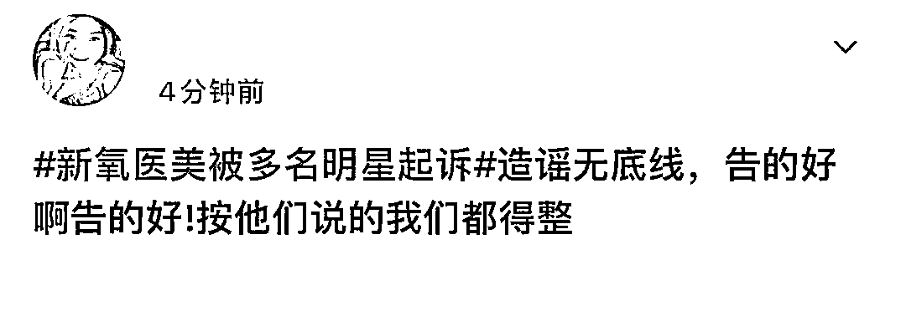**

**粉丝们怎么看呢？**

**来源 ：澎湃新闻、红星资本局、头条新闻、新闻晨报、利箭在行动**

****

**← 向右滑动与灰产圈互动交流 →**

****