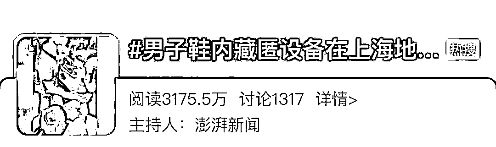
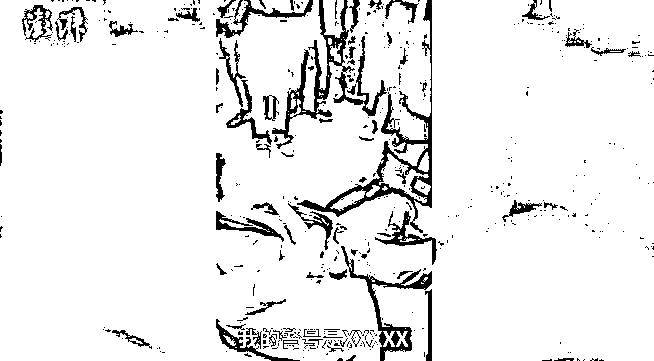
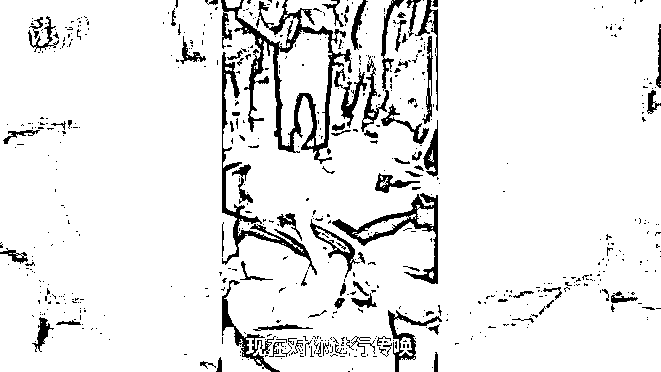
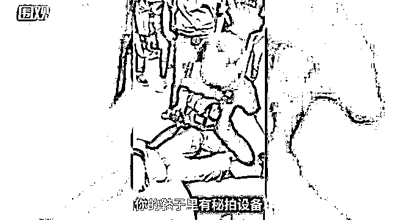
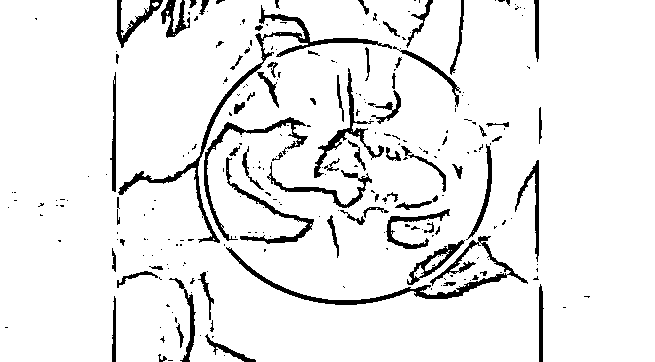
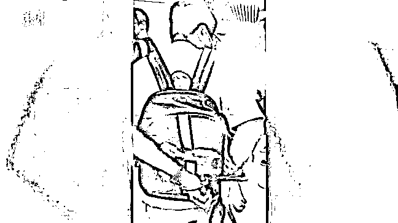

# “脱下来！”当场抓获，视频热传

> 原文：[`mp.weixin.qq.com/s?__biz=MzIyMDYwMTk0Mw==&mid=2247521906&idx=6&sn=2a85482e8dbb054a76736638507f112d&chksm=97cb5d4aa0bcd45cb437aecc5eff5f5d230ea358bdd7242bd97066b43cb0d9732f5f41384e50&scene=27#wechat_redirect`](http://mp.weixin.qq.com/s?__biz=MzIyMDYwMTk0Mw==&mid=2247521906&idx=6&sn=2a85482e8dbb054a76736638507f112d&chksm=97cb5d4aa0bcd45cb437aecc5eff5f5d230ea358bdd7242bd97066b43cb0d9732f5f41384e50&scene=27#wechat_redirect)

“我的警号是****，现在对你进行传唤，你的鞋子里有密拍设备。”一段上海便衣民警抓捕涉嫌地铁“裙底偷拍”者的全过程视频在网上火了。 

10 月 8 日下班高峰 

上海地铁内

一个行迹可疑的男子

屡屡将左脚伸向

前方等车女乘客的裙底

这一行为很快被轨交反扒民警江涛盯上了

在掌握证据后

江涛和下班路过的浦东民警打了个“配合”

在热心乘客的协助下

将这名“裙底偷拍者”迅速控制

让其他女乘客免受其害

[`mp.weixin.qq.com/mp/readtemplate?t=pages/video_player_tmpl&action=mpvideo&auto=0&vid=wxv_2083039225397968899`](https://mp.weixin.qq.com/mp/readtemplate?t=pages/video_player_tmpl&action=mpvideo&auto=0&vid=wxv_2083039225397968899)

这段抓捕视频直接火上热搜↓

**不少网友直呼**

**“警察太帅了！”**

**也有网友提问** 

**警察是如何发现藏匿的偷拍设备？**

带着这些问题 

9 日下午 1 时许 

澎湃新闻记者来到 8 号线成山路站

还原地铁偷拍事件现场

2021 年 10 月 8 日 18 时许，上海市公安局轨道公交总队反扒支队民警江涛在巡逻中看到一个男子形迹可疑，在站台和列车上，时不时用自己的左脚伸向女乘客的裙底方向，“当时我就觉得很奇怪，但是没有证据，然后跟踪了几部地铁直到到了成山路地铁站。” 

**江涛****在该男子再次将左脚伸向女子裙底时，看到了其手机屏幕上正显示该女乘客裙底，遂立即进行抓捕**。

然而该男子被发现后仍奋力反抗，一直声称“我没有我没有”，江涛急需帮助时，没想到真迎来了“神兵天降”。

6 时许，下班回家的浦东分局出入境管理办公室民警谢骥越在 13 号线转 8 号线的通道内行走，听到前方市民在喊“出事了”，急忙上前，看见一名身着便服的青年在报警号。

“我一听就知道是轨交反扒民警在进行抓捕，虽然不在勤不在岗，但我依旧是一名人民警察，比热心群众专业很多，所以立即开始帮忙。”谢骥越从背后一把抱住嫌疑人，将他压向地面，接过江涛递过的手铐，控制住了嫌疑人。

嫌疑人受控后，江涛立刻脱下该男子左脚的鞋，发现里面正藏着偷拍设备和电池，还能和手机相连。看到这一设备，谢骥越才反应过来出了什么事。

短短几分钟内，两位素不相识的民警凭着专业默契，完成了一次抓捕行动。

谢骥越和江涛都忍不住感叹彼此的配合度。从警 7 年，谢骥越从一名派出所民警到出入境窗口，尽管岗位变化让他更多完成内勤工作，但他依旧会每年接受民警技能培训，平日遇到市民紧急求助时也会亮明身份，做好人民警察的本职工作。

抓捕完成后，被偷拍的女乘客才意识到发生了什么，“尽管她觉得非常恶心难受，但还是愿意尽力配合我们调查。”江涛告诉记者，也很感激有两位热心市民在抓捕过程中伸出了援手。目前，违法人员范某已被依法处行政拘留。

实际上

如今在上海轨交内

一支民警队伍全天候在全线路里巡逻

曾有市民和他们偶遇得到他们的帮助

**女乘客遭遇偷拍或者咸猪手怎么办？** 

**民警江涛建议**

**一旦发现就要立刻大声呼救**

**并拨打 110**

**地铁内的驻站民警会很快到达现场**

来源：澎湃新闻、上海新闻广播、新民晚报、东方网、红网

← 向右滑动与灰产圈互动交流 →

