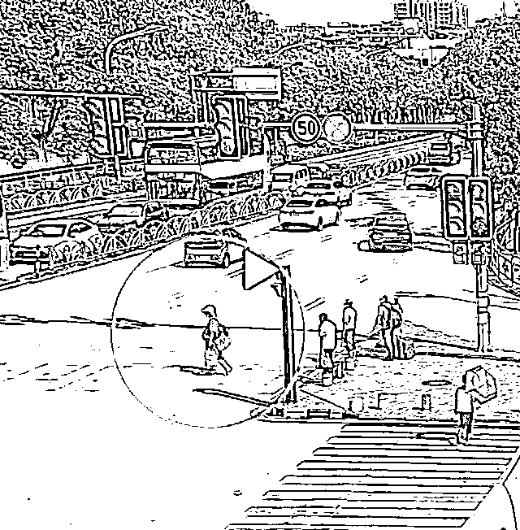
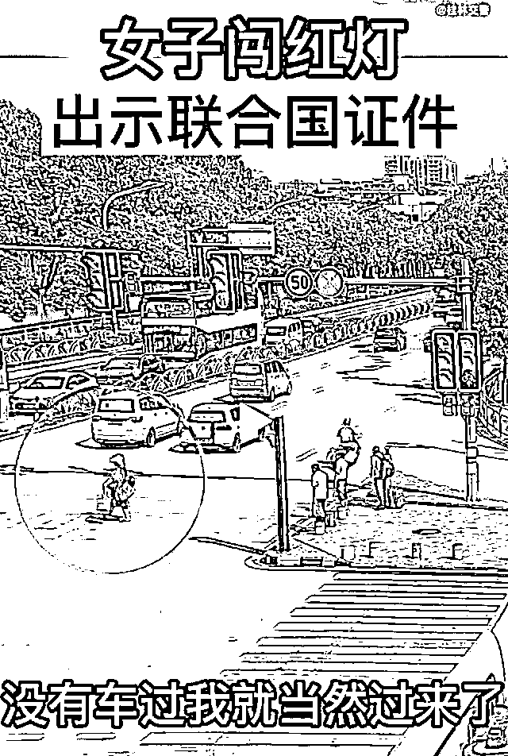
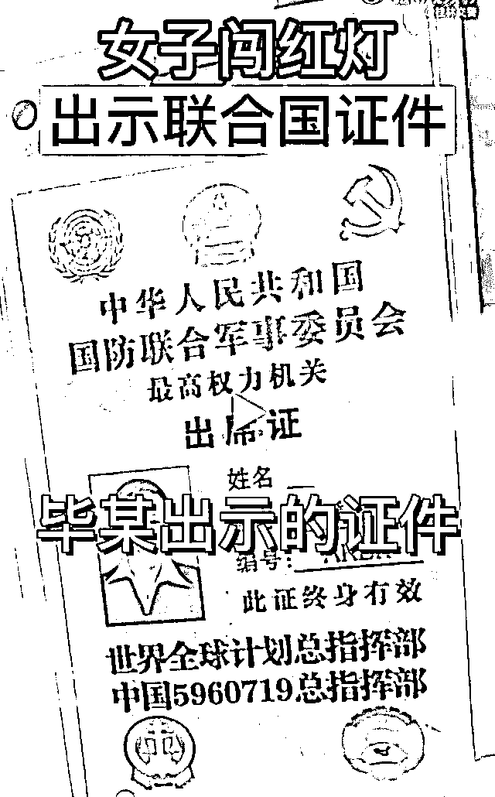
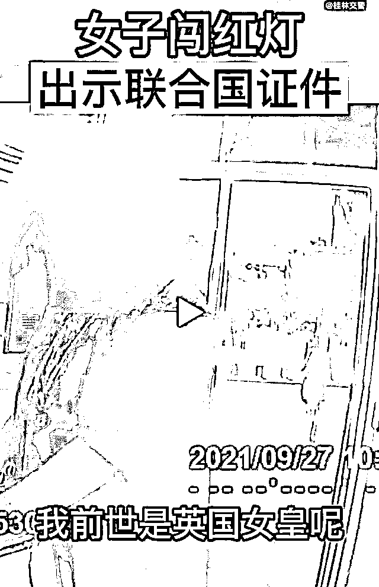
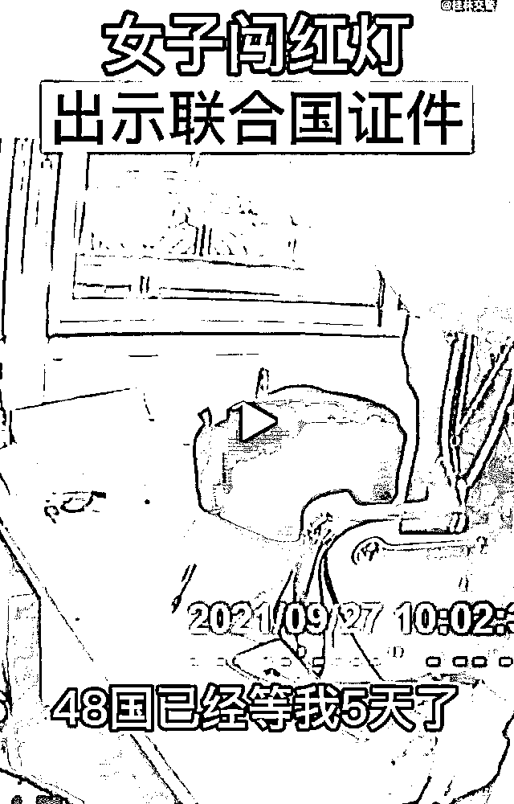
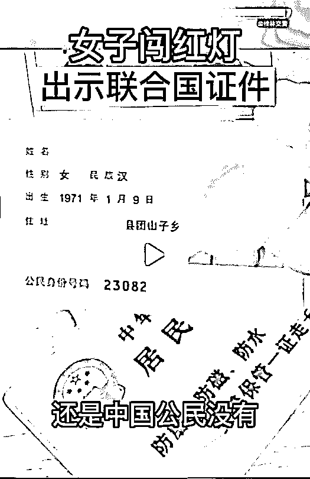
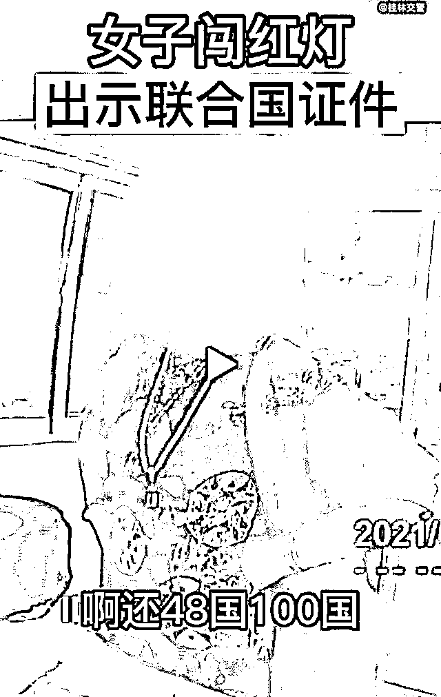

# 桂林女子闯红灯后拿出“霸气”证件，并称：我前世是英国女王！

> 原文：[`mp.weixin.qq.com/s?__biz=MzIyMDYwMTk0Mw==&mid=2247521906&idx=7&sn=bbdccbec2e0f8c7389bc84d094605bfc&chksm=97cb5d4aa0bcd45c48850da6b6af706aa68f2ddbf46613ab71669ee9c655317a8d75c3358f70&scene=27#wechat_redirect`](http://mp.weixin.qq.com/s?__biz=MzIyMDYwMTk0Mw==&mid=2247521906&idx=7&sn=bbdccbec2e0f8c7389bc84d094605bfc&chksm=97cb5d4aa0bcd45c48850da6b6af706aa68f2ddbf46613ab71669ee9c655317a8d75c3358f70&scene=27#wechat_redirect)

10 月 8 日下午，桂林交警官方微博发布了一则视频，一女子毕某闯红灯被拦后，交警询问情况，她出示了自己的“联合国证件”，并脱口而出“我前世是英国女皇。”“48 国已经等我 5 天了。”等惊人语句。

[`mp.weixin.qq.com/mp/readtemplate?t=pages/video_player_tmpl&action=mpvideo&auto=0&vid=wxv_2083541295481831425`](https://mp.weixin.qq.com/mp/readtemplate?t=pages/video_player_tmpl&action=mpvideo&auto=0&vid=wxv_2083541295481831425)

视频显示，交警问女子：“你闯红灯干嘛？”

女子理直气壮：“我背这么多东西，没有车过我就当然过来了。”

随后女子还向交警出示了“联合国证件”，并说：“我前世还是英国女皇呢。那边人等着我，48 国已经等我 5 天了。”

然而，交警在查看了她的身份证后表示：“还是中国公民没有？啊还 48 国 100 国，1000 国都没用！”

最终，民警对毕某闯红灯的行为作出了严厉的批评教育。

对此，网友评论：女皇也要遵守交通规则

来源：桂林交警官方抖音号、桂林日报、利箭在行动

← 向右滑动与灰产圈互动交流 →

