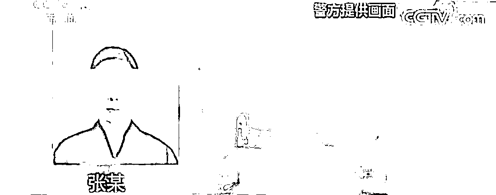
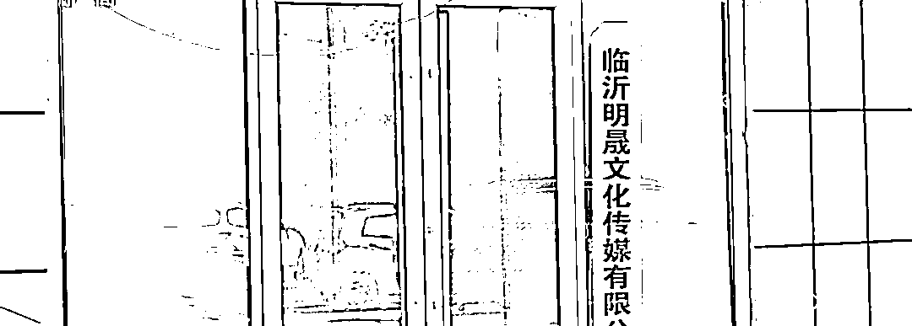
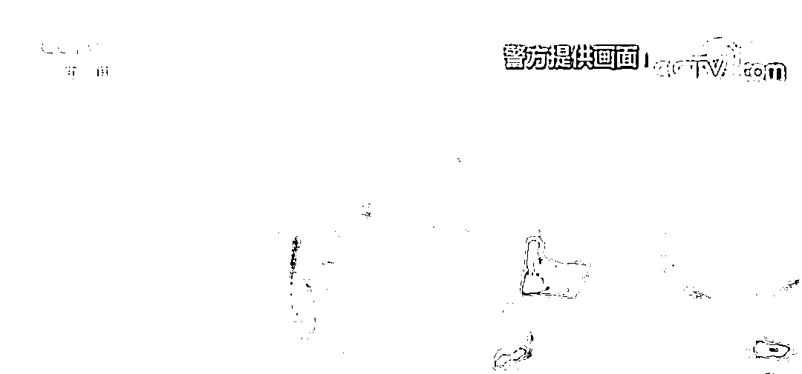
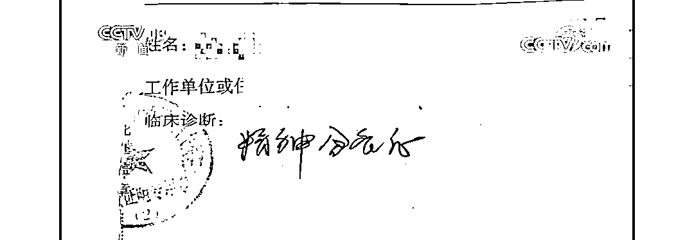
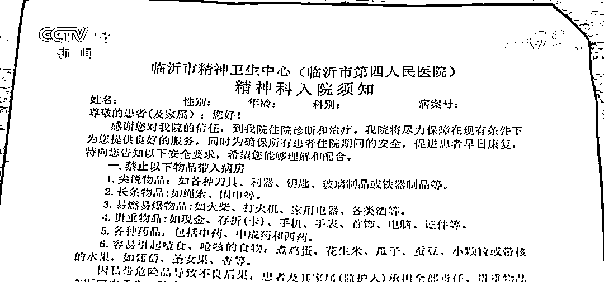
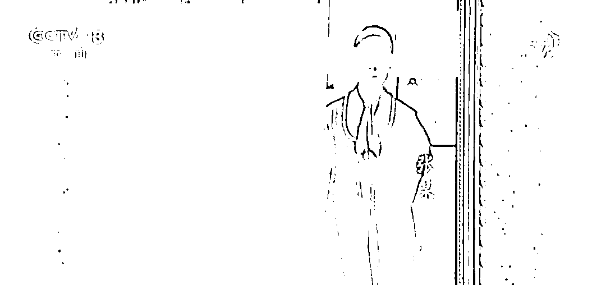
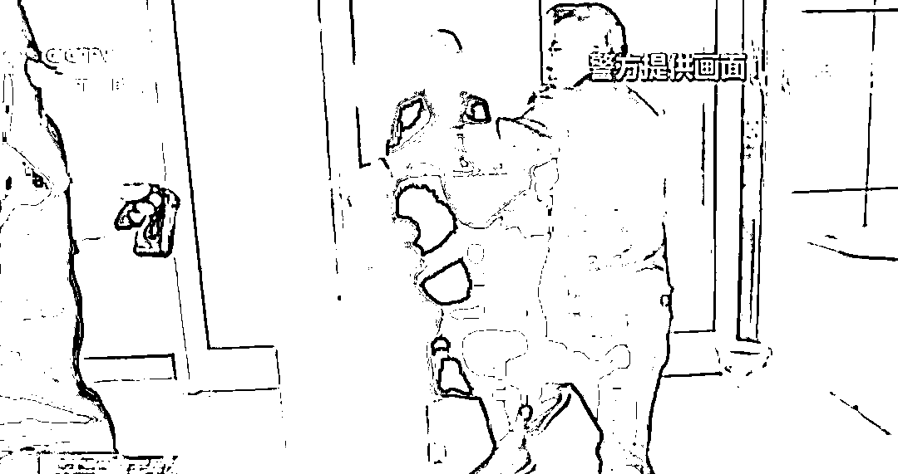
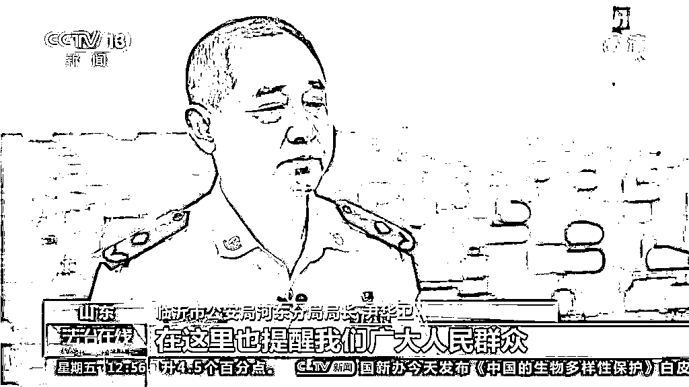

# 临沂“神婆”3 年骗钱 300 多万，央视揭秘落网过程

> 原文：[`mp.weixin.qq.com/s?__biz=MzIyMDYwMTk0Mw==&mid=2247521906&idx=8&sn=0e3df2cc521c63fa234b9911485f54fd&chksm=97cb5d4aa0bcd45c5e18bbb6852469a9f2dc0657b376f0aa557128aabdddb07b81da43954bb4&scene=27#wechat_redirect`](http://mp.weixin.qq.com/s?__biz=MzIyMDYwMTk0Mw==&mid=2247521906&idx=8&sn=0e3df2cc521c63fa234b9911485f54fd&chksm=97cb5d4aa0bcd45c5e18bbb6852469a9f2dc0657b376f0aa557128aabdddb07b81da43954bb4&scene=27#wechat_redirect)

“消灾解难”

“什么要求都可以实现”

这些连现代医学技术

都很难破解的专业难题

有人却高调宣称自己行

结果越传越神

[`mp.weixin.qq.com/mp/readtemplate?t=pages/video_player_tmpl&action=mpvideo&auto=0&vid=wxv_2083226120497299459`](https://mp.weixin.qq.com/mp/readtemplate?t=pages/video_player_tmpl&action=mpvideo&auto=0&vid=wxv_2083226120497299459)

10 月 8 日

**央视新闻频道《法治在线》栏目**

对河东警方侦办的一起

特大迷信诈骗案进行报道

租赁门脸房，包装成传媒公司

张某租赁了一间门头店并挂上**临沂明晟文化传媒有限公司**的招牌，这就是她平日里接待各方来客的地方。张某自称佛道兼修，对外宣称成立一个佛医堂，能够通过作法等方式，替人们消除烦恼和灾难。一传十十传百，结果越传越神，很多外地人“慕名而来”。

慕名而来的其中有一位王先生

患有精神分裂症

虽然坚持吃药使病情稳定

但是仍然希望能够根治

恰巧听闻有位“张大师”能力不凡

便主动上门询问

王先生：

我们当时去的时候，张大师说我身上有“老师”，可以给安上桌子“作法”，安完桌子，病就好了。

办案民警表示，所谓的“老师”，就是所谓的仙家，引诱你花钱作法，不然的话这个“老师”就会导致你诸事不顺。

病症未除，病情却愈加严重

王先生一家按照”张大师“的要求按时带着桌子、烟、酒、菜和现金来到佛医堂，依照”张大师“的说法，做完法事后王先生的病很快就能痊愈。

然而半个月过去了，张先生按照”大师“的说法，停用了自己原先的精神病药物，并且辞去了工作，静静的在家等待结果，可病症不仅没有消除，反而愈加严重。

临沂市公安局河东分局特巡警大队 李恩善：

本来吃的药停了，三个月以后，引起了强烈的反弹，最后不得不强制入院治疗。

这时，张先生的家人才反应过来这个所谓的“大师”极有可能就是个骗子。

多次实施诈骗，金额高达 300 万元

经过警方的调查，多名受害者均被“张大师”用相同的手段诈骗。 

慕名而来的人基本上都是有不顺心的事情的，“张大师”就会利用这点夸大其词，并保证作法可以祛除你的难事，这就开启了诈骗的关键一步。

第一次作法的费用不会太高，大多数人都会选择破财消灾，但其实这个所谓的作法并无任何作用，很多人就会选择二次作法，就需要再花更多的钱才能如愿解决问题，“张大师”就是这样一步一步进行诈骗。

历时三年，成功抓获

几年前，“张大师”还是一个在建筑工地上承包小工程赚钱的小商贩，2018 年张某偶然机会在朋友圈看到有人发布看病治病民间医术的广告，动了“歪心思”，开始进行各种诈骗，直至 2021 年 3 月被警方逮捕的那一刻停了下来。

此案历时 9 个月成功侦破，涉案价值三百多万元，目前该案的两名犯罪嫌疑人均受到了法律的严惩。**2021 年 8 月，河东区人民法院一审作出判决，张某因为诈骗罪被判处有期徒刑十一年。**

**在此也提醒广大市民**

**利用封建迷信实施诈骗，害人害己**

**患病的病人或者家属切不可为了急于治病**

**而陷入骗子的陷阱**

**希望我们自觉抵制封建迷信**

**防止上当受骗**

来源：平安临沂

← 向右滑动与灰产圈互动交流 →

