# 热搜上的美团：前有反垄断罚款 34 亿，又因系统安全被王思聪怒怼……

> 原文：[`mp.weixin.qq.com/s?__biz=MzIyMDYwMTk0Mw==&mid=2247521958&idx=1&sn=df0c9ee469183e1bd4c879e06caeb2c3&chksm=97cb5d9ea0bcd488d98ce22326e64cee52b9d6148942f2c364d39ce2ef23ed596fe0dbba4b9a&scene=27#wechat_redirect`](http://mp.weixin.qq.com/s?__biz=MzIyMDYwMTk0Mw==&mid=2247521958&idx=1&sn=df0c9ee469183e1bd4c879e06caeb2c3&chksm=97cb5d9ea0bcd488d98ce22326e64cee52b9d6148942f2c364d39ce2ef23ed596fe0dbba4b9a&scene=27#wechat_redirect)

**刚刚因“二选一”垄断行为被国家市场监管总局罚款 34 亿元的美团（03690.HK），又被推上了热搜。**

10 月 10 日，王思聪在微博发文称，自己的大众点评被别人改绑手机号。随后，王思聪转发上述动态并配文称：“震惊！国家数据安全法实施后市值万亿的美团点评依旧我行我素！”

早在 2015 年 10 月，美团与大众点评合并，成立新公司“美团点评”。自此，美团和大众点评使用了统一的账号体系，用户在大众点评对账号进行的换绑或者注销都将同步影响到对应的美团账号。

同一天，数码博主@轩宁轩 Sir 也在微博发视频表示：“美团连续 24 小时定位我，每 5 分钟一次，这是要干什么？”10 月 11 日，该博主又指称美团 APP 存在重大安全漏洞，只要获得手机号和生日，就可以换绑手机号。

尽管在港股科技股强势反弹的背景下，10 月 11 日美团股价大涨 8.36%，总市值达到 1.7 万亿港元，但相关话题引发广泛关注，用户数据安全再度成为讨论焦点。

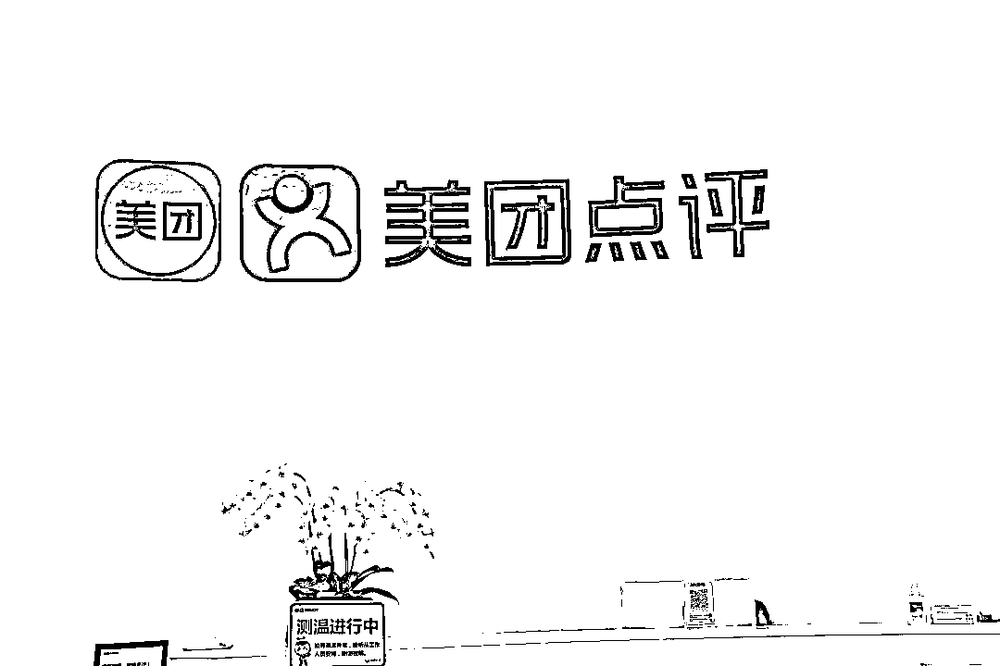

美团 APP 存在安全漏洞？

王思聪发微博怒怼

**10 月 10 日下午，王思聪在微博发文称，自己的大众点评被别人改绑手机号。王思聪@大众点评称：“这就是上万亿市值公司的安全系统吗？莫名其妙我自己的号就能被别人改绑手机？你们大众点评除了会恰烂钱做虚假分数还会点啥？”**

****该微博配发的截图显示：美团、大众点评使用了统一账号体系。你在美团对账号进行换绑或注销将同步影响对应的大众点评账号。由于你在 2021 年 10 月 9 日通过美团将大众点评账号“王思聪”绑定的手机号更新为：137****2797，因此你需要使用新手机号重新登录。****

**随后，王思聪转发上述动态，并配文称：“震惊！国家数据安全法实施后市值万亿的美团点评依旧我行我素！”**

**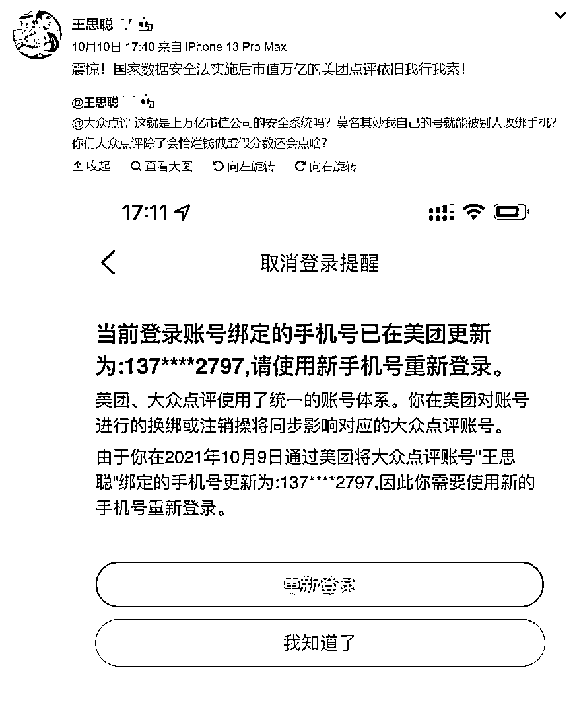**

**当晚，大众点评官方账号在王思聪发布的微博下回复道：“非常抱歉给您带来了不愉快的用户体验，相关账号已在您反馈后的第一时间内予以保护性冻结。相关问题的核查已有初步信息，我们会在私信中与您同步。”**

**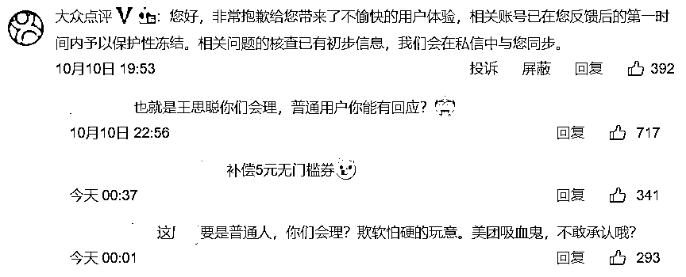**

**但截至发稿，美团及大众点评的官方渠道尚未发布针对此事的回应。红星资本局就此事联系了美团方面的工作人员，截至发稿并未收到回复。**

**而在 10 月 11 日早间，**数码博主@轩宁轩 Sir 也发微博称，美团 APP 有重大安全漏洞，只要获得手机号和生日，就可以换绑手机号，王思聪的账号可能就是这样被盗的。****

**@轩宁轩 Sir 表示，换绑手机后能看到各种美团订餐订单、买药订单、开房订单、家庭住址等私密信息。“有网友私信我说，‘号被盗了之后盗我号的人立马给我点了个菜刀外卖’、‘已经报警了’。”@轩宁轩 Sir 说。**

**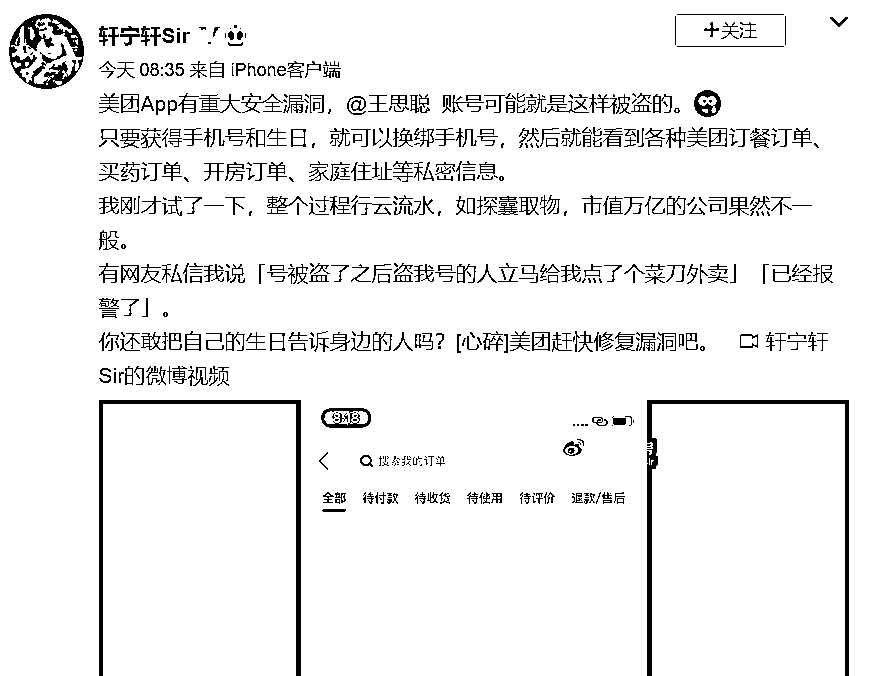**

**在视频中，@轩宁轩 Sir 演示了换绑手机号的流程：在登录时选择“手机号无法接收短信”，然后先输入无法接受验证码的手机号，再输入身份证上的 8 位生日日期，即可更换新手机号，无需接收验证码或人脸识别。**

**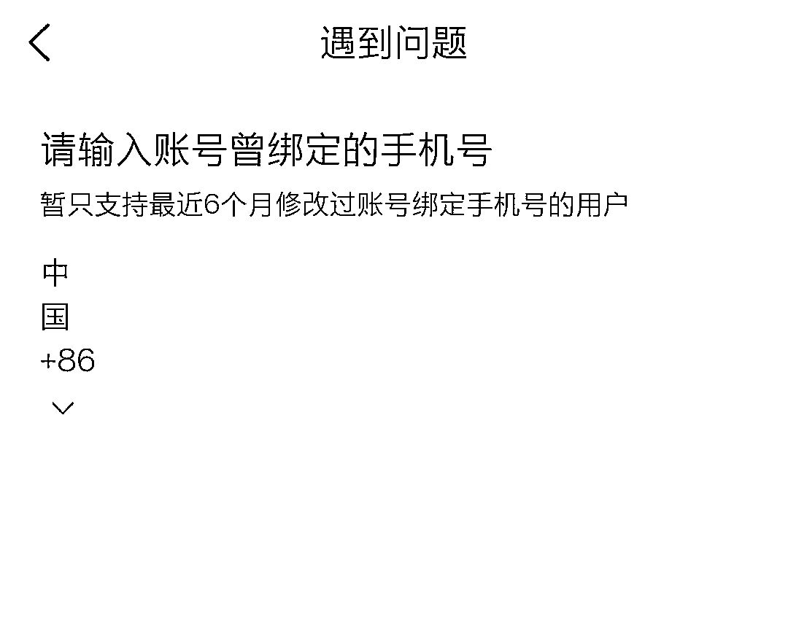**

**红星资本局验证发现，目前美团已经增设了限制条件“只支持最近 6 个月修改过账号绑定手机号的用户”。**

**而在已经登录的情况下，需要通过新手机接收验证码。**

**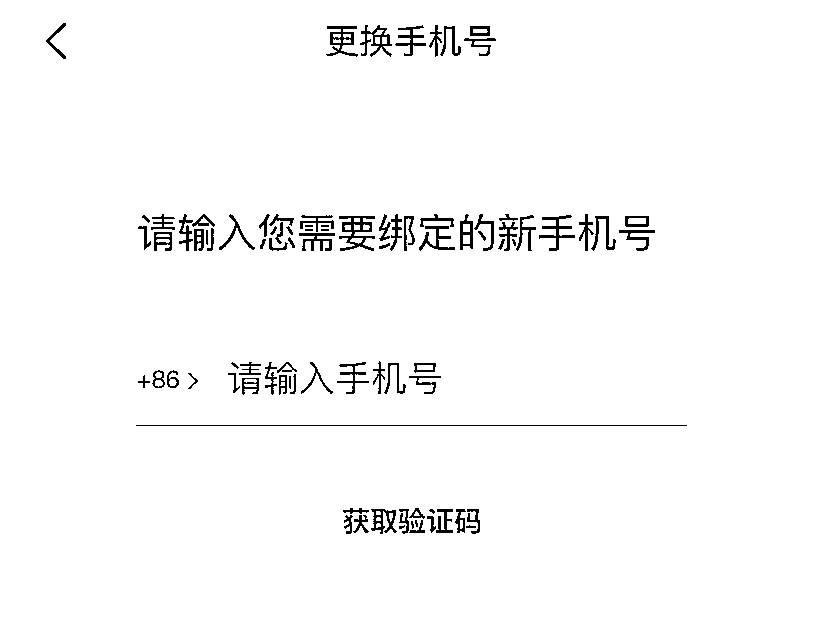**

****因垄断被罚款 34 亿元的美团****

****又陷入数据滥用风波****

********

****红星资本局注意到，10 月 10 日上午，**数码博主@轩宁轩 Sir 曾发布一条视频，称美团 APP 连续 24 小时获取用户定位，每 5 分钟一次。从视频中可以看出，即便是在凌晨 2 点至 3 点，美团仍在不断定位。****** 

****对此，有网友评论称：“美团外卖如果不打开定位就无法充会员，想不明白定位和充会员有啥关系。”****

****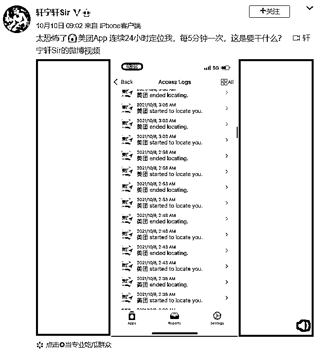****

****@轩宁轩 Sir 称，自己使用的监测工具是一款名为“洞见隐私”的 APP，能分析其他 APP 的网络活动、权限访问记录以及其他事件日志，该 APP 目前只兼容 iOS15.0、iPadOS15.0 或更高版本。****

****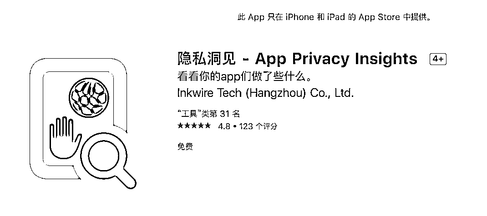****

****在该软件的评论中，有网友留言称，QQ、微信、淘宝，无时无刻读取照片。****

****此前，微信方面回应“反复读取用户相册”一事称，iOS 系统为 APP 开发者提供相册更新通知标准能力，相册发生内容更新时会通知到 APP，提醒 APP 可以提前做准备，APP 的该准备行为会被记录成读取系统相册。上述行为均仅在手机本地完成，最新版本中其将取消对该系统能力的使用，优化快速发图功能。****

****‍‍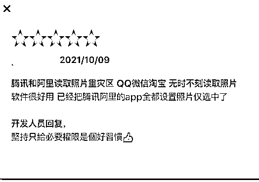‍‍

红星资本局记者通过 iPhone 自带的“记录 APP 活动”功能，监测了数小时内部分 APP 活动。访问记录显示，在没有使用的情况下，美团获取了定位。

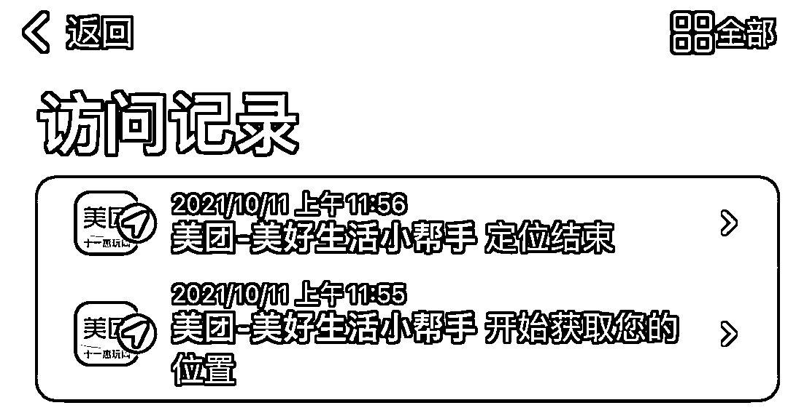

工信部督促企业落实《数据安全法》

市监局反垄断处罚也提及美团大数据应用

今年 9 月 1 日起，我国第一部有关数据安全的专门法律《中华人民共和国数据安全法》）正式施行。**《数据安全法》明确提出，数据处理，包括数据的收集、存储、使用、加工、传输、提供、公开等。处理数据的部门需要采取必要措施，确保数据处于有效保护和合法利用的状态。**

而在《数据安全法》正式实施之前，7 月 30 日，工信部官方网站发文，为加快贯彻落实《数据安全法》，指导督促互联网企业进一步提高思想认识，切实承担起数据安全责任和义务，2021 年 7 月 28 日，工业和信息化部网络安全管理局委托中国互联网协会组织召开重点互联网企业贯彻落实《数据安全法》座谈会。

座谈会上，中国互联网协会介绍了组建数据治理工作委员会、开展数据安全培训、建立举报投诉机制等工作情况。互联网企业代表介绍了对《数据安全法》的认识和理解，分享了数据安全管理制度、技术手段建设、安全保护措施等经验和做法，也对做好行业数据安全监管工作提出了意见建议。中国互联网协会、中国信息通信研究院及阿里、腾讯、美团、奇安信、小米、京东、微博、字节跳动、58 同城、百度、拼多多、蚂蚁集团等 12 家企业近 40 人参会。

事实上，**除了工信部的“预警”之外，在市场监管总局 10 月 8 日发布的对美团“二选一”垄断行为的行政处罚决定书中，也提到了美团对大数据的应用。**

《处罚决定书》显示，2018 年起，美团方面开发了大数据监测和分析系统，可以自动监测平台内经营者上线其他竞争性平台情况，并对上线其他竞争性平台的平台内经营者自动实施搜索降权或取消优惠活动等处罚。

市场监管总局责令美团停止违法行为，全额退还独家合作保证金 12.89 亿元，并处以其 2020 年中国境内销售额 1147.48 亿元 3%的罚款，计 34.42 亿元。罚款和退还保证金金额总计，超过美团 2020 年 47.1 亿元的净利润。

美团方面随后表示，诚恳接受，贯彻落实，深入自查整改。

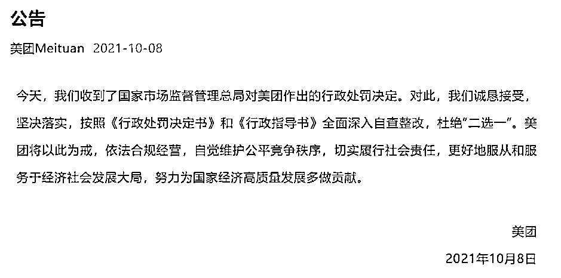

现在的互联网平台承担了越来越多的功能，除了吃吃喝喝，医疗、保险，甚至理财都可以在美团等平台上操作购买。在此背景下，用户隐私和数据安全显得越发重要。

美团曾在 2020 年报中表示，持续健全管理体系，制定多项制度以规范个人信息收集和使用、Cookie 和同类技术使用、个人信息保存保护、共享转让及公开披露、未成年人个人信息保护等内容。

但对于美团和其他互联网企业来说，如何合理使用大数据，切实保护用户隐私，仍然是一个必须面对的课题。**** ********

****← 向右滑动与灰产圈互动交流 →****

********