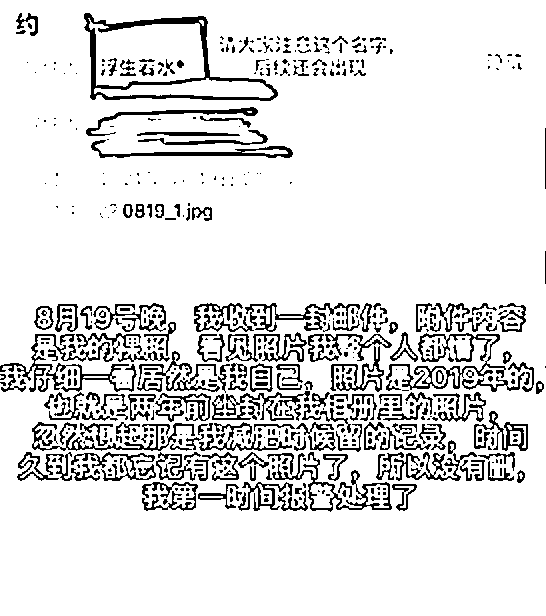

# 修个手机，女生隐私照片被泄露！

> 原文：[`mp.weixin.qq.com/s?__biz=MzIyMDYwMTk0Mw==&mid=2247521958&idx=3&sn=6275c0b827f14575a28faadad35acbd2&chksm=97cb5d9ea0bcd48892a4775f7ce54c51e93346a12e64e92580385d7c42588e7b778d9fe25d92&scene=27#wechat_redirect`](http://mp.weixin.qq.com/s?__biz=MzIyMDYwMTk0Mw==&mid=2247521958&idx=3&sn=6275c0b827f14575a28faadad35acbd2&chksm=97cb5d9ea0bcd48892a4775f7ce54c51e93346a12e64e92580385d7c42588e7b778d9fe25d92&scene=27#wechat_redirect)

## 

近日

上海一女生在社交平台曝光

自己修手机致隐私泄露的遭遇

[`mp.weixin.qq.com/mp/readtemplate?t=pages/video_player_tmpl&action=mpvideo&auto=0&vid=wxv_2085907991291101192`](https://mp.weixin.qq.com/mp/readtemplate?t=pages/video_player_tmpl&action=mpvideo&auto=0&vid=wxv_2085907991291101192)

据了解，8 月初，该女生到一手机维修店修手机后，手机维修店员工添加其微信，隔天又收到一封邮件，邮件主题内容就一个字“约”，里面有一附件照片，为该女生的全身裸照，该女生立即报警。

随后，女生又收到第二封邮件，附件内容依旧为全裸照片。

最终，公安机关对该男子作出拘留 5 天的处罚。该女生呼吁大家修手机时，切勿让手机离开自己的视线。

* * *

生活中如何避免

手机隐私泄露？

这里有些小方法 

⬇️

**送修手机：**

**1.和维修人员反复确认是否需要开机密码，在更换电池、后壳等不必须使用屏幕功能的维修项目时，不要轻易提供开机密码等安全密码。**

**2.尽量选择现场维修的方式，不要让手机离开视线。** 

**3.和维修人员对现场每一步操作及目的沟通确认，不轻易允许手机连接其他未知数据线。** 

**4.手机内尽量不存放重要的私密信息。**

**更换手机：**

**1.将重要数据迁移或备份。**

**2.反复格式化手机或恢复出厂设置。**

**3.多次存取一些无关紧要的内容将手机的储存空间占满。**

**4.选择正规的回收厂家回收，不要自行丢弃。**

**丢失手机：**

**1.立即致电运营商，挂失、冻结 SIM 卡。**

**2.冻结支付宝、微信等常用软件账号。**

来源：中国妇女报官方微博、星视频官方微博、央视新闻

← 向右滑动与灰产圈互动交流 →

