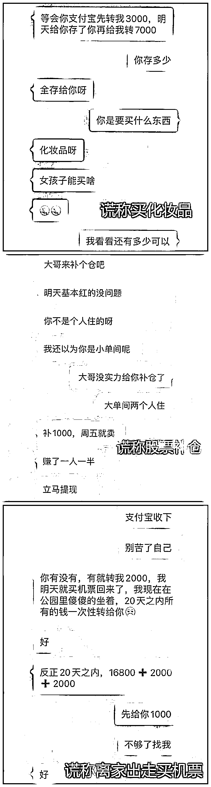
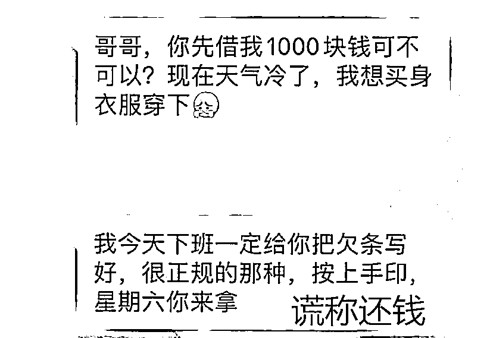
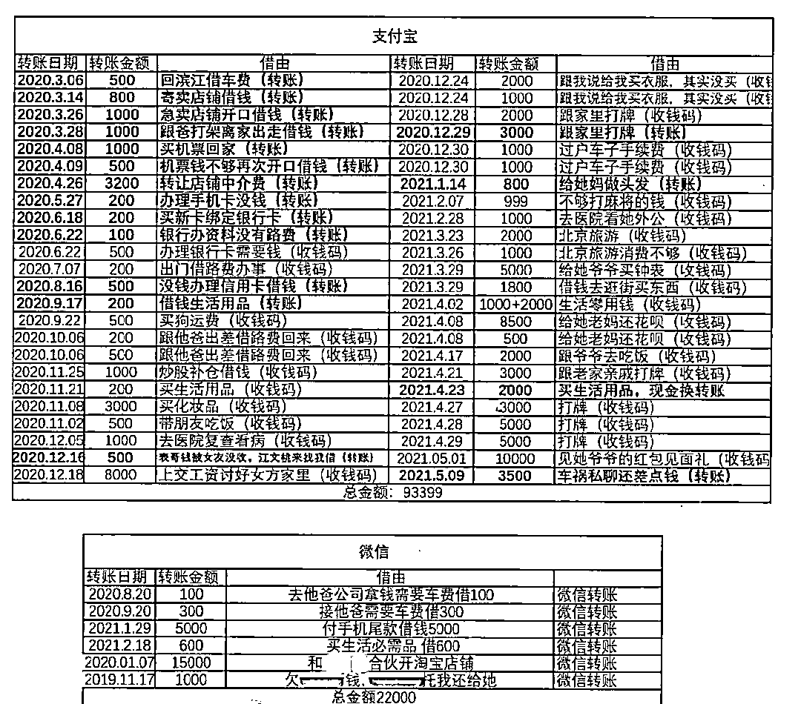
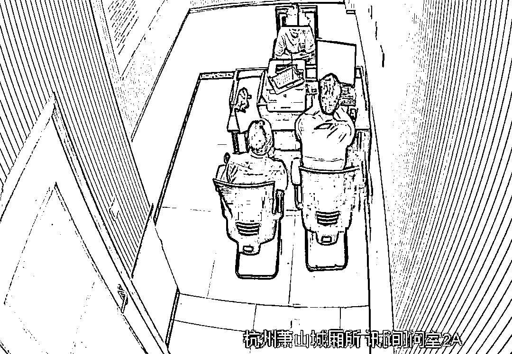

# 小伙恋上“同学前女友”，猛砸 11 万……

> 原文：[`mp.weixin.qq.com/s?__biz=MzIyMDYwMTk0Mw==&mid=2247521958&idx=4&sn=aa45ada73bf8ca04f0d7580e366890f6&chksm=97cb5d9ea0bcd488a32f5ebc1f7cc088a02eb17db6ab10f59ea96a0a13ad0853014991cabd41&scene=27#wechat_redirect`](http://mp.weixin.qq.com/s?__biz=MzIyMDYwMTk0Mw==&mid=2247521958&idx=4&sn=aa45ada73bf8ca04f0d7580e366890f6&chksm=97cb5d9ea0bcd488a32f5ebc1f7cc088a02eb17db6ab10f59ea96a0a13ad0853014991cabd41&scene=27#wechat_redirect)

同学和女友刚分手

小伙顺势和“同学前女友”谈恋爱

结果对方身份曝光

女生早已不是和同学交往时的那个“她”

而是换成了一个“抠脚大汉”

这究竟是怎么回事……

剪不清理还乱

萧山小伙阿东，今年 26 岁，是公司职员。小沈是他的高中同学兼死党，两人关系很铁。

2019 年中旬，当时阿东单身，小沈却有个女友桃子。一次，**阿东问小沈，是否能帮忙介绍个女孩子，**于是小沈便将女友桃子的闺蜜小李介绍给他，不久，**阿东与小李便发展成了男女朋友关系。**

阿东与小李，小沈与桃子四人拉了一个微信群，方便玩游戏时一起“开黑”以及日常聊天联络。

2020 年初，**小李与桃子准备合伙开网店**，桃子差点启动资金，先问小沈借，因平时桃子经常向自己要钱，小沈日渐反感，便没有答应。**小李便帮桃子，软磨硬泡让自己的男友阿东借给对方 1.5 万。**

****

今年 3 月，阿东与小李分手，两人断了联系，阿东想起自己之前借钱给桃子，**便通过微信群加了桃子的微信。**

**本来是想让对方还钱的，可聊着聊着****两人擦出了火花**，想着反正**桃子和小沈也已分手**，阿东就顺势和桃子网恋，还钱的事自然也不提了。

竹篮打水一场空 

**可网恋了一段时间，桃子经****常以各种借口问阿东要钱：**自己的工资都上交给父亲了，生活费太少开支不够；网店开不下去了，要周转下资金；甚至说炒股票要阿东补仓，赚钱了以后两人五五分……

▍桃子以各种理由向阿东要钱

时间长了，阿东也不禁疑惑，**只知索取的桃子是真心跟自己谈恋爱吗？对方的身份有无问题。**但转念一想，**之前桃子和小沈交往时，也经常向对方要钱，**这事小沈曾和自己抱怨过。

两人虽然线下从未谋面，但小沈和桃子本人相处过，**听说对方长相可以，很会打扮**，阿东自然也是十分期待的。想想自己如果表现得比小沈大方，肯为对方多花钱，最后终能抱得美人归。

然而，桃子却愈发变本加厉，到后面的理由基本都是生活费不够了，要还花呗了等等。**阿东在爱情的驱使下，陆陆续续给桃子转账了 11 万余元。**

▍桃子声称自己会还钱

而每次阿东提议见面，对方却以**“****生病、临时有事、机票钱不够”**等各种理由推脱。

 ▍阿东陆陆续续给桃子转账 11 万余元

2021 年 5 月 11 日凌晨，桃子发了条消息“明天去把我同学车弄下”后就突然“失联”了，之后大半个月时间里，**无论阿东怎么发消息，对方都没有回应。**阿东于 6 月 22 日无奈选择报警。

真相令人大跌眼镜

城厢派出所接到报警后，办案民警周益通过分析判断，很快查明**“桃子”微信账号的实名认证人员为男子曹某某（24 岁，江西人）**，并锁定其落脚点。

今年 8 月底，民警在江西婺源一家旅馆内将嫌疑人曹某某抓获。

 ▍审讯嫌疑人曹某某

据其交代，2019 年上半年的时候，交往了一个叫“桃子”的女生，对方称经常接到催款电话不堪其扰，**于是曹某某用自己的身份注册了一个新号码给“桃子”使用**，“桃子”用这个号码注册了微信和支付宝账号。

因“桃子”经常向自己要钱，且曹某某发现她似乎还在和其他男生暧昧不清，2020 年 3 月，两人分道扬镳。**曹某某将微信等账号收回。**

不久，阿东联系“桃子”微信。**曹某某“将错就错”，以“桃子”的身份和对方“网恋”，继而以各种理由骗取钱财。**

目前，嫌疑人曹某某已被依法逮捕，案件正在进一步办理中。

还是那句老话 

**“网恋有风险，交友需谨慎！”**

在无法甄别对方真实身份的情况下，

不可轻信其甜言蜜语和各种说辞。

**不要被突如其来的“爱情”冲昏头脑！**

记住的请点赞！

来源：萧山公安，阻击诈骗

← 向右滑动与灰产圈互动交流 →

