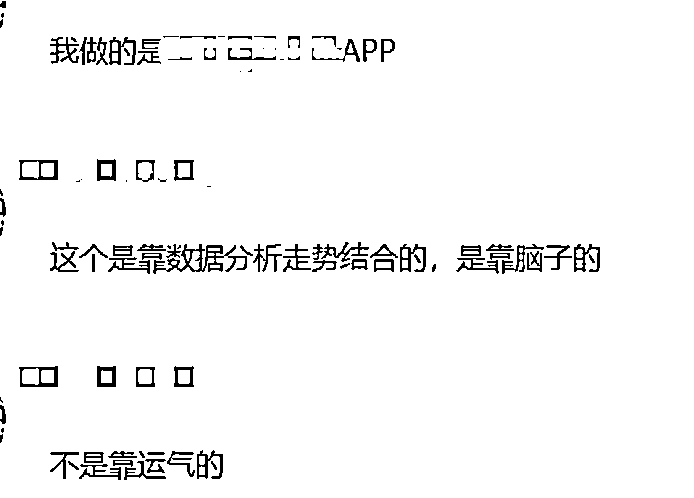
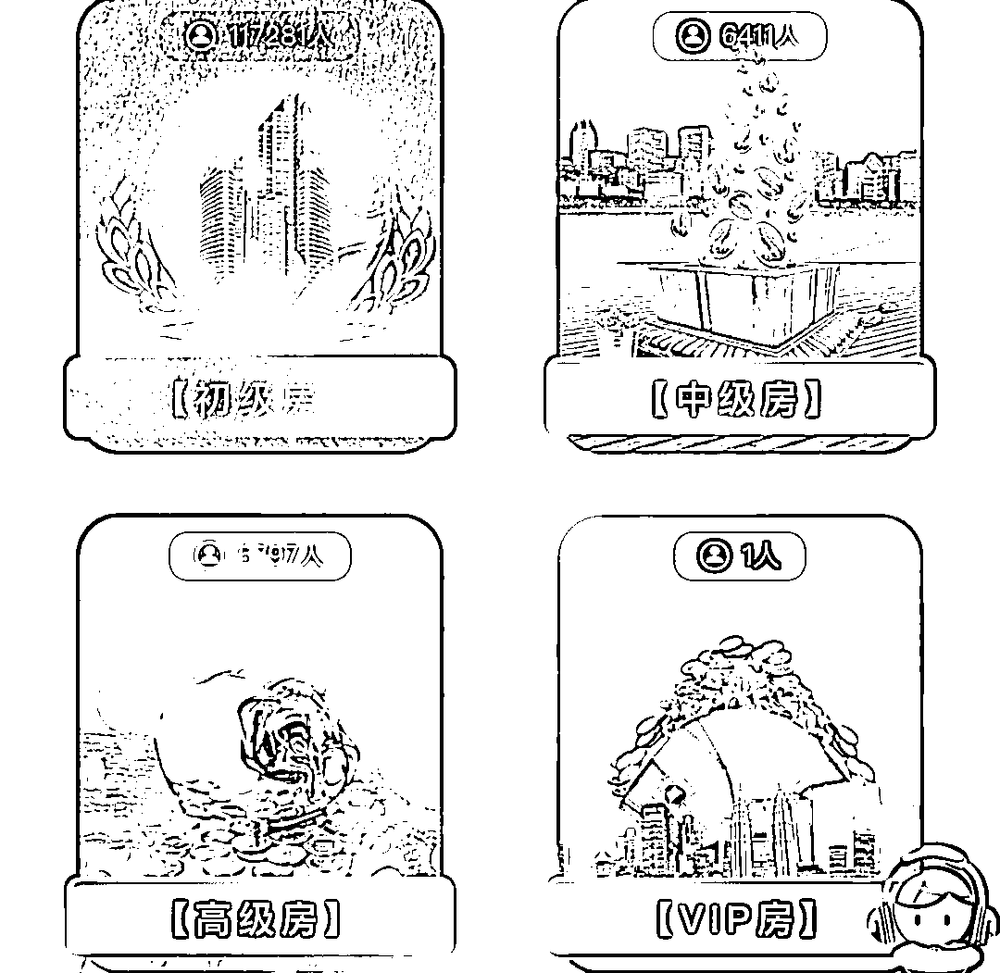
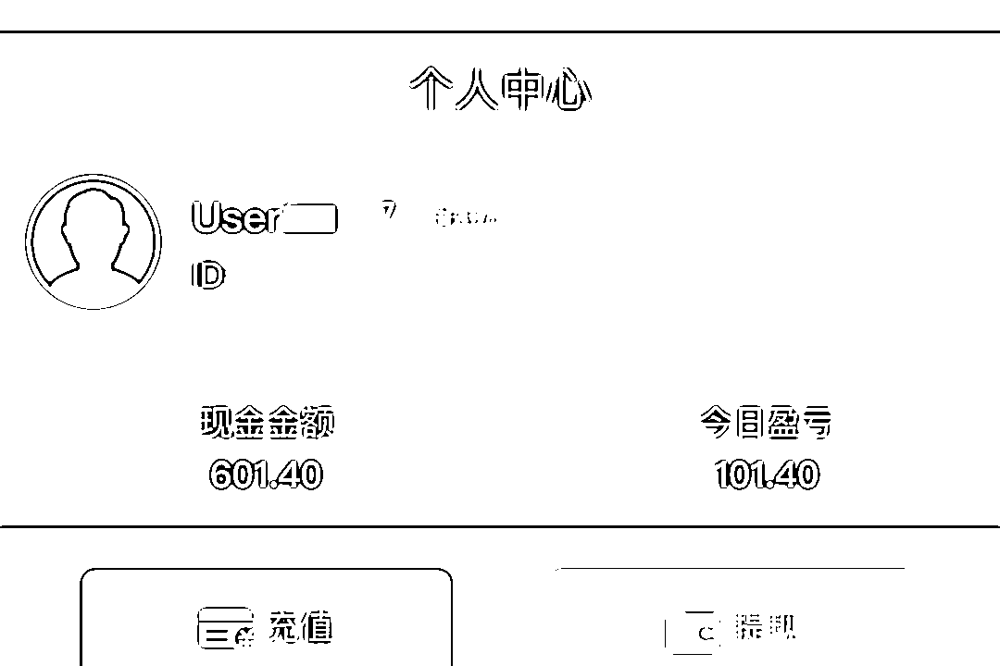
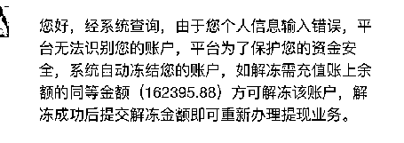
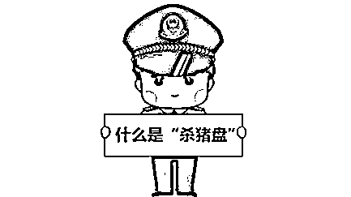
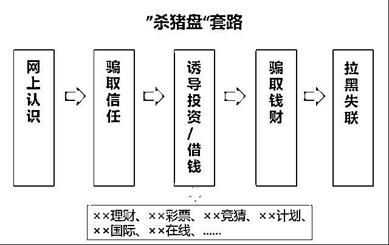

# 跟着“高富帅”投资，穷了自己富了别人……

> 原文：[`mp.weixin.qq.com/s?__biz=MzIyMDYwMTk0Mw==&mid=2247521958&idx=5&sn=d07fddefac825aff5538f4e7a6331a22&chksm=97cb5d9ea0bcd48817ac07e1fbac2fc607181b74ea1808557473873677818076ce77738fcbd6&scene=27#wechat_redirect`](http://mp.weixin.qq.com/s?__biz=MzIyMDYwMTk0Mw==&mid=2247521958&idx=5&sn=d07fddefac825aff5538f4e7a6331a22&chksm=97cb5d9ea0bcd48817ac07e1fbac2fc607181b74ea1808557473873677818076ce77738fcbd6&scene=27#wechat_redirect)

如果网上有异性向你示好 

且他（她）条件优越

不是“高富帅”就是“白富美”

对你关怀至备，嘘寒问暖

你会心动吗

如果他（她）还有赚钱的“利器”

想和你共同创造美好未来

你会不顾一切“奔向”他（她）吗

如果真有这样的“好”事

很有可能你已经掉进

骗子设计精密、环环相扣的圈套了

这种骗局叫做

**“杀猪盘”**

“高富帅”很暖，她沦陷了

39 岁的陈女士在某社交平台认识了一名王姓网友，对方谈吐幽默、成熟稳重，最重要的是，他对她关怀备至。她开始慢慢沦陷。

这位王先生身高 182 厘米，体重 82 公斤，自己开了公司，工作之余喜欢健身，两年前离婚后，一直空窗。聊天期间，王先生还晒出了自己的豪宅和豪车。

对方晒豪车

“起床了吗？”“吃饭了吗？”“早点睡吧，晚安！”“空调开高一点，别着凉了！” 虽然王先生比自己小四岁，却是“名副其实”的暖男，**每日的早晚“打卡”和嘘寒问暖让两人的感情迅速升温，**双方的称谓也一同升级更加亲昵。

他不想她太艰苦，想让她过得富足

说起自己的公司，王先生就开始滔滔不绝，他说受疫情影响，自己的公司曾一度跌入底谷，甚至欠了外债 500 多万，后来靠做彩票的收益半年就还清了债务，还让公司重新有了起色，现在还有了自己的工地。

看着陈女士经常工作到 10 点才能下班，每个月只拿几千块钱的工资，王先生心疼极了，**说女孩子不应该做压力太大、太累的工作，并决心要带着陈女士过上“富足”的生活。**

王先生开始介绍自己在福彩 APP 上的投资经验，在陈女士提出质疑怕被套路后，他却说这并不是赌博，是靠自己用脑子分析数据结合走势进行投资，**包赚，收益至少在 20%。**

对方介绍自己的赚钱“利器”

“第一次少赚一点，学习为主”，在王先生的建议和指导下，陈女士通过链接下载了“**福彩”APP，并在“初级房”试投了 500 元。才过了 10 多分钟，陈女士就盈利了**101.4**元，并顺利提现。

陈女士在“初级房”盈利 101.元

次日，陈女士追加了 18888 元，加上盈利提现了**21136**元。

她只想谈个恋爱，他却把她当“猪”宰

**“资金量越大，回报越高。”**王先生开始推荐“中级房”，虽然门槛要 5 万元起步，但收益会更高，有**40%-60%**。尝到了“不费力气轻松赚钱”的甜头后，陈女士似乎看到了以后美好、富足的生活，开始趁热打铁向朋友借钱，甚至贷款进行投资。

陈女士没想到的是她的第三次提现被**冻结**了，系统提示她的卡号信息错误，需充值与余额相等的金额才能提现。看着平台的余额，她非常焦急，但又不甘心，于是在王先生的引导下进行了充值，又缴纳了**会员费、保证金**等。

客服提示账户被冻结

最后，和所有杀猪盘的女主角一样，陈女士被“宰”了，钱没了，爱情也走了。盯着手机屏幕发不出去的信息和一堆欠债，陈女士不知所措，只能选择报警。

陈女士报警 

“原来都是假的，他就是为了骗我的钱”，陈女士后悔至极。截止报警，陈女士共计损失 34 万余元。目前，案件正在进一步调查中。

在诈骗团伙的内部黑话里，被锁定的目标就是被圈养等待屠宰的**“猪”**。**“猪槽/猪圈”**是用来筛选受害者的社交平台工具，给**“猪”**们投喂，**“猪饲料”**是一对一创造的剧本话术和化名“菠菜”的博彩，幕后操盘的骗子们则自称**“菜农/屠夫”**。

**警方提醒**

不轻信不透露不转账

***和普通电信诈骗不同，***“杀猪盘”更具迷惑性，不好识破，骗子会准备好完善的人设和你慢慢周旋，培养感情，放长线“养猪”。直到你对他足够信任，才会利用感情控制你到假投资网站或博彩网站借贷投资充值，迅速收割。

***骗子用谎话催促指挥操作，***还会把时间段特意选择许多人刚睡醒，快睡觉，或急于去吃饭，或去办事上班的时候。让受骗者没时间冷静思考，不给留出找家人亲友商量和网上查阅的空隙就信了。上当后才发现有漏洞的骗局。往往养的时间越久，杀得越狠，当你还沉浸在 TA 给你描绘的美好未来中时，他们已经悄然撤退只留下空荡荡的账户和一地债务。 

***当然更重要的一点是，***他们让受害者相信自己是真的爱着他们，在爱情面前，人们总是愿意卸下盔甲，相信那个“万一”。

来源：杭州公安，阻击诈骗

← 向右滑动与灰产圈互动交流 →

