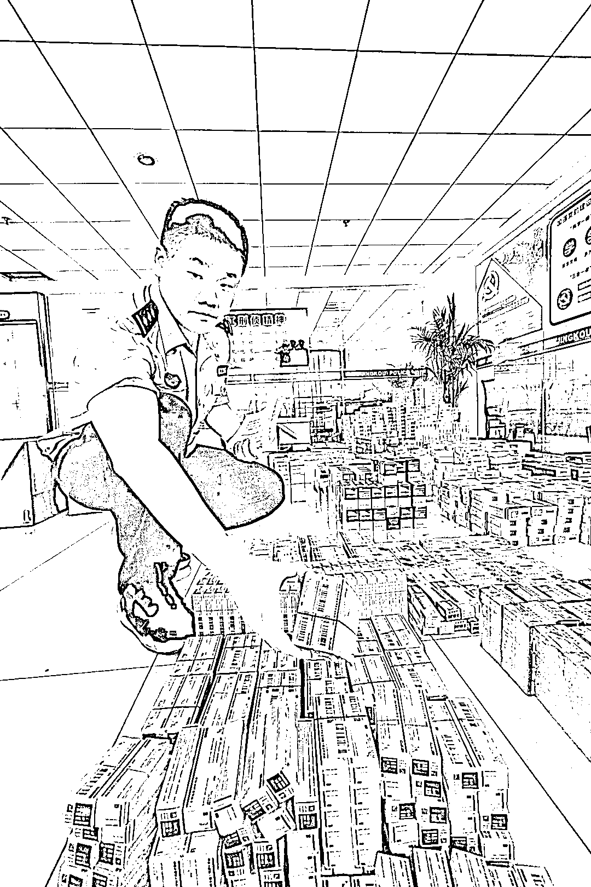

# 江苏一名中间商，倒药 7 年全款买下 7 套房产……

> 原文：[`mp.weixin.qq.com/s?__biz=MzIyMDYwMTk0Mw==&mid=2247521958&idx=6&sn=e08482f09d8c488789328fe1a728c0e3&chksm=97cb5d9ea0bcd488f6b0f1e965d918052e72e318a1bfaa23cb02cbeccb9f22f9ee11644810a5&scene=27#wechat_redirect`](http://mp.weixin.qq.com/s?__biz=MzIyMDYwMTk0Mw==&mid=2247521958&idx=6&sn=e08482f09d8c488789328fe1a728c0e3&chksm=97cb5d9ea0bcd488f6b0f1e965d918052e72e318a1bfaa23cb02cbeccb9f22f9ee11644810a5&scene=27#wechat_redirect)

江苏省镇江市，有一对 50 多岁的夫妻，妻子江某未患有疾病，丈夫许某患有高血压、糖尿病，但并不严重，然而两人几乎每天都要去市内各大医院、社区卫生中心开药，经常一天要跑好几家医药机构买药。在 2020 年，江某开了 120 余种药，价值超过 15 万元；许某也开了 100 多种药，价值超过 23 万元。 

夫妻二人为什么要开这么多种药？更令人匪夷所思的是，这些药中有很多是根本不能同时服用的。医疗专家表示，**两人若在一年内将这些药全部吃完，不知要丧命多少回。**

随着警方深入调查发现，异常开药的背后，竟是一个庞大的医保诈骗的产业链。近期，江苏省镇江市公安局打掉涉及 11 个省份的 20 多个医保诈骗团伙，揭开医保诈骗黑产冰山一角。

[`mp.weixin.qq.com/mp/readtemplate?t=pages/video_player_tmpl&action=mpvideo&auto=0&vid=wxv_2081992980709588992`](https://mp.weixin.qq.com/mp/readtemplate?t=pages/video_player_tmpl&action=mpvideo&auto=0&vid=wxv_2081992980709588992)

**1**

****一人一年开药 20 多万元 100 余种****

* * *

2020 年 7 月，镇江市医保局向公安机关反映，发现个别参保人员存在异常开药情况。经初步排查，就发现镇江 300 余人次门诊开药存在无病虚开、有病多开的情况。镇江市公安局着手深挖，历经 1 年多时间，揪出 20 多个相互关联的医保诈骗团伙。 

最早进入警方视线的，就是许某、江某夫妻二人。2020 年，两人在镇江各级医院开药数百种，涉嫌诈骗医保基金 30 余万元。

通过排查夫妻二人，镇江警方找到了组织开药、收药的药贩李某，继而又从李某揪出下游倒卖药品的中间商、销赃的药店。李某的公公、丈夫此前因组织开药、收药被抓获刑，可她依然接过公公、丈夫织起的网络，继续从事这一违法犯罪勾当。

之后，镇江警方又从这条线索出发，抽丝剥茧深挖打掉 20 余个医保诈骗团伙。镇江市公安局刑警支队政委顾剑介绍，**截至今年 8 月底，镇江警方已抓获犯罪嫌疑人 180 名，收缴涉案药品约 3 万盒，扣押冻结涉案财物、资金总价值达 2000 余万元。**

另外，根据目前掌握的线索，镇江警方初步研判，至少有分散于国内 11 个省份的 100 多名中间商、100 多家药店参与倒卖、销赃医保药品，各地开药人员规模更为庞大。

**医保诈骗获利惊人。**镇江市公安局润州分局刑警大队大队长傅明成介绍，江苏盐城一名中间商，自 2014 年开始倒药，7 年来不仅养活了一家人，还全款买了 7 套房产，其中南京 3 套。在被抓获的那一天，这名中间商倒卖药品的净收益就高达 1 万元。

**2**

**医保诈骗从开药到销赃形成网链**

* * *

镇江市公安局民警清点扣押的部分涉案药品 新华社记者朱国亮摄

镇江警方办理的这起典型案件显示，医保诈骗存在开药人、药贩、中间商、药店四个环节，一个开药人可能对应多个药贩，一个药贩又对应多个中间商，一个中间商对应多个药店，**总体呈现网状结构，每一个环节都是这张巨大“利益网”的一个节点。**

这些开药人在医院买了药，并不是自己用，而是加价卖给药贩。药贩将开药人开的药收集起来，再加价卖给掌握药店资源的中间商。中间商将药分拣、包装后，再加价销售给药店。药店则通过其销售渠道，将这些药卖给普通消费者，只是这些药品进货、销售一般不入账，而是体外运行。

**医保诈骗各环节利益分成基本固定。**顾剑介绍，开药人自付 5%到 10%的药费到医院开药后，一般加价 30%卖给药贩，药贩再加价 10%卖给中间商，中间商再加价 10%到 15%卖给药店。药店购进这些药物的价格一般不超过医院售价的 65%，然后再按市场价或略低的价格售出。

镇江警方还介绍，开药人员数量众多，部分人员也确实身患疾病。组织开药的药贩很多是曾经从事过药材经营的人员，他们中不少人都是亲戚、老乡。中间商中不少人曾是药企销售人员，因此得以掌握大量药店资源。销赃药店则散于全国，以监管相对松懈的农村地区药店居多。

**3**

****惩治“硕鼠” 不让“救命钱”被“啃食”****

* * *

**“医保基金是老百姓的救命钱，关系每一名参保人员的切身利益。”**镇江市副市长、公安局局长王文生说，“镇江公安联手医保局等部门开展医保反诈‘亮剑’行动，就是要将这些肆意‘啃食’医保基金的‘硕鼠’一一揪出来。” 

去年 12 月以来，镇江警方已就此案进行了三次收网行动，目前还在继续追查中。顾剑介绍，在公安部指导下，对已掌握的线索，镇江警方还在深挖，力争继续打深、打透、打彻底。

对于医保诈骗，公安机关依法严惩犯罪行为，相关部门也在进一步加大力度，严密监管防线。目前，镇江当地已就建立打击欺诈骗取医保基金联动工作机制出台实施意见，法院、检察院、公安机关将与医保、市场监管等部门开展更紧密的协作

来源：瞭望智库，利箭在行动

← 向右滑动与灰产圈互动交流 →

