# 游戏充值被骗 2 万，牵出特大“跑分平台”跨境洗钱黑灰产业链

> 原文：[`mp.weixin.qq.com/s?__biz=MzIyMDYwMTk0Mw==&mid=2247521958&idx=7&sn=85d2a612e4016aa6a86751ba013974f5&chksm=97cb5d9ea0bcd488e6e65e34d4bbb700b38bb5062ebcde4f7dcb98d824ad5c63879f814bd7f9&scene=27#wechat_redirect`](http://mp.weixin.qq.com/s?__biz=MzIyMDYwMTk0Mw==&mid=2247521958&idx=7&sn=85d2a612e4016aa6a86751ba013974f5&chksm=97cb5d9ea0bcd488e6e65e34d4bbb700b38bb5062ebcde4f7dcb98d824ad5c63879f814bd7f9&scene=27#wechat_redirect)

赵女士是一名网络游戏的爱好者。2020 年的一天，她收到了一条优惠充值游戏币的信息，没想到，这条信息不仅让赵女士损失了上万元，还牵出一个专门为跨境网络赌博、电信诈骗犯罪团伙提供资金结算的黑灰产业链条，涉案金额高达近 50 亿元。 

据赵女士回忆，2020 年 2 月的一天，她在玩游戏的过程中，收到了一位陌生游戏好友发来的信息，声称可以优惠充值游戏币。

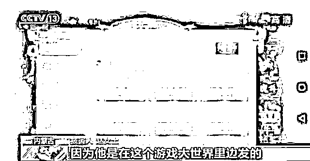

被害人 赵女士：因为他是在这个游戏大世界里边发的，我以为他就是官方客服，我也没对他产生怀疑。

赵女士称，抱着试试看的心态，她添加了对方的 QQ 号，随后对方给她发来一个网络链接。根据对方的指引，赵女士实名注册后购买了 50 元的充值礼包。

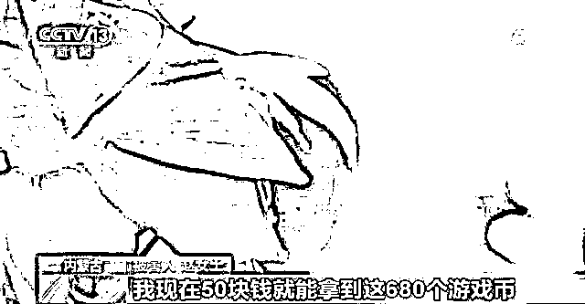

被害人 赵女士：正常我 50 块钱充的话，是能给我拿五百个游戏币。我现在 50 块钱就能拿到这 680 个游戏币，我还挺心动的。

激活游戏账号 连环套一个接一个

这时游戏账号显示充值成功，但是需要激活才能在游戏内使用。怎么才能激活呢？对方表示，赵女士需要充值 680 元才可以激活游戏账号，不过对方表示在激活成功后可以将充值的金额提现。

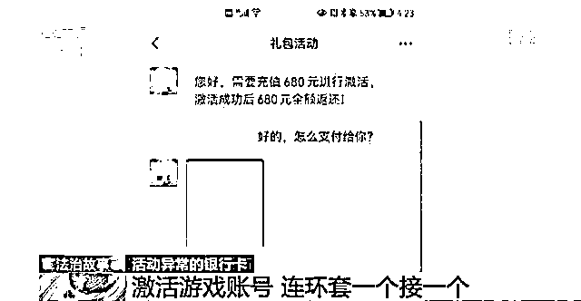

被害人 赵女士：我一共就是充了两次 680，第一次充，他告诉我手速慢，第二然后我就又输银行账号，我又充了 680，然后他告诉我，我的账号被冻结了。就是一次 50，两次 680 之后，他告诉我账号被冻结了。需要充值两次 3999，这样才能把这个号激活。

听到还要继续充值，赵女士有些犹豫了，但在想到之后还可以提现，赵女士按照对方的提示继续进行了充值。

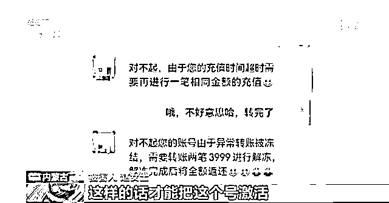

被害人 赵女士：因为我之前已经有了两个 680 了，然后我还有游戏币啥的，我就挺想让之前那个钱回来的，我也没怀疑，我就又给他支付了两笔 3999，分两次支付的，一共七千多块钱。

不到 2 个小时 被害人先后转账近 2 万元

几分钟后，对方告诉赵女士她的游戏账号已经成功激活，但是因为没有达到一定累计充值的金额所以不能提现，想要提现的话需要继续充值 7998 元。就这样，不到 2 个小时的时间里，赵女士通过手机转账到指定账户 18816 元。

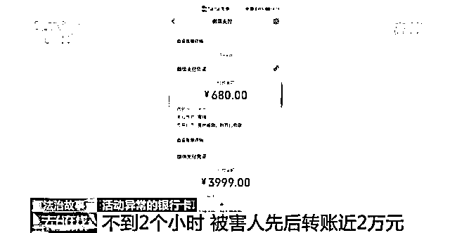

被害人 赵女士：我就等着他把所有的钱都给我提现，返到我银行卡上，我就去催他，我跟他聊天儿去了。他就问我说你给我提供你的那个银行卡账号里边儿还剩多少钱了？我说我就剩两三百块钱了，咋的了？他说那你这银行卡不合格，你必须得用一张金额加起来得有 18816，就我之前一共付的那些钱，银行卡里的余额必须得达到一万八千多，他才能给我提现。

不仅无法提现 还被“拉黑”无法联系

由于迟迟无法提现，赵女士察觉到有些不对劲，当她再次联系对方想要把钱退回来时，却发现自己早已被拉黑了。

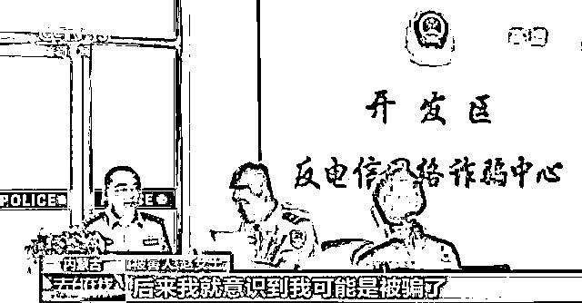

被害人 赵女士：我再和他说话，他就不理我了。然后我去游戏世界里边也找他，和他说话，都没有动静了。QQ 一直是离线的状态，后来我就意识到我可能是被骗了。

顺藤摸瓜 根据汇款记录锁定嫌疑人

意识到被骗后的赵女士选择了报警。根据赵女士的汇款记录，警方经调查，很快锁定了犯罪嫌疑人刘某，并顺藤摸瓜，锁定了另一名犯罪嫌疑人付某。

通辽市公安局经济技术开发区分局网安大队大队长 李永刚：发现刘某每天微信收取的资金要在一百笔左右，而且每笔资金量是从三五百到三五千不等，接到每一笔资金之后，随即又会转入到付某微信账户内。

警方调查发现，付某有正当职业，却长期使用付款二维码，进行不法资金的收取、转移等违法犯罪活动。

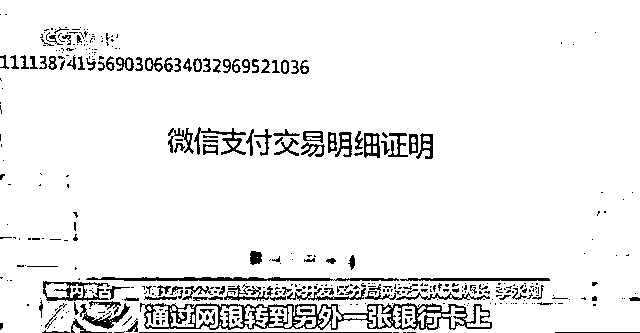

通辽市公安局经济技术开发区分局网安大队大队长 李永刚：通过微信收取每笔资金，提现转移到自己银行卡上之后，她会把她收取的每笔钱通过网银转到另外一张银行卡上。

租用他人收款码 负责接收转移非法资金

根据付某的转账记录，民警发现，付某每次收到钱后会转到张某的银行卡内。警方调查发现，张某长期通过租用的方式获得他人的“电子收款码”，帮助一个名叫“中正集团跑分平台”的“第四方支付平台”接收并转移非法资金。据警方介绍，所谓的第四方支付平台是指未获得国家支付结算许可的非法支付渠道。

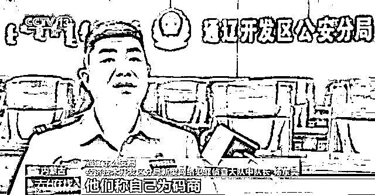

通辽市公安局经济技术开发区分局新型网络犯罪侦查大队中队长 杨东昊：第四方平台就是借助于第三方之上的平台，叫第四方支付平台，就是没取得国家金融牌照的平台叫第四方平台，他们是帮助第四方平台进行收款的这些人，他们称自己为码商。

警方介绍，在犯罪团伙中，像张某一样负责收集他人“电子收款码”，提供给第四方支付平台使用的人被称为“码商”。而那些提供“电子收款码”的个人被称为“码农”。

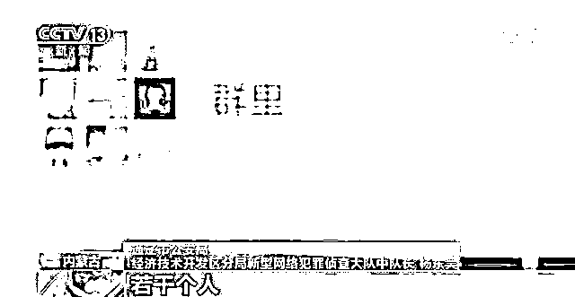

通辽市公安局经济技术开发区分局新型网络犯罪侦查大队中队长 杨东昊：团队里边可能有十几个、二十个若干人，他们是利用自己的二维码、亲朋好友的二维码、多人的二维码进行收取，就是帮这个平台收款。

以高额返利为饵 招揽他人出借支付账户

警方介绍，“第四方支付平台”也被称为“跑分平台”。而这里所谓“跑分”就是利用电子收款码，为别人进行代收款，然后赚取佣金。

“跑分平台”是指通过“跑分”模式，为赌博、诈骗等非法资金进行流转、逃避监管的网络平台。警方发现，张某为扩大规模，以高额返利为诱饵，招揽他人出借自己的支付账户，这些租赁来的支付账户被大量用于电信网络诈骗、赌博、色情等违法犯罪活动进行收款，其实就是洗钱。

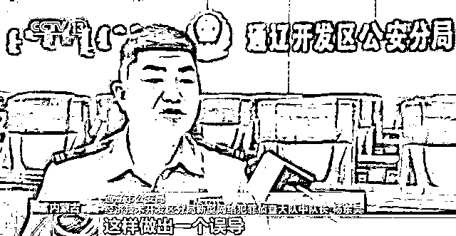

通辽市公安局经济技术开发区分局新型网络犯罪侦查大队中队长 杨东昊：张某就跟他们说，这个是境外赌博，给境外的赌场收钱，但是境外赌场在境外是合法的，所以咱们在国内给它收钱，咱们也合法。这样作出一个误导，这些人就开始帮他收款。

“下线”涉及人员广 转移非法资金巨大

警方调查发现，张某每转移一笔非法资金，就可以按照比例从中抽取一定的费用。他的下线涉及人员广，转移非法资金巨大，经严密部署，2020 年 7 月，警方在福建将张某抓捕归案。

通辽市公安局经济技术开发区分局新型网络犯罪侦查大队中队长 杨东昊：发号指令的嫌疑人（张某），会把若干一类违法犯罪活动这些人拽到一个单独的小群，然后从这个小群通知他们今天什么时间、什么地点，怎么提供，提供哪个使用的二维码进行收款。（码农）把这个二维码通过 APP 或者是网站发送给被害人或者是参赌人员，每一笔资金能达到最多的是近千万，最少的也是在五十万到一百万之间。（张某）出账总额将近在两亿余元。

随着犯罪嫌疑人张某的归案，游某进入了警方的视线。民警调查发现，游某是张某的上线，是一个码商团伙的头目，在她的手下还有多名像张某一样的码商。

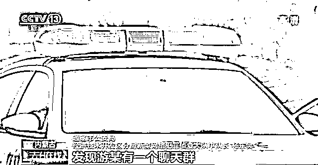

通辽市公安局经济技术开发区分局新型网络犯罪侦查大队中队长 杨东昊：发现游某有一个聊天群，这个聊天群里边有一百七十多个像张某同样层级的这么一个码商群体。这些小的码商团队每个都有 10 人到 20 人，他们收款金额非常庞大。

掌握“码商”人员架构及落脚点遂展开抓捕

2020 年 9 月，警方在掌握了这个“码商”团伙的人员架构以及落脚点后，展开抓捕行动，将主要犯罪嫌疑人游某等人抓捕归案，并查获大量涉案物品。

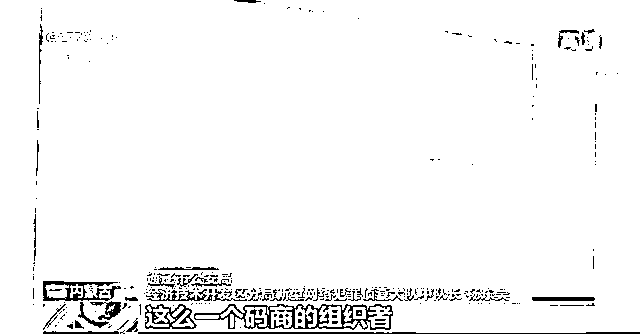

通辽市公安局经济技术开发区分局新型网络犯罪侦查大队中队长 杨东昊：游某是直接负责跟这个“中正跑分平台”技术、服务人员进行沟通联系，这么一个码商的组织者，咱们通过分析之后发现游某获利在 500 余万元。

梳理非法资金 又有意外发现

以游某为首的码商团伙归案后，警方在梳理非法资金的过程中，又有了一个意外发现，除了利用电子收款码进行洗钱的码商团伙外，还有一个专门利用银行卡四件套来帮助犯罪团伙洗钱的卡商团伙。

一名务工人员银行卡流水竟高达近 30 亿元

据警方介绍，银行卡四件套是指“银行卡、身份证、手机卡、网银 U 盾”，所谓“卡商”就是收购、租用、出售他人“银行卡四件套”的犯罪嫌疑人。而那些出售、出租本人“银行卡四件套”的个人被称为“卡农”。警方对涉案资金进行研判发现，这些涉案资金流水都曾汇到了辽宁沈阳的一张个人银行卡上，而这张银行卡的流水竟然高达近 30 亿元。

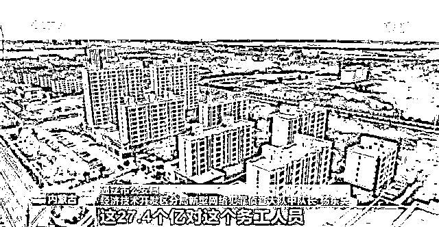

通辽市公安局经济技术开发区分局新型网络犯罪侦查大队中队长 杨东昊：这个卡的流水是进账 13.7 个亿，出账 13.7 个亿，整个这个卡的流水是 27.4 个亿，这 27.4 个亿跟这个务工人员的收入肯定是极其不相符的。

警方调查发现，这张银行卡的卡主叫宋某。据宋某归案后交代，他将自己的银行卡四件套出售给了一名叫王某的男子。

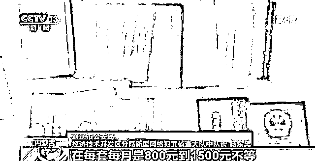

通辽市公安局经济技术开发区分局新型网络犯罪侦查大队中队长 杨东昊：王某抓住了宋某不懂法律的空子，以极低的价格将宋某的卡进行收购。他收售银行卡四件套的金额在每套每月是 800 元到 1500 元不等。

收购银行卡“四件套”再卖给“上一级”

民警进一步调查发现，王某是一个专门收购他人银行卡四件套的“卡商”。他主要针对法律意识淡薄的人群，收购他们个人银行卡四件套，再转手卖给上一级卡商。

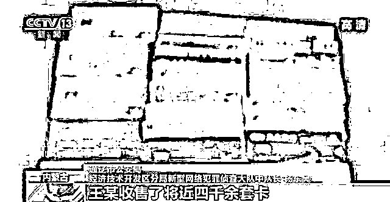

2019 年的 3 月到 2020 年的 5 月间，王某收售了将近四千余套卡。这些卡卡主基本都是 60 岁以上的老人，还有学生，还有务工人员。

警方调查发现，王某收购的个人银行卡四件套，都卖给了辽宁的赵某。

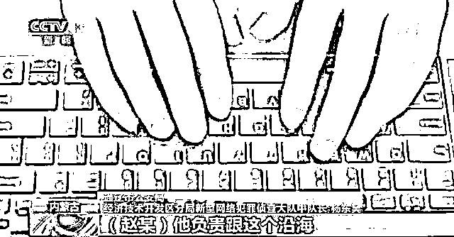

通辽市公安局经济技术开发区分局新型网络犯罪侦查大队中队长 杨东昊：王某会以 5000 元的价格卖给赵某，赵某会以 8000 元的价格转卖给福建、广东、广西、云南这些沿海的大卡商，他负责跟沿海还有边境城市卡商联系，他指使（王某）去邮寄、收购这些银行卡四件套，在一年之内他（赵某）的获利就是在 1200 万元。

银行卡被邮寄到各地 收货人全用假身份

据王某归案后交代，他与赵某谈好价格后，会按照对方的指示，通过快递的方式邮寄到福建、云南、广西等地，而具体收件人是谁，他并不知道。

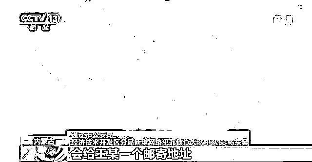

通辽市公安局经济技术开发区分局新型网络犯罪侦查大队中队长 杨东昊：每次让王某邮寄这些银行卡的时候，会给王某一个邮寄地址。每个邮寄地址的人员是有变动的，每次是不一样的人员，收货人是不一样的收货人，但是这些收货人是没有真名的。

从快递单入手寻找蛛丝马迹

由于无法确定收件人的信息，线索到了这里似乎已经中断，接下来该如何继续追踪这些银行卡四件套的去向呢？民警决定从王某寄出的快递单入手，寻找蛛丝马迹，果然在对王某邮寄的快递进行梳理后，一个细节引起了民警的注意。在近一个月王某寄出的包裹中，其中有三次寄到了福建省德化县。随即，通辽警方赶赴福建德化展开走访摸排，经走访发现，王某寄到这里的三个包裹，都被一名叫林某的男子取走了。

通辽市公安局经济技术开发区分局新型网络犯罪侦查大队中队长 杨东昊：这三次取货地址，就是这三次都是由林某进行收取，会在第二天，将这个快递分包之后进行发送国际快递物流。

“四件套”流向境外电诈团伙手中

警方经进一步调查，一个以林某为首的专门收购、贩卖“银行卡四件套”的犯罪团伙浮出水面。来自全国各地的个人银行卡四件套被源源不断地送到福建德化，之后犯罪嫌疑人通过快递的方式，将这些银行卡四件套，贩卖到在境外从事电信网络诈骗的犯罪嫌疑人手中。

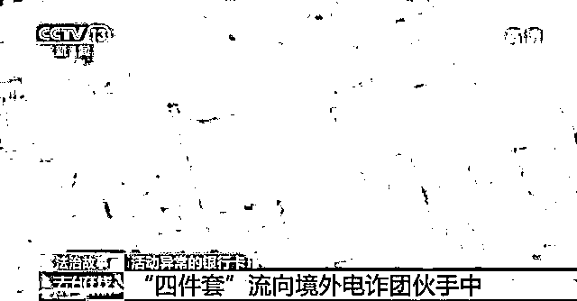

通辽市公安局经济技术开发区分局新型网络犯罪侦查大队中队长 杨东昊：包装成德化瓷，包装成工艺品往国外进行邮寄。

团伙人员结构复杂 分工明确

警方调查发现，这个犯罪团伙人员结构复杂，分工明确，主要在福建一带活动。为彻底斩断这一条银行卡四件套流向境外的通道，警方经周密部署，对林某等多名犯罪嫌疑人展开抓捕行动。

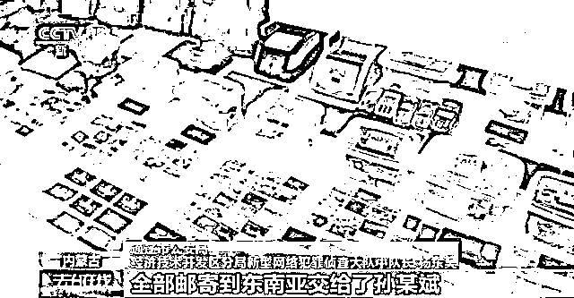

通辽市公安局经济技术开发区分局新型网络犯罪侦查大队中队长 杨东昊：林某所收的银行卡四件套全部邮寄到东南亚交给了孙某斌，孙某斌是通过以 12000 元的价格在林某处收购银行卡四件套，林某获利是 1600 余万元。据林某供述，1600 余万元都是孙某斌通过银行卡给他转入进来的。

洗钱过程中起关键作用 又一团伙被牵出

警方发现，以林某为首的犯罪团伙提供的银行卡与张某的码商团伙所使用的银行卡有所重合，而更令民警意外的是，除了码商团伙和卡商团伙这两个团伙外，还有另外一个团伙在整个洗钱过程中起到关键作用，那就是“车手”团队。

据警方介绍，所谓的“车手”团队，是指专门帮助赌博、诈骗等犯罪活动提取现金的犯罪团伙。其中又包括“取现车手”和“运送车手”。取现车手，顾名思义就是专门在银行提取现金的犯罪嫌疑人，运送车手则是负责运送这些现金的犯罪嫌疑人。那么警方是如何发现这个犯罪团伙的呢？这还要从警方在案件梳理过程中的一个意外发现说起。

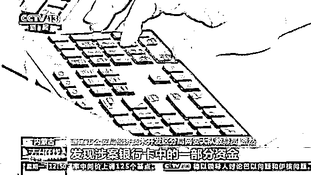

通辽市公安局经济技术开发区分局网安大队教导员 路然：我们梳理最长的一个资金链达到了 14 级，才发现了它有个汇合点。我们通过大量的数据分析，发现涉案银行卡中一部分资金在一个名叫施某池的银行卡中进行了归集。

警方调查发现，码商团伙和卡商团伙的非法资金曾在同一张银行卡上有汇合。随后，民警对这张银行卡展开调查，发现这张银行卡曾多次在福建省晋江市的一家银行提取了现金，经进一步调查，民警确定提取现金的人正是这张银行卡的卡主施某池。

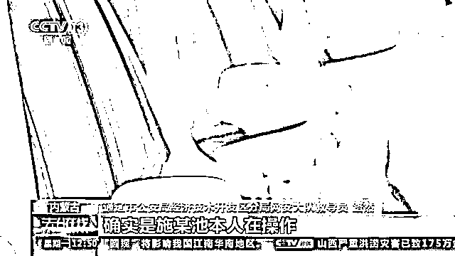

通辽市公安局经济技术开发区分局网安大队教导员 路然：发现施某池在几个月的时间内，在银行提现的交易量达到了五千余万元，确实是施某池本人在操作，她每天都要取几十万、上百万的资金在银行柜台取现。

民警调查发现，施某池在银行提取现金后，会将现金交由施某钩进行运送。

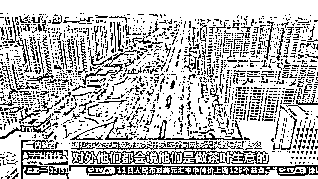

通辽市公安局经济技术开发区分局网安大队教导员 路然：他们取现之后，都会把现金装在一个纸箱内，封装之后进行转移，对外他们都会说他们是做茶叶生意的，纸箱子里装的是茶叶，他们管这个现金叫茶叶。

民警调取了施某钩的活动轨迹后发现，他曾到福建泉州的一家酒店门前的停车场，将装有现金的纸箱交给了一名男子。

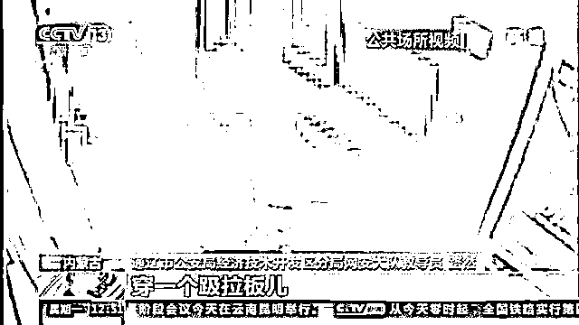

通辽市公安局经济技术开发区分局网安大队教导员 路然：他当时穿着很随意，因为南方也比较热，穿一个趿拉板儿，一个短裤就出来了，抱着现金他就上了电梯，这笔现金是一百多万，从酒店的电梯出来，施某钩把装着现金的纸箱交给了他的上线，从视频上看，两人没有说话，这个交易就完成了。

团伙成员多达上百人 并且涉及多个省份

经调查，民警最终锁定了他的上线名叫施某文，而施某文则是一个车手团队的头目，这个犯罪团伙成员多达上百人，并且涉及多个省份。

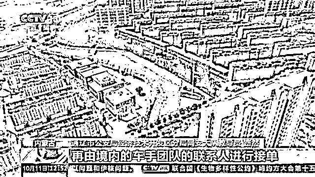

通辽市公安局经济技术开发区分局网安大队教导员 路然：我们发现了他（施某文）有这样一个工作群，这个群内的群成员有一百余人，其中境外赌场的财务人员有二十三个人，剩下的几十人都是境内的取款车手团队的联系人。境外赌场的财务人员会在这个群内不定时地发布一些取现的任务及金额，再由境内的车手团队的联系人进行接单。

专为境外团伙提供资金服务赚取结算手续费

警方调查发现，以施某文为首的犯罪团伙使用掌握的数千张银行卡，专门为各类境外赌博、诈骗团伙提供非法资金提现、转移服务，从中赚取大量的结算手续费。

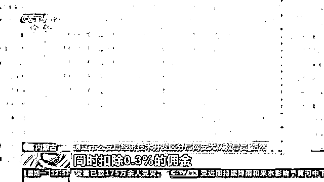

通辽市公安局经济技术开发区分局网安大队教导员 路然：财务人员会通知“跑分平台”向这张银行卡内转账三百余万元，同时加上 1.5%的佣金，施某文的取现车主团队下线，施某池的银行卡中收到这笔金额之后，施某池会将这个金额取现，同时扣除 0.3%的佣金，经过我们的调查，施某文在不到一年的时间，通过为境外赌场人员取现获得的非法所得达到了三百余万元。

搭建跑分平台 专门用于境外犯罪团伙洗钱

警方对主要犯罪嫌疑人施某文等人展开抓捕，成功打掉车手团队三个，累计取现转移现金近 10 亿元。据犯罪嫌疑人施某文交代，2019 年初，他在境外犯罪嫌疑人蔡某的指挥下，搭建了“中正集团跑分平台”，并通过分层代理、分级抽取佣金的方式，招揽了大量的码商、卡商开展跑分业务，专门供境外赌博、网络诈骗等犯罪团伙洗钱所用。

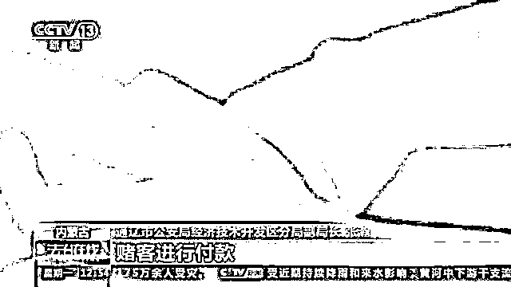

通辽市公安局经济技术开发区分局副局长 张瀚：以这个赌博平台为例，赌客在赌博平台上有充值需求后，赌博平台会将该需求发送到中正集团跑分平台上，这个平台也会根据充值金额的需求生成相应的订单，并挂到 APP 上，由相应的码商抢单。抢单成功后，上传收款二维码，赌客进行付款。再之后跑分平台确认订单完成，赌客也就充值成功了。跑分平台后期，在通过之前非法收购的个人银行卡四件套帮助赌博平台进行资金转移结算，对这个违法资金进行洗白。

多警种协同作战摧毁黑灰产业链

由于抓捕目标人员多，涉及地域广，案情复杂，为顺利收网，通辽警方成立 20 个抓捕组，调派近百名警力赴全国涉案地，多警种协同作战，多地公安配合下，对违法犯罪嫌疑人展开抓捕行动。

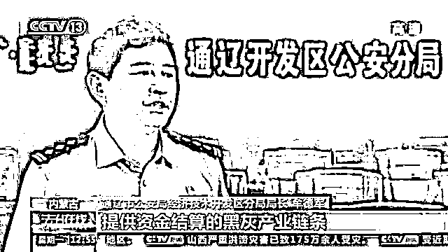

通辽市公安局经济技术开发区分局局长 牟德军：涉案金额近 50 亿元的新型网络犯罪案件历时八个月，横跨了 21 个省市，全覆盖、全链条，对中正跑分平台进行了全面打击，彻底摧毁了为跨境网络赌博、电信网络犯罪诈骗团伙提供资金结算的黑灰产业链条。

此次抓捕行动警方共抓获犯罪嫌疑人 54 人，查扣涉案银行卡一千余张，冻结涉案资金两千余万元。

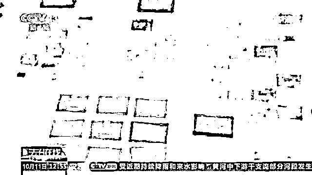

通辽市公安局经济技术开发区分局局长 牟德军：手机卡是五百余张，查扣的现金是五百六十五万元，冻结涉案资金是两千余万元。打掉了团伙是八个，其中码商团伙是两个，车手团伙是三个，卡商团伙是三个。

2021 年 3 月 22 日，通辽警方侦查终结，并向检察院移送审查起诉。目前，案件正在进一步审理过程中。

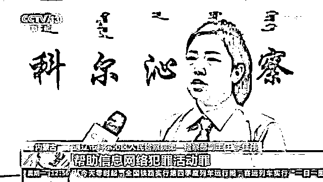

通辽市科尔沁区人民检察院第一检察部副主任 李佳伟：目前已完成所有卷宗审查工作，以涉嫌盗窃罪、妨害信用卡管理罪、帮助信息网络犯罪活动罪、掩饰隐瞒犯罪所得罪，向科尔沁区人民法院提起公诉。

来源：央视新闻客户端，环球网

← 向右滑动与灰产圈互动交流 →

