# 吸毒艺人喊冤想复出？怒了！

> 原文：[`mp.weixin.qq.com/s?__biz=MzIyMDYwMTk0Mw==&mid=2247522018&idx=1&sn=7c42a0df86decedd89e77658f6923249&chksm=97cb5ddaa0bcd4cc4f6507d519e4c14abf41b31932dcd13e98994d3224f68d0af6f157b0afe1&scene=27#wechat_redirect`](http://mp.weixin.qq.com/s?__biz=MzIyMDYwMTk0Mw==&mid=2247522018&idx=1&sn=7c42a0df86decedd89e77658f6923249&chksm=97cb5ddaa0bcd4cc4f6507d519e4c14abf41b31932dcd13e98994d3224f68d0af6f157b0afe1&scene=27#wechat_redirect)

近日

曾因吸毒被抓的宋冬野在微博发长文称：

自己的演出因多人举报被取消 

众多工作人员辛勤努力化为泡影

他不理解

还补充： 

艺人工作不好干 

艺人行业是抑郁症和精神疾病的重灾区

杀人的一直是贩毒者

而不是吸毒者
就算被强制离开

他也将始终捍卫自己

合理合法工作的权利

点击以下图片查看全文内容

👇👇👇

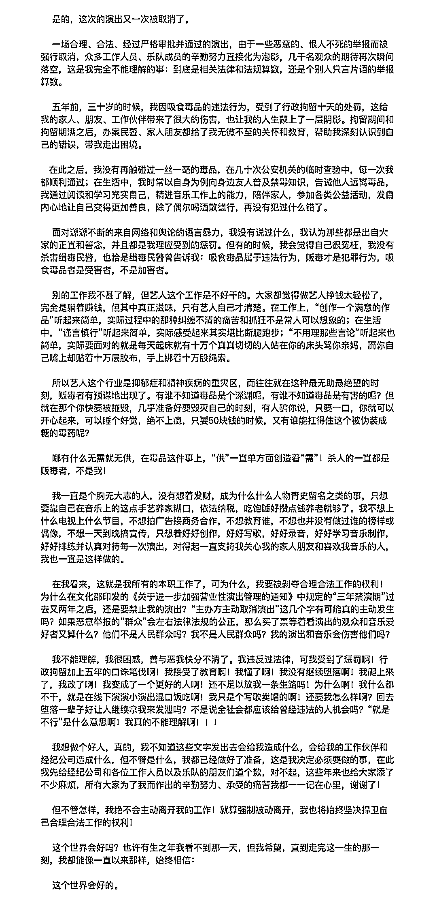

2016 年

该艺人因涉毒被警方抓获

虽然五年过去了

但这篇微博让很多网友表示

“通篇看完只有一个感想

一点反省的意思都没有”

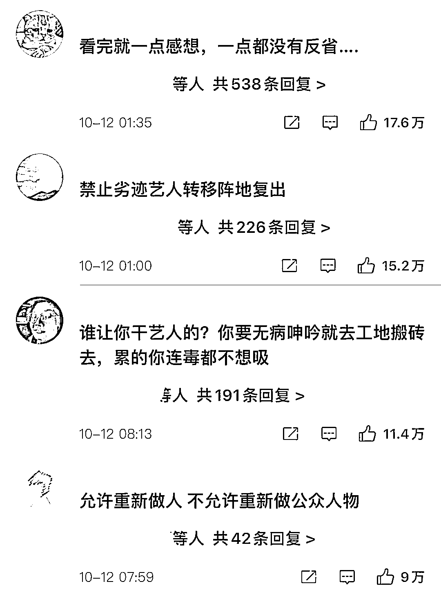

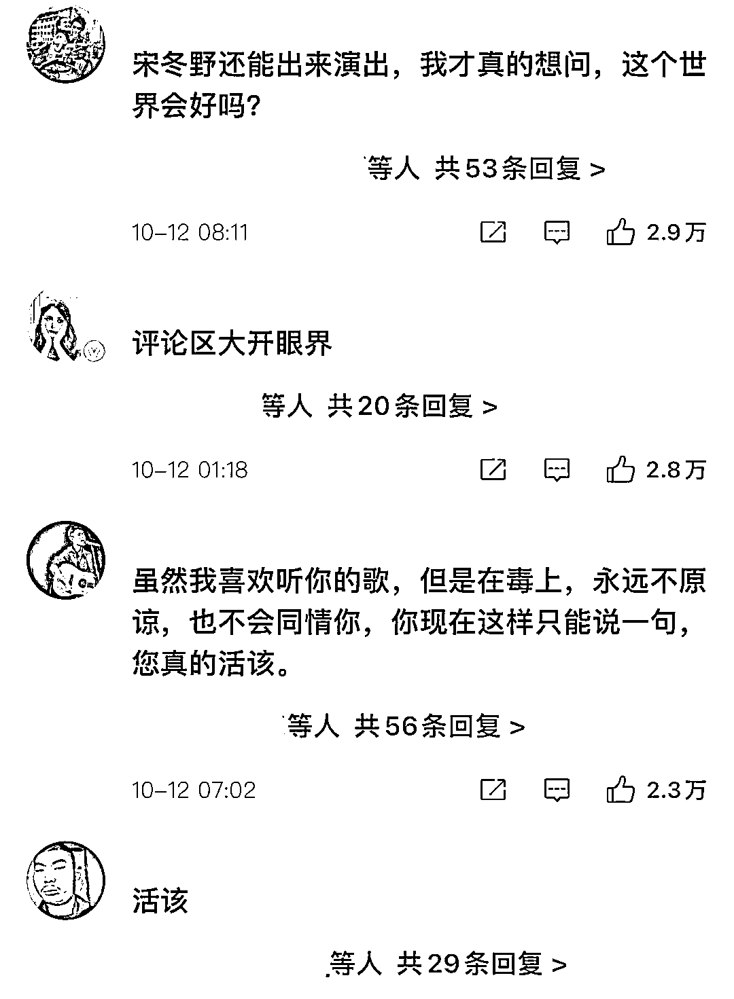

在该艺人的文字里 

**他把所有的责任**

**都推给了那些举报的网友**

**他把问题抛给了大众**

说自己有合理工作的权利

为什么不能让自己从头再来

但本质上

大家不是不让他工作

**而是不希望他**

**以偶像和公众人物的身份**

**出现在大众面前**

他说：

“杀人的一直都是贩毒者

不是我！”

**他把责任推给了那些卖毒的人**

说那些人才是坏人

是那些人害了自己

自己是受害者

目前

该艺人微博已被禁言

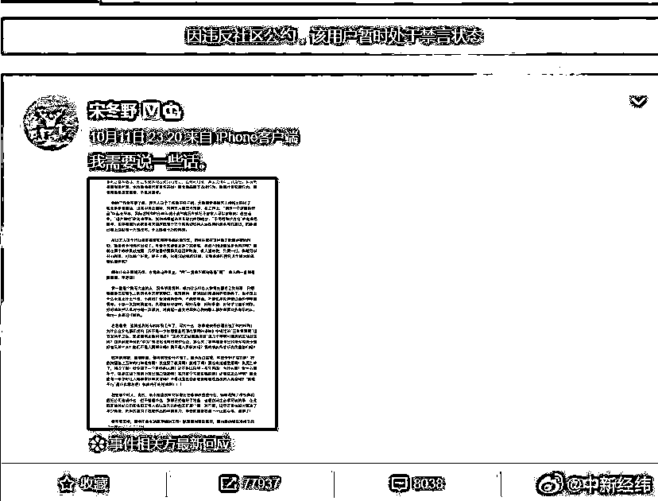

对于此事，

共青团中央官方微信公号发文：

公众空间需要正确的引领示范！

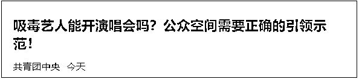

公安部新闻中心，

公安部治安管理局官方微博

**@中国警方在线发声表态：**

**如果吸毒艺人可以复出，**

**那么可以让我们牺牲的缉毒民警复活吗？**

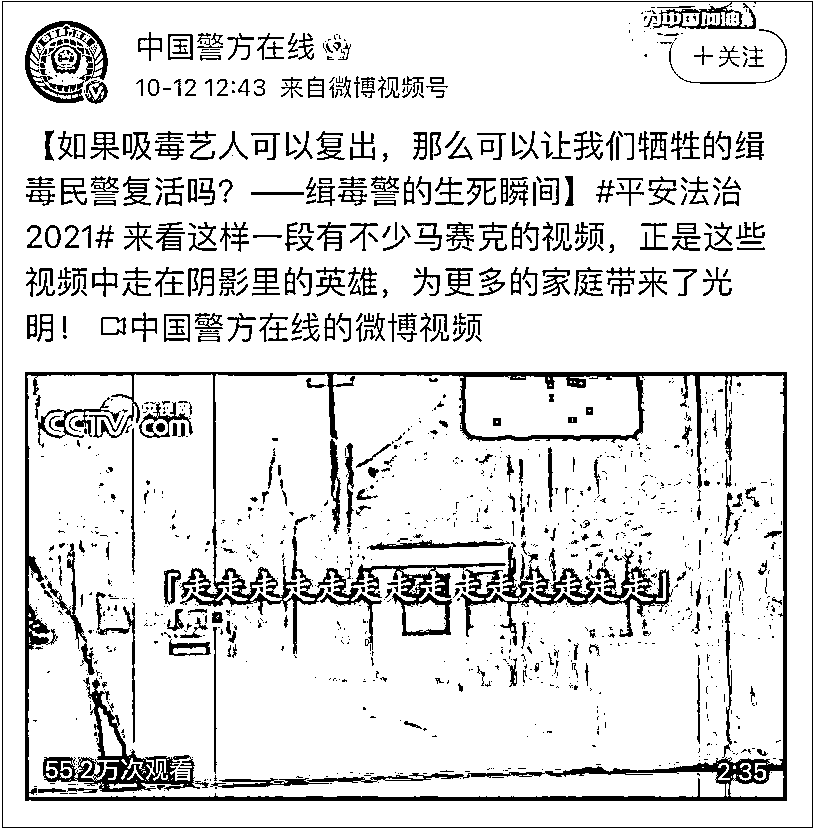

毒贩是丧心病狂

可在这条罪恶的利益链上

**吸毒者也是一环**

因为

**那些为吸毒而花出去的钱**

**都变成了毒资买了子弹**

**打在了缉毒警的身上！**

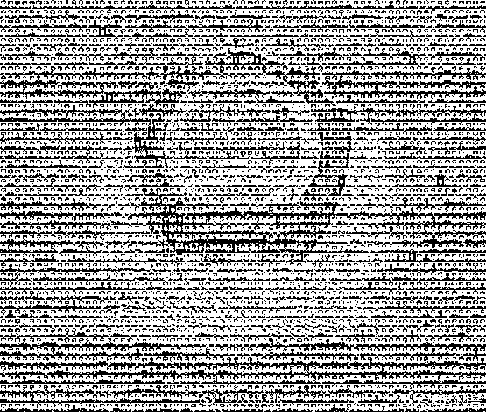

**禁毒民警生死瞬间**

（提醒：部分镜头可能引起不适

请慎重观看）

↓↓↓

[`mp.weixin.qq.com/mp/readtemplate?t=pages/video_player_tmpl&action=mpvideo&auto=0&vid=wxv_2087661416806694915`](https://mp.weixin.qq.com/mp/readtemplate?t=pages/video_player_tmpl&action=mpvideo&auto=0&vid=wxv_2087661416806694915)

据中新社报道 

2020 年

全国共破获毒品犯罪案件 6.4 万起

抓获犯罪嫌疑人 9.2 万名

缴获毒品 55.5 吨

新发现吸毒人员同比减少 30.6%

**每一起破获的毒品案件背后**

**都是缉毒民警们无数的付出与牺牲**

**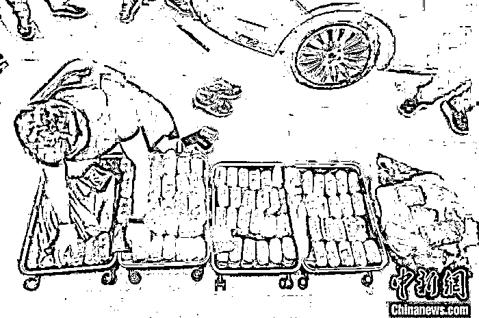**

**警方缴获的毒品。湖北西陵警方 供图**

**和平年代**

****缉毒警是最具风险的警种之一****

**他们面对暴戾的毒贩**

**在刀尖上行走**

**你看不见黑暗**

**是因为无数勇敢的人**

**把黑暗挡在了你看不见的地方**

**很多时候**

**因为缉毒警这个特殊的身份**

****他们不能暴露在大众视野中****

****经常是以马赛克的形式出现****

**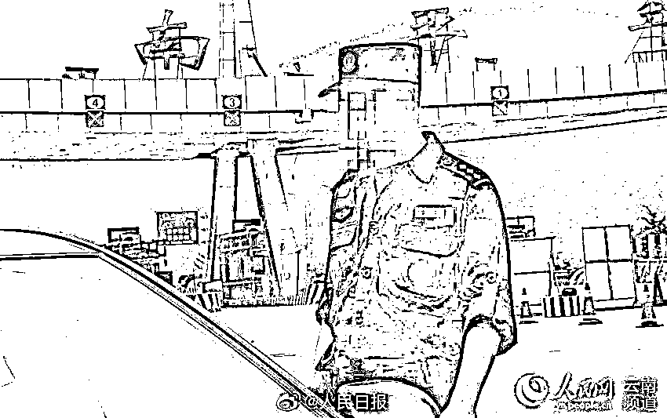**

****而一旦公布****

****往往是一张黑白照片……****

**当你在互联网上**

**清晰的看到一位缉毒警察的照片**

**就意味着他已经牺牲了……**

**更令人难过的是**

****很多牺牲的缉毒警**** 

****甚至连墓碑都没有****

**一位警察解释说:**

****“因为毒贩会跟随前去祭拜的亲友****

****进行报复****

****这是出于安全考虑……”****

**中国警察网**

**曾经发布的一篇文章里写到**

**一名跟毒贩斗争了几十年的警察**

**家人被毒贩报复**

**简直丧心病狂**

**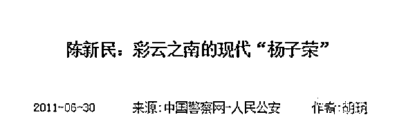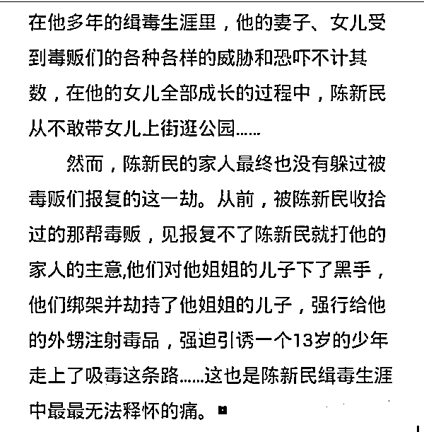**

**那些没有姓名**

**没有照片的缉毒警察**

****而今，他们的世界里****

****再也没有草莓、蓝天、音乐****

**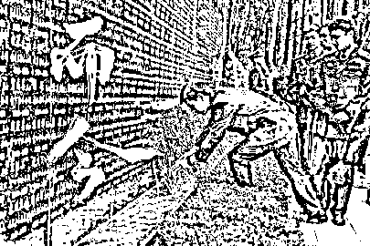**

**涉毒的艺人，他们可以戒毒** 

**可以去做其他的工作** 

**但作为公众人物**

****他们的吸毒行为不只是个人恶习****

****更会在传播中被放大****

****尤其会对青少年的防毒意识****

****产生负面影响****

**如果吸毒艺人可以复出**

****那些长眠地下的缉毒警察****

****该怎么“复出”呢？****

**对沾染毒品的公众人物说不**

**拒绝对毒品一切形式的美化和洗白！**

**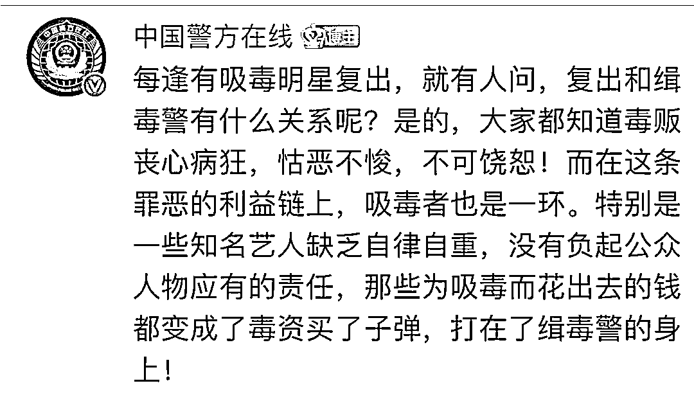**

**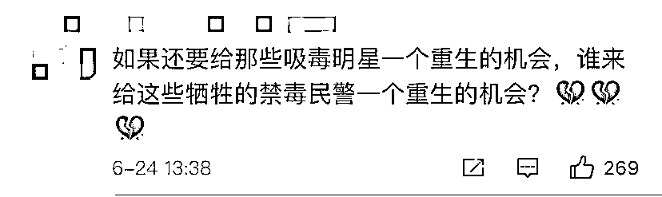**

**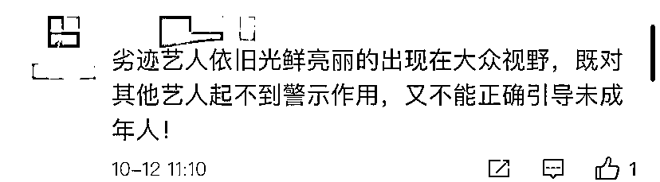**

**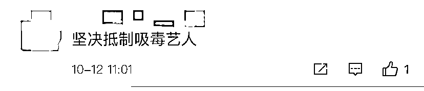**

**来源：澎湃新闻综合共青团中央、北京日报公号、中国网、人民日报、中国禁毒在线、中国新闻社公号、中新经纬、红星新闻、网友评论等**

****

**← 向右滑动与灰产圈互动交流 →**

****