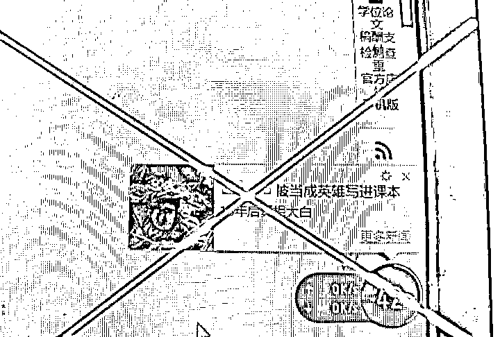
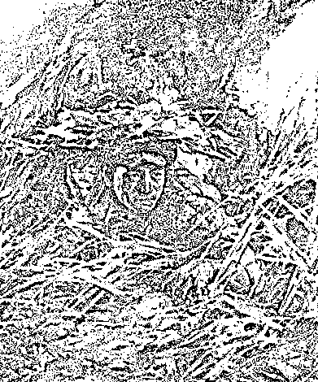
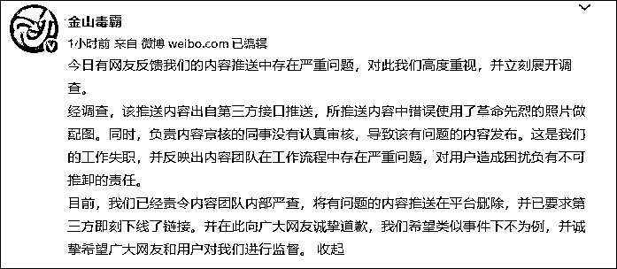

# 金山毒霸道歉

> 原文：[`mp.weixin.qq.com/s?__biz=MzIyMDYwMTk0Mw==&mid=2247522018&idx=5&sn=02be6560c415b1bd65ba1df47f9629cb&chksm=97cb5ddaa0bcd4cc2f226b90ca18659918b899403af8d0cf1003f8647d428af4653bb62eb627&scene=27#wechat_redirect`](http://mp.weixin.qq.com/s?__biz=MzIyMDYwMTk0Mw==&mid=2247522018&idx=5&sn=02be6560c415b1bd65ba1df47f9629cb&chksm=97cb5ddaa0bcd4cc2f226b90ca18659918b899403af8d0cf1003f8647d428af4653bb62eb627&scene=27#wechat_redirect)

推送《阴险小人被当成英雄写进课本》新闻，还用邱少云插画当配图？@金山毒霸 道歉：希望类似事件下不为例。

今天，有网友发现金山毒霸推送涉历史虚无主义新闻，还用革命先烈邱少云的插画当配图，令人愤慨。

69 年前的今天（1952 年 10 月 12 日），在抗美援朝的战场上，年仅 26 岁的邱少云任凭烈火焚身，始终未动，直至壮烈牺牲

刚刚，@金山毒霸 发微博回应称，**经调查，推送内容出自第三方，审核不严导致该内容发布，责令内容团队内部严查，向网友诚挚道歉，希望类似事件下不为例。** 

今日有网友反馈我们的内容推送中存在严重问题，对此我们高度重视，并立刻展开调查。

经调查，该推送内容出自第三方接口推送，所推送内容中错误使用了革命先烈的照片做配图。同时，负责内容审核的同事没有认真审核，导致该有问题的内容发布。这是我们的工作失职，并反映出内容团队在工作流程中存在严重问题，对用户造成困扰负有不可推卸的责任。

目前，我们已经责令内容团队内部严查，将有问题的内容推送在平台删除，并已要求第三方即刻下线了链接。并在此向广大网友诚挚道歉，我们希望类似事件下不为例，并诚挚希望广大网友和用户对我们进行监督。

来源：观察者网、@金山毒霸、央视网

← 向右滑动与灰产圈互动交流 →

