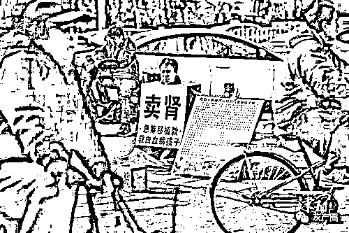

# 肾贩子 6 万 5 收肾转手卖 80 万 | 卧底调查交易链

> 原文：[`mp.weixin.qq.com/s?__biz=MzIyMDYwMTk0Mw==&mid=2247522018&idx=6&sn=b2e7cd9b813fb9d38084fe75824721a9&chksm=97cb5ddaa0bcd4cc145791bb9cb578b43098b335d9cca6a5ea3cbd28bc9d0bd2c57547d06492&scene=27#wechat_redirect`](http://mp.weixin.qq.com/s?__biz=MzIyMDYwMTk0Mw==&mid=2247522018&idx=6&sn=b2e7cd9b813fb9d38084fe75824721a9&chksm=97cb5ddaa0bcd4cc145791bb9cb578b43098b335d9cca6a5ea3cbd28bc9d0bd2c57547d06492&scene=27#wechat_redirect)

30 岁的内蒙小伙小张，因网络赌博欠债十几万。陷入绝境的他无意中进了一个定位为山东聊城的 QQ 群，群内有一套独特的暗语，意思就是买卖肾脏的各种中介消息。

小张想卖肾还债，对方很快安排他到郑州体检，体检配型一旦合格，小张的一个肾将以 6 万 5 千元，卖给肾贩子，最快 7 天就能拿到钱。

听着挺诱人，但小张出于恐惧最终没卖，记者根据小张反映的线索联系了肾贩子，当记者表明是换肾患者的家属，肾贩子表示换一个肾至少要 80 万。

小张恐怕没想到，自己想 6 万 5 卖出的肾，经过肾贩子倒手竟然价格暴涨十几倍，这嗜血的交易链条到底有多长多深？记者辗转郑州、北京、贵州、石家庄等多地卧底调查，揭开真相。

[`mp.weixin.qq.com/mp/readtemplate?t=pages/video_player_tmpl&action=mpvideo&auto=0&vid=wxv_2087365440745324546`](https://mp.weixin.qq.com/mp/readtemplate?t=pages/video_player_tmpl&action=mpvideo&auto=0&vid=wxv_2087365440745324546)

来源：澎湃新闻

← 向右滑动与灰产圈互动交流 →

