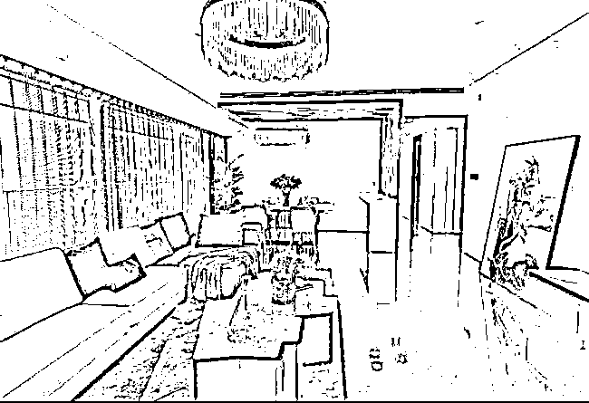
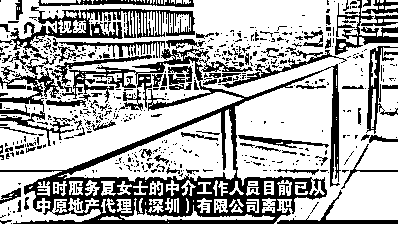

# 花 4000 多万买深圳豪宅，被中介赚 250 万差价？涉事公司回应

> 原文：[`mp.weixin.qq.com/s?__biz=MzIyMDYwMTk0Mw==&mid=2247522080&idx=1&sn=395ba4e910b6cbf80f45235909dacd99&chksm=97cb5c18a0bcd50e977a48697ef2b5afdf22259e24604ba881d5af6727ab3dd0fd934ea64aad&scene=27#wechat_redirect`](http://mp.weixin.qq.com/s?__biz=MzIyMDYwMTk0Mw==&mid=2247522080&idx=1&sn=395ba4e910b6cbf80f45235909dacd99&chksm=97cb5c18a0bcd50e977a48697ef2b5afdf22259e24604ba881d5af6727ab3dd0fd934ea64aad&scene=27#wechat_redirect)

无论是买房还是卖房，中介往往是绕不开的一环。由于并非买卖双方直接对接，在交易过程中，可能会遇到一些问题。

最近，深圳一女子就遇到了困扰。她质疑花四千多万元购房，被中介吃差价 250 万。

图片来源：南方都市报 

今天（10 月 13 日），涉事公司深圳中原地产回应称，中原向买方收取佣金 33.2 万元，卖方未支付任何佣金。此外，中原在调查后了解到，**卖方为卖房同时也与“深圳市深安房地产代理有限公司”签署了《房产销售策划服务合同》，深安地产收取其 250 万元服务费用。**深安地产公司本身与中原无任何关系，也从未和中原有任何业务往来。

**4000 多万豪宅疑被中介吃差价 250 万******

****深圳湾 1 号是深圳的“网红”楼盘，夏女士通过中原地产购置了这里的房产。****

****“前房东说这套房本来挂牌价 3800 万元，最后中介给我协商的价格是 4150 万元，相差的费用很有可能被中介赚了。”夏女士告知，她在 2020 年 12 月上旬，联系了中原地产工作人员，告知有购房意愿，“我说预算在 6000 万以内，中介带我去看了一套深圳湾的房子，并告知我价格是 5000 万元。”夏女士回忆称，经多次协调后，中介工作人员帮她争取为 4150 万元的成交价格，并支付 33.2 万元的中介佣金费用，于 2021 年 1 月办理了相关手续。****

********

****图片来源：星视频截图****

****夏女士认为中介造成买卖双方的信息差。****

****2 月 7 日，夏女士拿到了房子钥匙，在电梯里，小区物业管家及邻居问及买房价格时，均称该套房产挂牌价 3800 万元，夏女士购房价格高于挂牌价。夏女士从前业主处了解到，该套房产的售卖价格为 3900 万元，其中产生的差价不知被谁收取。****

********

********

****图片来源：南方都市报视频截图****

****“邻居告诉我成交价格过高了，我才发现当时中原地产在网页上的报价是 4500 万元，随后我去询问前业主，**前业主说挂的 3800 万元，但最终实际收了 3900 万元，有 250 万元的费用由中介收取。**”夏女士表示，她质疑中介人员除了拿中介费外，还暗地里吃差价。****

****据海报新闻，夏女士表示，后来自己才知道，前业主与另一家地产公司签了协议，购房当天，对方来的六七个人中，就有另一家地产公司人员在场。**“我和中原地产签协议买房，为什么需要另一家地产公司到场，这其中的猫腻不得而知。”******

****10 月 12 日，当事人夏女士在社交平台上“披露”了更多细节，称在交易过程中还存在第三方中介“深安房地产代理公司”。****

********

****业内人士透露，在过去房产中介“吃差价”现象屡见不鲜，由于交易过程不透明，房产交易双方地位不均等，掌握双方信息的中介存在吃差价牟利现象。就在今年 8 月，Q 房网就因“吃差价”、违规代理查封房等违规行为被深圳市房地产中介协会通报批评。****

****中原地产、行业协会回应************

******公开资料显示，中原地产代理（深圳）有限公司成立于 1997 年，源于香港，属于中原集团，是深圳规模较大的专业地产代理公司，为客户提供住宅、写字楼、商铺、厂房租售经纪服务以及按揭，评估等服务。******

******13 日，中原地产官方微信发布声明称，其对此事进行了调查核实，调查结果情况如下：******

*   ******1、卖方（原业主）于 2020 年 9 月 13 日与中原签署《二手房委托合同》，委托放盘价为 4300 万元。******

*   ******2、买方、卖方、中原三方于 2021 年 1 月 23 日签署《二手房买卖及居间服务合同》，合同中约定此物业最终转让价格为 4150 万元。******

*   ******3、本次交易买方为一次性付款，**交易总金额 4150 万元由卖方直接收取。********

*   ******4、此次物业交易中，依据和买方所签的《佣金承诺书》，**中原向买方收取佣金 33.2 万元，卖方未支付任何佣金。********

*   ******5、中原作为本次交易的中介机构，尽职完成了此次交易，帮助卖方按照合同约定成交价收到了卖房款 4150 万元，帮助买方完成了房产过户手续并顺利收房。完成交易后，中原收取中介服务费 33.2 万元。******

*   ******6、后续买方投诉吃差价问题，中原尽能力调查了解到：**卖方为卖房同时也与“深圳市深安房地产代理有限公司”签署了《房产销售策划服务合同》，深安地产收取其 250 万元服务费用。**深安地产法人为“左青”，工商注册经营范围是房地产经纪与房地产营销策划。但深安地产公司本身与中原无任何关系，也从未和中原有任何业务往来。******

************

******来源：深圳中原地产微信****** 

******2020 年 9 月 3 日，深圳市房地产中介协会发布了《关于实施“佣金透明化”要求的通知》。其中，明确要求房地产中介机构提供中介服务，应就服务项目、计费依据与标准及各方应付佣金及其税费分担等，明确告知交易双方，不得“背靠背”，刻意隐瞒牟取不正当利益，或与一方当事人串通，损害另一方当事人利益。如违反相关规定，将计入机构不良行为，并抄送各征信合作单位。******

******据海报新闻，10 月 12 日，深圳市房地产中介协会一工作人员表示，目前协会已经受理相关投诉，调查完毕，近期将对外发布情况说明。“我们是行业自律组织，受理投诉后，根据证据进行调查，开会审议，视情况对中介公司进行自律惩戒。特殊的案情，将会同有关部门进行处理。”******

******据南方都市报报道，夏女士在质疑买房被中介赚取差价后，通过深圳市房地产中介协会 APP 进行投诉。近日，深圳市房地产中介协会回复，深圳市深安房地产代表有限公司违反“佣金透明化”要求，在保底代理销售过程中未明确佣金标准。触犯《深圳市房地产中介行业从业规范》中介机构不良行为清单 C 类第 26 条：其他经自律专业委员会审定为 C 类不良行为的。**违规行为记入星级评价平台，抄送相关征信机构。********

******有律师表示，**深圳市深安房地产代理有限公司与前业主签订的合同有中介性质。**根据国家《关于房地产中介服务收费的通知》，房地产中介服务收费实行明码标价制度，最高不超过成交价格的 3％。夏女士可收集相关证据后，向法院提起诉讼，依法维权。******

******来源：每日经济新闻（ID：nbdnews）综合南方都市报、海报新闻、深圳中原地产微信****** 

************

******← 向右滑动与灰产圈互动交流 →******

************