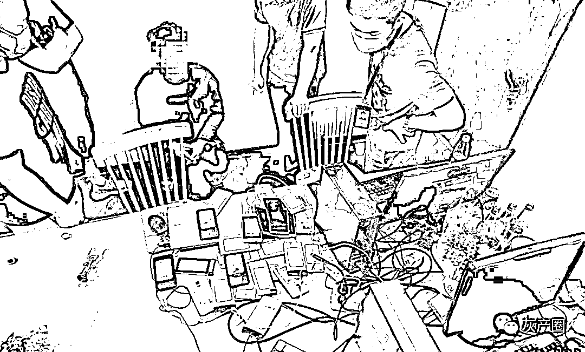

# 公司组织团建，结果变成“团灭”

> 原文：[`mp.weixin.qq.com/s?__biz=MzIyMDYwMTk0Mw==&mid=2247522080&idx=2&sn=869a9bd5fd19f4a4f0fd232c77541432&chksm=97cb5c18a0bcd50e9e5309ec7c385bd19ed657a922181aa1d860e23204ca8a712a2794ad0391&scene=27#wechat_redirect`](http://mp.weixin.qq.com/s?__biz=MzIyMDYwMTk0Mw==&mid=2247522080&idx=2&sn=869a9bd5fd19f4a4f0fd232c77541432&chksm=97cb5c18a0bcd50e9e5309ec7c385bd19ed657a922181aa1d860e23204ca8a712a2794ad0391&scene=27#wechat_redirect)

中秋节前夕 

公司组织全体员工到一个岛上团建

谁能想到

团建变“团灭”……

近日，江苏南京建邺警方将一个非法买卖公民个人信息、非法出租游戏账号的犯罪团伙一网打尽，并接连捣毁另外两个犯罪团伙，涉案人数达 40 多人。 

团伙组织架构清晰

非法出租游戏账号获利

日前，南京市公安局网安支队驻建邺分局大队民警在工作中发现，有的网店对外出租经过实名认证的网络游戏账号，而且业务繁忙，这引起了民警的注意。

“这些账号都是实名认证过的，里面的公民个人信息是哪里来的？国家出台了关于未成年人网络游戏防沉迷的规定，目的就是坚决防止未成年人沉迷网络游戏，切实保护未成年人身心健康。出租这样的账号，等于是变相绕开了有关部门的监管，不利于未成年人的身心健康，涉嫌犯罪。”办案民警说。

警方对此进行了调查，发现扬州的一家公司运营了四家网店，业务主要是对外出租游戏账号。

对于游戏玩家来说，要登录游戏平台，需要进行实名验证，需要输入姓名、身份证号，还要进行动态头像验证。

如果不使用玩家本人的身份信息，如何通过动态头像验证呢？民警告诉记者，犯罪团伙首先通过非法渠道购买大量公民个人信息，接着通过非正规渠道收集游戏账号，将账号与买来的信息进行绑定，使用配套的手机和软件制作动态头像，之后将账号对外出租。游戏玩家从其手中购买一定时长的服务后，可利用犯罪团伙提供的信息顺利登录游戏平台，并通过动态头像验证。

“每小时的租用价格是 5 到 10 元，看上去不多，但每天 24 小时，租出几百上千个账号，加起来的数字就不算小了。”民警说。

 “扬州的这家公司‘业务’很繁忙，除了老板和老板娘，还有四五名技术人员和 10 多名客服。技术人员负责技术方面的维护，客服则负责接单、出租账号、后续服务等工作。有时单靠公司的人忙不过来，他们还会把制作动态头像的‘业务’在网上发包，如在某些群里发单，由愿意干这种事的网友接单干活。”民警表示。 

犯罪团伙中秋节前集体出游

团建变“团灭”

根据调查的情况，9 月 16 日，南京建邺警方组织警力，到扬州对该团伙实施抓捕。让民警意外的是，该公司明明在网上正常开展“业务”，但公司里却没有人。

民警进一步调查发现，该公司全体员工已经到了太湖的一个岛上。警方循线追踪，最终在岛上一个民宿酒店将该团伙一网打尽。

“当时该团伙 10 多个人正在大厅里打牌娱乐。他们被抓后交代，之所以到太湖来，是‘中秋节前搞团建’。”办案民警说。

该团伙成员被抓时，大都在休闲娱乐，但仍有一名男子在埋头“工作”，面前有电脑，桌上还有二三十部手机。即使在搞“团建”，他们的“业务”也没有停止。

“团建成了‘团灭’，抓捕过程很顺利！”办案民警告诉记者，破获该犯罪团伙后，民警发现，团伙头目黄某的电脑中存储了几万条公民个人信息，现场有数十部改造过后的手机。

据团伙成员交代，他们从事这种不法业务已经好几年了，每年的利润可达百万元。通过线索，民警抓获了专门卖这种手机的上家。

“该团伙涉嫌两种罪名，一是侵犯公民个人信息罪；二是提供侵入、非法控制计算机信息系统程序、工具罪。他们买来公民个人信息，自己用过后，还会出售给他人获利。”办案民警说。

在破获了扬州这个犯罪团伙后，警方继续扩大战果，捣毁了另外两个犯罪团伙。

目前，涉案的 40 多人中，10 人已被南京建邺警方采取刑事强制措施，该案正在进一步调查深挖中。

来源 ：江苏新闻、人民日报

← 向右滑动与灰产圈互动交流 →

