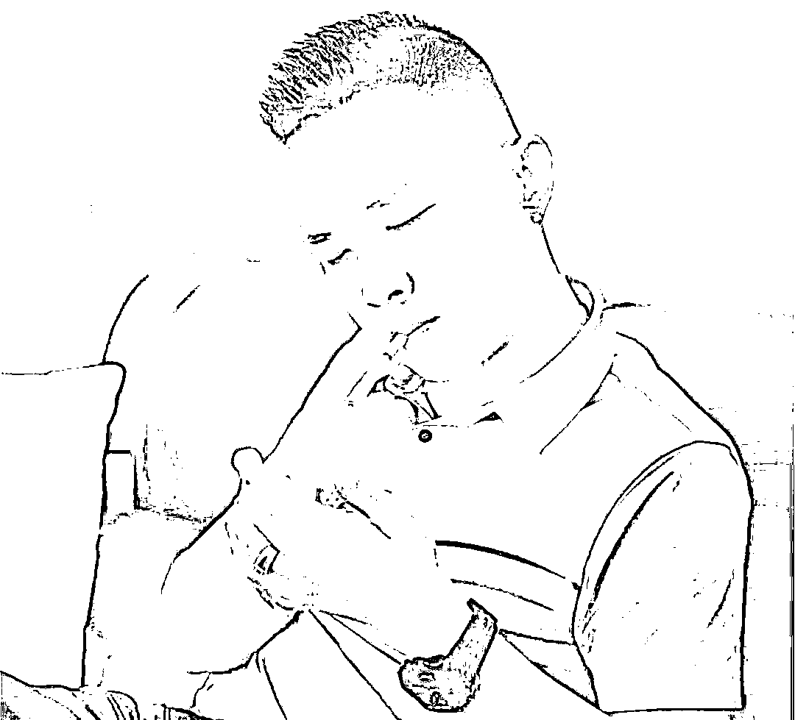
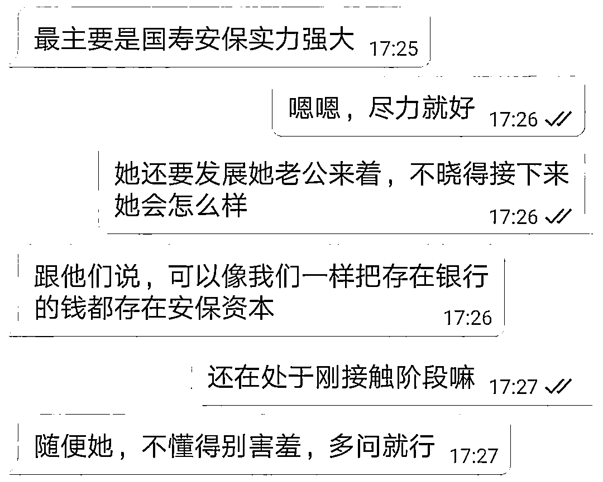
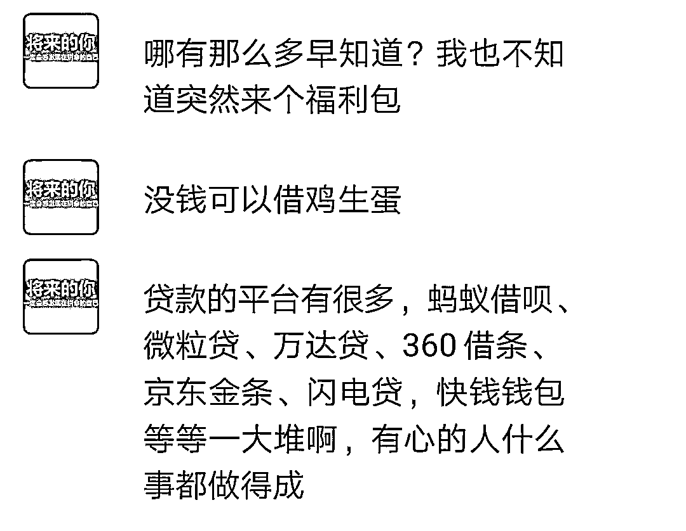
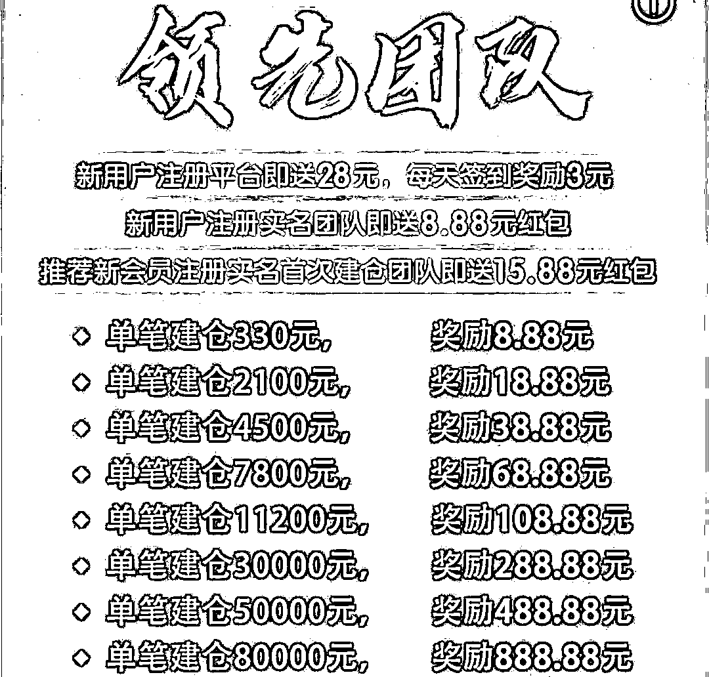

# 女子深陷“杀猪盘”骗局，拉拢亲友一起投资，最后...

> 原文：[`mp.weixin.qq.com/s?__biz=MzIyMDYwMTk0Mw==&mid=2247522080&idx=4&sn=daf8272745da723f899e774023bf9e0a&chksm=97cb5c18a0bcd50e726fa76039fa88aca16766813a3deb77957f93e962b53eb62c526828c326&scene=27#wechat_redirect`](http://mp.weixin.qq.com/s?__biz=MzIyMDYwMTk0Mw==&mid=2247522080&idx=4&sn=daf8272745da723f899e774023bf9e0a&chksm=97cb5c18a0bcd50e726fa76039fa88aca16766813a3deb77957f93e962b53eb62c526828c326&scene=27#wechat_redirect)

今年 9 月 20 日，舟山某单位职员小李（化名）想要从男友小南（化名）推荐的投资平台账户上提现时，却发现无论怎么操作，系统都显示“操作失败”。

小李疑惑不已，心中的不安也越来越大，然而“离奇”的是，**那个细心、体贴的男友小南也是在此时消失不见。**

(网络男友“小南”照片)

**而当小李赶到派出所报案时，发现自己除了能在网上联系小南，其余几乎一无所知。**

**0****1**

三个月前，小李在**“SOUL”**交友平台上与小南相识，小南自称是某投资公司高管，通过短暂的交流，小李觉得小南风趣幽默，又成熟稳重，见对方对自己感兴趣，于是便同意了添加微信，开始进一步的沟通交流。

小南在添加了小李的微信后，便对其万般体贴，嘘寒问暖，每天都分享自己的日常，逐渐获取了小李的信任。

（打造“霸总”人设，博取被害人信任）

都说恋爱中的女人智商为零，小李也是如此，认为小南是自己的真命天子，**因此当小南让小李下载“安保资本”投资 APP 时，小李也是照做不误。**

**0****2**

小李一开始也很谨慎，投资的都是小金额的短期理财，但是就如小南所说的那样，小李看到自己在几天内盈利了 2000 余元，欲望也就被逐渐放大了。

（怂恿被害人网络贷款进行投资）

在真爱和金钱的诱惑下，小李深陷泥潭，东拼西凑，开始在平台上投入大笔资金。**期间小李甚至在小南的怂恿下，开始发展自己的亲朋好友做下线。**

（虚假投资平台广告）

直到 9 月 20 日，小李存款耗尽，投资平台账户上空有 200 万的数额却无法提现，“男友”叶消失无影，她这才醒悟，深感自己被骗从而报警。

**最后，小李发现自己往该投资平台一共投资了 70 余万元，期间只成功提现 17000 元，而其亲朋好友一共损失了 80 万余元。**

警方提醒：

1、 网络交友需谨慎，特别是对那些没见过的人，尤其在涉及金钱往来时，一定要提高警惕，并与身边亲朋好友多沟通、多询问，防止落入“圈套”。

2、 对于引导在网上玩彩票、投资、理财之类，先给尝甜头再引导继续投入的，必是骗子无疑。

3、**“天上不会掉馅饼”，所谓“低成本、高回报”往往都是骗人的幌子，**一定不要贪图利益，赚钱还是要脚踏实地。

来源：洛阳市反诈骗中心，阻击诈骗

← 向右滑动与灰产圈互动交流 →

