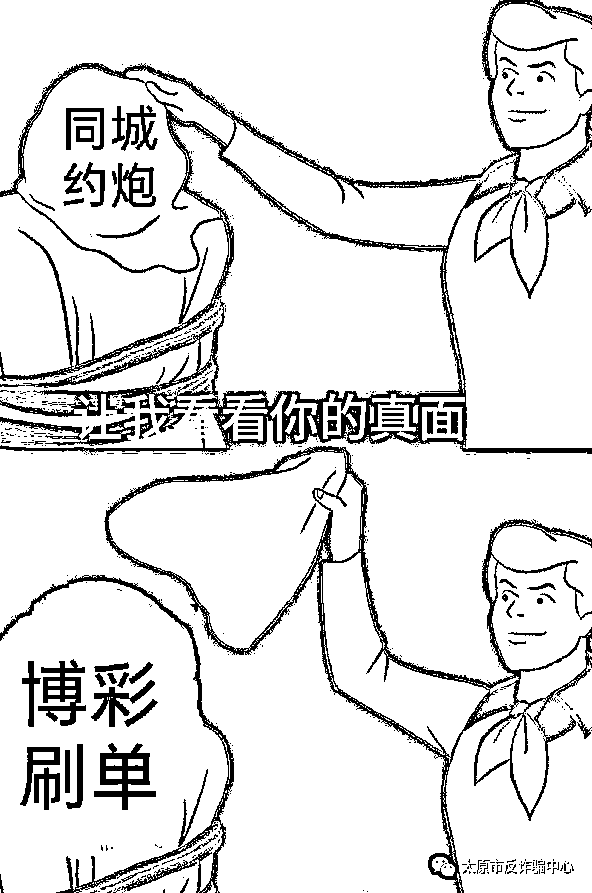

# 当代大学生的致命“毒药”——桃色陷阱

> 原文：[`mp.weixin.qq.com/s?__biz=MzIyMDYwMTk0Mw==&mid=2247522080&idx=6&sn=7e1b47efe3d81790ae69837618df147c&chksm=97cb5c18a0bcd50e0e730f3f8c4bfaaceb2af9c9fd77c0de6a0573e251c18dc8bbd97aea39ae&scene=27#wechat_redirect`](http://mp.weixin.qq.com/s?__biz=MzIyMDYwMTk0Mw==&mid=2247522080&idx=6&sn=7e1b47efe3d81790ae69837618df147c&chksm=97cb5c18a0bcd50e0e730f3f8c4bfaaceb2af9c9fd77c0de6a0573e251c18dc8bbd97aea39ae&scene=27#wechat_redirect)

抚慰你寂寞的心灵 

不再夜夜孤单

进入你和他的私密约会

当你夜深人静掏出手机

面对这些挑逗的文字和美女图片

你的内心是否已开始荡漾？

**想要马上见到美女的真容？**

**别急**

**做完任务才能获得约炮信息！**

**近期我市发生多起大学生在黄色网站或者 QQ,微信上裸聊，或者点击链接下载所谓的约炮/网络嫖娼 APP 之后被骗的案件。该 APP 上会有所谓的客服询问你需要什么样妹子和套餐，当受害人做出选择后又会让受害人加一个所谓的派单员，接下来就开始刷单诈骗。**

**真实案例：**

8 月 13 日，放假在家的小王正在上网，此时一个昵称为“诱惑”的 QQ 主动添加他好友，双方闲聊了几句之后，气氛就开始逐渐暧昧起来。对方自称是平台女主播，漫漫长夜，想找个男人“互诉衷肠”。她先是发给了小王一个直播 APP 的链接，小王下载打开后，发现该 APP 要求开通其手机各项权限。小王并未犹豫，直接点了确认。接下来在对方的“盛情邀约”下二人赤裸相见，但“美好”的时光总是短暂的，才聊了两三分钟，对方便挂断了视频，还发来一段刚才的视频威胁小王转好处费，否则就要转发给小王的家人、同学。其迫于压力陆续向对方指定账户转账 6 笔共计 3.8 万元人民币。

突如其来的好友验证

内心加速狂奔

“她”就这样来了

面对“陌生美女”de“盛情邀请”

他竟然卸下了一切防备

可是怎想事情后来的发展

竟然会变成这样

大学生群体，因抵制不良诱惑的能力弱从而落入圈套，绝大多数的社会经验少，也不会选择报警，自然就成了诈骗分子的“重点照顾”对象。

**骗****真实案例：**

10 月 9 日，小伟在中北大学宿舍上网时，通过“陌陌”APP 添加了一个陌生 QQ 号码，并在对方的指导下安装了“约爱”APP，之后该 APP 内一个昵称为“约爱接待——珊珊”的客服称：需做三单返利任务才有约炮资格。随后小伟通过微信扫描对方提供的二维码向对方转账 38 元，之后其收到返利 42 元；之后采用相同的方式再次转账 586 元，收到返利 1233 元。可第三次给对方转账成功后，对方却称其做错任务不能退款，于是小伟为了拿到“资格”只能选择再次向对方转账 11940 元、3000 元、9341 元、9341 元、12113 元，均未获得返利，之后对方让其再次转账时，小伟才意识到被骗。

这些软件发布的地方特别多，**漂流瓶、QQ 群、聊天软件、色情网站平台**这些上面全都有！俗话说得好，常在河边走，哪有不湿鞋。总有人蠢蠢欲动，打算探一探妖精洞。

而且会和你说的很诱人，譬如**良家妇女、上门服务不要钱、不玩仙人跳、永久提供资源**等等。狡辩说他们只是平台，需要流量。

“这都不叫优惠，简直女菩萨显灵啊。88 能干啥？哪怕就是给我分个坦克，我都想试试。”可当你入了会，套路才刚刚开始。

先让你刷两单，赚几十，一百的，随后你会发现你充值的钱根本提现不了，提现需要继续充钱交手续费或者以继续刷单才能返现为由，让你继续充钱，没钱充，就让你到各种借贷软件去借钱，直到你意识到被诈骗为止。

**真实案例：**

10 月 6 日，小刘在财经大学南校区学生宿舍内玩手机时看到一个黄色网站的广告，其点击并按照提示下载了一款“约宝”APP，在该 APP 上客服告知小刘只需要完成软件提供的刷单任务便可获得返利，并取得免费约炮的机会。可当小刘进入页面后却发现这是一个类似于博彩的网站，所谓的刷单任务也是去押大小、单双。可是此时已经“精虫上脑”的他已经顾不得了，先后下注了两次，可没成想居然都挣到钱了。小刘乐坏了，约炮还能赚钱？理所当然的又按照对方指引继续下注，等待提现的小刘没有想到，对方以自己是违规操作为由，让他继续充钱，最后对方称需要交税再次让其转账。小刘给对方账户转账共计 6 次，损失 6109 元后终于意识到自己掉进了骗子的陷阱，立刻报了警。

一样的配方，一样的套路！

披着同城约炮面具的**博彩刷单**诈骗！

**色字头上一把刀，千万别相信什么“约炮神器”，不管是裸聊，还是上门服务都是假的，都是骗子！洁身自好，不要随意点击陌生人发来的链接、下载非正规的 APP，更不要在网上刷单、赌博。**

来源：太原市反诈骗中心，阻击诈骗

← 向右滑动与灰产圈互动交流 →

