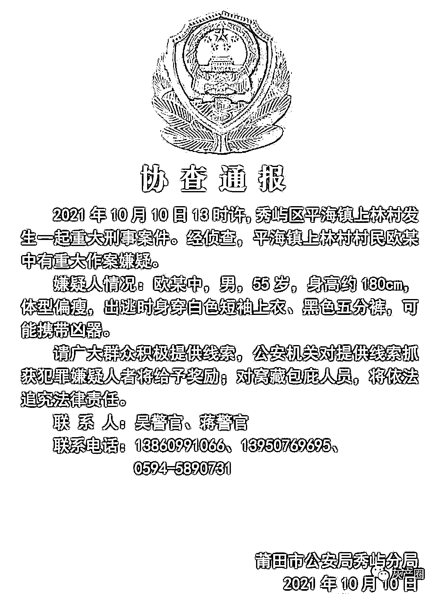

# “见活的奖 2 万，见死的奖 5 万”，莆田悬赏杀人嫌犯引争议，被网友举报了！

> 原文：[`mp.weixin.qq.com/s?__biz=MzIyMDYwMTk0Mw==&mid=2247522151&idx=1&sn=0a954548501e1d888a0605cfba210448&chksm=97cb5c5fa0bcd5490c8912294ed51be412663fb3ddf0a7f641fd375bc824e722a9be5a04d9c5&scene=27#wechat_redirect`](http://mp.weixin.qq.com/s?__biz=MzIyMDYwMTk0Mw==&mid=2247522151&idx=1&sn=0a954548501e1d888a0605cfba210448&chksm=97cb5c5fa0bcd5490c8912294ed51be412663fb3ddf0a7f641fd375bc824e722a9be5a04d9c5&scene=27#wechat_redirect)

福建莆田的一村民欧某中杀人在逃，因纠纷致邻居一家 2 死 3 伤，被害人为一家祖孙四代，伤者包括一名儿童，受到网上舆论的热议。
事发前，两家人曾多次发生矛盾，主要聚焦在欧某中旧房翻新问题上。

[`v.qq.com/iframe/preview.html?width=500&height=375&auto=0&vid=b3301dpzdge`](https://v.qq.com/iframe/preview.html?width=500&height=375&auto=0&vid=b3301dpzdge)

网上集纳了欧某中之前发的求助网帖，他在那些求助信息中表示自己翻盖房屋受到“村霸”的阻挠，长期上访求助无门。另外接受媒体采访的村民说，欧某中“为人和善”，多年前还跳海救过人，这些信息引起很多人对欧某中的同情，并且对其所在村镇基层组织“不作为”强烈不满。与此同时，网友还发现，福建莆田秀屿区平海镇政府官方微信，就此案发布悬赏通告称，有发现犯罪嫌疑人欧某中线索的一次性奖励 2 万，有发现欧某中尸体的奖励 5 万，引发网络争议。看到刑案的悬赏通告，一般大家的感受是提高警惕，同仇敌忾，期待早日破案。但这份悬赏通告的措辞和行文，让很多网友感到迷惑不已，有些脊背发凉。网友选择了举报。@环球时报认为：这些可以说来自于人们同情弱者的天性，还有对一些政府机构官僚主义和不作为的厌恶。

现在不清楚那家被杀的邻里是否就是欧某中在求助网帖里说的“村霸”，但无论如何，那家人有不遭杀戮之灾的权利。更何况即使那家的主人与欧某中形成了过节，那家的其他成员也是无辜的，尤其是那个 10 岁的孩子。**在今天的中国决不应存在为欧某中这样行凶杀人进行辩解的道义，他的杀人行为被全社会谴责应当是无条件的。**

来源：微博那些事儿

← 向右滑动与灰产圈互动交流 →

