# 上海长宁独居女孩遭杀害被藏行李箱后抛尸，更多案发细节曝光！

> 原文：[`mp.weixin.qq.com/s?__biz=MzIyMDYwMTk0Mw==&mid=2247522151&idx=2&sn=364eb155357352357faeaa8d40bd8c84&chksm=97cb5c5fa0bcd5497504ba7dc0090288d24abe7f7bbe203b3724bc00cdf020d271e3b5008886&scene=27#wechat_redirect`](http://mp.weixin.qq.com/s?__biz=MzIyMDYwMTk0Mw==&mid=2247522151&idx=2&sn=364eb155357352357faeaa8d40bd8c84&chksm=97cb5c5fa0bcd5497504ba7dc0090288d24abe7f7bbe203b3724bc00cdf020d271e3b5008886&scene=27#wechat_redirect)

近日，“**上海长宁独居女子遭杀害后被藏尸行李箱**”

消息在网上流传

该视频号不可引用<mpvideosnap class="js_uneditable custom_select_card channels_iframe" data-pluginname="videosnap" data-id="export/UzFfAgtgekIEAQAAAAAAJJY1dWMhbgAAAAstQy6ubaLX4KHWvLEZgBPE04IMKUMBBvr9zNPgMIvFM-SXhOO9P8zYsAzvVB4X" data-url="https://findermp.video.qq.com/251/20350/stodownload?encfilekey=XGocBFxVWK5dcyOOqpEU47RpBHQIvlhnZE4BSNiaOibNAicKpicvqK0NdibMNRz7JQutH6ZpngEhD6J7v46O3O89mMBic9jUkJLXubqvQD6bRe7ia0eAl30TQ7pWboOMd5TZ4AGBh5vywcmbEeuicRWWptEXNtrxHBTiaO1CiaBGRPrTj4LDnzVR4941ys2w&amp;adaptivelytrans=0&amp;bizid=1023&amp;dotrans=0&amp;hy=SH&amp;idx=1&amp;m=f5b0ab2b3678fa7bd4d0f8228f6470dd&amp;token=AxricY7RBHdUTGeNIceVNzAA5HkqQhmUVyDcz5KtwbQm11fC2F4PnZdzGyvHsqgtYvjX1rX2HcU8" data-headimgurl="http://wx.qlogo.cn/finderhead/PiajxSqBRaEISAKibugHhUQs74zK9sdqn9QvawbxCzU7AuxCgU4kpS0A/0" data-username="v2_060000231003b20faec8cae18b1bcad5cb00e937b0779ef044c516b0481d185bbca60dd9c21f@finder" data-nickname="灰产圈" data-desc="【#被装行李箱抛尸女子系 28 岁海归# 凶手住处可轻松偷窥其房间】#上海抛尸凶手疑多次敲女孩房门#近日，一则“上海长宁独居女子遭杀害后被藏尸行李箱”的消息在网上流传。10 月 13 日，警方回应称，嫌疑人已被抓获，案件正在调查中。10 月 13 日下午，极目新闻记者来到事发地上海市幸福小区。据小区居民介绍，被害女孩 1993 年出生，重庆人，国外留学回来，已经有了上海户口，是新上海人。女孩和犯罪嫌疑人住相邻楼栋，且都在顶楼，犯罪嫌疑人可通过楼顶阳台看到被害女孩。据小区居民了解，犯罪嫌疑人疑似从楼上阳台，通过窗户看到对面女孩，在 11 日早晨，趁女孩上班之前，进屋将其杀害，她听闻此前该男子就多次敲女孩房门，但女孩并未开门。另据住犯罪嫌疑人楼下居民介绍，事发前一晚深夜，他曾见到犯罪嫌疑人时而坐在楼道间，时而在小区“游荡”。@灰产圈 " data-nonceid="8026861293953499094" data-type="video"></mpvideosnap>

**吃瓜群**里网友曝出的聊天记录及视频显示

一男子在事发小区内拖着大号行李箱

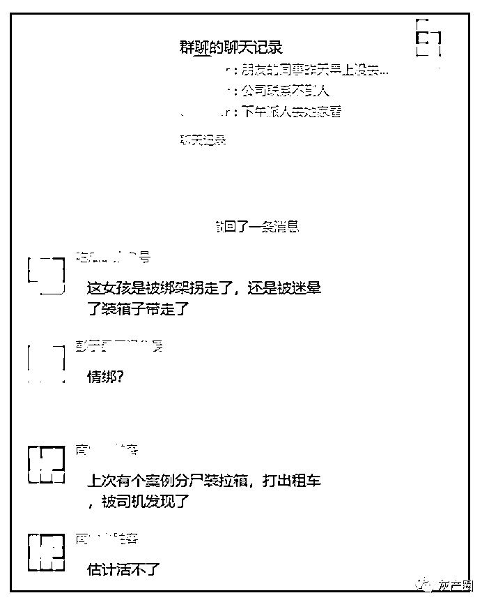

有网友怀疑女孩就是被装在行李箱内运走的

10 月 12 日，又有知情网友称

该女子已经被抛尸无锡

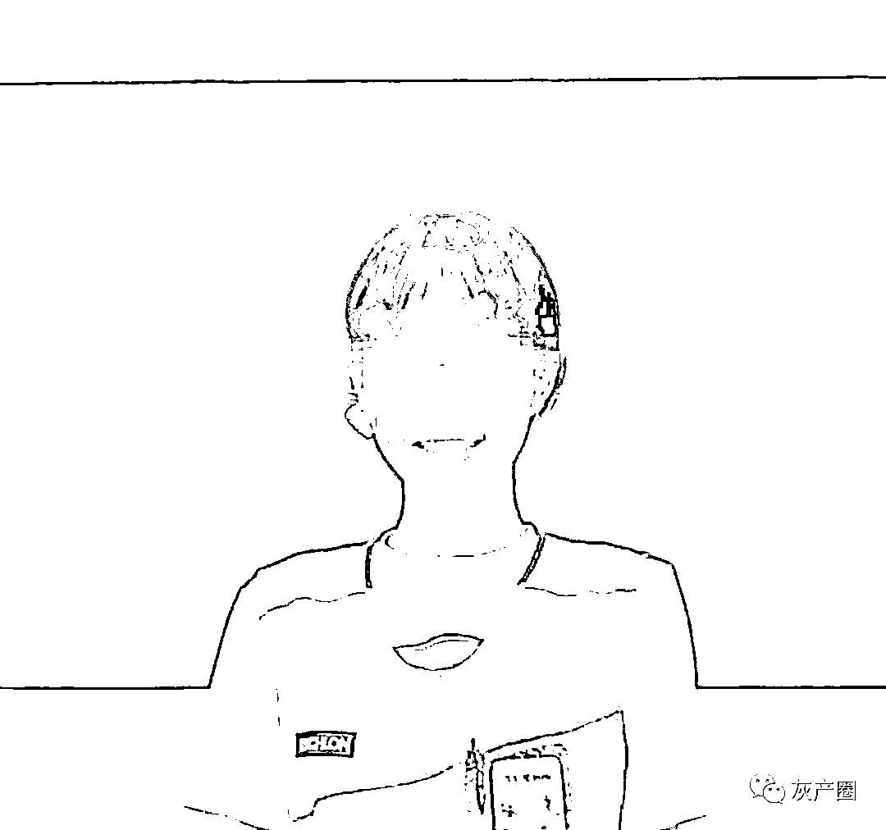

网传受害者

网友曝出的聊天记录显示，案发地位于上海市长宁区某小区。有知情网友表示，事发前由于被害女生未去上班，公司联系不到人，遂安排人员去其家中查看，才发现情况不对劲。

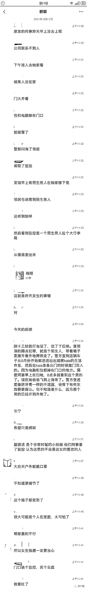

据网传信息显示，女子系独居在该小区内，她在工作群发布消息后失联。该女子同事称在被害人住处发现门口散落电脑及背包。有邻居听到女子的尖叫声。

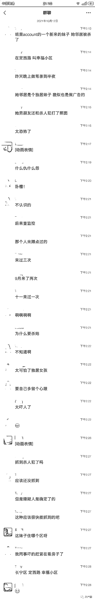

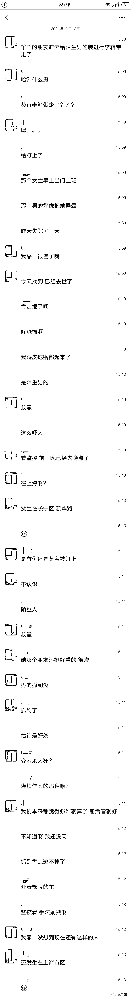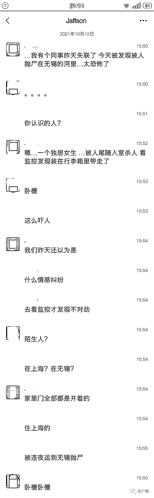

该网友曝出的一段视频显示，10 月 11 日下午 1 时许，一名戴口罩、身穿白色上衣的男子，将一个大号行李箱抱出楼栋，随后男子拖着行李箱走出监控范围外。

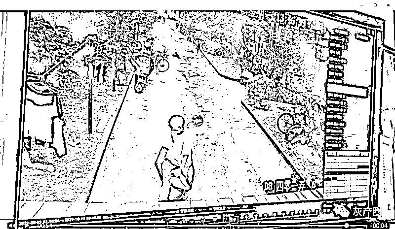

10 月 13 日下午，上海警方已于案发 10 小时后抓获犯罪嫌疑人，受害人已死亡，案件正在进一步侦办中。

据上海市长宁区幸福小区居民介绍，11 日案发后，被害女孩公司同事过来查看情况。他们从被害女孩同事口中得知，女孩 1993 年出生，重庆人，国外留学回来，已经有了上海户口，是新上海人，女孩和犯罪嫌疑人住相邻楼栋，且都在顶楼，犯罪嫌疑人可通过楼顶阳台看到被害女孩。

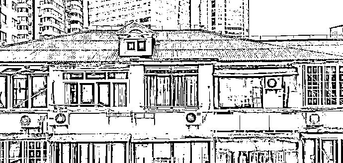

凶手所住楼层阳台可看到被害女子所住房间

据与被害女孩住同楼层的居民介绍，11 日上午，她亲眼见到犯罪嫌疑人拉着行李箱在二楼歇息，满脸通红，手中拿着毛巾。另据住犯罪嫌疑人楼下居民介绍，事发前一晚深夜，他曾见到犯罪嫌疑人时而坐在楼道间，时而在小区“游荡”。

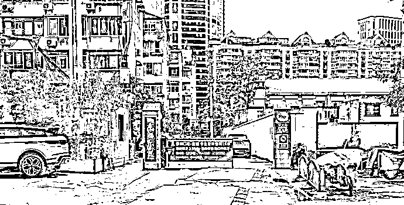

上海女子被藏行李箱遇害地小区

小区居民称，当天天气并不热，但该男子拿着毛巾擦汗，她当时并未起疑心，楼道间也未见血迹。陆女士说，该小区建成已有三十多年，从未发生过类似事故。事后她才从新闻上得知，男子行李箱中竟然装着人，想起来就后怕。陆女士回忆，犯罪嫌疑人身形较瘦，下楼后左转出了小区。

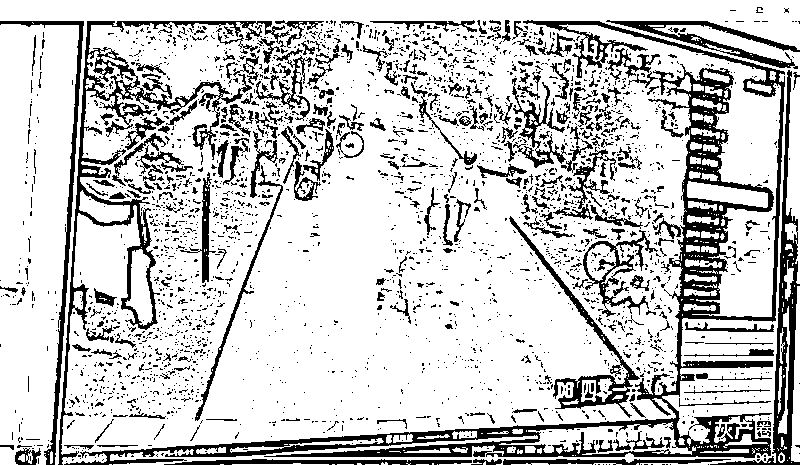

据小区居民介绍，犯罪嫌疑人和被害女孩住在两栋楼，都位于六楼，两楼道间不足 10 米距离。两栋楼格局相似，从犯罪嫌疑人所住房屋阳台处，正好可看到被害女孩房间的窗户，如果女孩所住房间窗帘未拉，可轻易通过窗户可以轻松偷看到房内的场景。

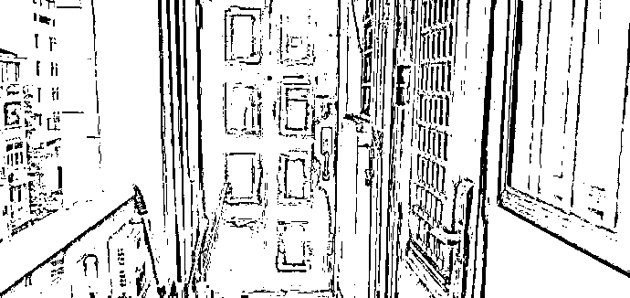

被害女子所住房间门口

住在犯罪嫌疑人旁边的蔡女士称，平时几乎不出门，极少与住旁边的嫌疑男子碰面，事发后的几天有民警过来调查。

居民陆女士称，她曾见过女孩，女孩个子小巧，比较时髦。据她们了解，犯罪嫌疑人疑似从楼上阳台，通过窗户看到对面女孩，在 11 日早晨，趁女孩上班之前，进屋将其杀害，她听闻此前该男子就多次敲女孩房门，但女孩并未开门。

住在犯罪嫌疑人楼下的陈先生说，他和犯罪嫌疑人有多次碰面，印象中，该男子身形较瘦，从不与人搭话，事发前一天夜里两点多，他当时光着膀子下楼倒垃圾，曾看到犯罪嫌疑人时而坐在楼道，时而在小区游荡，令人生疑。

* * *

人性之恶，往往存在最平静的生活。

我们自然可以谴责它，但这对于自身的安危，起不到半点保护作用。

女性的生理弱势，注定会在独居这个勇敢的选择下，出现犯怂的时刻。

**别害怕，世间仍是良善居多，做好万全的准备，将一切糟糕的，都关在门外吧。**

来源：吃瓜不吐葡萄皮

← 向右滑动与灰产圈互动交流 →

