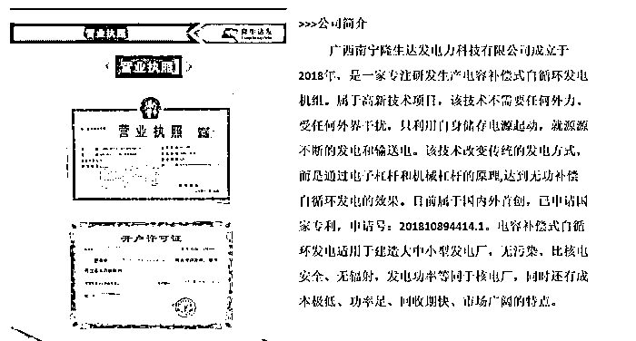
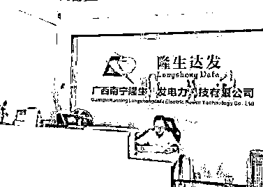
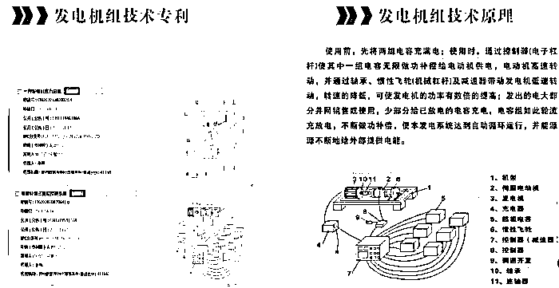

# 一度电能发一百万度电？吹牛！

> 原文：[`mp.weixin.qq.com/s?__biz=MzIyMDYwMTk0Mw==&mid=2247522151&idx=3&sn=898b0ec2d0454a3c1d977ffb9306def4&chksm=97cb5c5fa0bcd5499687cfb3f97b26a8b2baf45cf1f7e0ac81238b1c53594d8d521c0f9d262f&scene=27#wechat_redirect`](http://mp.weixin.qq.com/s?__biz=MzIyMDYwMTk0Mw==&mid=2247522151&idx=3&sn=898b0ec2d0454a3c1d977ffb9306def4&chksm=97cb5c5fa0bcd5499687cfb3f97b26a8b2baf45cf1f7e0ac81238b1c53594d8d521c0f9d262f&scene=27#wechat_redirect)

不需要任何原材料就能源源不断地发电和输送电？近日，广西南宁隆生达发电力科技有限公司因在官网宣称已突破能量守恒定律，并已获得国家专利，登上了微博热搜。

不少围观网友表示疑惑：“有人发明了永动机？”

用 1 度电发 1 百万度电？

据隆生达发公司官网介绍，该技术“已经完全突破了能量守恒定律，通过电子杠杆和机械杠杆的原理，达到无功补偿自循环发电的效果。”

隆生达发公司官网上的公司简介。

“不用烧煤、烧油，不用太阳能、风能、水能、核能等等，只需要用我们自主研发的一系列零部件组合起来，就可以源源不断地**用 1 度电发 100 度电、1000 度电、10000 度电，甚至百万度电。**”

其在官网介绍，该项循环发电技术可运用于手机、机器人、电动汽车、大中型轮船、大中小型发电厂等领域，且发电优于任何一种发电方式，更比核能安全、环保，无污染、无辐射，发电功率等同于核电厂，但设备成本较低。

“以一座标准电厂的投资为例，平均 1 度电的成本只需三分钱，所以我们的技术有着无比巨大的市场经济效益。”

隆生达发公司官网图片。

发电技术突破能量守恒定律？

大多数网友都对此表示怀疑：“是不是骗子公司？”更有人调侃称：“焦耳的棺材板压不住了。”“发明了永动机，怕不是要拿诺贝尔奖。”

也有人对该公司申请的专利提出了质疑：“普通人不懂就算了，为何能申请到专利？”

中新网查询发现，隆生达发所申请的“一种电容补偿式自循环发电系统”专利，在国家知识产权局的查询系统中显示的法律状态为“实质审查的生效”，也就是说，**该专利尚在审查中，并未被承认生效，其标注的专利号 201810894414，实际上是专利的申请号。**

天眼查显示，这家自称是“新能源高新科技企业”的公司成立于 2018 年 11 月，注册资本仅为 100 万元。

“永动机”能实现吗？

那么，隆生达发公司宣布发明的“电容补偿式自循环发电系统”，真的能突破能量守恒定律吗？

对于试图发明“永动机”的人而言，**能量守恒定律是一道无法逾越的鸿沟**。

“可以想象，用电能来让灯泡发光发热，是电能转换成了光能和热能，电能的量减少了，但是电、光、热的总量不会改变。”物理专业人士向中新网解释，**“‘能量守恒定律’是自然界的基本定律，是绝对不可能打破的。”**

隆生达发公司官网上关于专利原理的说明。

企业被立案调查，涉嫌违反广告法

对于隆生达发公司的专利，在物理专业人士看来，根据示意图显示，该装置甚至连节能也无法实现，**所谓的“无限做功”只是用来混淆视听，“电子杠杆”也并非学术专有名词。**“该产品的设想是想用 1 度电发 10 度电，但**发电过程中的耗散是不可避免的，因此不可能实现。**”

12 日，有消息称，隆生达发公司涉嫌违反《中华人民共和国广告法》相关规定，已被南宁市市场监管局高新分局立案调查。对此，南宁市市场监管局高新分局工作人员向中新网证实了这一消息，并表示案件正在调查处理中，具体进展不方便透露。

来源 : 中国新闻网，巴蜀反诈

← 向右滑动与灰产圈互动交流 →

