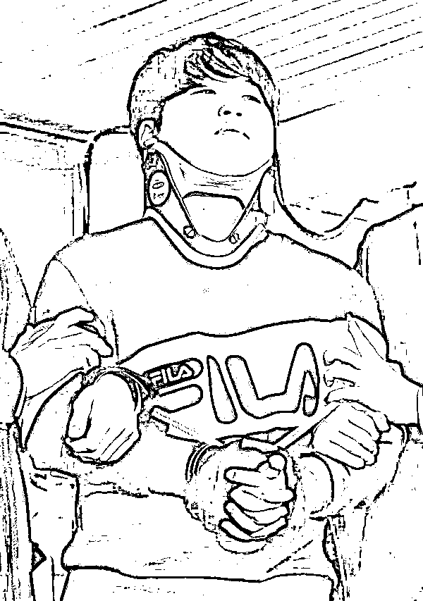
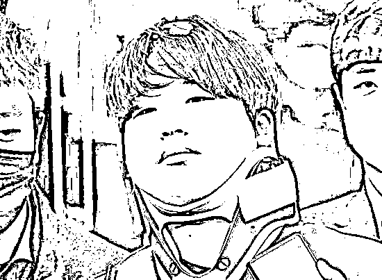
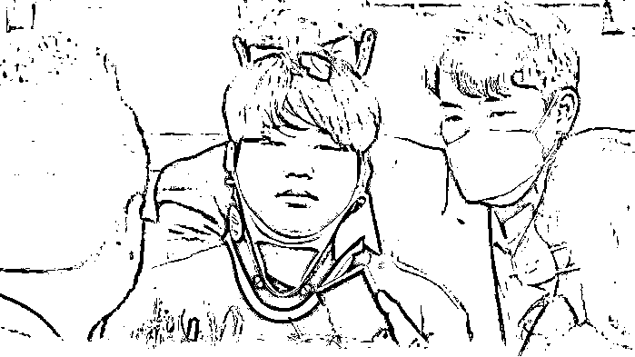

# 韩国 N 号房主犯“赵博士”终审被判 42 年

> 原文：[`mp.weixin.qq.com/s?__biz=MzIyMDYwMTk0Mw==&mid=2247522151&idx=4&sn=3246200df02c563919076f2ea136562c&chksm=97cb5c5fa0bcd549da0836d764b29cb31ad77633f3c755bc2709e4d592ecfc85095257034e44&scene=27#wechat_redirect`](http://mp.weixin.qq.com/s?__biz=MzIyMDYwMTk0Mw==&mid=2247522151&idx=4&sn=3246200df02c563919076f2ea136562c&chksm=97cb5c5fa0bcd549da0836d764b29cb31ad77633f3c755bc2709e4d592ecfc85095257034e44&scene=27#wechat_redirect)

**此前报道：**

**[韩国 N 号房事件 | 记者实录](http://mp.weixin.qq.com/s?__biz=MzIyMDYwMTk0Mw==&mid=2247497691&idx=1&sn=f1bcb1b60b69f4f18728c8a445e23d3b&chksm=97cb3ce3a0bcb5f5dbc95cdb085a161ab08aca54b1684adaa0436406e948a7515ba5d1c02386&scene=21#wechat_redirect)**

**[揭露“N 号房间”背后的“摄像头黑产”](http://mp.weixin.qq.com/s?__biz=MzIyMDYwMTk0Mw==&mid=2247497722&idx=2&sn=57de2601b21c894034de17d9896a80aa&chksm=97cb3cc2a0bcb5d4fec4d198d2686fe5ff873cff29267d12335fa0ffd940ce2796721e704d62&scene=21#wechat_redirect)**

**[“N 号房”背后的秘密平台，早就打响了全球游击战](http://mp.weixin.qq.com/s?__biz=MzIyMDYwMTk0Mw==&mid=2247497760&idx=3&sn=bced20fdfc008be859858aad15b9abed&chksm=97cb3318a0bcba0e6bb4570ca5817e46bf88425417d493f7ac6ce5d6f75baf65a5921ec8efef&scene=21#wechat_redirect)**

[`mp.weixin.qq.com/mp/readtemplate?t=pages/video_player_tmpl&action=mpvideo&auto=0&vid=wxv_2090321264484630530`](https://mp.weixin.qq.com/mp/readtemplate?t=pages/video_player_tmpl&action=mpvideo&auto=0&vid=wxv_2090321264484630530)

澎湃新闻编辑 胡岑 实习生 许扬 视频来源 中新视频 责任编辑：顾亚敏

据韩联社报道，10 月 14 日上午，韩国最高法院对“N 号房”主犯赵博士（本名赵主彬）进行终审宣判，判处其 42 年有期徒刑。**赵主彬一审获刑 45 年，二审获减刑，改判 42 年。**

“N 号房”赵博士（资料图）。

赵主彬现年 25 岁，毕业于韩国一所工业大学的信息通信系，自称“赵博士”。2019 年 5 月到今年 2 月，他涉嫌胁迫数十名女性拍摄变态不雅视频，并在加密软件上设立聊天室进行有偿分享，赚取数十亿韩元收入。此外，他还以传播不雅视频作为要挟，指使共犯性侵未成年少女，总计面临 14 项指控。

“N 号房”赵博士（资料图）。

2020 年 3 月 19 日，赵主彬因涉嫌违反儿童青少年性保护法等罪名，被警方逮捕。3 月 25 日，他被公开示众时当场谢罪，称感谢帮助他停止这“恶魔般的生活”。

“N 号房”赵博士（资料图）。

2018 年开始，韩国多名犯罪者通过兼职为诱饵吸引年轻女性，哄骗她们上传裸体照或不雅视频，以此威胁拍摄性剥削视频，并在通讯软件聊天室内共享，供付费会员观看或下载。为躲避搜查，犯罪者提前建好多个聊天群，不断新建、解散聊天群，并分别命名为“1 号房”、“2 号房”等，因此被统称为“N 号房”。其中赵主彬运营的聊天群最为猖獗，被称为“博士房”。

来源：澎湃新闻

← 向右滑动与灰产圈互动交流 →

