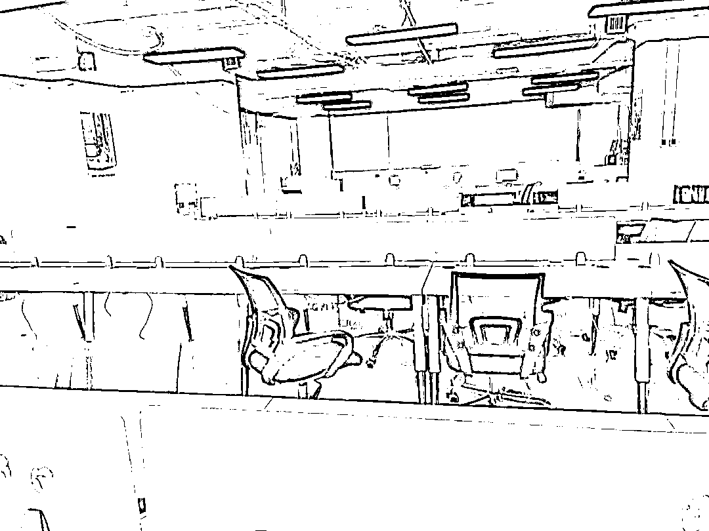
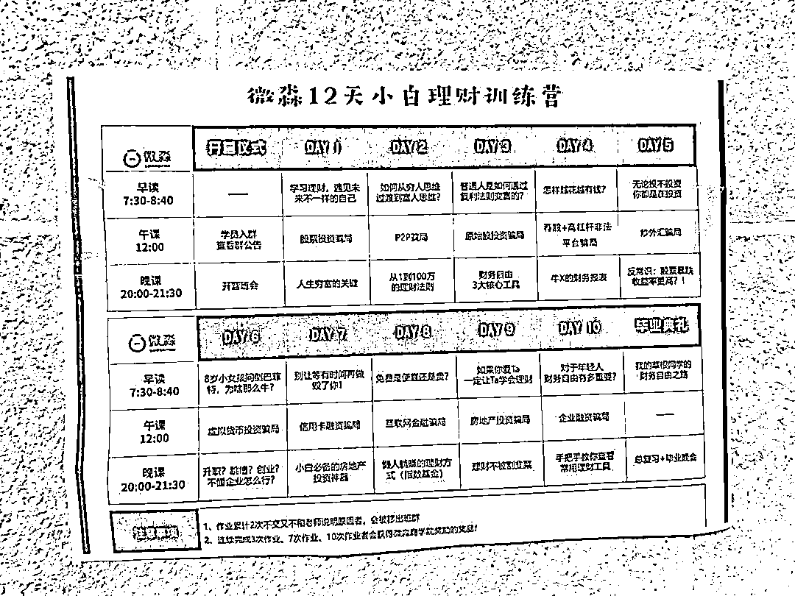
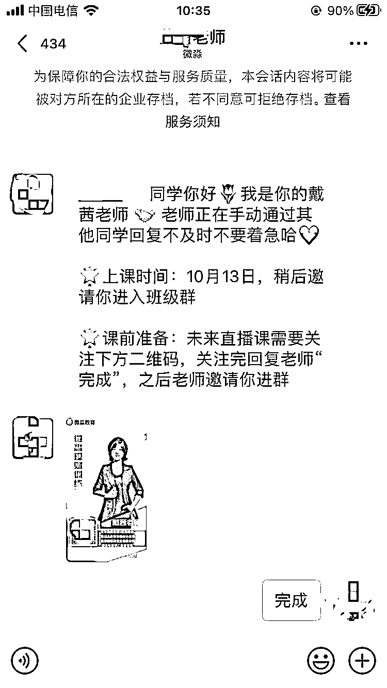
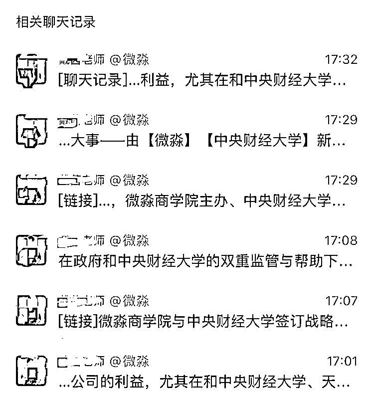
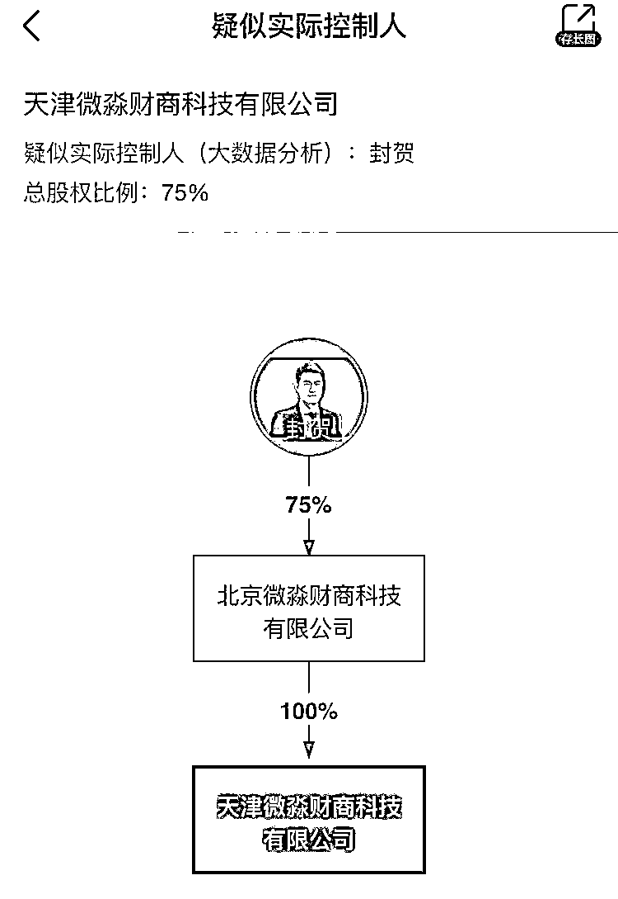

# 微淼商学院被指诈骗，多地警方立案，探访微淼北京总部（图）

> 原文：[`mp.weixin.qq.com/s?__biz=MzIyMDYwMTk0Mw==&mid=2247522157&idx=1&sn=cf076c3ee25a1ab7a26d59a867d2a863&chksm=97cb5c55a0bcd5437b6ca22bee3c60d575ab711c5da8da6bdb6ee32d9db6e285cea645d72515&scene=27#wechat_redirect`](http://mp.weixin.qq.com/s?__biz=MzIyMDYwMTk0Mw==&mid=2247522157&idx=1&sn=cf076c3ee25a1ab7a26d59a867d2a863&chksm=97cb5c55a0bcd5437b6ca22bee3c60d575ab711c5da8da6bdb6ee32d9db6e285cea645d72515&scene=27#wechat_redirect)

“12 天教你告别死工资，提高被动收入，仅 12 元”、“掌握富人思维，拥有‘睡后收入’ ”、“抓住理财造富，12 天实现用钱赚钱” ……

你肯定见过类似的广告吧？他们通过极具听觉冲击力的广告词不断的告诉人们，无论你只有几千块还是几百块。只要上了小白理财课，就能快速成为理财高手，变成有钱人。

如果你动心了， 那你可能将成为他们的收割目标。 

**微淼商学院被指诈骗**

**全国多地已立案**

近期，涉及微淼商学院学员被骗信息充斥各大互联网平台。

有网友表示，微淼涉嫌诈骗，已向北京警方报警，7 月 9 日登陆北京市公安局“立案公开查询系统”查询已显示立案。11 期 797 班小白群微淼周琳老师拆群就是防止学员收集证据。

知名打假人王海的一篇微博是网友投稿，讲述了自己被骗的过程。

该网友称，微淼商学院以 12 元吸引理财新手报名，报名后，所谓授课老师以“随时可以无理由全额退款”诱导学员报名 6998 元所谓财务自由时间课，学员发现课程名不副实想要退款时，老师失踪。

王海的另一条微博显示，微淼商学院涉嫌诈骗全国多地被立案。

三言财经咨询了图中显示的几个派出所。 

广州从化区太平派出所的工作人员表示，网络上的诈骗案件，他们会在立案 12 小时内移交给刑警处理，具体进展他们也不清楚。 

江苏溧阳昆仑派出所的工作人员表示，当时处理相关案件的警官已经调到别的地方，他们也表示不知道具体进度。

北京昌平沙河派出所的工作人员表示，处理相关案件的警官今天不在，要等他上班后才能给予回复。

三言财经还询问了微淼方面对有学员报警一事是否知晓。笔者多次问及对方是否知晓此事，但客服人员始终未明确答复，只是称竞争对手故意抹黑的太多。 

据南方都市报，至少三起微淼涉嫌诈骗的案件，被各地公安受案或立案。其中，山东潍坊一公司保安高大爷称自己在网上看到微淼广告，报了 12 元的小白课。由于对股市金融不熟悉，进群之后，高大爷轻信了小白课老师说的高收益，用信用卡透支买了进阶课，现在还在还款中。

截至今天，在黑猫投诉平台上对微淼商学院的投诉量达 2319 条，投诉内容多为微淼商学院虚假宣传，欺诈学员，不予退款等。 

**探访微淼北京总部：有一层近乎搬空，遗留工作痕迹** 

**愿景曝光：成为全球最好财务自由实现平台**

三言财经也探访了位于昌平区的微淼商学院北京总部。 

这栋楼的 5、6、7 层都有微淼商学院的办公室。

5 楼的一间大办公区已经搬空，但是留下了很多员工工作的痕迹。

一个办公桌挡板上贴着“xx 老师，你还差 2 单就卓越了！”“50 个有效电话，5 单必胜！”等给自己加油打气的便贴。

墙上还贴着课程表，包括“p2p 骗局”、“从 1 到 100 万的理财法则”、“我草根同学的财富自由之路”等等。

还有微淼社群运营部晋升通道图。 

海豚代表微淼的企业文化，其使命是，让 1 亿人财商及格，让财务自由不再难。 

微淼老师入职宣言。

奖状和奖牌也都没带走。据物业方面人士透露，往 7 层搬了，然后国庆前往天津也搬了一批人。

6 楼有人正常办公。 

7 楼员工密度很大，工作热火朝天。

据微淼员工介绍，5 楼的搬 6-7 楼了。搬天津因为那有一栋楼。

**体验 12 元小白理财课：学员“激情互动”**

**老师展示“收益”，一天近一万元**

三言财经还通过“微淼教育”公众号购买了 12 元的小白理财课。 

付款之后，会给出一个二维码，让添加老师的微信。 

添加老师后，老师会让关注另一个公众号“微淼精品课”，告知晚上 8 点开课，并拉班级进群。进群后，老师会告知 12 天的课程分为两部分，8 天直播课和 4 天微信班群图文课。

下午 5 点，群里开始预热。

“复制粘贴”的话术中，蕴含着微淼逐层推进的重点。 

老师还晒出了自己的理财收益，一天就高达 9000 多。 

老师还分别介绍了实操老师和直播老师。 

8 点开课，第一天的课程主题是“看透人生穷富的关键”，直播老师虽然一直强调自己不会推荐股票、基金等，但一直举例“某些人何时如何通过股票获利多少”。 

老师强调，并非有钱人才能投资理财，“1 块钱就可以投资货币基金，200 元就可以投资指数基金，百元就可以投资股票，千元就可以投资 REITs”。

直播课结束后，学员们非常有激情，整齐划一的跟实操老师互动。 

实操老师也仍鼓励大家，只要学会理财，几百元也可以慢慢变富。 

第一天的课程听完后，感觉跟那些成功学大师的路数有些相似。

首先老师不断向学员灌输“穷富的区别不在于财产本身，而首先取决于自己”的思想观念，穷人之所以穷，是思维的懒惰。然后通过各种事例引导学员要学习富人思维，做个财务自由的人。

整体来说，没感觉到有什么收获。老师也没有推荐几千块的进阶课程，毕竟后面还有 11 天，大家都不急。 

第二天早晨 8:00，是早读时间，老师先发了一个“1 万小时贫穷定律”的链接。

然后老师开始分析解释，为什么会越忙越穷。 

老师讲解“购买股票的本质是购买了这个企业的一部分，相当于雇佣了这家公司的团队帮自己赚钱”。 

晒往期学员在微淼企业分析平台写分析文章的获得的非工资收益。 

老师讲完后让学员发表感悟。

不少学员都茅塞顿开般感悟到“努力工作不是最好的赚钱的方式”。 

看完第二天的早读，笔者不禁感慨，给别人灌输思想理念这么容易吗？口口声声说自己不推荐股票，却一直强调股票多么多么赚钱。学员也都十分配合的领悟到“努力工作不是最好的赚钱方式”...... 

微淼官网介绍，微淼为学员创造短中长三大价值。短期内可以让学员掌握投资理财技能，建立富人思维体系，建立家庭财务体系；中期可以让学员格局提升，增加理财收入，精通财务自由技能；长期可以让学员有机会实现财务自由年轻退休，提高孩子财商，富过三代。

**起底：创始人封贺疑复旦大学“夜大”学历**

**多个关联公司曾被指涉嫌诈骗**

**微淼旗下多个分公司经营异常**

微淼官网显示，其深度合作伙伴包括中央财经大学。 

在笔者加入的 12 元小白理财班，老师也曾多次强调与中央财经大学的合作。

具体而言，就是在 2020 年 7 月，微淼曾与央财合作打造了财商教育新课程《金融投资与企业管理高级研修班》；2021 年 5 月，微淼商学院还联合央财发布《国民财商教育发展白皮书（2021 年）》。 

但根据此前的媒体报道，与微淼合作开发上述课程的是中央财经大学继续教育学院，与央财本校没有任何关系。

还有网友称，自己曾咨询过央财，央财方面称和微淼合作已到期，已要求微淼下架宣传。

微淼官网显示，每位导师都有着不俗的简介。

资料显示，天津微淼财商科技有限公司和北京微淼财商科技公司的法定代表人均为王楼楼。

后者是前者的全资控股股东，疑似实际控制人为封贺。

公开资料显示，封贺，复旦大学经济学学士、国家理财规划师，微淼商学院创始人，曾连续两年荣获央广网“年度教育行业影响力人物”。

据红星新闻此前报道，微淼学习群内存在多名“托”，疑似杀猪盘；“导师”不限学历和经验，只要培训 7 天就可上岗；以“完成作业”的形式，要求学生购买特定股票或基金。

微淼创始人封贺复旦大学经济学学士的学习形式为“夜大”，入学难度及含金量均无法与高考、考研相比。 

封贺除了是微淼创始人外，还是北京金桐商品经营有限公司、青岛金九州商贸邮箱公司、上海兰坤实业有限公司的股东。三家公司的股东均为刘雯和封贺。且三家公司均已注销。

近几年来，网上频频曝出，金桐公司作为会员单位的青岛齐鲁商品交易中心、上海长江联合金属交易中心开展违法电子期货交易的信息。称其会员单位通过以老带新、QQ 群交流、会议讲解等方式培训员工，形成相对固定的诈骗模式。

早在 2016 年，就有投资人状告北京金桐。

据该案件原告诉称，自 2015 年 11 月起，金桐公司安排工作人员不断动员当事人进行原油交易，通过欺诈和虚假宣传，诱骗其在 2016 年 1 月 1 日与金桐公司通过网络签订了电子合同开立交易账号。2016 年 1 月 6 日，当事人开始原油交易，当事人根据金桐公司的工作人员指示进行交易后，短短几天内就亏损 487425.12 元。

这一诉讼持续了两年。2018 年，法院一审宣判原告与被告北京金桐的全部交易行为无效；被告北京金桐于本判决生效之日起十日内返还原告刘艳玲投资本金 487425.12 元。

但不知为何，在北京金桐上诉不久后，原告就撤诉了，法院的一审判决也失效了。

2018 年，有投资者状告青岛齐鲁商品交易中心，称其通过北京金桐业务员在青岛齐鲁商品现货交易中心开立账户，并要求投入 20 万元，之后屡次进行重仓等频繁操作，导致爆仓。

资料显示，微淼另一个联合创始人王楼楼，早在 2015 年就曾先后参股了青岛金裕道商品经营有限公司和上海裕道金属有限公司。其经营范围，包括贵金属、金属制品、矿产品、燃料油、煤炭等的网上销售。

由此可见，封贺和王楼楼都是专业做金融期货出身。

2017 年 4 月，王楼楼创立霍尔果斯财商信息科技有限公司，并以微淼商学院的名义进行授课。

据官方介绍，其课程设置：《12 天小白理财训练营》《财务自由操作系统课》、《财务自由财报分析技能课》、《财务自由企业经营方法课》。

2019 年 4 月，封贺与王楼楼一起创立了北京微淼财商科技有限公司，近两年微淼商学院的扩张迅猛，在北京、天津两地开设了多个分公司。

但是近期，微淼旗下北京微淼财商科技有限公司朝阳分公司、天津微淼财商科技有限公司朝阳分公司等多个分公司被列入经营异常名录。

**监管之下多次被点名** 

**被曝裁员、找麻辣烫研发员** 

**或将转型做其他**

在黑猫投诉平台，除了微淼商学院外，启牛商学院的投诉量也不少，其他几个商学院的投诉量少很多。

从投诉量来看，微淼和启牛比较严重。也曾有多家媒体报道，启牛的财商课存在与微淼类似的情况。

对此，监管层也曾出手整治。2020 年 11 月，《新晚报》在微信公众号发布的“微淼商学院 12 天小白理财训练营”广告成为了黑龙江省市场监管局公布的 2020 年虚假违法广告十大典型案例。

2021 年 3 月 4 日，北京昌平区市场监督管理局就发出消费警示，15 家教育培训主体被点名，其中北京微淼因被投诉次数达 12 次，位列投诉榜首，而在此前发布的同类名单中（1 月 31 日~2 月 6 日），北京微淼也同样被诉 4 次。

8 月 27 日，国家网信办启动财经类信息专项整治，“财商课”即在此次重点违规问题之列。

09 月 10 日，北京市昌平区市场监督管理局对北京微淼财商科技有限公司涉嫌发布利用科研单位、学术机构、教育机构、行业协会、专业人士、受益者的名义或者形象作推荐、证明的教育、培训广告一案公开举行听证。

或是在监管的收紧和大量被指诈骗的压力下，微淼若有所思。

据一个重点关注微淼的个人公众号“道福斯”爆料，微淼近期似乎在大量裁员，说是北京社群的点要撤了。该账号表示天津被裁的老师得不到补偿，北京的 N+1。他还声称微淼北京第二次签协议离职潮场面非常壮观，有的人拿十几部手机办离职，排队比医院挂号都慢。

更有趣的是，“道福斯”居然还爆出微淼在招聘麻辣烫研发和菜品研发，疑似要转型。同时，微淼也在招聘心理催眠师。

三言财经通过搜索第三方平台发现，微淼还在招聘健身课程研发和健康营养师。 

三言财经也向微淼方面咨询了近期是否有裁员情况，客服人员回复称，“人事变动是很正常的事，应该有吧，具体不清楚”。

如此看来，也许微淼真有转型的计划。但会不会是换汤不换药，也不好说，毕竟做餐饮还招心理催眠师这种事很罕见。 

贩卖焦虑已经成为这个时代的一种敛财手段。如果好高骛远，迫切想要实现财务自由，搞不好就会沦为别人的韭菜。理财投资是个系统性、长期的过程，还要结合实践，不是通过几节课就能学会的。

这种课程也许对思维训练有帮助，但指望借此快速赚钱怕是行不通。还是应该脚踏实地，别老想着天上掉馅饼。

← 向右滑动与灰产圈互动交流 →

