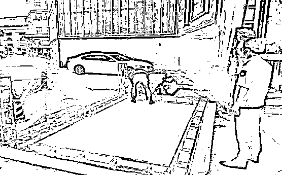
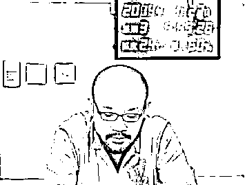

# 涉毒艺人参加商演？紧急叫停！

> 原文：[`mp.weixin.qq.com/s?__biz=MzIyMDYwMTk0Mw==&mid=2247522231&idx=3&sn=90b1ebe47837f1835e741be54e46dbb5&chksm=97cb5c8fa0bcd599056fb9fe299f813bcca25a543cbe9f1267fca07d4af9fffe7de65665bfc3&scene=27#wechat_redirect`](http://mp.weixin.qq.com/s?__biz=MzIyMDYwMTk0Mw==&mid=2247522231&idx=3&sn=90b1ebe47837f1835e741be54e46dbb5&chksm=97cb5c8fa0bcd599056fb9fe299f813bcca25a543cbe9f1267fca07d4af9fffe7de65665bfc3&scene=27#wechat_redirect)

近日，安徽蚌埠市文化市场综合执法支队对全市歌舞娱乐场所持续开展执法检查行动。在执法行动中，接举报称李代沫将在该市一娱乐酒吧参加营业性演出活动。

“接举报后，支队高度重视，迅速做出研判，执法人员立即前往该娱乐酒吧予以核查。”蚌埠市文化市场综合执法支队执法人员告诉记者，经查，在该酒吧门口确实摆放有演出活动的大型海报。而酒吧负责人无法出示该场演出活动的演出批准文件，并表示未办理相关的批准手续。

酒吧工作人员对宣传海报予以拆除

随后，执法人员现场就《营业性演出管理条例》相关规定进行普法宣传，并责令该酒吧停止违规营业性演出活动。在执法人员的宣传教育下，酒吧负责人表示停止该场演出活动，并对宣传海报予以拆除。

“当天晚上，执法人员坚守岗位，确保该酒吧无违规营业性演出活动。”执法人员说。下一步，将持续加强营业性演出市场监管，紧盯社会关注度高的重点营业性演出不放，严查劣迹艺人的违规营业性演出活动，保护消费者合法权益，规范营业性演出市场经营秩序。

在此，提醒广大市民，如发现违规营业性演出经营行为，可拨打营业性演出市场举报电话 12318，或登录举报平台 www.12318.gov.cn，举报违法违规营业性演出经营行为。

文旅部重拳挥向“劣迹艺人”

据了解，今年，文化和旅游部发布《关于规范演出经纪行为加强管理促进演出市场健康有序发展的通知》。

演出活动不得使用造成恶劣社会影响的失德演员；不得使用含有《营业性演出管理条例》第二十五条禁止内容的图形、画面、音视频和文字等进行演出宣传、售票和演出场地布置等活动；不得组织演员假唱，不得为假唱提供条件。有未成年人参与的演出，应当经过未成年人父母或者其他监护人同意。

中国演出行业协会发布新制定的《演出行业演艺人员从业自律管理办法》，“劣迹艺人”将受到协会会员单位 1 年期限至永久期限的联合抵制，且须在联合抵制期限届满前 3 个月内提出申请，经同意后才可继续从事演出活动。

李代沫容留他人吸毒案件回放

李代沫是黑龙江省齐齐哈尔市人，曾参加《中国好声音》第一季比赛，因深情演唱歌手曲婉婷的代表作《我的歌声里》而一炮走红。之后李代沫在北京签约当然娱乐公司。

2014 年 3 月 17 日，北京警方官方微博“平安北京”发布声明称，著名歌手李代沫伙同另外 6 人，于 17 日晚在北京朝阳区三里屯某小区的暂住地内吸食毒品，6 人全部被警方抓获。此外，在丰台区一酒店内还有另外两名涉案人员也在随后被警方抓获。此 8 人尿检均为苯丙胺类阳性，且当事人对犯案事实供认不讳。

随后，李代沫因涉嫌容留他人吸毒罪于 2014 年 3 月 19 日被北京市公安局朝阳分局依法刑事拘留，并被移送至常营看守所。

3 月 27 日凌晨，有微博爆料称，“李代沫已患病，看押方认为不适宜关押正办理相关手续”，但该爆料很快被北京市公安局辟谣，警方明确表示，李代沫仍在羁押中，案件正在进一步审查。

4 月 16 日下午，朝阳检察院发布消息称，以涉嫌容留他人吸毒罪对李代沫依法批准逮捕。

5 月 27 日上午 9 时在北京市朝阳区人民法院依法公开开庭审理。开庭 10 分钟左右，朝阳法院微博发消息称，李代沫当庭自愿认罪。

法院认为，公诉机关指控事实清楚，证据确实充分，罪名成立；法院认为李代沫主动供述犯罪事实，认罪态度较好，给予从轻处罚，判刑九个月，处罚金两千元。李代沫当庭表示不上诉。

[`v.qq.com/iframe/preview.html?width=500&height=375&auto=0&vid=a3302y5csov`](https://v.qq.com/iframe/preview.html?width=500&height=375&auto=0&vid=a3302y5csov)

来源：新安晚报报，红网

← 向右滑动与灰产圈互动交流 →

