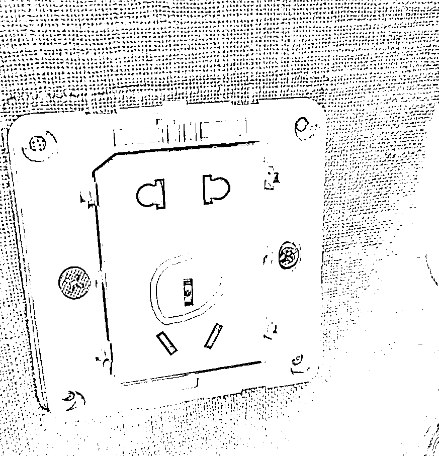
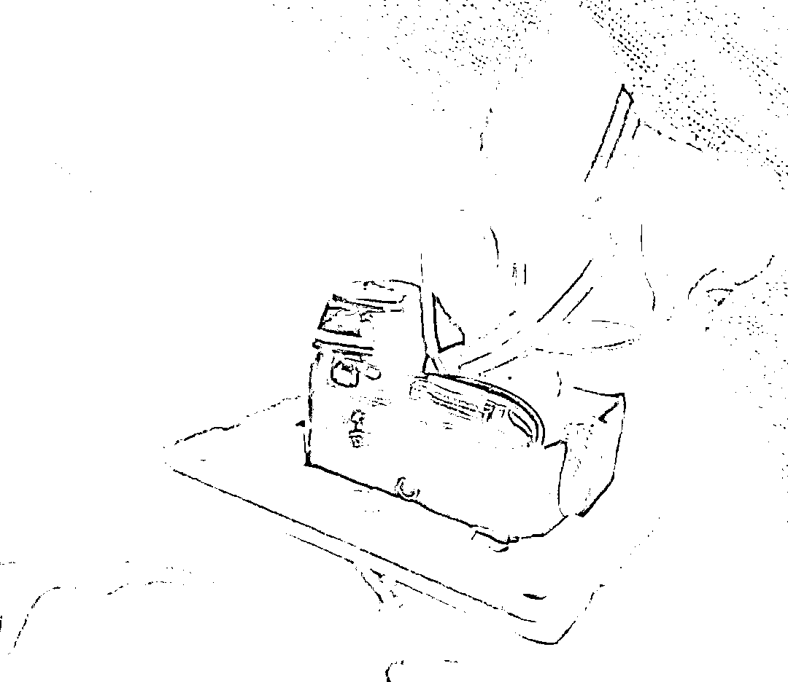
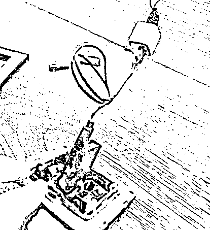

# 细思极恐！女子住酒店，换俩房间都发现了这个，紧急报警！

> 原文：[`mp.weixin.qq.com/s?__biz=MzIyMDYwMTk0Mw==&mid=2247522231&idx=4&sn=d2019a244fbcea2c5593702e6f852f76&chksm=97cb5c8fa0bcd599dabd2a28380689d152b92c7e1faecfb119f8675f87407c5a5404dceb45d6&scene=27#wechat_redirect`](http://mp.weixin.qq.com/s?__biz=MzIyMDYwMTk0Mw==&mid=2247522231&idx=4&sn=d2019a244fbcea2c5593702e6f852f76&chksm=97cb5c8fa0bcd599dabd2a28380689d152b92c7e1faecfb119f8675f87407c5a5404dceb45d6&scene=27#wechat_redirect)

**导读**

出门在外，住酒店是很多人的第一选择，然而越来越多的“隐藏摄影头”却让很多人感到不安。近日，湖南衡阳的唐女士便遭遇了这么一件事：她在郴州市的临武国际大酒店房间发现隐藏摄像头后，被酒店安排换了房，结果新换的房间内仍然存在隐藏摄像头。当晚，感到震惊的她立马选择了报警。 [`v.qq.com/iframe/preview.html?width=500&height=375&auto=0&vid=m3301ofs7rb`](https://v.qq.com/iframe/preview.html?width=500&height=375&auto=0&vid=m3301ofs7rb) 发现隐藏摄像头，换房后还有

10 月 7 日，因为工作出差，唐女士入住了郴州市的临武国际大酒店 1711 号房间，因为在短视频平台刚好刷到女子被偷拍的新闻，出于好奇，她也决定检查一下自己所住的房间里有没有类似的可疑设备。这一查不要紧，唐女士惊了：**对着床的充电插头内，真的隐藏着一个正在运行的摄像头。**

唐女士：当时我用牙签尝试戳充电头，发现戳不进去，仔细看又发现有一个类似于摄像头的东西，我当时就立马叫前台拿起子过来，拆了之后，真的发现是一个正发着光，在运行的摄像头。

从唐女士提供的视频可见，隐藏在充电插板后的摄像头约肥皂大小，正闪着蓝色的光，**里面还插着一张储存卡。**

由于该摄像头正对着床，唐女士担心自己的隐私已经泄露？于是立刻拍下相关证据并报警。警方给唐女士做了笔录，带走了相关摄像头等证据，**随后酒店为她安排了 1311 号房间入住。**

换房之后，唐女士仍心有余悸，马上又检查了房间，您说巧不巧，**她又在同样位置的插座孔内发现了摄像头，**唐女士再次报了警，警方第二次赶到酒店，同时调取了酒店房间其他客户的入住信息。

因为当时已经是深夜 11 点多左右，多位其他同事也住在该酒店，当晚唐女士没有搬离，仍在该酒店住宿了一晚。

酒店：我们也是受害者

针对此事，网友们愤怒不已。有人说“太可耻，没有任何隐私了！”“对于这种酒店一定要零容忍，都别订房”，也有网友表示这个很常见，“很多酒店都有吧，我看到过有人在网上打包出售视频。”还有网友表示“出租房照样有这种，大家租房也要注意！”

10 月 13 日，潇湘晨报记者联系了临武国际大酒店的童经理，她表示，事发后，**酒店已经排查了其他所有房间，并未再发现其他摄像头，目前酒店正配合警方进行调查。**

童经理：目前的事情，警方还没有定性，酒店完全接受警方调查之后的调查结果。客人说她可能要进行民事诉讼，但是我们酒店本身也是受害方，不知道摄像头从何而来。

童经理坦言，酒店方想等警方定性，以及相关调查结果出来之后，再和消费者进行公平公正的对话，争取有一个双方都满意的解决方式。

10 月 13 日，记者从临武县公安局了解到，此事已立行政案件，正在进行调查。

律师：酒店应承担相应补充责任

客人在酒店房间发现隐藏摄像头，但酒店表示自己也是受害方，客人被泄露的隐私又该谁来担责？10 月 13 日，记者联系到了湖南睿邦律师事务所执行主任刘明。

刘明表示，此事中，如果摄像头是第三人安装的，**管理人应当举证证明其是否尽到了安全保障义务，如无证据证明，则酒店应承担相应的补充责任。**

根据《民法典》第一千一百九十八条的规定：**宾馆、商场、银行、车站、机场、体育场馆、娱乐场所等经营场所、公共场所的经营者、管理者或者群众性活动的组织者，未尽到安全保障义务，造成他人损害的，应当承担侵权责任。**

因第三人的行为造成他人损害的，由第三人承担侵权责任；经营者、管理者或者组织者未尽到安全保障义务的，承担相应的补充责任。经营者、**管理者或者组织者承担补充责任后，可以向第三人追偿。**

**如果摄像头是酒店安装的，则酒店涉及刑事与民事责任。**刘明说，在刑事责任上，根据《刑法》第二百八十四条规定，非法使用窃听、窃照专用器材，造成严重后果的，涉嫌构成非法使用窃听、窃照专用器材罪，处二年以下有期徒刑、拘役或者管制。民事责任上，酒店的行为侵犯了消费者的隐私权，应当承担相应的赔偿责任。

来源：潇湘晨报，阻击诈骗

← 向右滑动与灰产圈互动交流 →

