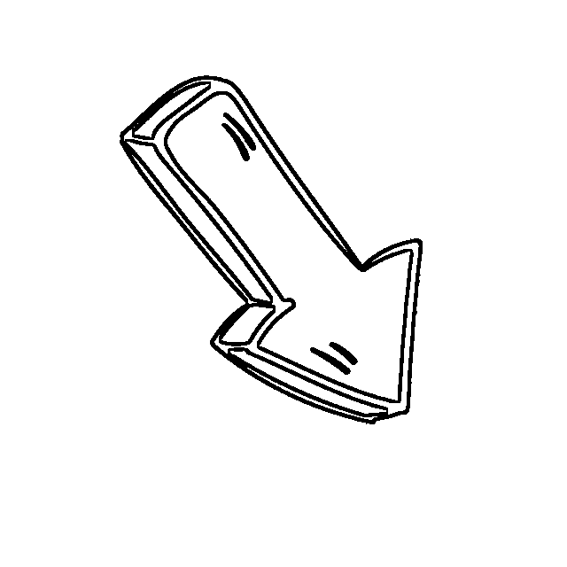

# “我不会再相信爱情了！”30 岁女硕士网恋陷“杀猪盘”被骗 58 万

> 原文：[`mp.weixin.qq.com/s?__biz=MzIyMDYwMTk0Mw==&mid=2247522231&idx=5&sn=4cf2536e691cdc6b8d016860df447f48&chksm=97cb5c8fa0bcd59961c4ceac34344075d8a9d6301dca424694547bfc85c397e8430e56c5908d&scene=27#wechat_redirect`](http://mp.weixin.qq.com/s?__biz=MzIyMDYwMTk0Mw==&mid=2247522231&idx=5&sn=4cf2536e691cdc6b8d016860df447f48&chksm=97cb5c8fa0bcd59961c4ceac34344075d8a9d6301dca424694547bfc85c397e8430e56c5908d&scene=27#wechat_redirect)

如果你被家人疯狂催婚

而你还没有交往对象

你会怎么办

[`mp.weixin.qq.com/mp/readtemplate?t=pages/video_player_tmpl&action=mpvideo&auto=0&vid=wxv_2088759166608654346`](https://mp.weixin.qq.com/mp/readtemplate?t=pages/video_player_tmpl&action=mpvideo&auto=0&vid=wxv_2088759166608654346)

**一起来读读她的故事吧**

**Part1:****被催婚，急于找个男朋友**

周女士

一毕业就进入深圳的一家国企

由于上学比较晚

研究生毕业时年龄比较大

如今快 30 岁的她

和前男友分手了

面对父母的催婚

急忙在婚恋网上注册账号

发布了自己的信息

幸运的是

她很快便找到了互相欣赏的人

对方是卖手机的

个体户、本科毕业

身高 175cm、年龄与其相近

……

**一切看起来似乎都刚刚好**

两人在婚恋网上互点了喜欢

获得了彼此的联络方式

聊了很长一段时间

格外投机

她想着或许能跟他在一起

对“男友”也十分信任

某天

“男友”说是去澳门出差

**让她帮忙管理一个投资的网站**

并把账号给了她

教她操作

感觉“男友”也十分信任她

她放松了警惕

对方最开始投资 2 万、3 万

后面投资 30 万

投资收益很高

让她帮忙提现

还把提现密码给了她

她再次感觉到“男友”无比的信任

她觉得自己找到了真爱

还跟“男友”商量

等他出差回来见一面

**Part2:****身陷“杀猪盘”**

那天

“男友”说

“我给你带一点礼物回来”

她，不太好意思要，拒绝了！

“男友”又说

**“那我带你投资赚点零花钱吧”**

她，同意了！

她贷款上的学

刚工作两年多

没什么存款

跟着“男友”两三天

投了全部家当

近 5 万

然后，打算坐等收益

这天

“男友”说

“平台有个奖励活动，你可以预约一下 10 万。”

她，照做了！

预约后

**平台先返了 1.88 万**

**账户里将近有 7 万元**

**再借 3 万就能凑够 10 万元**

她没有跟别人借钱

而是选择贷款

贷了 3 万多

但

当她把钱放进账户后

却惊讶地发现账户被冻结

此时

她既慌张又害怕

急忙去问客服

客服解释说

**“不是账户上累积到 10 万元**

**就算参加活动**

**而是需要**

**再投进去 7 万元才算参加活动。”**

当时

她一心就想把钱拿出来

赶紧四处凑钱

跟妈妈撒谎

借口要了 5 万元

又跟同事借了 2 万元

她心里很惶恐

想不玩了

但

已经投进去那么多

她想取出钱

也没有别的选择

可她把 7 万元投进去

钱仍然取不出来

她再次询问客服

客服说

**“你虽然参加了这个活动**

**但你没有交易量，还要再投。”**

一想到钱已经投进去很多

不继续投的话

更是没有提出的机会

无奈之下

她只能继续投钱

她

将花呗、借呗的提现额度

都用光了

还去线下的深圳借贷中心借了 5 万元

但，金额还是不够！

这时

“男友”突然说

“我帮你投 3 万！”

让她倍感暖心

可她再次提现

却发现依然无法提出

“我其实从来都没有怀疑过他。”

直到目前

周女士对“男友”仍然无比信任

可因为她实在凑不出钱了

账号被平台冻结

无奈之下

她跟同事提起说自己欠了 58 万

同事感觉不对劲

第一时间将她带到了派出所

在民警的帮助下

周女士

才意识到“男友”是个骗子

自己所遭遇的骗局叫做“杀猪盘”

**“我真的没想到这种事会发生在自己身上。”**

她不相信会发生在自己身上

**Part3:****生活还得继续**

事后，她反思道：

**“我不该在网上找对象**

目前不考虑找男朋友和结婚了

先把钱还了

也不再相信什么爱情了

……

贷款父母已经帮忙还了

还剩两三万

我自己慢慢分期还

跟同事借的钱先缓一缓

自己做错了

就得付出代价

家里人肯定会骂

我自己也会睡不着觉

但生活还得继续下去

再难也得挺过去

如果我不振作起来

这笔钱就全部得父母去还

不能给父母增添更大的负担”

大家一定要注意

在恋爱的道路上

如果你突然遇到一个人

跟你完美适配

你一定要小心

没有这样的人

他一定是有目的地接近你的

不要那么相信童话

另外

**如果素未谋面的朋友叫你打钱**

**那他一定是骗子**

**赶紧报警！！！**

来源：十堰人民路派出所

← 向右滑动与灰产圈互动交流 →

