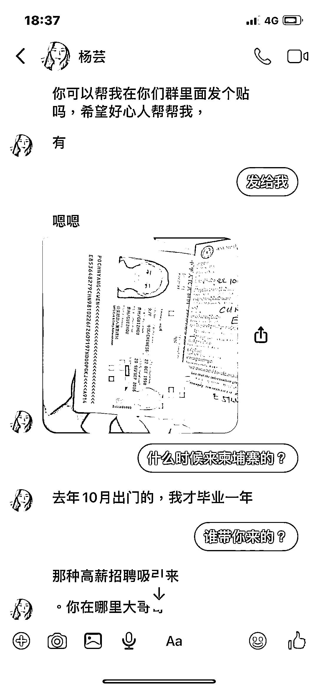
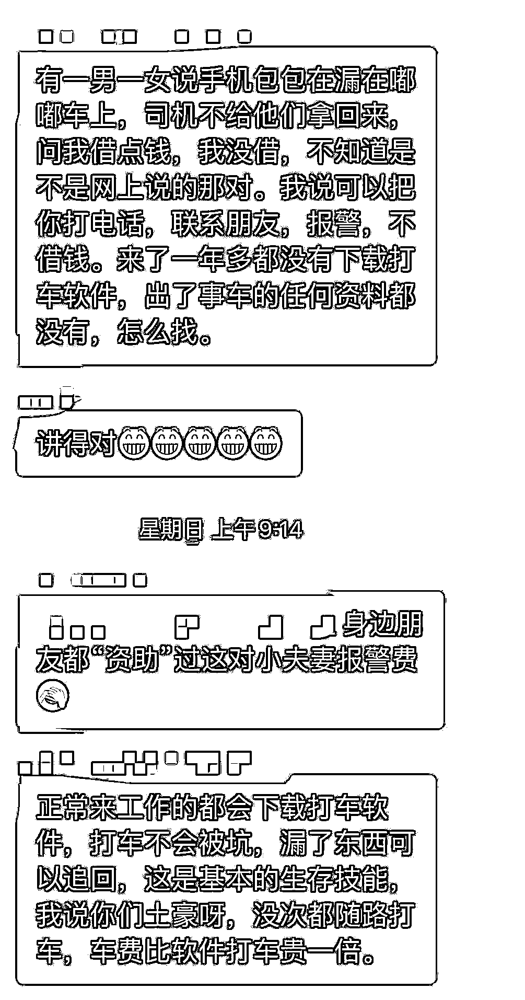

# 骗子无孔不入，在柬埔寨骗子比你想象的更努力在“奋斗”着

> 原文：[`mp.weixin.qq.com/s?__biz=MzIyMDYwMTk0Mw==&mid=2247522231&idx=6&sn=3a8ced189cddef8f5e1e6451f1a3f754&chksm=97cb5c8fa0bcd59923ea0b2d85a37320ecf11e5bcdc3e4e91036399770491243aae632ca6c1d&scene=27#wechat_redirect`](http://mp.weixin.qq.com/s?__biz=MzIyMDYwMTk0Mw==&mid=2247522231&idx=6&sn=3a8ced189cddef8f5e1e6451f1a3f754&chksm=97cb5c8fa0bcd59923ea0b2d85a37320ecf11e5bcdc3e4e91036399770491243aae632ca6c1d&scene=27#wechat_redirect)

你一定想不到，骗子的努力程度超乎你的想象！他们潜伏于各个地方，只要你能想到的地方都有“骗子”的身影，也可以说是无孔不入。 

骗子无孔不入 

 绞尽脑汁想方设法进行诈骗 

很多时候，骗子的“敬业程度”超乎你的想象，这年头要做一个容易让人相信的骗子不容易，但骗子们早就研究出一套又一套的诈骗方案，而且专挑中国人下手，**渗透到回国机票、换汇、办证、招聘等与生活**相关的方方面面。

当在人人都想躺平，一丁点脑子都不想动的时候，他们混迹在各种群里，掌握各种信息，抓住人们的心里弱点和痛点实施诈骗，说实话，骗子从不错过任何新闻热点！而且总能进行借势营销，这年头，就怕骗子不仅努力还有文化 ！

利用买卖回国机票诈骗

回国难的问题开始出现时，骗子们就抓住了很多人急于回国的心里，假借卖机票、包中转回国等方式骗取钱财，他们一旦收到钱就消失得无影无踪。

因此，我们常常能看到很多人爆料自己买回国机票却被骗惨的经历。

他们混迹在各种社群和社交平台，通过各种各样的伪装，抓住人们的心理弱点进行诈骗。

注意！此人专用 facebook 诈骗

而很多人在急于回国的时候，会心存侥幸，甚至有些执拗，一步一步跟着骗子的脚步进入圈套，最终被骗方才醒悟。

因此，无论再着急，都应该保持冷静，查看官方发布的机票和航班信息，不轻信他人，不轻易转款。

通过个人换汇诈骗

在柬埔寨的同胞几乎都有换汇需求，随着管控越来越严格，在柬埔寨换人民币不仅越来越难，除了面临可能被封卡的风险，有时候还会遇到换汇人收款后逃逸得无影无踪的情况。

2021 年 8 月 26 日，一名中国男子向柬埔寨头条爆料称他在柬埔寨找人换汇 11 万人民币，却迟迟没有到账，而且对方还失踪了。

利用同情心诈骗 

2 个月前，曾有人向柬埔寨头条爆料，有 2 名中国人经常假借手机丢失，打车没零钱等手段，以向同胞借一二十美元为借口，进行诈骗。

近日又有人表示他们再次遇到，小编只想说：“疫情之下人人都想在家躺平，只有骗子老是出门，还不断卖惨跟人要钱。真是努力程度超乎想象......”

总而言之，在柬埔寨，充斥着各种各样的诈骗信息，而且随着疫情的持续，诈骗的花样也是越来越多，就连正常的求职招聘都能被拐卖到网投公司，让很多人深陷泥藻。

这一类诈骗是最为可恶的，一方面让人损失大量钱财，关键还让人遭受非人的折磨，还被高价转卖，每一个被骗到网络博彩公司的人，都像是坠入深渊，惶惶不可终日。

骗子能克服各种恶劣条件

特别能吃苦还特别能战斗

下图为上个月，柬埔寨警方突袭一非法窝点，进入窝点时一些人在地板上睡觉，旁边人在上班。

要不是有图片为证，不少人都不相信这是诈骗者的生存条件。据此前被抓捕的电信诈骗犯供认，他们比做正常工作还辛苦，每天都要上 12 小时左右的班，而且做不出业绩会被殴打。

也有不少人被骗往东南亚，呆在诈骗窝点里如同黑砖窑的“黑工”，不敢声张、小心翼翼，过着暗无天日的生活。

有的人为了安全，竟藏匿在乡下甚至是深山老林，为了诈骗，真的是什么苦都能吃。

所以，你永远无法想象骗子为了骗钱到底有多努力。因此，在柬埔寨的同胞一定要有重复的防范意识，在保护好自己的同时，积极参与全民反诈。

此外，这年头连骗子都这么努力了，你还有什么理由不奋斗呢？

来源：柬埔寨头条，我在柬埔寨

← 向右滑动与灰产圈互动交流 →

