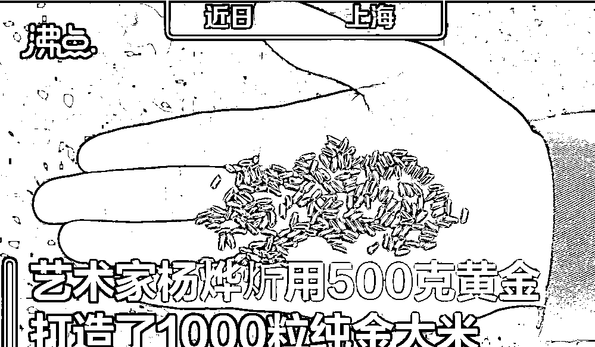
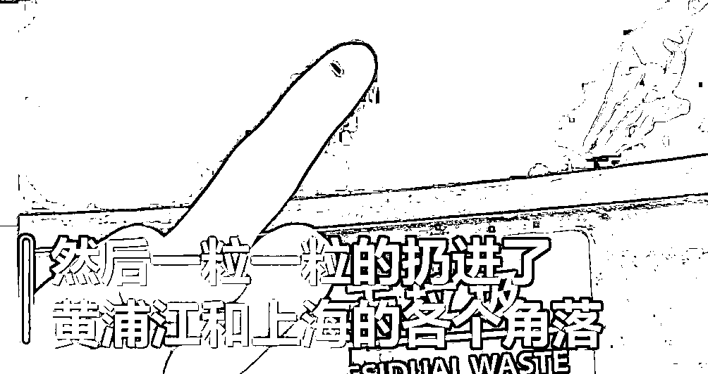
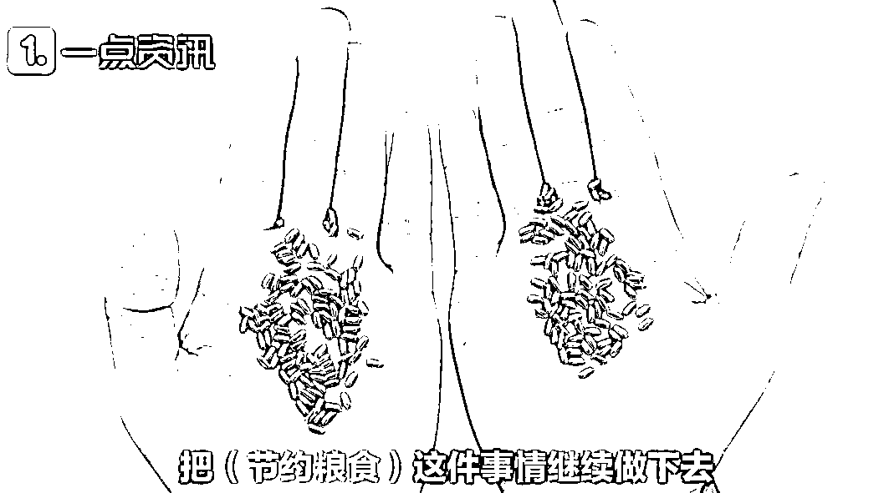
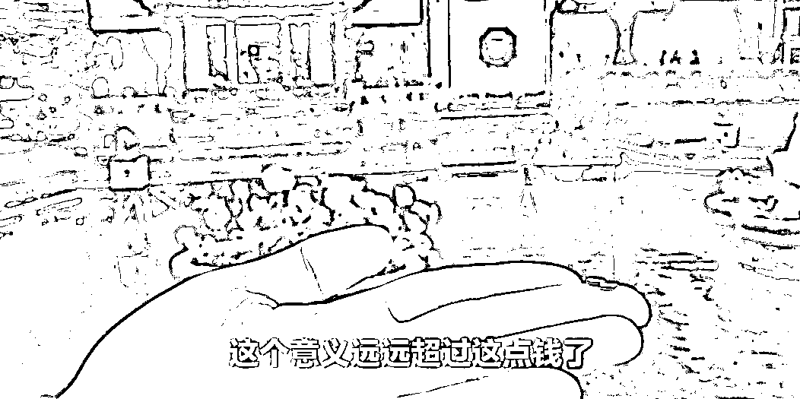
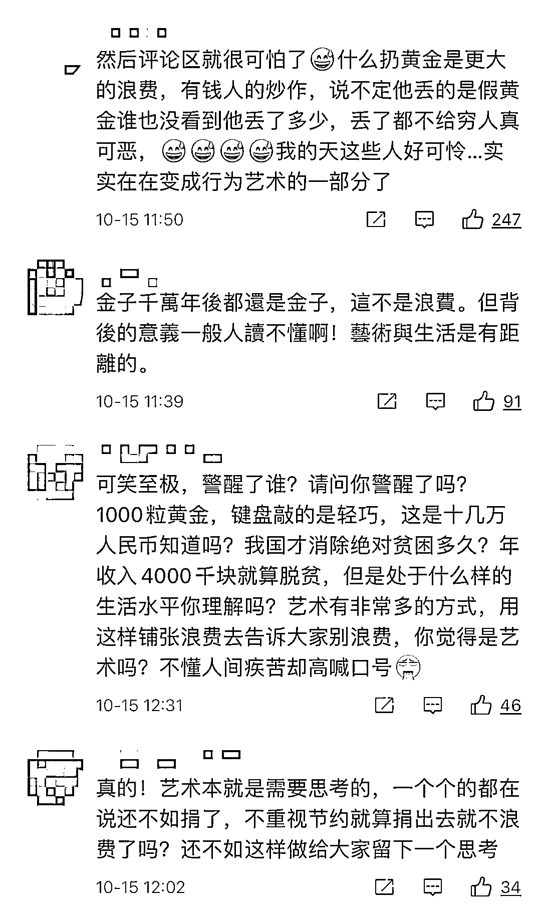
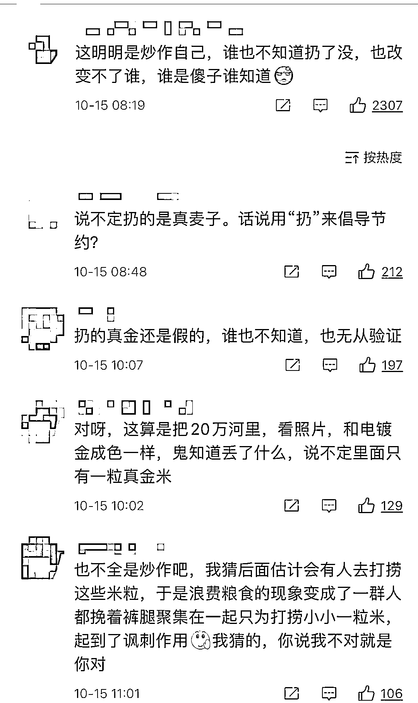

# 500 克黄金制 1000 粒纯金大米，扔进黄浦江？如此“艺术”，网友炸锅

> 原文：[`mp.weixin.qq.com/s?__biz=MzIyMDYwMTk0Mw==&mid=2247522231&idx=7&sn=6707730e6cb4c7ba9f738873cca07957&chksm=97cb5c8fa0bcd5991df150ed54d550f6cd0f7282c41319a256c53a08335613d9d97dc7778a55&scene=27#wechat_redirect`](http://mp.weixin.qq.com/s?__biz=MzIyMDYwMTk0Mw==&mid=2247522231&idx=7&sn=6707730e6cb4c7ba9f738873cca07957&chksm=97cb5c8fa0bcd5991df150ed54d550f6cd0f7282c41319a256c53a08335613d9d97dc7778a55&scene=27#wechat_redirect)

今天

是第 41 个世界粮食日

近日

艺术家杨烨炘

**用 500 克黄金打造了 1000 粒纯金大米**

**然后一粒一粒地**

**扔进了黄浦江和上海的各个角落**

他表示

**自己是以这种行为艺术的方式**

**来讽刺浪费粮食的行为**

**唤醒国民对粮食安全的重视**

探讨浪费与节俭

价值与价格

富裕与富强之间的关系

艺术家、广告创意人杨烨炘表示

他用 500 克黄金

打造了 1000 粒纯金大米

500 克黄金是什么概念？

按照金价计算

要花费 20 多万元人民币！

他表示

把这些纯金大米一粒一粒

扔进了黄浦江、垃圾桶

下水道、草丛里…

这是演绎真实版“把钱扔水里”？

“我们不浪费粮食，

我们只浪费黄金！”

杨烨炘举着手中的纯金大米说道

杨烨炘说

他想以这种行为艺术的方式

来讽刺浪费粮食的行为

10 月 16 日是世界粮食日

杨烨炘这样解释他的创意——

日常生活中有许多浪费 

普通浪费很难引起关注

只有通过极致的浪费

才能让大众认识到浪费的严重性

从而受到触动

他表示

希望唤醒大家对粮食安全的重视

建立珍惜粮食的好习惯

这个意义的价值远超过这点钱

有人质疑

把黄金扔到垃圾桶里

不也是一种浪费吗？

杨烨炘回答道：

“不浪费，

在我的观念中，黄金不如大米值钱，

因为大米比较软，比较好吃，

黄金太硬，会磕着牙齿。

现在，人们脖子外的黄金越来越重，

而脖子内的黄金却越来越轻，

我希望通过浪费黄金的行为

来重建中国人内心的黄金。”

戳视频

↓↓↓

[`mp.weixin.qq.com/mp/readtemplate?t=pages/video_player_tmpl&action=mpvideo&auto=0&vid=wxv_2091889459788038151`](https://mp.weixin.qq.com/mp/readtemplate?t=pages/video_player_tmpl&action=mpvideo&auto=0&vid=wxv_2091889459788038151)

**我国粮食浪费现状**

现在中国已经进入小康社会

部分国人不知不觉养成了浪费粮食的习惯

大量吃不完的白米饭，面条

各种食物被倒进了垃圾桶

中国粮食浪费现象全球排名第一

我国粮食流通环节损失浪费惊人

有专家估算

我国现在每年

粮食全产业链总耗损率约 12%

粮食收购、储存、运输、

加工、销售等流通环节

损失损耗的粮食大约 700 亿斤

占全年粮食总产量的 5%左右 

消费环节更是粮食浪费的“重灾区”

我国餐饮食物浪费量

约为每年 1700 万-1800 万吨

相当于 3000 万到 5000 万人一年的口粮

**网友评论**

不少网友直呼：

玩艺术也太费钱了 

“我不懂但我大受震撼”

这场行为艺术本身就是个浪费

还有网友质疑： 

这就是一个炒作行为 

不知道真假

**你怎么看待这场行为艺术呢？** 

**留言区讨论**

来源：东方网综合一点资讯、沸点视频、侬好上海、中国商报、网友评论

← 向右滑动与灰产圈互动交流 →

