# 利用虚拟币洗钱？“币圈”绝非法外之地！

> 原文：[`mp.weixin.qq.com/s?__biz=MzIyMDYwMTk0Mw==&mid=2247522231&idx=8&sn=4a47b8cd2d61c7f4296b3a63bbec9dd5&chksm=97cb5c8fa0bcd599c3787e845b2eac9394bbf609e7fc75376836d25a54d0a3326bfcd3f591ad&scene=27#wechat_redirect`](http://mp.weixin.qq.com/s?__biz=MzIyMDYwMTk0Mw==&mid=2247522231&idx=8&sn=4a47b8cd2d61c7f4296b3a63bbec9dd5&chksm=97cb5c8fa0bcd599c3787e845b2eac9394bbf609e7fc75376836d25a54d0a3326bfcd3f591ad&scene=27#wechat_redirect)

近期，深圳警方

成功打掉一个利用**“虚拟货币”**

帮诈骗集团进行**洗钱转账**的犯罪团队

[`mp.weixin.qq.com/mp/readtemplate?t=pages/video_player_tmpl&action=mpvideo&auto=0&vid=wxv_1899309576739471363`](https://mp.weixin.qq.com/mp/readtemplate?t=pages/video_player_tmpl&action=mpvideo&auto=0&vid=wxv_1899309576739471363)

2021 年，深圳罗湖警方接到某银行的举报，一名叫做贾某的男子，正在该银行办理业务，而他的**银行卡****涉及违法行为被相关部门冻结**。深圳罗湖警方立即出动将贾某抓获，随即展开调查，一个**专门帮诈骗集团进行洗钱转账的犯罪团队**逐渐浮出水面。

起初，贾某的好友王某鑫称自己最近要投资一种**虚拟货币**，但自己的银行卡不能用了，需要借一下贾某的银行卡来进行转账。

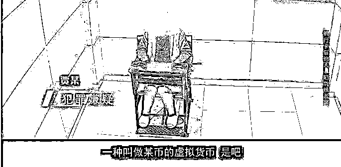

出于对好友的信任，贾某决定出借银行卡。2020 年年底的某一天，贾某被好友王某鑫带到深圳市罗湖区某酒店。房间里，陆某、沈某军等人已等候多时。

在陆某的指挥下，王某鑫快速地给贾某的银行卡拍了张照片，几乎在同一时间，就有钱转进贾某的账户。

随后王某鑫拿出另一个银行账户的照片，让贾某在手机上操作，把刚收到的钱转到这账户里。那天贾某一共操作了**6 笔**，金额共**11 万 9 千多元。 **

 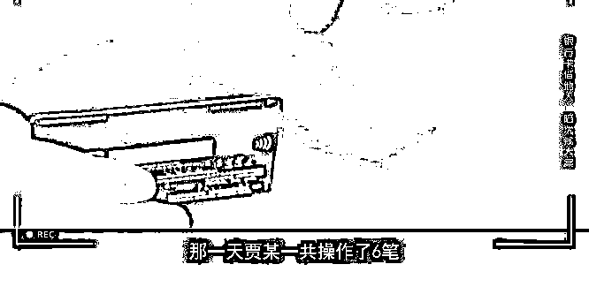

案件中，王某鑫及其犯罪团队，主要是利用网络来实施诈骗，贾某则是通过租借自己的银行卡，为他们提供了支付、结算的一个帮助，涉嫌**帮助信息网络犯罪活动罪**。

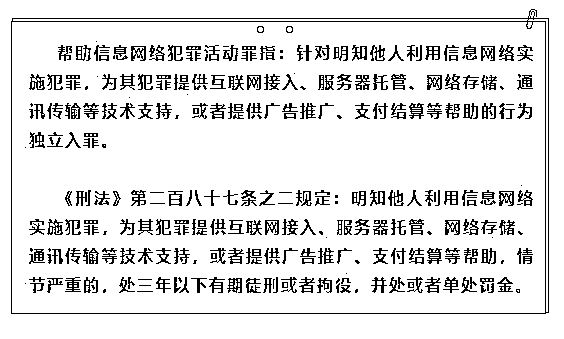

**▲帮助信息网络犯罪活动罪**

**  实际上通过他人的银行卡来 **

** 实施违法犯罪的情况近年来是比较常见的 **

2020 年 10 月份，国务院联合多部委展开了**“断卡行动”**，目的是通过阻断电话卡以及银行卡这种非法租售或者买卖的行为让犯罪嫌疑人、犯罪团队无卡可用。

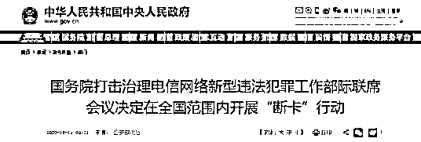

虽然有这样的一些惩戒措施和打击的措施，还是有一些不法分子在法律的边缘进行游走。

** 警方再次呼吁大家 **

**** 不要租借或出售自己的银行卡和电话卡 ****

** 小心成为犯罪“工具人”！**

经层层研判，深圳警方最终在上海将陆某抓获，至此，该犯罪团队的 9 人已全部落网。据了解，该团队分工十分明确。

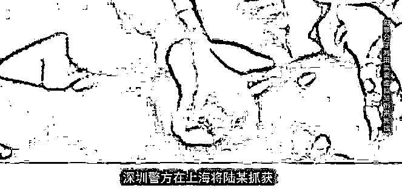

当诈骗集团需要**转移赃款**时，陆某等人便组织买虚拟货币的人和收钱转账的人到同一个酒店房间进行集中操作。

贾某是属于最底层的一个成员，只负责**出借银行卡**；王某鑫则**负责计算转换人民币和虚拟货币的汇率**；沈某军负责**租用银行卡、电话卡**；王某负责**计帐、转账，组织层下人进行银行卡操作**；陆某则负责**买卖虚拟货币****。**

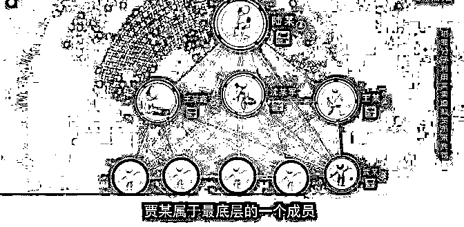

**在这一套流程下，数百万的赃款 **

** 在短时间内便通过虚拟币交易洗白 **

在此案件中，我们可以注意到两个关键词，一个是**“洗钱”**，一个是**“虚拟货币”**。 虚拟货币流转不留痕，具有**去中心性、匿名性**等特征，很多犯罪分子正是利用了这一点，来逃避打击，实施自己的犯罪活动。

在数字经济的发展之下，以区块链技术为底层基础的虚拟货币发展态势越来越强劲。同时，不法分子也开始利用虚拟货币的技术这一新生事物不断地从事洗钱、敲诈勒索等违法犯罪行为。

近年来，可以发现有越来越多首宗的案例一个个出现，比如说首宗的虚拟币敲诈勒索案，首宗的虚拟币网络攻击案等。现在**涉及虚拟币的案件已呈现一个上升的趋势**。

**江苏省南通警方破获****比特币网络敲诈案**

在“净网 2020”专项行动中，江苏省南通、启东两级公安机关联手，成功侦破一起由公安部督办的特大制作、**使用勒索病毒破坏计算机信息系统从而实施网络敲诈勒索的案件**。

警方抓获巨某、谢某、谭某等 3 名犯罪嫌疑人，其中巨某系多个比特币勒索病毒的制作者。这是全国公安机关抓获的**首名比特币勒索病毒的制作者**。截至案发，巨某已作案百余起，非法获利的**比特币折合人民币 500 余万元**。

** 苏州警方破获虚拟货币黑客****案**

在“净网 2020”专项行动中，江苏省苏州市破获一起针对虚拟货币的黑客犯罪案件，苏州园区警方通过缜密侦查，循线追踪，成功打掉了一个**负责转移虚拟货币**的团伙，抓获多名专门**利用黑客手段**盗取账户密码、窃取虚拟货币 ，通过暗网联系职业洗钱销赃团伙变现的犯罪嫌疑人，涉案金额高达**3000 余万元**。该团伙两名犯罪嫌疑人宁某、陈某均为某网络科技公司前工程师，技术水平高、犯罪手段隐秘。 

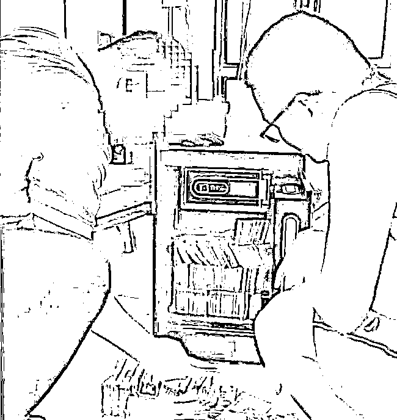

不过，随着相关法律法规的日益完善以及调查取证技术的不断更新，还有国际协助打击力度的不断加强，那些想利用虚拟币的特点来逃避打击的不法分子也必将会被一网打尽。

** 其实，除了洗钱、敲诈勒索 **

** 各种层出不穷的****“传销币”、“空气币”**

** 也给犯罪分子提供了空间 **

** 以虚拟货币为幌子 **

** 进行非法集资、传销、诈骗的**

** 犯罪行为也应运而生 **

例如，虚拟币钱包 Plus Token 用分红和奖励催促会员发展下线，通过拉人头，导致 200 万人卷入传销组织，涉案金额超 400 亿元。还有传销组织，自称“国币”、用“天河二号”运算，以提供虚拟数字货币增值服务为幌子，进行非法集资、传销、诈骗活动。

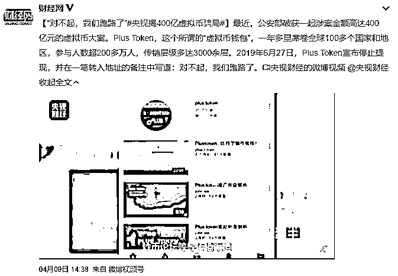

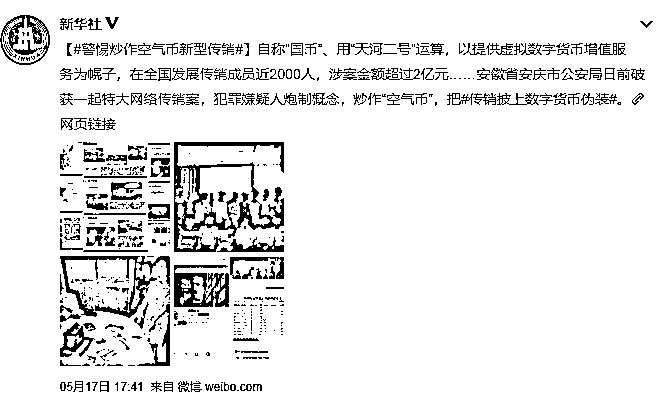

这些犯罪分子通常通过吹嘘自己有最先进的区块链的技术或者最先进的一个算法，然后人为的创造了各种**“空气币”**，以高额的回报、高额的收益为来诱惑网民、投资者来投入其中。但是，这些“空气币”**没有实物依托、不具备应用价值**，所涉及到的所谓的虚拟币或者是交易全都是**虚构**的，集资参与人最终将遭受惨重经济损失，甚至**血本无归**。

2018 年 8 月份，银保监会、中央网信办以及公安部也是发布了一个风险提示，告诫大众一定要**警惕利用虚拟币或者区块链的名义来进行非法集资的犯罪类型**。

**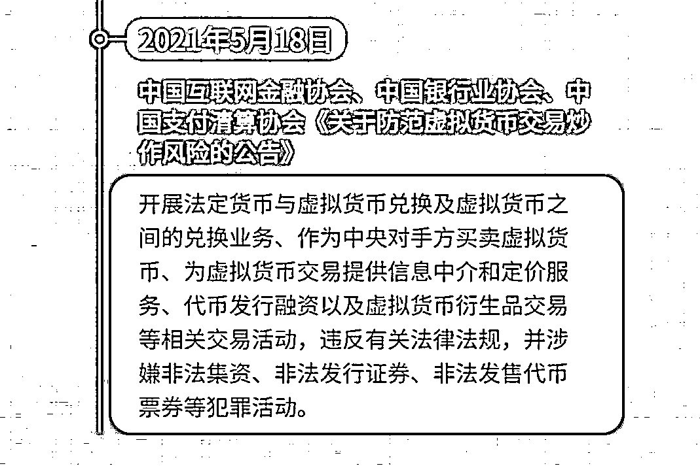**

**** 对于公共机关来说 ****

**** 币圈绝对不是法外之地 ****

**** 虚拟货币严格监管的脚步从未停止 ****

**近期，虚拟货币价格暴涨暴跌，虚拟货币交易炒作活动大幅反弹。面对乱象横生的“币圈”，中国互联网金融协会、中国银行业协会、中国支付清算协会联合发布公告。**这一公告作为风险警示，给虚拟货币市场乱象敲响警钟。****

**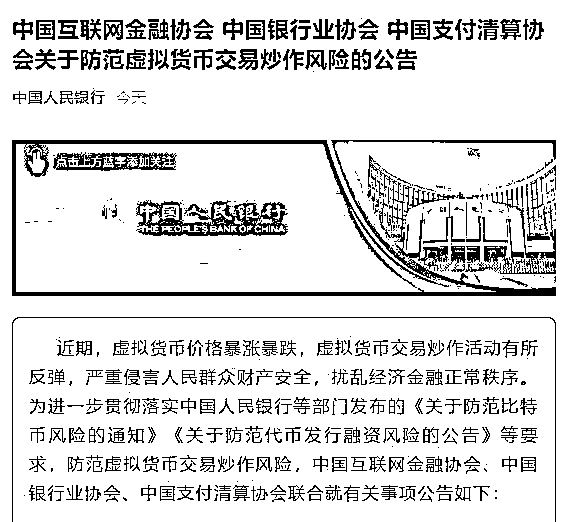**

**公告明确提出，虚拟货币是一种特定的虚拟商品，不由货币当局发行，不具有法偿性与强制性等货币属性，**不是真正的货币**，不应且不能作为货币在市场上流通使用。**

**公告提示，虚拟货币**无真实价值支撑**，价格极易被操纵，相关投机交易活动存在**虚假资产风险、经营失败风险、投资炒作风险**等多重风险。从我国现有司法实践看，虚拟货币交易合同不受法律保护，投资交易造成的后果和引发的损失由相关方**自行承担**。**

**公告显示，开展法定货币与虚拟货币兑换及虚拟货币之间的兑换业务、作为中央对手方买卖虚拟货币、为虚拟货币交易提供信息中介和定价服务、代币发行融资以及虚拟货币衍生品交易等相关交易活动，违反有关法律法规，并涉嫌**非法集资、非法发行证券、非法发售代币票券**等犯罪活动。**

****警方提醒：****

**虚拟货币无任何有形资产担保，价格波动剧烈，投资者极易遭受损失，同时虚拟货币未对投资者提供任何法律保护，也未充分提示风险，投资者只能**自担损失**。在国家进一步严格监管的同时，消费者还是要**增强风险意识**，不参与虚拟货币交易炒作活动，同时**警惕虚拟货币诈骗**，谨防个人财产及权益受损。**

**来源 : 深圳网警巡查执法，巴蜀反诈**

****

**← 向右滑动与灰产圈互动交流 →**

****