# 小红书致歉！

> 原文：[`mp.weixin.qq.com/s?__biz=MzIyMDYwMTk0Mw==&mid=2247522310&idx=3&sn=9f0079b66e1a9f61677e7ae8a003bf00&chksm=97cb533ea0bcda2820912c73c892360cf6fc6786fde27f52ea2c603bb7898d3eb608d7312d8a&scene=27#wechat_redirect`](http://mp.weixin.qq.com/s?__biz=MzIyMDYwMTk0Mw==&mid=2247522310&idx=3&sn=9f0079b66e1a9f61677e7ae8a003bf00&chksm=97cb533ea0bcda2820912c73c892360cf6fc6786fde27f52ea2c603bb7898d3eb608d7312d8a&scene=27#wechat_redirect)

不知道大家有没有过这样的经历： 

看到网上推荐的“拍照圣地” 

精致的画面、舒适的光影

惬意的表情……

自己兴冲冲跑到现场一看 

就这？

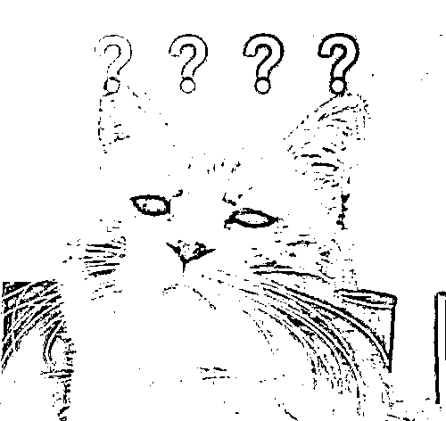

近日

众多网友发文吐槽

在小红书平台上看到

被过度修饰的风景图

实地探访后发现落差很大

产生了被欺骗的感受 

10 月 17 日

“小红书”在其微信公号发文

就网友关于“滤镜景点”的吐槽

发表声明并道歉

**承认部分用户**

**存在过度美化笔记的情况**

**今后将尝试推出**

**景区评分榜、踩坑榜等产品**

**便于用户获取更多元的信息** 

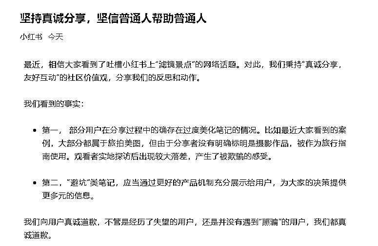

10 月 14 日

有网友在微博上发文：

“#我再也不相信小红书了#

分享一则之前被小红书打卡文欺骗

（不完全，也怪我没看仔细）的故事”

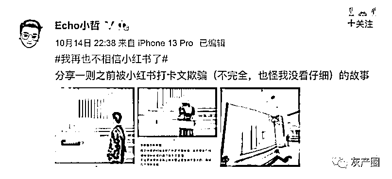

上面三张图里 

前两张来自小红书截图

人置身于一条阳光充盈的长廊 

画面简洁又明朗

推荐者更是配以“小众免费”

“拍照圣地”“超出片”等文字 

显得格外诱人 

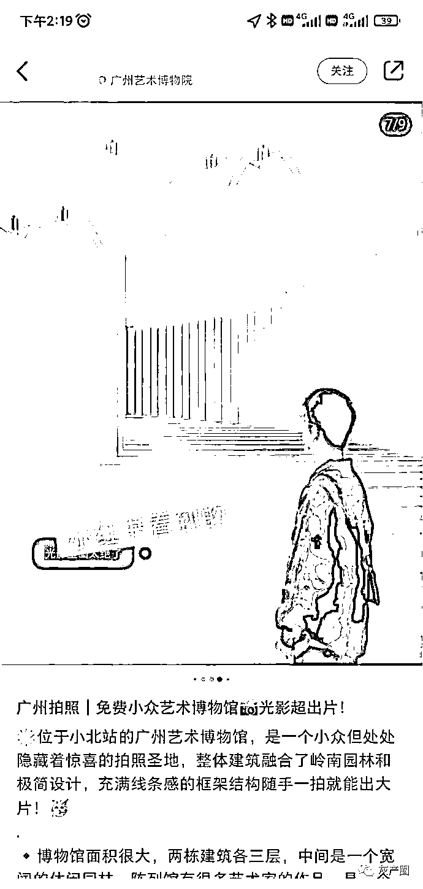

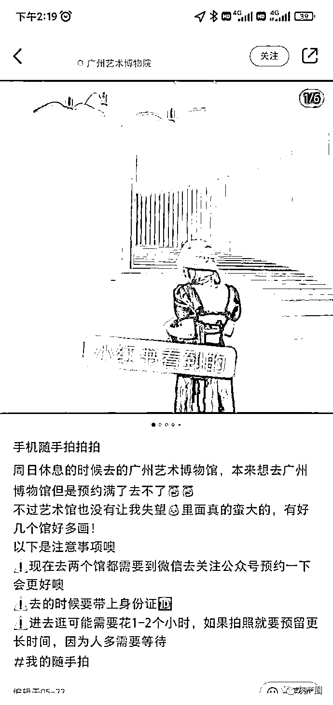

而当网友实际抵达现场后

发现这里其实只是一面墙

墙上是用壁纸

营造出来的 3D 视觉效果

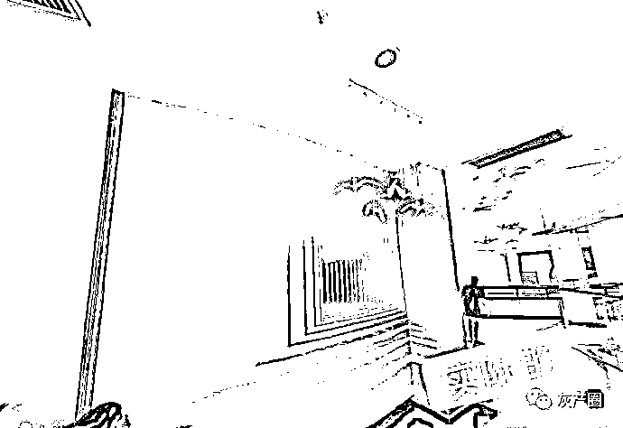

随手一搜 

某宝上还真有卖的

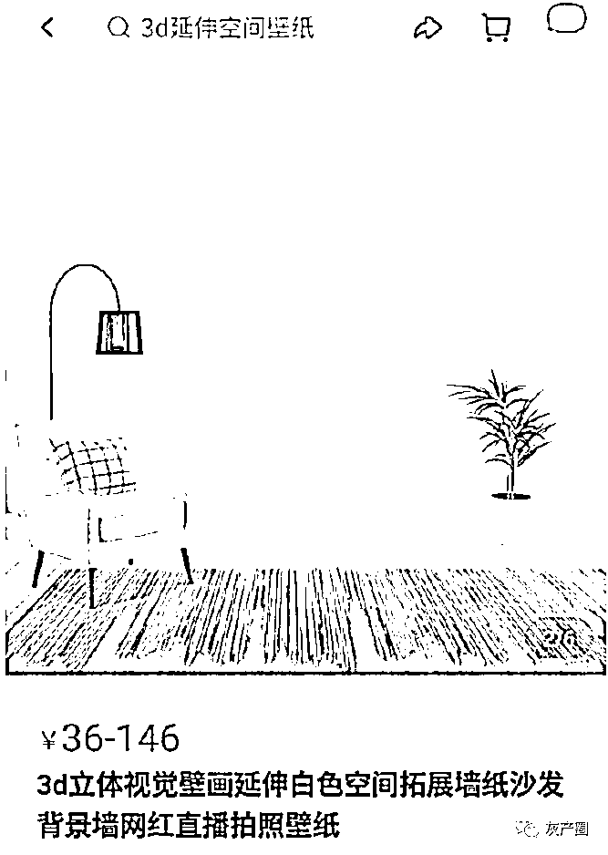

还有网友直言：

小红书真的害人

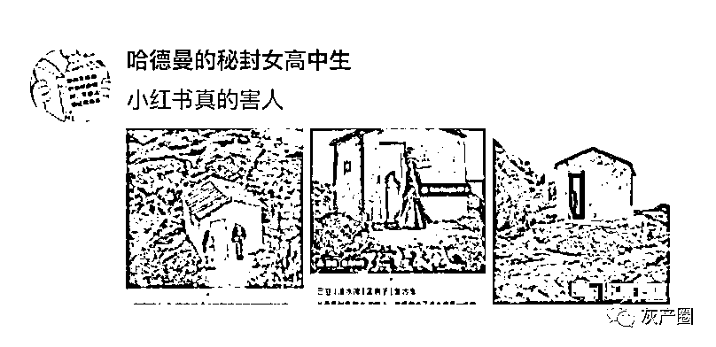

和前述网友一样

前两张配图是小红书用户的分享

照片里三亚风景的画面

显得静谧又浪漫

配文则是

“电影感”“免费”“小众”等文字

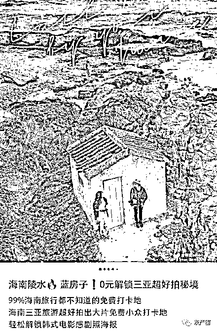

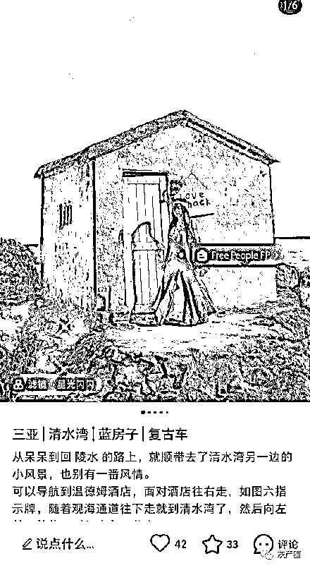

而当该网友到了实地后发现

这处风景长下图这样

小房子门前杂草丛生

门也都掉在地上了

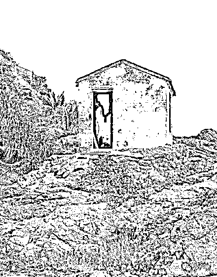

之后 

不少网友也产生共鸣

分享了各类“照骗”

👇

**北京国贸的一家咖啡店**

**号称能拍出“上海大片”**

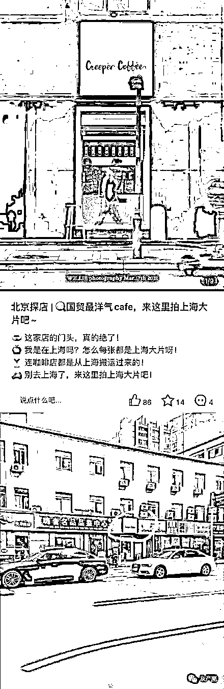

**天津一个图书馆满是“墙书”**

**实际是贴的壁纸**

**成都周边的“金色麦田”**

**和 Ta 实际拍到的**

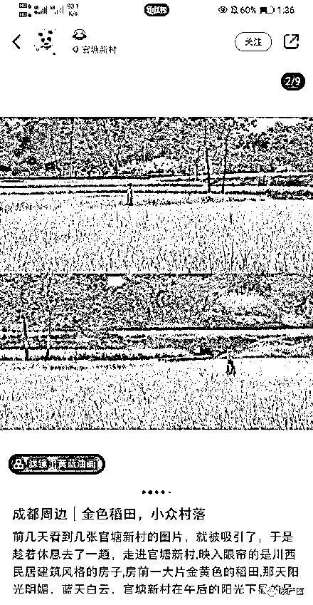

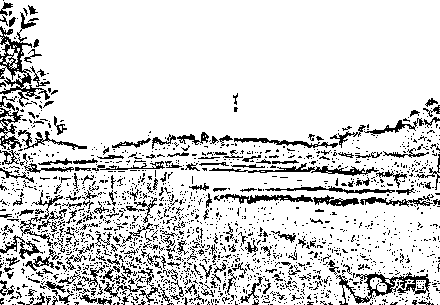

对此 

生活方式平台“小红书”

今天在其微信公号

发表了声明并道歉

主要内容如下

↓

最近，相信大家看到了吐槽小红书上“滤镜景点”的网络话题。对此，我们秉持“真诚分享，友好互动”的社区价值观，分享我们的反思和动作。

我们看到的事实：

第一， 部分用户在分享过程中的确存在过度美化笔记的情况。比如最近大家看到的案例，大部分都属于旅拍美图，但由于分享者没有明确标明是摄影作品，被作为旅行指南使用。观看者实地探访后出现较大落差，产生了被欺骗的感受。 

第二，“避坑”类笔记，应当通过更好的产品机制充分展示给用户，为大家的决策提供更多元的信息。

我们向用户真诚道歉，不管是经历了失望的用户，还是并没有遇到“照骗”的用户，我们都真诚道歉。

《小红书社区公约》有过明确倡议：

请尽量避免过度修饰，尤其是在美妆、穿搭、探店等为他人提供建议的领域。

小红书社区之所以广受欢迎且长期繁荣，核心原因是社区里活跃着一群乐于为他人提供真诚建议和帮助的成员，他们持续不断地分享真实、多角度的内容。人人皆有爱美之心，你可以适度美化笔记内容，但请记住你分享的内容，随时可能会被他人当作决策依据，因此修饰和美化的度，以不产生误导为衡量标准。

我们希望分享者坚持社区公约的准则，同时在小红书内部，已经有多个部门行动起来——我们已经启动了一系列运营活动，鼓励小红书发布者做有用而非美化的分享；在大家搜索某个景点的时候，我们也会提供更丰富的搜索联想词，对“避坑”等内容作更多展示；我们还会尝试推出景区评分榜、踩坑榜之类的产品，便于大家获取更多元的信息。

一句话总结：我们将竭尽全力帮助大家在小红书 App 获得更全面的信息。

来源：澎湃新闻综合自小红书微信公号、北京日报

← 向右滑动与灰产圈互动交流 →

# 

> 原文：[`mp.weixin.qq.com/s?__biz=MzIyMDYwMTk0Mw==&mid=2247522310&idx=4&sn=6acc30d0ddf30e462e63df8786311ad3&chksm=97cb533ea0bcda28efe078eb62dd4528106ddf7a513f0ad7a149cdb3184259e14a20cadeb4d3&scene=27#wechat_redirect`](http://mp.weixin.qq.com/s?__biz=MzIyMDYwMTk0Mw==&mid=2247522310&idx=4&sn=6acc30d0ddf30e462e63df8786311ad3&chksm=97cb533ea0bcda28efe078eb62dd4528106ddf7a513f0ad7a149cdb3184259e14a20cadeb4d3&scene=27#wechat_redirect)