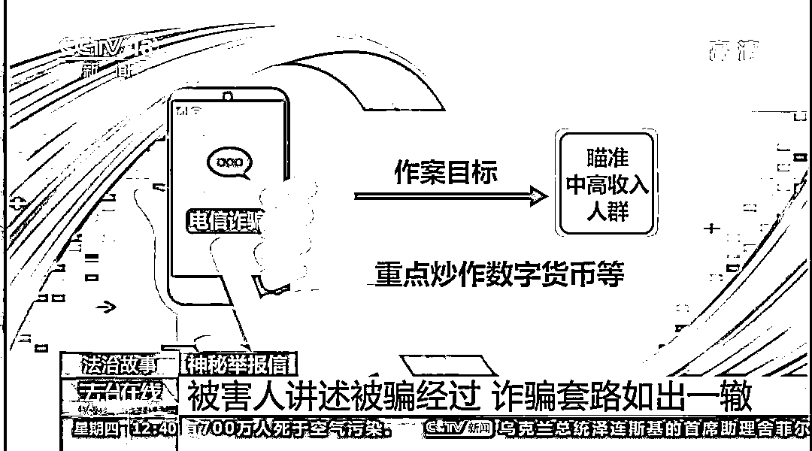

# 特大“杀猪盘”侦破纪实：境外密信，电诈举报人遭追杀，赴菲律宾抓获 342 人！

> 原文：[`mp.weixin.qq.com/s?__biz=MzIyMDYwMTk0Mw==&mid=2247522310&idx=5&sn=20661dc9222ca6045376865db1d6623b&chksm=97cb533ea0bcda28a43ea508ff9d0ab20e0669567e0cc18c44dd75338f1c24aa502f5f370dbd&scene=27#wechat_redirect`](http://mp.weixin.qq.com/s?__biz=MzIyMDYwMTk0Mw==&mid=2247522310&idx=5&sn=20661dc9222ca6045376865db1d6623b&chksm=97cb533ea0bcda28a43ea508ff9d0ab20e0669567e0cc18c44dd75338f1c24aa502f5f370dbd&scene=27#wechat_redirect)

[`mp.weixin.qq.com/mp/readtemplate?t=pages/video_player_tmpl&action=mpvideo&auto=0&vid=wxv_2081787381380087815`](https://mp.weixin.qq.com/mp/readtemplate?t=pages/video_player_tmpl&action=mpvideo&auto=0&vid=wxv_2081787381380087815)

今天我们来关注一封警方收到的神秘网络举报信。举报信是由菲律宾奎松市发出，而就在举报信发出前一个月，我国公安部派出了一支工作组，就是前往菲律宾奎松市与当地警方展开合作。所涉及的案件正与举报信所写内容相关。

经过核查，举报信是由犯罪团伙中的一名成员发出。为此，**举报信的人还在被追杀。**那么中国警方要如何帮助举报人？虎口脱险呢？菲律宾奎松市是菲律宾首都马尼拉的卫星城市，是菲律宾的第四大城市，也是主要的经济、文化、政治和交通中心。 

2019 年 12 月 19 号的晚上，在奎松市警察局的停车场里，有一对中国警察正站在警车旁，一边吃着快餐，一边商量着什么。他们计划前往当地的一栋高端写字楼全球贸易中心大厦，与菲律宾警方协同，对一个涉嫌电信网络诈骗的犯罪团伙窝点进行收网。

数小时后，行动开始了，我国警察作为观察员现场参与。谁在哪坐地上坐地，你们这一条全部出来，**全部出来，动作快点，不要动，不要动，都是荷枪实弹，就不比国内就不比国内。**

在 12 月 19 日晚上，我们联合菲律宾警察局对该窝点开展了集中收网行动。警方进入到窝点后，发现在上千平米的办公区内，**摆放着近千台电脑，操纵电脑的人大部分来自国内，电脑屏幕上有国内股票交易平台涨跌幅曲线、****虚拟数字货币交易平台**。

还有他们同时和数名被害人聊天的页面。

这次集中行动，我们共抓获**中国籍犯罪嫌疑人 342 人，缴获手机 7700 多部，电脑电甚至产品三百多部****。**这个养号是吧，这应该都是养号的。在另一间屋子里，几个架子上摆放着七千多部手机，手机都安装了自动运行的程序，**正在进行所谓的养号**。当这些微信号养成后，就成为了犯罪团伙对被害人进行诈骗的作案工具。这次我国警方赴菲律宾工作组与菲律宾警方展开警务合作，一举端掉了这个诈骗窝点，**涉案金额达到数 10 亿元**。2019 年的 12 月 19 号。

所以我们这个案件就叫**1219 专案。** 

这场行动为何能一击即中，警方又是如何掌握犯罪线索的呢？在 12 月 19 号行动的前一个月，在相同的地点，菲律宾奎松市全球贸易中心，一封神秘的举报信被发送到我国警方的电子邮箱内。民警调查后发现，举报人很可能是涉案犯罪团伙的一员，中国籍男子王某。他举报称自己深陷一个犯罪集团，正在对国内的几百名被害人进行诈骗活动。接到王某这封网络举报信的时候，湖北孝感公安正在侦办一宗大额电信诈骗系列案件，已经有半年时间。在这些案件中，**被害人的损失金额少则几十万，多则数百万元，已经赔了 93 万多，就已经没法再投进去了。**而且这些钱不是我自由资金，而是我一些生意上的一些营运资金。结果对生意上的影响非常的大，整个人是崩溃了，你的家庭都散了。

三十几万，根据被害人的描述，他们被邀请进入所谓**投资理财聊天群****前，还有一项专门的验资环节，一旦现金数额低于 20 万 ，连进群资格都没有。**至于这几起电诈案件的犯罪套路，警方调查后发现，与**大多数杀猪盘几乎一样，邀请被害人进微信群，由金牌导师在线授课，群友纷纷晒赚钱截图，被害人经不住诱惑，开始投钱，最终血本无归。**

不过，这伙犯罪嫌疑人的作案目标更为明确，那就是瞄准中高收入人群，甚至重点炒作。绝大多数被害人此前听都没听过的数字货币等投资大神。这个思维老师会逐渐给你抛出一个观点，炒股票远远比不上炒虚拟币。虚拟币的收益要更大。然后逐渐将我们的受害人慢慢的引入到这个交易所谓的虚拟币交易平台里面的。然后完成从股票投资到兄弟投资的这种转变，就是 USTD，那些我也大致知道他们可能说的这个平台也在那个网络上有相应的投放。类似于这种宣传的那些广告文章，我是实际上是没有真正的操作的。就是入了资金之后就被打掉了。

我是在 2019 年的 7 月 18 号开始入境，第一笔是 18 万多，不到两二十万。后来跟着老师三站一第一章第二章、第三章。因为他这种操作，它这种盘子封闭盘，他没有跟市场接轨的，资金没有流入市场，就流入他们的腰包。然后他这种走势是完全可以人为操控的，在后台可以操控的。其实多数被害人在刚入群时还是十分谨慎的，并没有立刻投资。但是群里的所谓**股神讲师**会通过讲课对被害人反复灌输挣大钱的观念。群里还有不少托，与这些被称作大师的人呼应，显得十分懂行情。如此这般，没过多久，许多被害人就被洗了脑，投入大笔资金。我们在这 45 天的一个学习中，如果说你基础好，那么你在这 45 天，你就太一一个更大的台阶。如果说你基础不好，那么我们在那有一个小小的进步，我想这都是一种成长。这两天一直忙着整理。我希望大家周末的时候，把这里面的东西好好的去学习一下，复习一下。因为这个东西我讲了两遍了，有的票先冲高后回落，对不对？有的票震荡小幅回落，或者有的票还在上涨。**一般每一个微信群，像我在那个群差不多 100 个左右，100 个人左右。**

他们对老师提出的这些问题都是在复合，所以感觉到那个真实性很高。

哪怕是有些提出质疑的话，他们又被踢出去了，所以基本上都没有群，里面没有什么其他的杂音，就变成老师的那个技术非常的高超。就像股神一样。不仅如此，这些所谓的讲师还宣称会带着不熟悉操作的被害人手把手一点一点进行投资，起初甚至会让被害人有一定的获利，有一点点账面上的获利，大概 10%左右都有。

实际上有时操作的好，一天就一个晚上都可以，百分之二三十都有无线团队是有一个完完整整的一个时间表。前期通过一个月两个月，我们这段时间完完全全的是不会骗你一分钱的。这段时间都是在所谓的养猪，养猪的目的就是让你完完全全的去相信他们，把你的钱，把你的投资的能够拿出来的钱全部榨干，全部投入到我们这个所谓的平台里面。 

而这实际上都是**杀猪盘诈骗方式的典型手法。**

他们把被害人称为猪，实际目的都是为了把猪养肥再进行收割，获取更大的利益。而被害人往往都蒙在鼓里，以为是将资金投入到一些看似正规的购买数字货币的平台。不过不久他们就会遭遇平台关闭或将资金赔光的情况。

**警方侦查发现，这些平台的服务器都架设在境外，而且都指向了同一个地理位置。** 
逐步的发现这整个犯罪团伙的线索都指向了一个境外的一个东南亚国家。办案民警通过侦查，将犯罪团伙所在地锁定在了菲律宾。同时他们发现还有多桩手法不同、风格迥异的电站案件也与这个坐标有关。也就是说，在境外某处，警方锁定的位置很可能存在着远远不止一个诈骗团伙。派了一帮人到菲律宾去出境去开展侦查工作。公安部将此案列为部督案件，由湖北警方主办。2019 年 10 月，公安部派出副菲律宾工作组到当地展开线索侦查。同年 11 月，警方就收到了举报人王某发送的举报信，而民警调查锁定的涉案犯罪团伙正是举报人王某所在的公司。

于是，他们立刻与王某取得联系，提出要与他见一面，与举报人见面。警方要弄清楚几个疑点，首先就是举报人王某为何会发出这封举报信，以及他是如何加入到这个涉嫌诈骗的公司里的。为了保护好举报人，警方选择了一处人少的海边，与王某约见举报的那个名男子。**他是在 2019 年出通过那个网站招聘，然后通过上海蜥蜴贸易有限公司以海外招聘工作人员的方式，通过这家公司，直接到飞云参加了一些诈骗集团的一些工作。**

据王某讲述，他在入职公司的时候，并不明确到底要做什么。这个诈骗团伙，他在我们境内是专门搞网上招聘，就是以招人的名义招过来之后，就是他设置一些你基本上不可能完成的指标。然后如果你完成不了就要辞退，同时他就跟你说有一个工作机会，你到菲律宾去，这个薪资待遇比国内也高。然后工作这个难度也容易，就这样把他们一批一批的查那边输送人员。不过那是对方给出的薪资待遇非常诱人。王某同意了，他和几个同事一起进行了所谓的员工培训，之后一起到了菲律宾。但是**刚下飞机，他们的护照就被没收了**，这让王某等人嗅到了一丝不寻常的气息。他们就是公司上层就设置的，就是说我给你签证统一保管了，然后到时候统一办签证了，办延期，就这种名义把他们的护照留着他们，他们**在这个公司都是集中住宿，集中上班，所以对他们来说，人身自由基本上没有完全的人身自由。**当王某接触到工作内容后，他意识到自己参与的是涉嫌诈骗的犯罪行为。 

他们可能最初进去的时候，实事求是的说，**很多是大学生求职进去的，但是他们没有擦亮眼睛。进去了之后基本上工作个三五天就会知道自己是在搞电信诈骗。**他是面向中国大陆不特定的对象，他是设计了一个平台，然后通过底层的业务员引流之后，就是包装成炒股大师，跟你聊天，然后我给你推荐股票什么，然后把这些人吸引进去了之后，然后给你推荐炒虚拟币。然后在里面把钱输进去之后，他们通过这个设计的平台调节杠杆，带包括一些炒股大师，带你反向操作，这样就把把你的资金把你诈骗干某某并不想继续参与诈骗。**他提出辞职想要回国却遭到了拒绝。你是公司花钱，然后招募过来的，你要走的话，必须要把公司的钱要赔了，而且是远远大于他们当时来的那种价格的**。

另外一点就老团队的老板会告诉这些员工，你要走的话，我们肯定是会有一些其他的手段。也就是说说白了就是人生威胁的一些话，就是在这样的情况下，王某搜索了国内公安机关的联系方式，悄悄在网络上对他所在的公司进行了举报。根据他提供的线索，赴菲律宾工作组的警察很快摸清了涉案公司的具体位置与公司架构等关键信息。

然后我们要求那个举报人在安全的前提条件下，然后发挥了一些窝点内部的一些情况和资料。桌子上面有摆放了大量的手机，然后他们的屏幕上是一些跌幅涨幅的那些线条，我们看的是非常明确的。然后我们通过一些蹲点守候，发现这个公窝点的门口有保安进行值守，对车辆运输的次数、人数进行鉴定，进行分析，发现这个窝点大约人数在四百多人左右，因此初步掌握了这个公司的规模。

综合举报人提供的线索，经过国内外工作组的共同研判，警方得到了一个十分重要的信息，进行了为期一一周的模拟盘的训练。发现这些说话人基本上百分之百的都能得到很高的回应。2019 年 12 月 15 日正式的盘点正式上线。然后我们收到消息之后，这个正式盘收割时间应该是为期一周，12 月 15 日开始正式接纳他们入侵。12 月 23 日网站进行关闭，进行所谓**诈骗集团的收割行为，让受害人颗粒无偿模拟盘使用的是虚拟资金，而正式盘就需要投入真实资金进行实盘操作了。**

一旦涉案犯罪团伙的正式上线，被害人将资金投入，就会导致他们的财产受到损失。于是，警方决定在犯罪团伙的正式盘上线之前展开收网行动。就在民警商量具体抓捕方案的时候，他们突然收到举报人王某的消息，他的举报行为被犯罪团伙发现了。

王某在与警方见面后并没有离开犯罪团伙的窝点，而是选择留在那里继续收集消息，甚至劝服其他的成员一起合作。王某的计划本来隐蔽又顺利的进行着。然而一个意外让他彻底暴露了出来，犯罪团伙甚至对他发出了追杀令。当然我们在对这个公司进行侦查的时候，那个公司由于这个举报人在公司内部的一些活动，他不仅仅自己在举报。

同时由于跟我们公安部进入菲律宾工作组的接洽，然后他还在公司内部说服一些其他的业务员，想跟他一起来回国，就是终止这种诈骗行为。 

于是，王某争取了五名一起工作的业务员，说服他们终止诈骗行为和警方合作。当他在争取第六名业务员的时候，却出现了意外。那个业务员由于跟那个组长关系比较密切，所以他把这个情况就向组长举报了，**他们的诈骗集团就开始对他进行封杀。他当天晚上收到信息之后，连夜的采取把五个人都秘密的带出了公司，然后跟我们取得了联系。很快，犯罪团伙对王某发出了追杀令。**工作组民警收到王某等人的消息后，迅速与他们汇合，帮助他们逃避追杀。我们接到这种信息之后，把他们接到之后，躲避了公司的追捕，然后秘密的把它转移到一个离公司很远的一个地方小旅馆。毛某等六人暂时安全了。**但是诈骗集团对这些被他们成为叛逃者的对象，发出了追杀令，甚至还点名要买我国警方赴菲律宾工作组负责人的人头酬金 5000 美元，希望将中国警察吓退**。

与此同时，王某还告诉民警，就在他们逃离公司前还发现犯罪嫌疑人加快了诈骗进度，提前推进诈骗平台收割被害人。警方得到消息后，一方面加强自我防护和对王某等证人的保护，另一方面加快部署收网行动。2019 年 12 月 19 号，警方开展了收网行动。

警方这次抓获了数百名犯罪嫌疑人，但是他们并未就此停止行动。因为抓到的人基本都是相对底层的业务员、组长等幕后的大老板仍未浮出水面。当时抓捕这些人之后，我们发现这些人成绩比较分明，有的是业务员，有的是小组长，有的是组长，有的是总监。而且还有一些物业管理公司对这些诈骗成员单位开展一些行政管理，包括提供一些平台。所以说这个物业公司的幕后老板应该来说是这个诈骗团伙的最上层。通过电子证据，我们发现的这些层级关系之后，在菲律宾的工作期间逐步对他的成绩结构进一步的细化落实。落地到每一个人绘制了层级结构图。应该来说把各级的这个犯罪集团的层级结构，幕后金主都基本上搞清楚了。警方侦查后发现，这批将公司设在菲律宾的电信诈骗团伙，都涉及同一个幕后人物黄某。在外人眼中，他只是一名企业家。那么工作组是如何发现他涉案的呢？他对菲律宾政府那一块说是**投资理财类，搞金融类的现代化的一些公司。但是实际上他秘密的又申请了菲律宾合法的博彩牌照，但是仍然从事的是那种虚拟投资理财的诈骗行为**。

境外诈骗窝点被一举端掉后，国内警方又相继将为主要犯罪嫌疑人黄某搭建涉案诈骗平台的技术人员招工到境外的负责人抓获。得到这些消息后，黄某坐不住了。他是知道他们这个公司打了他，就是希望回国来寻求找一找关系，来寻求怎么把这个事儿解决的。

2020 年 1 月，黄某定好了回国的班机，准备悄悄回国。这条重要的信息被警方掌握后，围绕他的大网终于撒开。当时他是入境之后，他在飞机上我们的人就上去，就是没有让他下飞机，就是他在座位上把他抓的。至此，1219 跨境网络诈骗案告破案件目前已移交孝感市人民检察院审查起诉。

来源：央视新闻、天下有诈、昆明反电信网络诈骗中心

← 向右滑动与灰产圈互动交流 →

