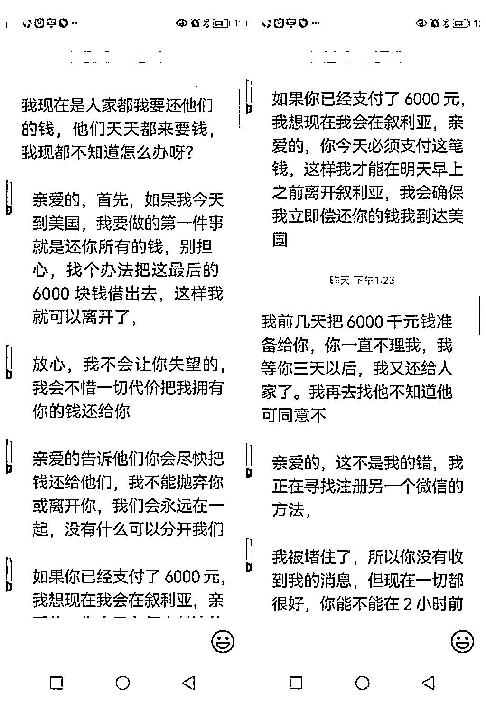

# 73 岁老太落入“爱情”陷阱：被“外国男友”诈骗 25 万余元！

> 原文：[`mp.weixin.qq.com/s?__biz=MzIyMDYwMTk0Mw==&mid=2247522310&idx=6&sn=80e5d6e3eb65549509bb29f43bb9943f&chksm=97cb533ea0bcda2852ca76d90a2d7bcd33c27199c76886f5d2c68aeaa7032e6e238df0081326&scene=27#wechat_redirect`](http://mp.weixin.qq.com/s?__biz=MzIyMDYwMTk0Mw==&mid=2247522310&idx=6&sn=80e5d6e3eb65549509bb29f43bb9943f&chksm=97cb533ea0bcda2852ca76d90a2d7bcd33c27199c76886f5d2c68aeaa7032e6e238df0081326&scene=27#wechat_redirect)

世界之大，无奇不有。近日，池州市石台县发生一起离奇的电信诈骗案，一位 73 岁的老奶奶居然遭遇一场“迟来的异国恋”，被甜言蜜语的“美国大兵”电信网络诈骗达 25 万余元。

近日，73 岁高龄的朱女士来到石台县公安局刑侦大队报警，称自己被骗了 20 多万元。见老奶奶面容憔悴，民警劝慰她不要着急，让她把受骗经过陈述清楚。

朱女士陈述，自己在今年 4 月底，通过微信添加了一个名叫罗伯特·梅森的外国好友。罗伯特自称是“美国军人”，是“美军上将”，现在叙利亚当兵打仗，只会打字不会说中国话。之后的两个月，这位“美国大兵”一直和朱女士保持联系。随着两人关系的“热乎”，罗伯特有意无意地告诉朱女士，他不想再继续待在叙利亚打仗了，想要过安宁日子，并称准备先回美国，然后去北京买房，以后就在中国生活。他承诺，到中国就来找朱女士，和她一起生活。通过两个月的交往，这位“美国大兵”终于俘获了朱女士的芳心。

6 月底的时候，罗伯特说要给朱女士寄东西，向朱女士索要了身份证照片。7 月中旬，罗伯特称寄包裹过海关要收取关税、让朱女士垫付，并发来一个银行卡卡号。当天，信以为真的朱女士就去银行给他转了 10000 元。此后，罗伯特先后以“包裹有问题”、要支付“关卡费”、邮寄费等各种名目，多次要求朱女士转账，并花言巧语地欺骗道：“亲爱的，如果你真的想让我们在一起，请先让我离开这里。你是我的妻子，我是你的丈夫，这个世界上没有什么可以把我们分开……”

朱女士深陷“美国大兵”爱情陷阱，不顾手机的提示，不睬银行工作人员的劝阻，先后以微信转账、支付宝转账、银行柜台转账等方式，多次转账到罗伯特提供的多个账号、收款码，累计金额达 25 万余元。

 民警：“你和微信上那个罗伯特·梅森见过面吗？”

“没有，我跟他在微信上开过视频聊天，对方讲话我也听不懂，我看对方确实是外国人，年纪比较大，鼻梁比较高，头发是黄色的，我们基本上都是通过打字的方式聊天的。”

民警：“对方是通过何种方式使你上当受骗的？”

“他先以恋爱为名和我套近关系，然后讲自己是美国军官，要给我寄包裹，之后又以过海关需要海关税关卡税等各种名义让我转钱，还说如果不转钱就要犯错误可能要坐牢，我就这样一步一步被套进去了。”

民警：“你之前是否接受过反电诈宣传？”

“接受过，但是我也没想到这种事情会发生在我自己身上。”

幸运的是，朱女士及时醒悟并报警，避免了更多的经济损失。目前，此案在进一步侦办中。

**警方提醒，**冒充外国士兵“网络婚恋”、交友类诈骗，大多以收包裹邮寄费、关税费等理由诱导被害人转账实施诈骗。“美国大兵”电信网络诈骗套路“四部曲”如下：

1\. 大兵形象获取信任。冒充美国大兵，随机添加好友，聊天试探，使用网上照片，利用美国大兵照片获得信任。

2\. 蜜语甜言俘获芳心。自称是外国人，不会汉语，但奇怪的是都擅长手机打汉字，无论是午后还是夜晚，总有无微不至的关切。

3\. 私定终身托付财产。“私定终身”后继续抛出重磅，称自己有巨额财产、重要物品只能托付给别人保管。

4.设下套路骗取钱财。巨额财产只能邮寄，而且必被海关查扣。过关需要缴纳费用，但相比“巨额财产”，代交这笔费用很划算。

该种套路目前已出现升级版：骗子不仅是中国人，还可能是外国人或受雇佣的外国人，通过直接视频的方式骗取被害人的信任，再通过一名外国人与被害人直接见面打消疑虑（随着国内打击力度的加强，见面地点逐渐选择在国外），综合利用“线上+线下”的方式进行诈骗。

**反诈提示**

1、骗子自称海外人员，但英语水平有限，使用词汇简单，句子语病较多，有些情况下是团伙多名成员轮流联系，语言风格变化明显。

2、不管对方是“高富帅”、“白富美”还是“美国大兵”，没见面就问你要钱的，都是骗子！交友时，一定要认真核实对方身份，并与身边亲友多沟通、多询问，防止落入骗子的圈套。

3、在涉及钱财问题时，不要轻信对方的任何借口、说辞。骗子大多是以“高回报”“连本带利”等借口诱骗受害者缴纳各种费用。

4、海关、银行等单位都可以在官方网站上查到准确的办事流程，并且绝不会要求向个人银行账户内汇款。

来源：警方微信公众号，利箭在行动

← 向右滑动与灰产圈互动交流 →

