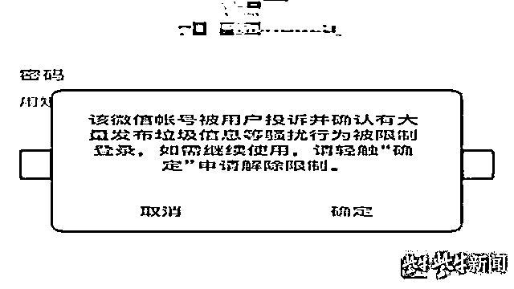
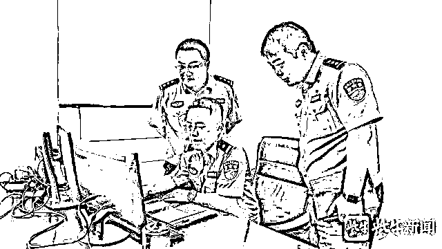
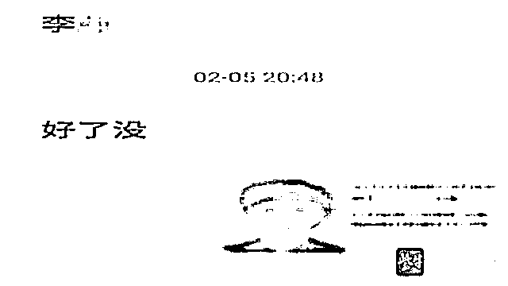

# 上万个被限制登录微信号“复活” ，“变脸”软件成诈骗帮凶

> 原文：[`mp.weixin.qq.com/s?__biz=MzIyMDYwMTk0Mw==&mid=2247522364&idx=3&sn=f7c342470448b328346d5dd1e31f8773&chksm=97cb5304a0bcda12c19feb03c916934792526418a64a1ffe140c8fd060f5287933598bcf8c0d&scene=27#wechat_redirect`](http://mp.weixin.qq.com/s?__biz=MzIyMDYwMTk0Mw==&mid=2247522364&idx=3&sn=f7c342470448b328346d5dd1e31f8773&chksm=97cb5304a0bcda12c19feb03c916934792526418a64a1ffe140c8fd060f5287933598bcf8c0d&scene=27#wechat_redirect)

[`v.qq.com/iframe/preview.html?width=500&height=375&auto=0&vid=q3302tgfpwp`](https://v.qq.com/iframe/preview.html?width=500&height=375&auto=0&vid=q3302tgfpwp)

张嘴、眨眼、摇头……打开摄像头对准脸部，通过软件就能实现模拟出符合各种要求的丰富表情。

近年来，随着网络技术的不断发展，短视频行业异军突起，催生出一系列“周边”软件，而上述“变脸”APP 就因为较强的娱乐性走红网络。

但这类使用到人像识别的软件，背后却隐藏着被犯罪分子利用的安全隐患。

10 月 13 日，国家网络安全宣传周期间，江苏南通警方对外通报，在“净网 2021”专项行动中，经缜密侦查，南通市公安局网安支队会同如皋市公安局网安大队，成功破获一起新型网络犯罪案件，抓获犯罪嫌疑人 5 名，斩断一条为电信网络诈骗、网络赌博等犯罪团伙重启被限制登录微信账号的黑色产业链。

截至案发，该犯罪团伙通过利用“变脸”APP 和某款智能手机的安全漏洞，**共重启了上万个被限制登录的微信账号，非法获利上百万元**。

目前，涉案的 5 名犯罪嫌疑人因涉嫌诈骗罪、帮助信息网络犯罪活动罪被依法采取刑事强制措施，案件正在进一步办理中。

**案发：多个涉诈微信离奇“复活”**

被限制登录的微信截图

2021 年 2 月，南通市公安局网安支队在侦办多起案件时发现了一个“离奇”现象——一些境外诈骗分子使用的微信账号在已被限制登录的情况，竟然成功“复活”并被重新使用。

根据微信注册流程，每个手机号只能对应注册一个微信号。

当涉及到金钱往来、账号安全等敏感信息时，都要通过重重检验，动态人脸识别是其中安全系数最高的一环。

诈骗分子身在境外，是如何实现将这些账号批量重启的？

民警对案情分析研判

“这些微信账号都是用他人的个人信息注册，重启必须要通过动态的人脸识别核验。”

南通市公安局网安支队三大队大队长许平楠说，被限制登录的账号注册者分散在全国各地，且大多都是偏远地区，要想将他们集中起来操作的可能性极小。

而重启账号所需要的所有流程都是在网络上完成，是否可能有人从中找到了漏洞并加以利用，从而滋生出专门的 “地下市场”？

2 月 26 日，南通市公安局网安支队会同如皋市公安局成立专案组，抽调精干警力全力开展侦查。

秘诀：“变脸”软件让照片张开嘴

经过研判，犯罪嫌疑人李某旗等 5 名犯罪嫌疑人很快进入警方视线，由此牵出一个从查询、出售公民身份证信息到制作“三色”人脸动态短视频，为电信网络诈骗、网络赌博等犯罪团伙重启被限制登录微信账号的黑色产业链。

犯罪嫌疑人与“客户”的聊天截图

李某旗等人分布在安徽、浙江等多个省市，平时都是线上交流。

2 月 28 日，专案组在安徽安庆、池州、滁州，浙江温州、舟山等地同步开展收网行动，5 名犯罪嫌疑人全部落网，现场查获 30 余部作案用手机、电脑 6 台，并在电脑中发现大量公民个人信息。

“**他们都是自学的网络技术。**”具体负责侦办此案的如皋市公安局网安大队副大队长王强伟说，李某旗是最早开始接触这一“行当”，其余 4 人几乎都“师承”李某旗。

犯罪嫌疑人与“客户”的聊天截图

经查，李某旗今年 28 岁，安徽滁州人，常年在南通生活，虽然学历不高，但对网络技术很感兴趣，并结识了很多拥有共同爱好的网友。

一次偶然的机会，李某旗发现有人讨论如何重启微信账号，他觉得这是“生财之道”，决定“拜师学艺”。

“其实重启一个账号并不复杂，最大的难点在于微信的人脸识别环节。”

据李某旗交代，当时，为了确保执行操作的是注册该账号的本人，在发起解除限制登录申请时，需要在限定的时间内完成张嘴这一动作。

但看似无法绕过的“防火墙”，只要利用“变脸”软件模拟真人动作，再依靠某款特定手机即可轻松完成，整个过程只需短短几秒钟。

所谓“变脸”软件，是如今火爆的短视频市场催生的“周边”产物，甚至一些短视频平台就内嵌这项功能，用户只要上传人像照片，就能直接由静态转变为动态视频，不同类型的夸张表情都能实现，简单的张嘴更是不在话下。

而另外一个关键点，是某款智能手机的安全漏洞。

李某旗称，这款智能手机经过“刷机”获取 root 权限（即整个手机系统的最高权限），利用一款视频切换软件，当申请解除限制登录流程进入到要求动态人脸识别时，软件就会读取相册中保存的最后这个视频。

只要视频中人像的清晰度达到要求，系统就会判定为这项行为是真人操作，从而顺利完成这项验证。

调查：为犯罪分子批量重启账号

在掌握这项技术后，李某旗就开始在网上招揽客户，并将技术传授给了韦某某等 4 人。

就这样，这 5 人就组团做起了重启微信账号的“生意”，每重启一个账号，收取 100 元至 200 元不等的费用。

南通警方查明，截至案发，李某旗等人共重启了上万个被限制登录的微信账号，非法获利上百万元。

如此庞大的账号数量，显然背后有着专门提供账号及公民个人信息者。这些“复活”的帐号，最后又流向了哪里？

犯罪嫌疑人使用的作案工具

据李某旗供述，他在网上发布“接单”广告后，很快就遇到了“金主”——电信网络诈骗、网络赌博、网络淫秽色情等犯罪分子。

他们手上掌握了大量微信账号，很多曾用于实施电信网络诈骗或散布赌博、色情网站等非法广告被限制登录。

“重启的目的，就是为了让这些账号二次发挥作用。”南通市公安局网安支队支队长张建说，帮助犯罪团伙重启微信账号是一种新型网络黑灰产，涉及上游侵犯公民个人信息和下游网络诈骗、网络赌博等多个环节，并形成了一条完整的黑色产业链。

本案中，李某旗等人为 100 多个犯罪团伙解除微信账号的限制，助长了这些犯罪分子的嚣张气焰，社会危害性极大，同时也给增加了公安机关打防网络犯罪的难度。

警方在犯罪嫌疑人手机中查获大量使用“变脸”软件的视频

落网后，李某旗对自己的行为后悔不已。他说，本以为帮助别人重启微信账号的行为性质并不严重，也不会引起公安机关的关注，并没有深想重启这些帐号会引起怎样的后果。

目前，李某旗等 5 名犯罪嫌疑人因涉嫌诈骗罪、帮助信息网络犯罪活动罪被警方依法采取刑事强制措施，案件仍在进一步办理中。

呼吁：加强监管让“脸”更安全

人脸识别技术广泛应用，既促进了互联网产业的发展，方便了用户生活，同时也带来一系列的风险隐患。

办案民警正在讯问犯罪嫌疑人李某旗

南通警方侦破在这起案件中，犯罪嫌疑人用于合成短视频的图像素材来源，均是居民身份证上的照片。

这些 “粗制滥造”合成的视频，除了极少部分因为图片像素较低没有通过校验，软件无法辨别采集到的究竟是真人还是视频信息。这也意味着，只要掌握了简单的技术，就可以轻易突破人脸识别的这道安全防线。

通过这起案件可以看出，“人脸数据”的买卖已经成为不法分子涉足的新型黑色产业，这一点还没有引起软件运营商和用户的足够重视。

如今互联网上多款流行软件都提供合成短视频的功能，而用户往往不多加考虑就会给出授权，让软件后台可以轻而易举地采集到用户的面部数据。

在相关监管制度和法规不完善的情况下，不少采集面部数据的软件或者机构并没有完备的安全保障机制，也不具备相应的风险防控能力，一旦这些数据流入地下市场，将会造成难以估量的后果。

互联网行业不能“野蛮生长”，亟需更多的行业监管和法律约束，应督促相关企业落实安全主体责任，展开针对人脸识别的网络安全技术研发和应用推广，净化数据行业生态，促进数字经济的高质量发展。

同时，此案还牵涉到大量公民个人信息被泄露。这些个人信息在地下市场被低价转手倒卖，有的被用于广告推销，有的被用于注册社交账号牟取不当利益，给人民群众的财产安全造成巨大隐患。

在公民个人信息保护这方面，应当以更严厉的手段打击相关违法犯罪活动。

网络安全为人民，网络安全靠人民，本案也对公民个人敲响警钟，应增强自身对个人信息的保护意识，积极维护个人合法权益，共同守护网络的清朗空间。

来源：紫牛新闻

← 向右滑动与灰产圈互动交流 →

