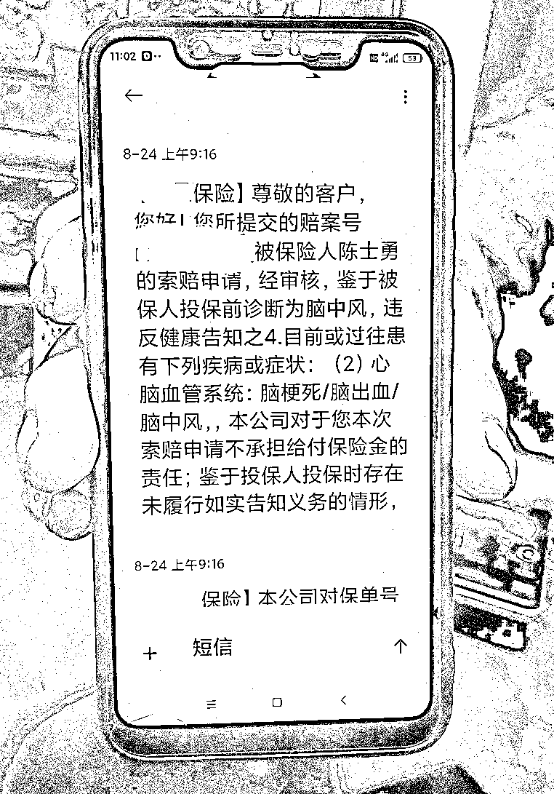
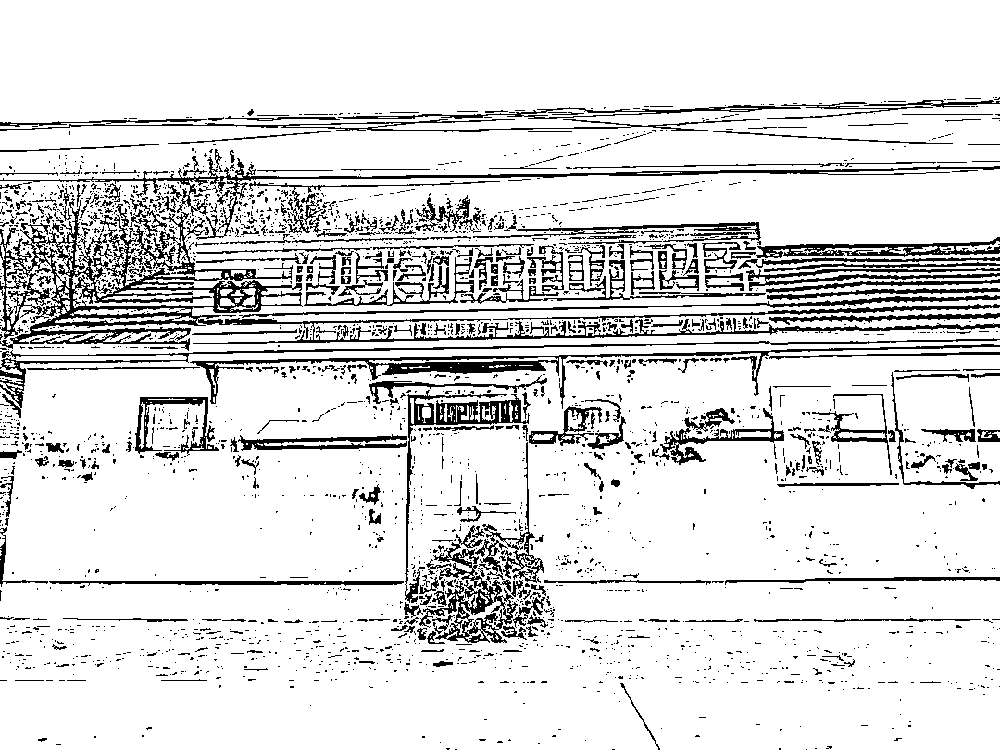
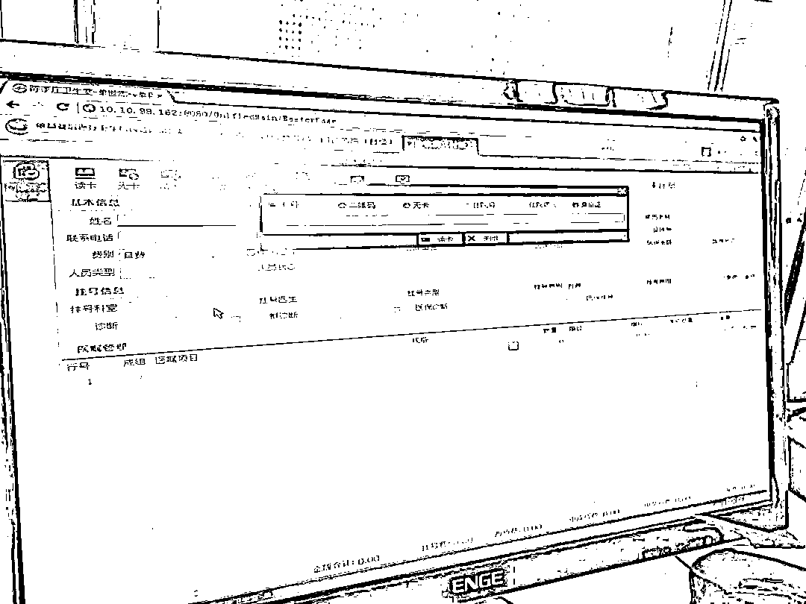

# 2000 多名村民被“脑中风”，医保结算背后藏着什么猫腻？

> 原文：[`mp.weixin.qq.com/s?__biz=MzIyMDYwMTk0Mw==&mid=2247522364&idx=4&sn=f45204419e632d060974540d45bca290&chksm=97cb5304a0bcda127f8f71a72278d1b3c6d4f273ad38a821679b5f5a323d409a51f0f0d99309&scene=27#wechat_redirect`](http://mp.weixin.qq.com/s?__biz=MzIyMDYwMTk0Mw==&mid=2247522364&idx=4&sn=f45204419e632d060974540d45bca290&chksm=97cb5304a0bcda127f8f71a72278d1b3c6d4f273ad38a821679b5f5a323d409a51f0f0d99309&scene=27#wechat_redirect)

近日，总台央广中国之声收到群众反映称，在山东省菏泽市单县莱河镇崔口村，大多数村民名下的城乡居民医保账户，近五年来莫名出现多次脑中风的医保结算记录。

记者调查发现，有孩子刚刚 5 岁就有了脑中风的医保结算记录；有老人去世很长时间后仍有 48 次医保消费；而有的村民常年在外务工，一次也没有去过村里的卫生室，名下的医保账户也出现了脑中风的结算记录。究竟是谁在骗取医保资金？

医保账户被盗刷

一村民多位家人被“脑中风”

今年 7 月，山东菏泽单县莱河镇崔口村村民陈士勇在单县中心医院做了一个手术，出院后他到村卫生室继续输液治疗，却意外发现自己的城乡居民医保账户上没有钱。随后，他找到单县医疗保障局，查询发现，**自己的医保账户竟然被多次盗用**。

根据陈士勇提供的医保结算清单，2016 年 2 月至 2019 年 12 月，他有过 16 次脑中风的医保结算记录，**医疗机构名称为崔口卫生室，经办机构名称为单县医保局**。

陈士勇表示，自己没有脑中风病史，医保结算清单上的记录，他本人也毫不知情。**这两年自己长期在外面打工，城乡医保始终没有用过，并且家人都参与城乡医保，都有各自的医保账号，家人不会用他的账号去买药。**

**因为所谓“脑中风”医保记录，陈士勇此前投保的商业健康保险，也拒绝理赔，“投保有个先前告示，其中就有脑中风不能参与投保。”**

****

**△陈士勇因“脑中风”医保记录被保险公司拒赔**

**陈士勇通过查询还发现，他的妻子、二弟、三弟等家人，也都有所谓“脑中风”的医保结算记录，尤其是其二弟陈士庚已在外务工多年，从未在村卫生室看过病。**

**两千多名村民得了所谓“脑中风”**

**有人去世后仍有医保结算记录**

****

**村里更多村民查询发现，自己在不知情的情况下，就得了所谓“脑中风” ，而且大多数都是在崔口村卫生室报销结算的，涉及村民竟达两千多人。**

**拿着一张张医保结算清单，村民陈雪侠告诉记者，她查询发现**全家 9 口人都有所谓脑中风的医保结算记录，其中包括当时只有 5 岁的孩子。****

****

**更让人难以置信的是，有村民去世后还有医保消费。村民陈士印告诉记者，**他的母亲孙富梅今年 3 月就去世了，医保记录显示此后竟然还有 48 个医保结算记录。**陈士印称，他的母亲生前没有得过脑中风，而且一直和他在城里住，近几年也从没有去过崔口村卫生室看病拿药。**

**采访中，多位村民担心，脑中风的医保结算记录会影响村民正常的升学就业、参军、保险赔付等。而村民们更关心的是，医保账户被盗刷的背后，被套出的钱究竟流向了何方？**

**37000 多条医保结算记录存在问题**

**多个乡镇存在类似问题**

****

**相关问题暴露后，据单县相关部门初步排查，**崔口村 2000 多名村民起码有 37000 多条医保结算记录存在问题**。**而且不止这个村，类似情况在其他村庄也不同程度存在。****

**村民陈士勇说，事发后，他就此质问崔口村卫生室负责人朱爱菊，对方解释说是因为医保系统出错，并带着礼物到他家里做工作，让他不要声张。村卫生室的上级单位莱河镇卫生院的院领导也多次找到陈士勇，希望私了，不要扩散此事的影响。**

**崔口村卫生室法定代表人刘夫华自称常年在外打工，平时负责卫生室的是妻子朱爱菊。刘夫华告诉记者，令他也不明白的是，他们一家人也莫名其妙出现了脑中风医保结算记录。**

****“我们只是输入药名，直接就报销了。其他所有的程序，我们也看不到，什么病名，我们操作不了。一个小小的诊所，我们都不知道这是怎么产生的。”****

****

**△单县基层医疗卫生机构管理信息系统页面，只要输入村民姓名和身份证号，村医就可以开处方药物**

**刘夫华声称要把县里有关部门告上法庭。他给记者出示的行政起诉状显示，**自 2016 年至 2019 年，村卫生室开出的处方与医保报销系统记载的不符，**经查询，被告的管理系统出现明显错误，显示疾病名称为脑中风，占比达到 90%以上；经过核实，脑中风疾病记录达到 37567 条。**

**采访中，单县医疗保障局相关负责人李鹏向记者证实，不仅仅是崔口村，莱河镇 12 个村卫生室，其中 7 个存在这样的情况，其他乡镇也不同程度存在类似现象。涉及这么大面积，这么多人，的确很不正常。**

**医保局：只审核乡镇卫生院上报数据**

**当地公安机关已介入调查**

****

**一个村庄出现这么多“脑中风”患者，医保部门为何未及时发现并纠正？李鹏称，**医保部门每月只审核乡镇卫生院上报的医保结算数据，不具体审核村级卫生室的相关数据。****

**单县卫生健康局主任科员郑效坤告诉记者，**目前当地公安机关已介入调查，并对涉事村医等相关人员采取强制措施。****

**针对此事，中国社科院健康业发展研究中心副主任陈秋霖分析说，**仅靠村医个人是无法操作这么大范围、这么重疾病骗保的**。调查的关键在于，大量问题医保结算记录的背后，被套出的药和钱究竟流向了何方？“在这个过程当中，村医有没有拿到钱，处方开出去以后，这个药是谁给的？”**

**有关事情进展，我们将持续关注。**

**来源：中央广电总台中国之声，中国青年网微信**

****

**← 向右滑动与灰产圈互动交流 →**

****