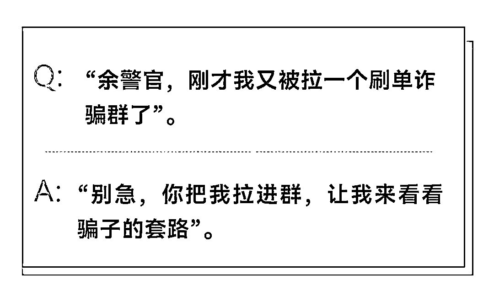
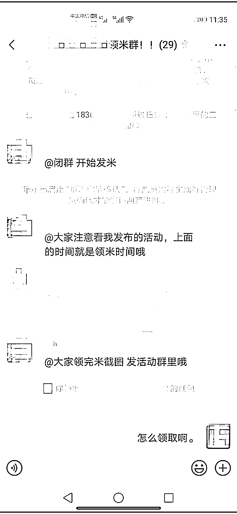
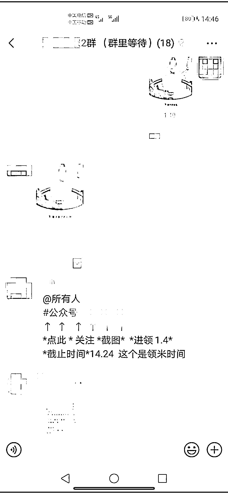
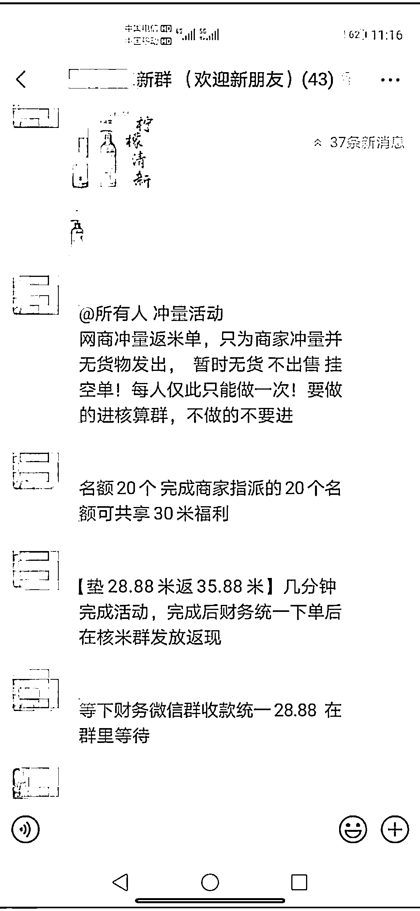

# 1.5 元红包把我带向“刷单”骗局深渊：民警卧底诈骗群揭秘最新诈骗套路

> 原文：[`mp.weixin.qq.com/s?__biz=MzIyMDYwMTk0Mw==&mid=2247522364&idx=5&sn=30b16cdd9995ecc6343815a6e278e840&chksm=97cb5304a0bcda122c20c9d027623ecce0446986dda6572e28c04e632e7ed87048c46063f977&scene=27#wechat_redirect`](http://mp.weixin.qq.com/s?__biz=MzIyMDYwMTk0Mw==&mid=2247522364&idx=5&sn=30b16cdd9995ecc6343815a6e278e840&chksm=97cb5304a0bcda122c20c9d027623ecce0446986dda6572e28c04e632e7ed87048c46063f977&scene=27#wechat_redirect)

近日，杭州钱塘新区闻潮派出所的余警官接到一起诈骗案受害人金某（化名）的微信消息。在这名受害人的帮助下，民警成功以受害人朋友的名义在群名“某领米群”卧底成功，经历了 2 天的卧底经历，也体验了“刷单”诈骗的入坑套路。

# 现在带你揭开“刷单”诈骗套路

# 1 以小额红包，让受害人体验“刷单”获利快感。

民警被拉入“某领米群”微信群。一入群，群里就有人发红包，民警点击领取，获利 1.5 元。

几秒钟后，民警点开红包领取的记录，发现 30 个群成员每人领取的都是 1.5 元的红包。

过了一会，群主通知，需要加入“任务群”才能继续领取红包，通过扫描群里的二维码，民警又加入了“2 群（群里等待）”，进群后，有三四个群成员会在群里发送任务，最开始的任务是关注微信公众号，并在完成任务后截屏发送到该群，证明自己完成了任务。

每一次群里发布任务后一两分钟，群主就会发红包让大家抢。这种类型的任务，民警一天完成了四五十个，共“兼职刷单”获利 60 元左右。

# 民警分析

利用碎片时间，点点手机屏幕，就可以轻松获利，虽然不多，但胜在轻松。轻松、自由、零成本获利，这是刷单型诈骗让受害人一开始就“情不自禁”、感觉自己找到“金矿”的感觉。

# 2 制定规则、纪律，让受害人感觉操作很正规。

在完成任务的过程中，民警偶尔故意通过复制、转发他人的截屏“滥竽充数”，一下子就被群主发现，并被通报。

群里发送任务还固定上下班时间：上午 10:00-11:30、下午 14:00-16:30，其他时间段，群众会安排抢红包游戏，群成员表演才艺和感言。任务完成后，也规定了完成任务、领取报酬的的截止时间，让群成员感觉该群是一个非常正规的兼职刷单群。

# 民警分析

“劳逸结合”、“软硬兼施”，进行群文化的软性输出，特别是群成员的才艺表演、感言，均透露出兼职刷单大有可为，获利很丰厚，让受害人对兼职刷单获利的心理预期不停膨胀。

# 3 不停换群，对群成员的“忠诚度”进行筛选。

发布任务和领取报酬的群，每半天就会进行更换。时间一到，群主就会在群里告诉发布通告，让所有群成员，扫码加入新的群，重新领取任务、领取红包。

# 民警分析

频繁的退群、加群操作，是骗子检验群成员兼职刷单获利的欲望是否强烈，对兼职刷单的工作是否可继续坚持，通过筛选，将对兼职刷单的受害人一步一步引向深渊。

# 4 任务升级，检验受害人是否愿意垫钱刷单。

第一天卧底结束，受害人金某告诉民警，她之前被骗也是一模一样的方式，接下来群里会发布需要垫付小额资金的刷单任务。

果然，到第二天接近中午，发布任务的群里推送任务：网商冲量返米单，只为商家冲量并无货物发出，暂时无货，不出售挂空单！每人仅此只能做一次，要做的进核算群，不做的不要进。名额 20 个，完成商家指派的 20 个名额可共享 30 米福利。

“垫 28.88 米返 35.88 米。”群员几分钟时间完成活动，在财务同意下单后，在核米群发放返现。

群里一发送这个消息，金某就电话联系民警：“警官，这个肯定是骗子群，跟我之前被骗的套路一模一样，我再也不敢垫钱刷单了”。

民警挂掉电话，已经超过了群里规定的换群时间，被群众踢出了群。

# 民警分析

从点点屏幕就能获利，到不停换群，再到垫钱刷空单，步步升级、步步深入，对受害人进行多次诱导、筛选，将那些对兼职刷单获利深信不疑的受害人，一步一步引到垫付刷单的棋局。

# 5 以高额回报引诱受害人加大投入。

从群里退出后，民警电话联系金某，金某告诉民警，这个 25.88 元的刷单仅仅是开始，后面还会有几个类似大小的“任务”，会让群成员在获利一阵。

之后，群主便“故伎重演”，会告诉大家，接下来任务的不在微信群里发布了，需要大家下载一个手机 APP,领任务、报酬都需要在这个 APP 里完成。

金某就是在下载 APP 后，领取了几个 50 元的任务，就被安排了一个 2000 元的刷单任务。金某完成该任务后，在领取报酬时被告知操作错误，无法领取。

微信群里会安排有“导师”、“客服”与金某一对一进行沟通，告知金某要想取现，必须按照公司规定，再领取一个 2 万元的刷单任务，完成后才能取现。

金某按照对方要求完成了一个 2 万元的刷单任务，结果在取现时，又被告知操作错误，账户被冻结了。要想解封账户，需要完成一个“串联单”。所谓串联单，就是一共 3-5 个任务并在一起，第一个任务刷单 2 万，第二个任务刷单 3 万，第三个任务刷单 5 万，第四、第五个任务的金额在继续提高，待所有任务完成后，才能解封账户、取现获利。

金某称，自己就在没有办法再筹集刷单款、对方又不肯解封账户的时候，才想到报警求助的。

# 民警分析

通过步步为营，骗子们利用受害人兼职挣钱、轻松获利、急于取现的心理，一步步诱导、迫使受害人不停投入资金进行刷单，待受害人警觉时，为时已晚。

# 警方提醒

1

天上不会掉馅饼！世界上没有什么“轻轻松松赚大钱”的好事。诱惑背后，一定是陷阱！

2

网络刷单本身就是违法行为！任何要求垫资的网络刷单都是诈骗。遭遇诈骗要立即报警，并将对方的 QQ、微信、电话号码、聊天记录等留存提交给警方，以便警方破案。

3

请广大群众一定要保持清醒头脑，时刻提防电信网络诈骗，提高网络支付与银行卡使用安全意识。（同时做到“不轻信、不点击、不透露、不转账”，不出借、出租、出售银行卡，手机卡。）

来源：洛阳市反诈骗中心，利箭在出击

← 向右滑动与灰产圈互动交流 →

